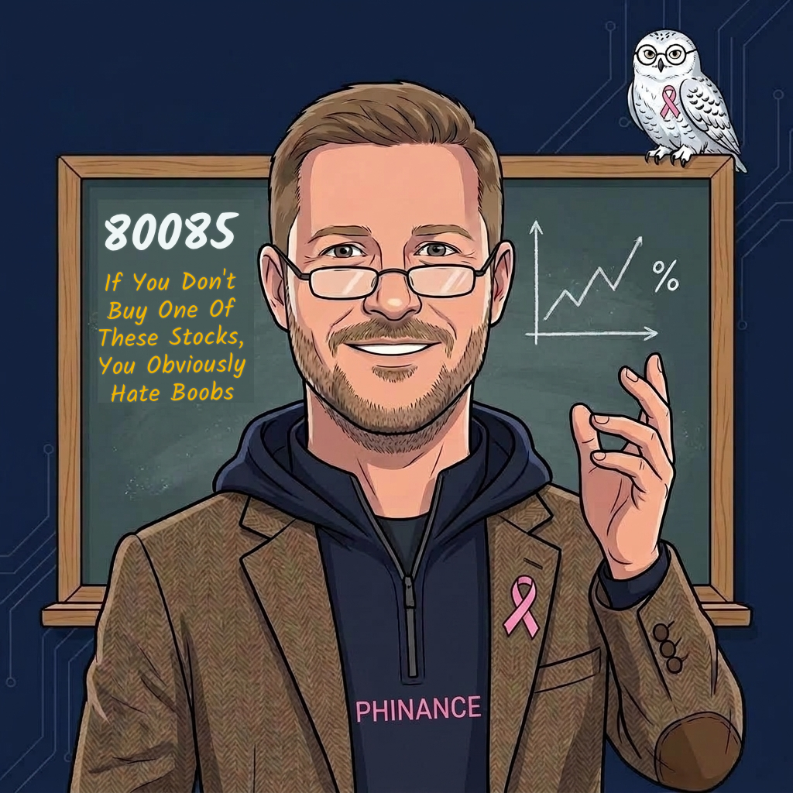
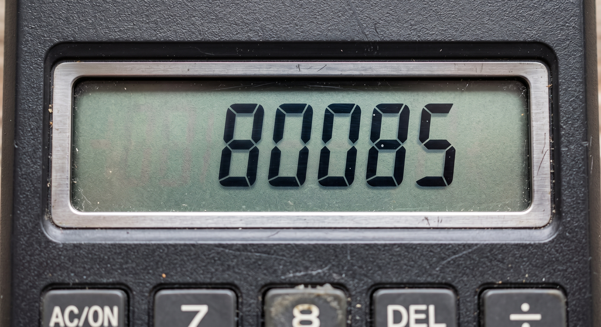
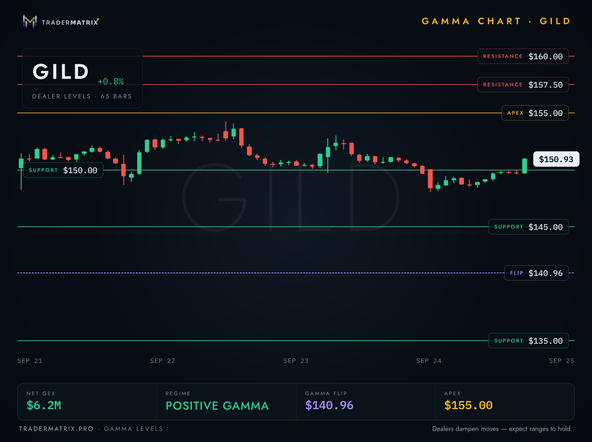
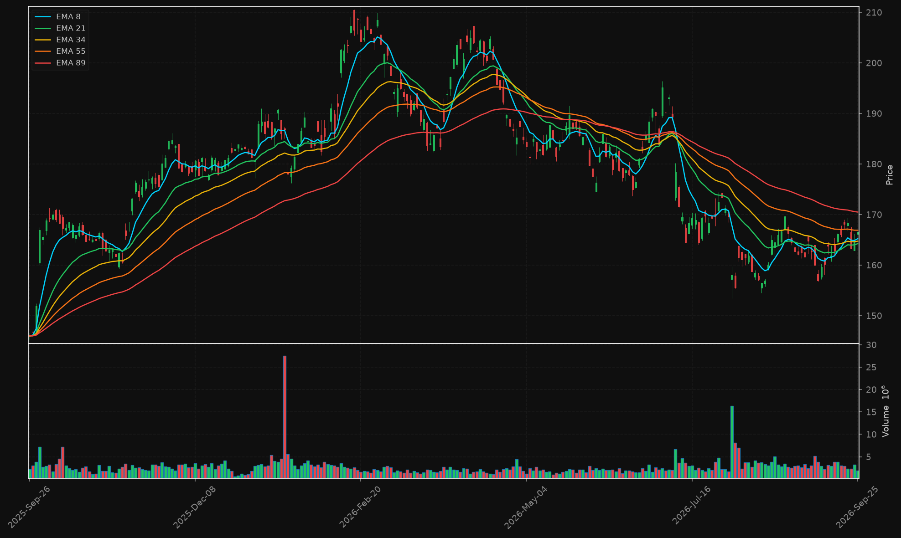
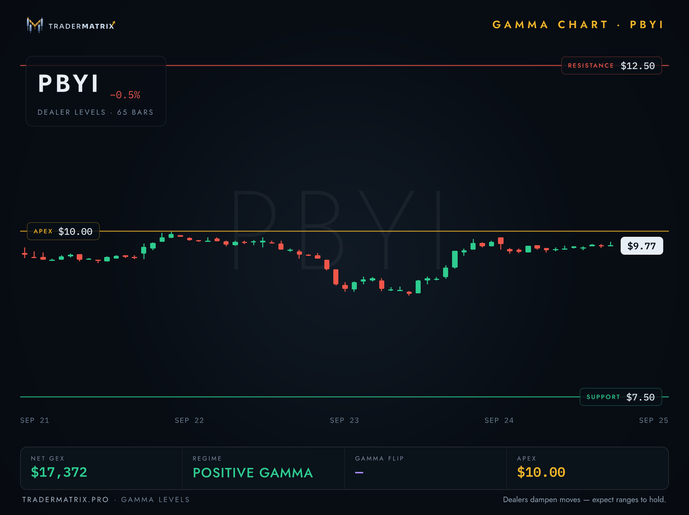
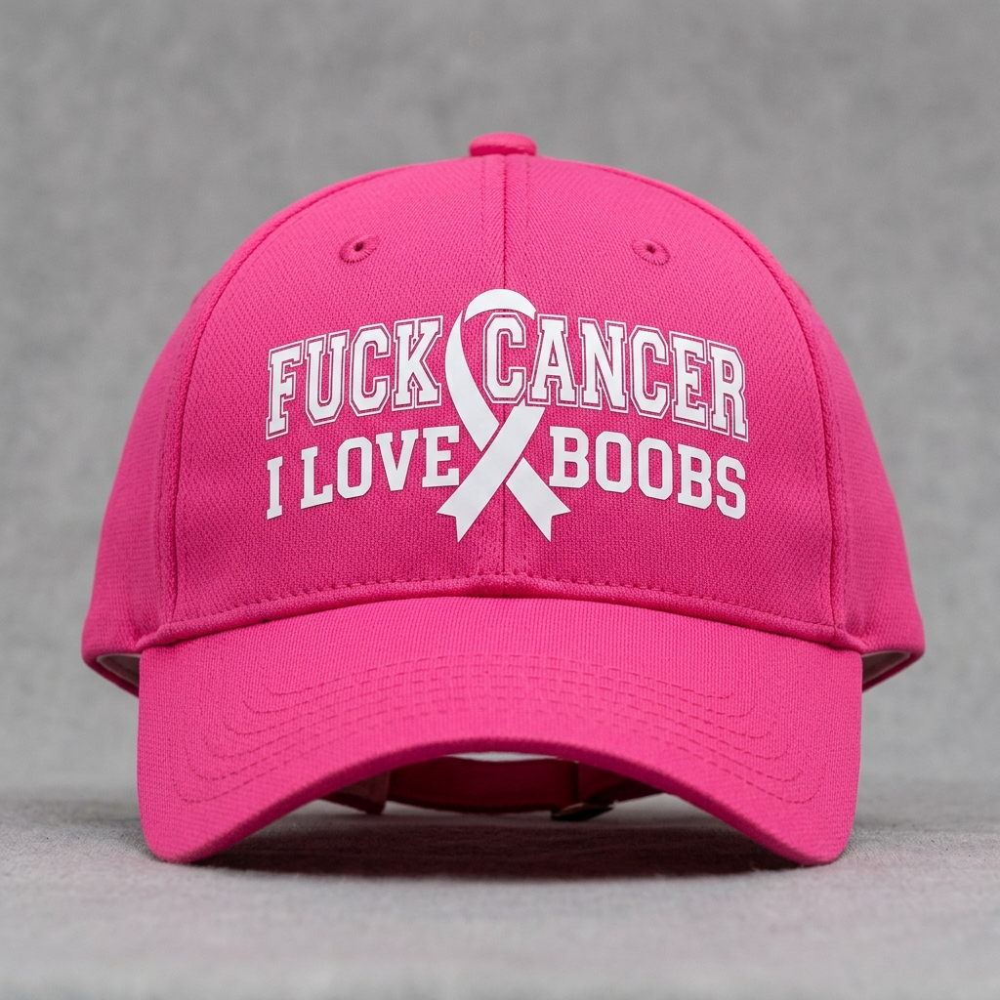
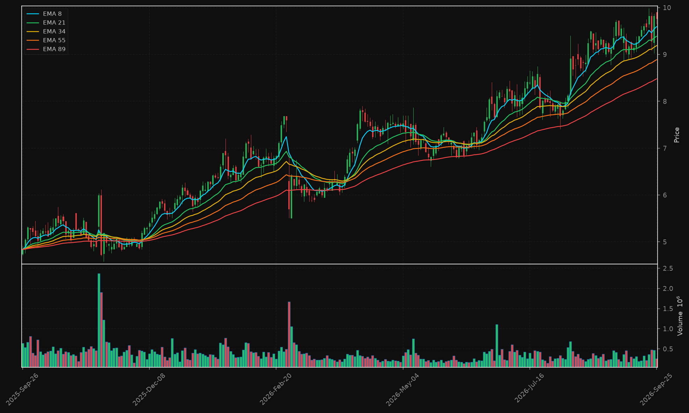

# If You Don't Buy One Of These Stocks, You Obviously Hate Boobs

*Trading 70% | Mindset 30%*

**TLDR: October is Breast Cancer Awareness Month and one of my oldest friends is on the wrong end of it. So I dug into the companies making the drugs. Three worth knowing (GILD, AZN, PBYI), two everybody asks about that I'm skipping (PFE, NVS), a hat I designed, and for paid subs, the setups on the two I'd actually buy.**

Scroll to GILD if you don't care about my personal story here.

My mom was born in 1958. When she was 17 she used to borrow her friend Sue's ID to get into dance clubs, because Sue was 18 and apparently that was close enough in the 70s. They're still friends. Still get lunch. That's somewhere north of 50 years.

Sue's daughter is Shannon. So Shannon and I have known each other basically since before either of us had a say in it.

High school was where it got good. We never hooked up, never did anything, but we were both hot and neither of us was shy about telling the other one. Looking back I think we pumped each other's confidence up more than either of us realized at the time. Cheap therapy.

Now, full disclosure, since the title is what it is. I've always been more of an ass and legs man. And Shannon had ass and legs out of this world. Boobs, not so much. Never really had them.

Which is why, when she got breast cancer, we had a pretty good laugh about the fact that what little she did have had to get chopped anyway.

Probably not funny to most of you. Still funny to us lol. That's the friendship.

She's tougher than I'll ever be. Last October I posted from vacation that when the market's acting like cancer, the breast defense is investing in 80085.

This year I figured I should actually do the homework, so I went and looked at the companies making the drugs people like her are actually taking. Because I'm me, and that's how I process things.

## GILD: the HIV company with a cancer missile

Most people know Gilead for HIV. Biktarvy is the biggest-selling HIV drug in the world, and their newest thing, lenacapavir, is an HIV prevention shot you get a couple times a year instead of a pill every day. Every Gilead headline this month is about that shot rolling out to more countries.

The breast cancer piece is **Trodelvy**, which they got by buying Immunomedics back in 2020. It's an antibody-drug conjugate. Think guided missile: the antibody finds the cancer cell, and it's carrying a chemo payload that only goes off once it's there. Normal chemo hits everything that grows fast. Hair, stomach lining, all of it. This is supposed to hit the tumor and leave more of the rest of you alone.

About **$30.5B** in revenue, a **2.17%** dividend, and a beta of **0.35**, which means it barely cares what the rest of the market is doing.

So if you buy GILD for breast cancer, know that you're mostly buying an HIV company. Trodelvy comes along for the ride.

Here's where the options dealers are sitting on it right now.

## AZN: the one I'd want in my corner

AstraZeneca is British, and oncology is the biggest thing they do. For breast cancer they've got two big ones.

**Enhertu**, made with Japan's Daiichi Sankyo, is another guided missile like Trodelvy, aimed at a protein called HER2. The reason doctors got excited about it: it works on tumors with only a little HER2 on them, which used to be treated like they had none. That opened the drug up to a lot more patients.

**Lynparza** is for people with the BRCA gene mutation, the one that made Angelina Jolie get a preventive double mastectomy back in 2013. It goes after the cancer cell's ability to repair its own DNA, which BRCA cells are already bad at.

About **$61.4B** in revenue, a **1.92%** dividend, and analysts rate it a strong buy. If I got to pick one of these companies' drugs to fight for me, I'd probably pick theirs.

I'm still not buying it yet. The chart is broken, and there was a headline Thursday asking whether they can keep growing while their breast cancer market gets narrower. Watchlist for now.

Look at it. Topped around **$210** in February, then lower highs all summer, and now the slowest EMA (the red 89) is sitting on top of price instead of underneath it. That's what broken looks like. When it gets back above that red line and holds, I'll care.

## PBYI: the actual boob stock

Puma Biotechnology is small, about **$504M**, and it basically sells one drug. **Nerlynx** is a pill for HER2-positive breast cancer, mostly used after someone's already done a year of the standard treatment, to lower the odds it comes back.

That's pretty much the whole company, so it lives and dies on breast cancer.

Two things surprised me. It's profitable, which small biotechs usually aren't, with **$231M** in revenue. And on their Q2 call they said they're debt-free. They're also running trials on a second drug, alisertib, but those are in lung cancer, so they don't change the story here.

And yeah, one drug means if a better one shows up or a trial goes sideways, there's nothing else propping it up.

And its options picture. Keep an eye on that yellow line at $10, it comes up again in the paid part.

## PFE and NVS: why I skipped them

**Pfizer** makes **Ibrance**, one of the standard drugs for the most common kind of breast cancer. Everybody already writes about Pfizer. You don't need me for that one. Just do the math on that **6%** dividend before you fall in love: `$1.72 dividend / $0.76 trailing EPS = 226%`. They paid out more than twice what they earned last year.

**Novartis** makes **Kisqali**, which competes head to head with Ibrance. Good drug. But earnings are down **17%** year over year, analysts have it at hold, and the recent headlines are a paused cell therapy trial, a heart drug that failed, and a top shareholder saying the party's over for their dealmakers. Too many problems that have nothing to do with breast cancer.

## The hat

There are a lot of pink caps with the ribbon already sewn on. I wanted something you could add to one of those with a Cricut, so I made cut files that go around a sewn-on ribbon without touching the thread. "F*ck Cancer" arched over the top, "Save The Boobs" or "I Love Boobs" underneath.

Make one. Wear it in October. If anybody asks, tell them you're doing it for Shannon.

The gamma charts above come from TraderMatrix, the platform I help build. If you want to pull these for your own tickers, that's [tradermatrix.pro](https://www.tradermatrix.pro/?ref=MPHINANCE) (my referral link), and we walk through this stuff on video at [youtube.com/@TraderMatrixHQ](https://www.youtube.com/@TraderMatrixHQ).

Paid subs, the setups on GILD and PBYI are below.

<!--paywall-->

## The setups

Everything below is as of Friday's close.

### GILD at $150.93

Receipts first. On 2025-08-26 I posted on AfterHour that GILD was "hard bouncing off the 88 EMA, soft off the 55" and I'd grab $115 calls if it dipped into **$110.12 - $112.91**. From the top of that range to Friday: `((150.93-112.91)/112.91)x100 = 33.7%`.

Where it sits now:

- Every EMA stacked in order, 8 over 21 over 34 over 55 over 89. That's a real uptrend.
- ADX at **32.5**. Anything over 25 means the trend has actual strength behind it.
- MACD crossed above its signal line and the gap is still widening.
- RSI at **60.6**. Strong without being stretched.
- Above the 50-day (**$141.48**) and the 200-day (**$135.99**), a few bucks under the 52-week high of **$157.29**.

Analysts' average target is **$158.65**. `((158.65-150.93)/150.93)x100 = 5.1%` upside. Not a moonshot, just a big pharma with a trend and a dividend.

Back to the GILD gamma chart up top. Quick decoder:

- **Positive gamma** means the dealers' own hedging pushes against big moves. Up days get sold into, down days get bought. Ranges tend to hold.
- **$150** is support, and GILD closed at **$150.93**, right on top of it.
- **Apex at $155** is the strike with the most hedging stacked on it. Price tends to react when it gets there. It is not a price target.
- **$157.50** resistance is basically the 52-week high (**$157.29**). That's the ceiling to beat.
- **Flip at $140.96** is where the regime changes. Below it, dealers flip to amplifying moves instead of dampening them. If GILD loses $141 the calm, rangey trade I'm describing is gone.

One thing to read before you buy: trailing EPS is **-$2.66** while forward EPS is **+$9.89**. That's a big gap and I'd want to know exactly what's behind it first.

### PBYI at $9.77

About as clean a staircase as you'll find. Every pullback all year held above the slower EMAs and went on to a higher high.

- Same bullish EMA stack as GILD.
- 52-week high is **$9.98**, so it's pressing right up against it.
- Way above the 200-day at **$7.37**.
- Earnings grew **39.9%** last quarter.

From the 52-week low: `((9.77-4.58)/4.58)x100 = 113%`. It's already run. The trend is still intact, but you're not early.

The options market is thin here, but what's there is all in one place. The **$10** strike has **805** contracts of open interest, more than every other strike combined, and it sits right on the **$9.98** 52-week high. So the round number, the old high, and the options wall are all the same line. A clean close over $10 is the breakout. If it stalls right under, that's the wall doing its job, not the trend breaking.

The fun part: **9.8%** of the float is sold short, and at normal volume it'd take shorts **14.6** days to buy it all back. Somebody out there really hates boobs. If Puma drops good news, those people have to buy, and that's fuel.

The not-fun part: there's no analyst consensus on it in the data I pulled, and it's small enough that one bad headline hurts. Size it like a lottery ticket you actually thought about.

Send this to somebody who'd wear the hat.

~ Michael
