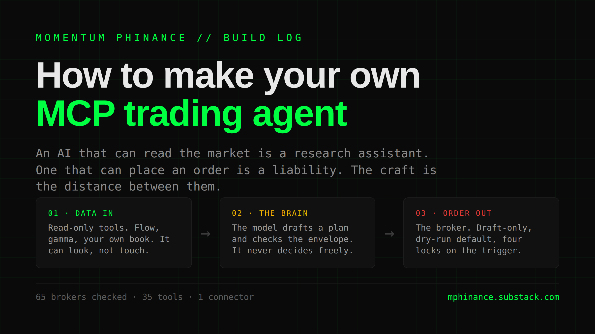
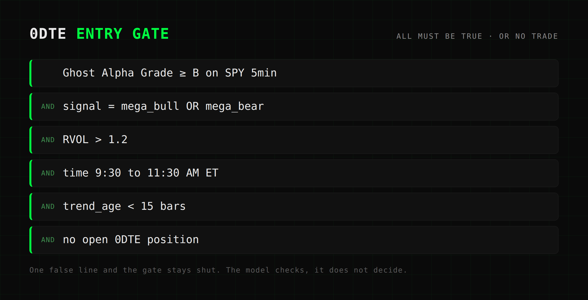
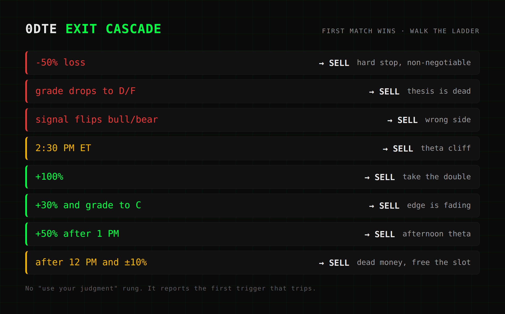

# How to make your own MCP trading agent

*AI 45% | Trading 40% | Mindset 15%*



An AI that can read the market is a research assistant. An AI that can place an order is a liability. The entire craft of building a trading agent lives in the distance between those two sentences. This piece is about the distance, not the order.

The part where the robot buys the stock is the easy one. It is three lines of config. The reason you do not already have a bot trading your account is not that the buy button is hard to wire. It is that wiring the buy button to a thing that occasionally makes stuff up is how you wake up short **40 contracts** of some ticker you have never heard of, wondering what the hell happened.

So here is how I actually connect an AI to my brokerage. What I let it touch, what I never let it touch, and the boring scaffolding that stands between a good idea and a margin call.

Two quick things first, both free, both mine. If you have never built an agent at all, start with the plain-English primer on the three pieces every agent is made of: [Building Agents: The Part Nobody Explains](https://mphinance.github.io/mphinance/guides/building-agents-101.html). If you want to see real ones running, here are five working examples pulled straight from my own three-agent mesh: [Agents in the Wild: Real Examples](https://mphinance.github.io/mphinance/guides/building-agents-examples.html). Those two are the ground floor. This piece is the trading floor.

Let me start with the piece that is easy to get wrong: what MCP even is.

## MCP is a USB port for your AI

MCP stands for Model Context Protocol. Think of it as a standard plug. A "connector" is just a small server that exposes **tools**, which are functions the model is allowed to call, over a web address. The model does not know or care whether a tool reads a database, hits your broker, or fetches your old newsletter posts. It sees a menu of things it can call, and it calls them.

Every trading agent worth building has three layers, and you should hold them apart in your head like they are three different people.

1. **Data in.** Screeners, options flow, gamma, your own positions. Read-only. My data brain is TraderDaddy Pro: gamma exposure, dark-pool prints, unusual activity, directional flow. Not one of those tools can place a trade. That is the entire point of that layer.
2. **The brain.** The model itself. Mine is named Sam. She reads the data tools, reasons over them, and drafts a plan.
3. **Order out.** The broker. This is the one dangerous layer, and it is the one you gate to hell and back.

Get that mental model right and everything after it is plumbing. Get it wrong and no amount of clever prompting saves you.

## The shopping menu: which brokers can an AI actually trade through?

I got so tired of "does broker X have an MCP server or not" that I built a directory and checked **65 brokers** at the source. I opened each one's own docs, read the actual tool list, and wrote down a yes or a no. **27** have official servers. **15** have nothing, confirmed. A "no" is a real answer, so I list those too.

The only axis that matters the moment you are about to hand keys to a robot is this: can it place an order?

- ✅ **Places a real order** on a single tool call. Alpaca, Robinhood, Tradier, tastytrade, Kraken, and a couple dozen more.
- 📝 **Draft only.** It builds the order, you press send in the broker's own app. Interactive Brokers is the marquee case here, and the directory puts it plainly: the AI never submits an IBKR order to the market. It writes the order into a tab you approve by hand.
- 👁️ **Read only.** It can look. It cannot touch.

Now rank those by how easy it is to hurt yourself. IBKR sits at the safe end: it cannot execute by design, so it is the safest thing that still trades. Alpaca, Kraken, and Webull default to paper, so live money is an opt-in you flip on purpose. Robinhood, Tradier, and most community servers go live on a single tool call: real money, no second thought. And Public.com has no paper mode at all, so there is no training-wheels version to hide behind. Respect it accordingly.

If you are building your first one, start with a paper-first or draft-only broker. I run my read layer against everything, and my write layer against IBKR in draft-only mode, so the worst the machine can do is hand me an order I still have to look at before it is real.

The full directory of all 65 is open and free. Knowing which broker will even talk to your robot should not cost you anything.

## Build the read layer first. Let it read for a week before it writes

Here is the shape of my server. One process, one web address, one token, and behind it right now about **35 tools**. It started life as **13**. That is the quiet magic of MCP: you add a capability by writing a function.

```python
from fastmcp import FastMCP
mcp = FastMCP("supermcp", auth=auth.build())

@mcp.tool
async def get_positions() -> list[dict]:
    """Raw positions across brokers (tastytrade + ibkr) with DELAYED marks. Never live quotes."""
    return await _all_positions()
```

That is a complete, working tool. And that docstring is not a comment. It is the instruction the model reads to decide when to reach for this tool. Your docstrings are prompt engineering now. Write them like it.

One rule shapes every tool I build: your own account data is yours to share, live exchange data is not. Positions, fills, P&L, my trade journal, all of it is mine to hand around. Redistributing live quotes and option chains needs a data license I do not have. So every adapter I write uses delayed or end-of-day marks, or my own already-published feed. That is why the docstring literally says "Never live quotes." A legal boundary, baked right into the tool the model sees.

The adapter pattern underneath is simple on purpose. Every broker gets mapped into one common shape: broker, symbol, underlying, quantity, avg_price, delayed_mark, cost_basis, market_value. tastytrade comes straight off its SDK on delayed marks. IBKR I pull live from my own app, not from the exchange. And there is one iron law for every adapter: if it fails, it returns an empty list. It never crashes the server. One broker going dark cannot take down the whole agent. Hold onto that one, it matters later.

You deploy this like any web app. A process behind a web server, a service that restarts itself, an HTTPS address. Paste that address into Claude as a custom connector and every tool shows up in the model's menu. There is nothing proprietary about it. Any spec-compliant MCP server works the same way.

Build this entire layer first. Then let the agent do nothing but read for a week before you ever let it write a single thing. You will learn fast what it is genuinely good at and what it quietly invents.

## The part the tutorials skip

Here is the thing that actually keeps you solvent, and it is not the model.

The danger was never that the model hallucinates a price. You fix that with one line in the prompt: answer only from the data in front of you, never invent a number you cannot derive from it. Done.

The danger is a capable model, a live order tool, and no envelope around it. A model with a `place_order` function and a vague instruction to "trade the setup" is a coin flip with your money and a genuinely creative imagination for new ways to blow it up. The fix for that is not a smarter model. The fix is to stop asking the model to **decide** and start asking it to **check**.

That single move, from decider to checker, is the whole game. And it is where this goes behind the wall, because what comes next is the part I paid real tuition for.

Fair warning on the stakes before you decide whether to keep reading. Half of what you pay for this newsletter gets traded live in the same IBKR and tastytrade accounts these agents watch. This is not a theory of trading robots. It is the thing my subscribers fund. Below the line: the exact rules my agent checks instead of guessing at, the four locks between it and my money, and the thirteen hours yesterday I handed one a live SLV position and watched what it did with 158 chances to screw it up.

<!--paywall-->

## Skills: turning judgment into an IFTTT cascade

A skill, in my setup, is a folder with a playbook in it. A little bit of frontmatter says what it does and when to load it. The body is the operational meat. But the real trick is what goes in that body: not "trade well," but a rule ladder the model walks top to bottom, first match wins. No free-form reasoning about exits. The model is a checker, not a gambler.

Here is the actual entry gate out of my 0DTE skill. Every line has to be true at once, or there is no trade:



And the exit cascade, in strict priority order, first match wins:



Read that exit list again and notice what is missing. There is no "use your judgment" line. The model is not deciding whether to sell. It is walking the ladder and reporting the first rung that trips. That is the entire difference between an agent you can sleep next to and one you cannot.

The guardrails wrapped around it are non-negotiable, and I mean the word: max **1** open position, auto-close at **2:30 PM**, no averaging down ever, grade floor of **B**, entries between **9:30 and 11:30** only, no Friday 0DTE because triple-witching will eat you alive. Two losers in a day and the skill says done, walk away. A human breaks every single one of those on a bad afternoon. The skill does not have bad afternoons.

And the load-bearing sentence, written into the skill itself, in plain English: this drafts the plan, Michael places every order.

## The four locks between a robot and your money

So how does an order actually leave the building? Through four independent locks, all of which have to fail in the same direction at the same time before a robot spends my money without me.

1. **Dry run is the default.** Every order tool builds the ticket and shows me the exact body that would be sent, plus whether I can even afford it against buying power, and then routes nothing. Getting a real order out takes an explicit flag I have to pass on purpose.
2. **The one live-capable tool is triple-gated.** It needs an environment switch turned on, a confirmation string that literally has to read `SEND IT LIVE`, and a quantity I can actually afford. Miss any one of the three and it refuses. (One personal sandbox account runs a looser path, boxed in by its own hard caps.)
3. **The broker itself is draft-only.** IBKR through MCP cannot put an order on the market. It writes it into an approval tab. So even a bug that somehow trips all three software locks still cannot fill without my thumb on the screen.
4. **The glass box.** Every score, every filter, every signal gets logged next to the formula that produced it. `score = (1 - |delta|) * (250 / (DTE+5)) * (bid/strike)`. If I cannot audit why it wanted to do a thing, it does not get to do the thing.

Belt, suspenders, a second belt, and a guy whose entire job is checking the belts. That is not paranoia. That is the price of admission for pointing a language model at a live account.

Copy that structure and swap my numbers for yours and you have an envelope for any strategy you run. The envelope is the product. The model is just the thing that fills it out.

## The case study: a 5-minute cron that watched SLV all day and barely moved

Its best day was a day it did almost nothing. Here is what that looks like.

Yesterday, for fun, I pointed one of these at a single position and let it run the whole day. A cron job, every **5 minutes**, from 9:20 in the morning until half past ten at night. **158** runs. The target: scale into **2 contracts** of the SLV August **$62** call, then manage the thing.

Here is what it did in the first fifteen minutes. There was a stale limit order left over from a premarket chase, sitting too high. It cancelled that instead of reaching for it, re-priced down, and filled both legs on **$0.48** limits: **$0.46** at the open, **$0.47** thirteen minutes later. Average **$0.465**, about **$93** of risk against a **$200** cap. Call it half my powder in, the other half left dry. Then it pinged me. Leg one on. Leg two on. Position complete.

And then, for the next twelve hours, it did nothing. On purpose.

SLV chopped around **$52** all day, stuck under its VWAP the entire session, tagging the **52.46** moving average on every bounce and fading right back off it. The rule for adding a third leg was explicit: price has to clear 52.46 and hold above VWAP. It never did. So every five minutes the watcher checked the same three questions and wrote the same three answers. Add leg three: blocked, no sustained break. Invalidation: not hit, no new low under **51.77**. Take profit or cut: nowhere near. No ping. Hold.

That is roughly **78 runs in a row** of an agent staring at a live position and correctly deciding to sit on its hands.

Then, around half past nine at night, the IBKR gateway dropped. The watcher did not crash, and it did not guess. It fell back to a delayed price feed, kept confirming the position through tastytrade's delayed marks instead, and carried on. Degrade gracefully, never crash. That convention I told you to hold onto, doing its job at 9:30 PM while I was not watching.

The position finished flat. Dead flat, at cost, held into the close and into after hours with no invalidation, no target, and no cut. If you came for a war story with a fat P&L on the end of it, this is not that. And that is exactly the point.

That is the whole lesson. It entered on plan in the first fifteen minutes, then held the line for twelve hours because the one condition that would justify doing more never showed up. No boredom trade. No "it has been quiet, let me just add a little." No revenge buy after the bounce faded. A human sitting in front of that chart for thirteen hours talks himself into something by hour four. The agent talked itself into nothing, because I never gave it the option. The envelope had three exits, and none of the three opened.

## Two kinds of autonomy. I only run one

I am not going to sell you a fairy tale, so here is the tradeoff nobody screenshots.

There are two ways to build this, and I have built both. One is the decision-support version I just walked you through: the agent reads, drafts, and checks, and I place every order. The other is fully autonomous. A chart alert fires a webhook, a cheaper model acts as a yes-or-no gate, and code places the trade on its own, with a monitor checking the position every **30 seconds** to manage the exit. No human in the loop. Just hard caps and a kill switch stashed in an environment variable.

I run the first one. I have run the second one. The difference between them is not the model, and it is not the broker. It comes down to a single question: when the machine is wrong, and it will be wrong, does a human see it before the money moves or after? Everything I have shown you, the dry-run default, the draft-only broker, the four locks, the skill that says Michael places every order, is me answering that question the same way every time. Before.

The autonomous path is real, it works, and it is also the fastest way I know to find out your backtest was lying to you. If you build one, put the kill switch somewhere you can reach from your phone.

## Build the thing that checks, then the thing that trades

Half of what you pay goes straight into The Phund, the same live IBKR and tastytrade accounts these agents watch. I am not writing you a theory of trading robots. I am funding them with your subscription and showing you the fills. That SLV trade up top is real. It is 2 contracts, and it is sitting flat as I type this.

I spent a lot of years being the guy who could not be trusted with an open position and a bad feeling at the same time. The whole reason I build the envelope first and the trigger last is that I know precisely what happens when judgment is the only thing standing between me and a button. So I do not let judgment be the only thing. Not for the robot. And these days, not for me either.

Build the thing that checks. Then build the thing that trades. In that order.

~ Michael
