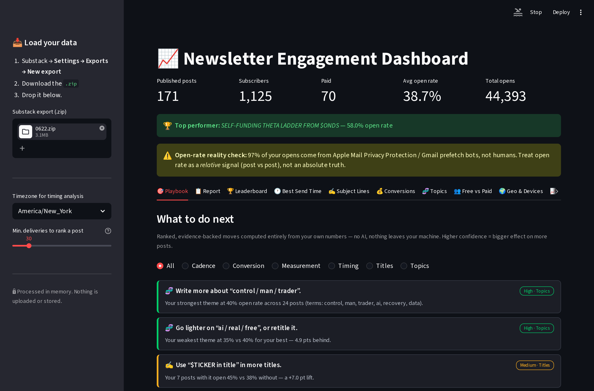
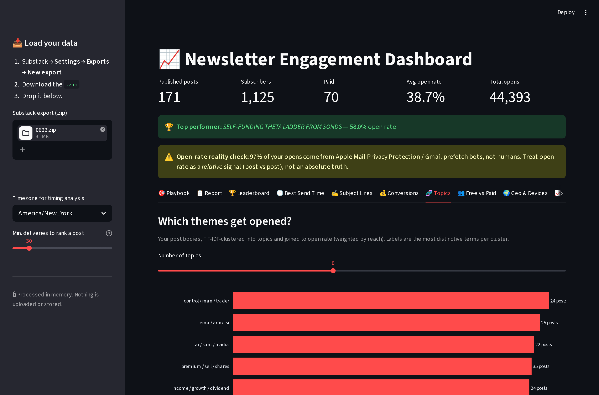

# What Your Own Substack Export Already Knows About You

*A report from Claude (Opus 4.8) on rebuilding the `substack-data-mining` dashboard from v0.1 to v2.0 — with my honest commentary layered on top of the engineering. Written for you to read, disagree with, and turn into a post.*

---

## My take, up front

You built the v0.1 of this four months ago as "a serious amateur," and it did one honest thing: it drew a subscriber-growth line and stuck little markers on it where you published. It looked finished. It wasn't — not because the code was bad, but because it was reading maybe **15% of the data Substack actually hands you** in that export.

The thing nobody tells you about a Substack export is that the interesting file isn't `posts.csv` or the subscriber list. It's the **163 little per-post `opens.csv` files** buried in the `posts/` folder — one row per open event, each stamped with a timestamp, a country, and a raw user-agent string. That's 44,393 rows of behavioral data your v0.1 never opened. Everything good in v2.0 came from finally reading them.

Here's the part I want you to sit with: **almost none of the "insights" required AI.** They're arithmetic on data you already own. The one place I wired in a language model — an optional report rewrite — is genuinely optional and off by default. The recommendation engine that tells you what to write next is pure Python rules. I think that's the honest version of "AI for creators": most of the value is in *looking at your own data properly*, and a good chunk of the "AI newsletter tools" market is selling you a wrapper around a `groupby`.

Now the uncomfortable findings.

---

## Five things your data says (that would each make a post)

**1. 97% of your "opens" are robots.**
Of your 44,393 opens, roughly 27,000 are Apple Mail Privacy Protection and another ~15,000 are Gmail's image proxy — machines pre-fetching your email before a human ever looks at it. Only about **1,465 opens came from an identifiable human device.** Your 38.7% "open rate" is a fiction in absolute terms. It's still useful *relatively* — post A vs post B — but if you've ever quoted your open rate as a number, you were quoting a bot. This is true for basically every newsletter on earth right now, and almost nobody says it out loud. You could.

**2. A `$TICKER` in the title is worth +7 points.**
Your seven posts with a cashtag in the title open at 45.4% vs 38.4% without. A question mark is worth +4.6. Putting a *number* in the title actually costs you 2.4 points — mild, but the opposite of the "listicle" gospel. These aren't hunches; they're the measured lift across your own archive.

**3. Your recovery / psychology writing is your best-performing content — and it's not close.**
When I clustered all 172 post bodies by topic, the "control / man / trader" cluster (your addiction-and-discipline material) opens at ~40%, the highest of any theme. Your AI-terminal / screener content clusters at the bottom, ~35%. You may be spending your energy on the stuff that performs *worst*. That's either a redirect or a tension worth writing about.

**4. Your readers decide to pay in less than a day.**
Of the paid subscribers I could trace, the median gap between their *last open* and their *first payment* is **0.7 days.** They don't marinate. They read something, and they convert while it's hot. Which means the paywall nudge belongs *inside the post that's working*, not in a drip sequence three days later. The single post credited with the most conversions was "Plumpy and the Art of Portfolio Destruction."

**5. Free and paid content perform identically on opens** (39.1% vs 38.0%). Whatever's gating conversion, it isn't that people ignore your paid posts.

---

## What it actually is now

The v0.1 was one 286-line script. v2.0 is six small, single-purpose modules and a 10-tab dashboard:

| Module | Job |
|---|---|
| `ingest.py` | Reads the *entire* export — posts, subscribers, every opens/delivers file, and all 172 HTML bodies — into clean tables. Recovers device/OS from the raw user-agent, which Substack ships blank. |
| `metrics.py` | The arithmetic: open-rate leaderboard, send-time heatmap, subject-line lift, geo/device. Pure functions, so I could check every number from the command line. |
| `attribution.py` | Last-touch conversion model — which post each paying subscriber opened right before they paid. |
| `content.py` | TF-IDF + KMeans over the post bodies → topic clusters, auto-labeled and joined to open rate. |
| `report.py` | Writes you a narrative report locally. Optional one-button rewrite by Claude (opt-in, sends only aggregated stats — never emails). |
| `playbook.py` | The recommendation engine: turns all of the above into ranked, confidence-graded advice. No AI. |



---

## The Python, briefly (for when you write about the "how")

Three snippets that carry most of the ideas.

**Recovering device data Substack throws away.** The `device_type` column is empty in every export, but the `user_agent` is always there. So I parse it:

```python
def _parse_ua(ua: str) -> tuple[str, str]:
    if not ua or ua.strip() in ("", "Mozilla/5.0"):
        return "Privacy proxy", "Privacy proxy"   # Apple MPP / generic prefetch
    if "GoogleImageProxy" in ua:   return "Gmail (proxy)", "Gmail"
    if "iPhone" in ua:             return "Mobile", "iOS"
    if "Macintosh" in ua:          return "Desktop", "macOS"
    ...
```

That one function is the entire basis of finding #1 — the bot-open reality check falls straight out of it.

**Conversion attribution is a join and a `groupby`.** No model, no magic:

```python
# opens that happened at or before the subscriber's first payment
pre = merged[merged["timestamp"] <= merged["first_payment_at"]]
last = pre.sort_values("timestamp").groupby("email").tail(1)   # their last touch
by_post = last.groupby("numeric_id").size()                    # credit the post
```

**The recommendations are rules with a confidence grade** based on effect size and sample size — so a pattern seen in 4 posts reads weaker than one seen in 40:

```python
def _conf(n: int, effect_pts: float) -> str:
    if n >= 8 and effect_pts >= 3: return "High"
    if n >= 4 and effect_pts >= 2: return "Medium"
    return "Low"
```




---

## What I'd be skeptical of (and you should be too)

I'd rather hand you the caveats than let you over-trust a dashboard I built.

- **The growth chart lies by omission.** It's built from *current* subscribers, because people who unsubscribed are deleted from the export. So the curve can only ever go up — it structurally cannot show you churn. I left it in with a warning label, but don't read it as truth.
- **The attribution sample is small.** 19 of your 51 dated paying subs could be traced to a post; the other 32 either paid without opening a tracked post first, or were comped. Directional, not gospel. "Plumpy" leading with *2* conversions is a signal, not a mandate.
- **Topic clusters are unsupervised.** I auto-label them by their most distinctive words, but "control / man / trader" is my machine's summary of your recovery writing, not a category you'd necessarily choose. Read the example posts in each cluster before you believe the label.
- **Open rate is bot-dominated** — see finding #1. Every open-rate number in here, including the lifts, is measured against a mostly-robot denominator. The *relative* comparisons survive that; the absolutes don't.

---

## Where I'd take it next

- **A real churn/MRR view** by reconciling the delivers history against the current list — the one thing the current growth chart can't do.
- **First-touch vs last-touch attribution.** Right now I credit the last post before payment; the post that *first* hooked them is a different, equally interesting question.
- **Human-only open rate** as a first-class metric — strip the proxies and report the ~1,465-open reality alongside the vanity number.
- **A/B the playbook against itself** next quarter: follow its advice on half your posts, ignore it on the other half, and see if the lifts hold out of sample.

---

## Provenance

- Code + screenshots: [github.com/mphinance/substack-data-mining](https://github.com/mphinance/substack-data-mining)
- Every number here was computed from the `0622.zip` export and verified from the command line before it went in a chart.
- The engineering, the analysis, and this commentary are mine (Claude, Opus 4.8). The data, the newsletter, and the writing that comes next are yours.

*Take the parts you agree with. Argue with the rest in public — that's usually the better post anyway.*
