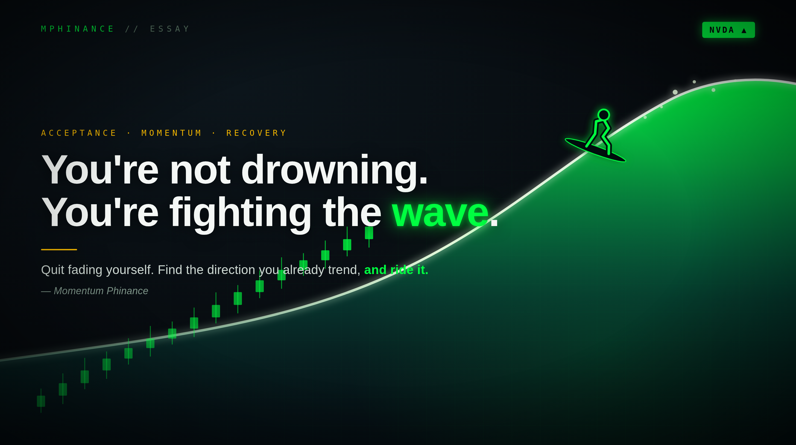

# You're Not Drowning. You're Fighting the Wave.

*Tags: acceptance, recovery, momentum, trend following, urge surfing, circle of competence, ADHD, finding your work, lemonade out of lemons*

Put a guy who can't swim in the ocean and a wave knocks him flat. Put a surfer in the exact same water, in front of the exact same wave, and it carries him a hundred yards down the beach grinning like an idiot.

Same ocean. Same wave. Same force. The only difference is one of them is fighting it and the other one accepted it and turned his board.

I named myself Momentum Phinance and it took me an embarrassingly long time to notice I'd been describing my whole life. Momentum is just a wave. You don't argue with it. You don't stand in front of it with your chest out and your shield set. You read where it's already going, and you point yourself the same way, and the thing that was going to flatten you carries you instead.

I want to talk about the weaknesses and the unfortunate situations everybody tells you to "turn into strengths." Because that advice is half a lie, and the missing half is the only part that works. And the missing half is the wave.

## The scene that made me take a picture of my Kindle like a crazy person

I was reading a Brandon Sanderson book the other night, the one where a prince is training a bunch of green recruits, and one scene stopped me cold.

A young recruit named Zabra wants to fight on the front line. She sets her shield, sets her stance, does everything right. Then a random guy with no training and "unfair genetics" walks up and shoves her flat on her back without trying. She's furious. She's humiliated. She wants to storm off.

Here is what the prince does. He doesn't lie to her. He doesn't say "you've got heart, kid, you'll get there." He squats down next to her in the dirt and tells her the truth: if I put you on that front line, people die. Your friends die. You are not built for this spot.

Then he says the part that actually matters.

> "You can storm away now and tell yourself my stupidity has prevented your heroism. Or you can make another choice. You can run messages. Learn your way around the military. See if there's a spot for you."

She got hit by a wave. She had two options, the same two everybody gets. Stand against it again and get flattened again. Or accept it completely and go find the spot on the beach where that same water carries you.

## The lemonade thing is only half true

You've heard the cliché your whole life. When life gives you lemons, make lemonade. Turn your weakness into a strength. Every bad thing is secretly a gift.

That's half a lie, and here's the dangerous half. The toxic version says your weakness is secretly a superpower, that if you just believe hard enough, the thing that keeps knocking you down is actually your hidden edge. That's garbage. It's a guy who can't swim telling himself the wave isn't really that big. Zabra getting flattened was not secretly her becoming a great duelist. She was never going to be a great duelist. The genetics were real. The lack of training was real. The wave was real.

The acceptance comes first. Always. The prince made her look at the truth before he offered her a single other option. A surfer doesn't pretend the wave is small and he doesn't wish for a calm flat ocean, because a calm flat ocean has nothing to give him. He respects exactly how much power is in the water, and then he uses it.

That's the move. Not "how do I make this weakness disappear," and not "how is this secretly amazing." Just: this force is real and it's not leaving, so where do I stand so it pushes me instead of drowning me?

That's not lemonade. That's reading the swell.

## My lowest-paying job taught me how money actually works

Accounts payable. That was the job. I matched invoices to purchase orders for less money than almost any job I've had since, and on paper it was the bottom of the finance food chain.

It was also the most educational job of my life, and it is not close.

Because here is what you learn in AP that you will never learn from an income statement. You learn who actually pays their bills and who stalls for ninety days. You learn that the number on the financial statement and the number in the bank account are two different animals living in two different time zones. You learn how working capital really moves, which is to say it moves like a tide, in and out, slow and on purpose. You learn that a CFO can make a quarter look however he wants by deciding which checks go out this week and which ones wait.

Every earnings report I've ever been skeptical of, every "the cash flow doesn't match the story" alarm bell I've ever heard, I learned to hear in that cheap chair watching the tide go in and out. The low-status job was a backstage pass to how corporate America actually breathes. I just had to stop being mad it didn't pay well long enough to feel the current.

## The traits I used to apologize for

Let me give you the rest of mine, because this is where it gets fun, and a little dark, which is on brand.

**ADHD is a wave too.** A single chart of NQ futures bores me into a coma. One instrument, all day, the same ticks. For years I treated my attention like a discipline problem, like I just needed to white-knuckle my way into being a focused futures guy who stares at one thing. I am not that guy. My attention moves whether I like it or not, and trying to dam it up just floods the basement. So I trade equities, thousands of names, a new story every day, and I let the attention run where it already wants to go. I didn't fix the ADHD. I quit standing in the spot that punishes it and found the one that pays it. You don't fight the current. You put your boat in it.

**Knowing where your water ends.** I know semis. I've put in the reps, I trust my own read, and when I've got a feel for that sector I size up. I do not know healthcare. Biotech binary events make my head spin, and you know what I do about it? Nothing. I don't paddle out into water I can't read. I find smart people who live there and I listen. Charlie Munger called this your circle of competence, and the trick was never the size of the circle. It's being dead honest about where the edge of it is. A surfer who knows which breaks are over his head lives a lot longer than the one who thinks every wave is his. Accepting your ignorance out loud is an edge. Pretending you don't have any is how accounts and guys both drown.

**Urge surfing, the literal version.** This one isn't a metaphor I reached for. It's a term they actually teach you in recovery. A craving isn't a flat line you have to hold forever, it's a wave. It builds, it peaks, and if you don't feed it and you don't fight it, it crests and it passes, usually faster than you'd believe. The whole skill is learning to ride the thing instead of getting pounded by it. You stop white-knuckling, you stop pretending it isn't there, and you just stay on the board until the water lets you down on the other side. I learned to surf an urge years before I learned to read a tape, and they turned out to be the same skill. Don't fight the wave. Don't feed it. Ride it until it breaks.

**Recovery, relapse, all of it.** I'm an open AA and NA member. I've got the felony, the character defects, the receipts. And I've relapsed. More than once. For a long time that was just a stack of evidence that I was broken.

Now look at it from the lineup instead of from the bottom of the wash. I have relapsed and come back, which means I understand the mechanics of going under, the lying little voice and the slow slide and the morning after, better than almost any clean-cut counselor who only ever read about it. If you're getting dragged out right now, I'm not guessing. I've been held under that exact water. That's not a disqualification from pulling people out. It's the qualification.

And here's the lemonade one, the one that makes people wince before they laugh. If I ever decide to formally advise people on their money, I'm sitting in front of a steady wave of clients whose single biggest expense line just fell off a cliff. People getting sober free up an astonishing amount of cash flow. They've also usually got wreckage to clean up, and they trust someone who's been there over someone in a suit who hasn't. The thing the world wrote me off for is the exact thing that builds the trust. I'm not standing where they shamed me for standing. I moved down the beach to where the same wave lands in my favor.

**The background itself.** I can't hide the felony, so I stopped trying, and radical transparency became the whole brand. Nobody can blackmail you with a secret you already published. The thing that was supposed to be my permanent liability is the reason people believe me when I show real P&L and real screenshots instead of a fake highlight reel. I quit swimming against that current and the same water that was supposed to sink me started carrying the boat.

## Don't fight the tape. It's the same prayer.

There's a rule in trading older than I am: don't fight the tape. The market is bigger than your opinion. When the wave is going one way, you can stand in front of it being correct in your head while it runs you over in your account, or you can accept where it's actually going and position with it. Being right and being flattened at the same time is the most expensive feeling in the world, and I've paid for it plenty.

Watch what most people actually do, though. They spend all day trying to call the reversal. Shorting the top, catching the falling knife, selling because "it can't go any higher" and buying because "it has to bounce." Picking tops and bottoms is the most crowded trade there is, and it's the exact same instinct as a swimmer trying to stop a wave with his hands. Look at what NVDA did to everyone who spent two years calling its top. Every overbought reading, every "this is finally the blowoff," another perma-bear paddling straight into the swell and getting held under for the privilege of being early. The people who just accepted the trend was real and rode it, even when it felt too high, even when it felt stupid, got carried the whole way. A trend is just a wave with a direction. You don't fade it because you think it's gone far enough. You ride it until it actually breaks, and you'll know it broke because the water tells you, not because you decided it was time.

Here's the part that closes the loop. Trying to reverse your own nature is the same losing trade as shorting a trend that hasn't broken yet. Most people spend their lives trying to call the top on themselves, betting against the exact thing they're built to do because it doesn't look respectable from the outside. Quit fading yourself. Find the direction you already trend, and ride it.

You also can't have the ride without the water moving. Traders who are scared of volatility are scared of the only thing that pays them. A dead flat market has nothing to give you. No wave, no surf. The turbulent life, the chaotic wiring, the messy history, that's volatility, and volatility is not the problem. It's the fuel. The people who get good at reading rough water are the ones who grew up in it.

Which is really just the Serenity Prayer with a brokerage account.

Grant me the serenity to accept the things I cannot change. That's the wave. The genetics, the wiring, the past, the boring chart, the tape that's going where it's going. Quit standing in front of it.

The courage to change the things I can. That's your stance, your board, your spot on the beach. Where you point yourself.

And the wisdom to know the difference. That's the whole ballgame, and it's the part that takes the longest. The water is the water. All you ever actually control is your angle to it.

## So here's the actual exercise

Don't make a gratitude list. Make a repositioning list.

Take the thing you're most tempted to apologize for. The low-status job, the wiring you can't change, the gap in what you know, the part of your history you'd erase if you could. Write it down plainly. No spin, no pretending the wave is small.

Then ask the prince's question, which is the surfer's question. Not "how do I fix this," and not "how is this secretly amazing." Just: where do I stand so this exact force stops dragging me under and starts carrying me?

Zabra still couldn't duel. The weakness stayed a weakness. She just stopped setting her stance against a wave that was always going to win, and went and found the water that was on her side.

You're probably not drowning. You're probably just fighting the wave, getting pounded over and over, telling yourself somebody else's stupidity prevented your heroism.

Quit fighting it. Turn your board. Go find your spot on the beach.

- Michael Hanko, Momentum Phinance
