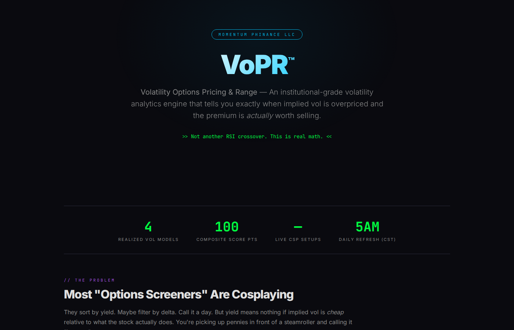
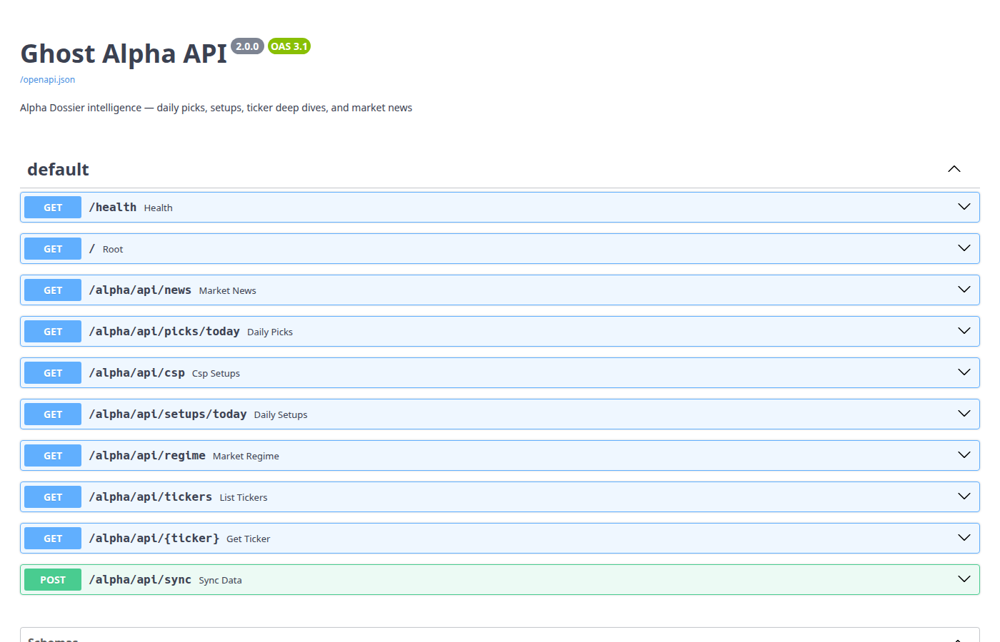
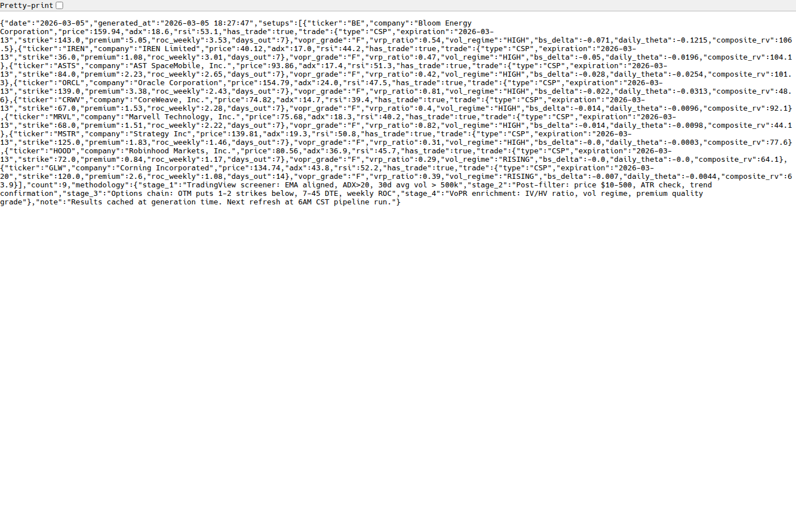

# VoPR™ — The Real Options Edge Nobody Else Gives You

**Here's the truth:** Most options screeners are sorting by yield and calling it analysis. That's like sorting players by height and calling it a basketball scouting report. Yield is one number. It tells you almost nothing about whether the premium you're collecting is *worth the risk*.

I built something better. It's called **VoPR — Volatility Options Pricing & Range** — and it answers the only question that matters when you sell premium:

> **Is implied volatility actually overpriced, or are you just picking up pennies in front of a steamroller?**

---

## 💡 What VoPR Actually Does

Every morning at 5AM CST, my automated pipeline screens 100+ stocks, runs the survivors through a 4-stage funnel, and spits out graded cash-secured put setups enriched with institutional-grade volatility analytics.

Not "high yield put ideas." Not "filter by delta and good luck." Full quantitative analysis using research published in the *Journal of Business* and *Review of Financial Studies*.

Here's the stack:

**4 Realized Volatility Models** — blended into one composite number:

- **Close-to-Close** — the one everyone uses. We include it, but down-weight it because it misses intraday
- **Parkinson (1980)** — uses high-low range, 5x more statistically efficient
- **Garman-Klass (1980)** — OHLC estimator, most efficient classical model (gets the most weight)
- **Rogers-Satchell (1991)** — drift-adjusted, unbiased even in trending stocks

Each model contributes to a proprietary weighted composite. The weights are tuned, not equal — because not all information is created equal.

**Volatility Risk Premium (VRP)** — the actual edge:
> VRP = Implied Vol / Realized Vol (composite)

When VRP > 1.2, the market is pricing in significantly more volatility than the stock is actually exhibiting. That's the sellers' paradise. When VRP < 0.8, IV is cheap — don't sell, you're giving it away.

**Black-Scholes Greeks** — computed from scratch:

- **Delta** — we target |Δ| ≤ 0.15 for safe CSPs (85%+ probability of expiring OTM)
- **Theta** — daily time decay in real dollars. Every day that passes without assignment = money in your pocket

**Vol Regime Classification** — context matters:

- 🟢 **LOW** — vol compressed, best environment for selling premium
- 🔵 **FALLING** — elevated but coming down, good entry window
- 🟡 **RISING** — expanding, proceed with caution
- 🔴 **HIGH** — max premium but max risk, size down or sit out

---

## 📊 The Grading System

Every candidate gets scored across three dimensions and assigned a composite grade:

| Component | What It Measures |
|-----------|-----------------|
| **VRP Ratio** | How rich is IV vs realized? The core signal. *(Heaviest weight)* |
| **Vol Regime** | Is volatility compressing or expanding? *(Significant weight)* |
| **Delta Safety** | What's the probability this put expires worthless? *(Significant weight)* |

| Grade | What It Means |
|-------|--------------|
| **A** | Everything aligned. Rich IV, calm vol, safe delta. Full-size. |
| **B** | Solid setup, one minor concern. Standard size. |
| **C** | Marginal — proceed with caution or wait. |
| **F** | Don't touch it. Cheap IV, hot vol, or dangerous delta. |

This is what separates "high yield" (trap) from "high quality setup" (edge).

---

## 🔥 Live Data — Right Now

The API is live. CORS open. No auth required *(for now)*.

### VoPR Showcase Page

Full methodology deep-dive with live data table:

🔗 **<https://mphinance.github.io/mphinance/vopr.html>**

### Swagger Docs

Full interactive API documentation — try every endpoint yourself:

🔗 **<http://mphinance.com:8002/docs>**

### API Endpoints

| Endpoint | What You Get |
|----------|-------------|
| `GET /alpha/api/csp` | Full VoPR-graded CSP setups with strikes, premiums, Greeks, grades |
| `GET /alpha/api/picks/today` | Daily momentum picks (Gold/Silver/Bronze, 9-factor scoring) |
| `GET /alpha/api/setups/today` | 3-style daily setups (Day Trade / Swing / CSP) |
| `GET /alpha/api/news` | Aggregated market news from CNBC, MarketWatch, Yahoo, Investing.com |
| `GET /alpha/api/regime` | Market regime (VIX level, hedge suggestions, context) |
| `GET /alpha/api/{TICKER}` | Full deep dive data for any tracked ticker |
| `GET /alpha/api/tickers` | All available tickers with grades and scores |

### Raw API Response

Here's what comes back when you hit `/alpha/api/csp` — real tickers, real strikes, real grades:

---

## 🛠️ The Stack

The whole thing is Python-native. No spreadsheets. No manual entry. No "I'll update it when I get to it."

- **Python** — NumPy, SciPy, pandas-ta. Black-Scholes from scratch. 4 vol models with zero shortcuts.
- **FastAPI** — sub-50ms response times. JSON endpoints. Swagger docs included.
- **GitHub Actions** — fully automated 5AM CST daily pipeline. 13 stages. Zero manual intervention.
- **Docker** — containerized on Vultr VPS. One `docker compose up` and it's running.

The source code for the VoPR engine lives at `strategies/vopr_overlay.py` in the [mphinance repo](https://github.com/mphinance/mphinance). Yeah, it's open source. Because the value isn't in reading the code — it's in the automated pipeline that runs it every morning and serves it as an API while you're still asleep.

---

## ⚠️ Fine Print

This won't be free forever. The API is open right now because I want you to see it, try it, and understand what differentiates this from every other "options screener" that sorts by yield and calls it a day. But at some point, this data goes behind an API key.

The methodology page stays public. The code stays open source. But the *computed, daily, ready-to-trade setups* — that's the product.

Not financial advice. Options involve risk. Past performance doesn't guarantee future results. But you already knew that. What you didn't know is that most of the "premium" you've been collecting was underpriced for the risk. Now you do.

---

*Built with math, not marketing. — Ghost Alpha 👻*

*Questions? Hit me on [Substack](https://mphinance.substack.com) or check the [Ghost Blog](https://mphinance.com/blog/) to see Sam roast my commits in real-time.*
