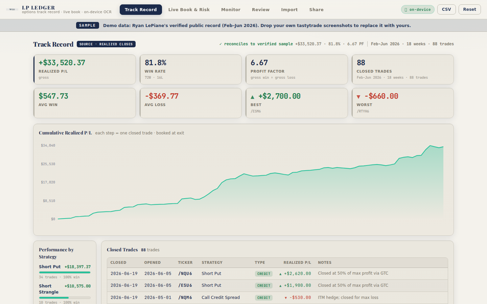
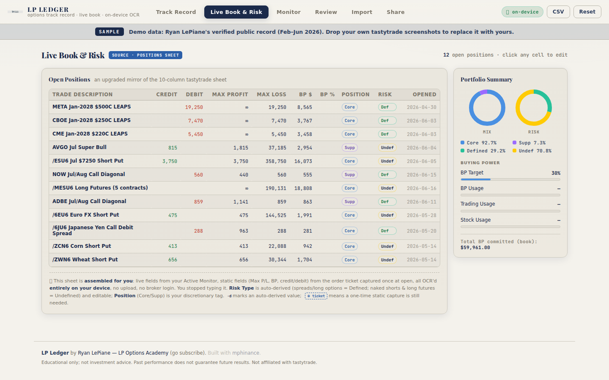
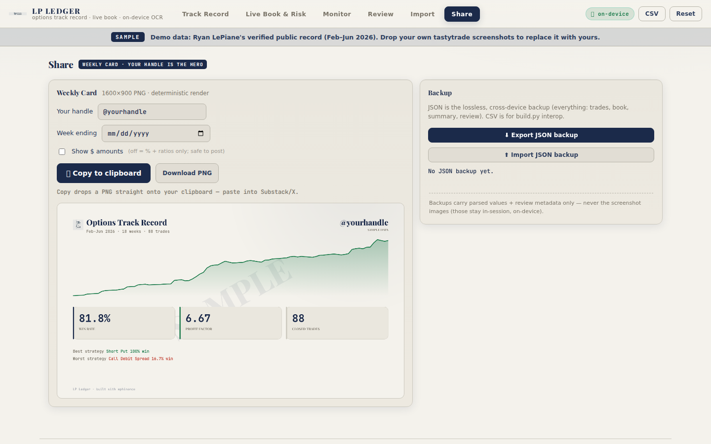
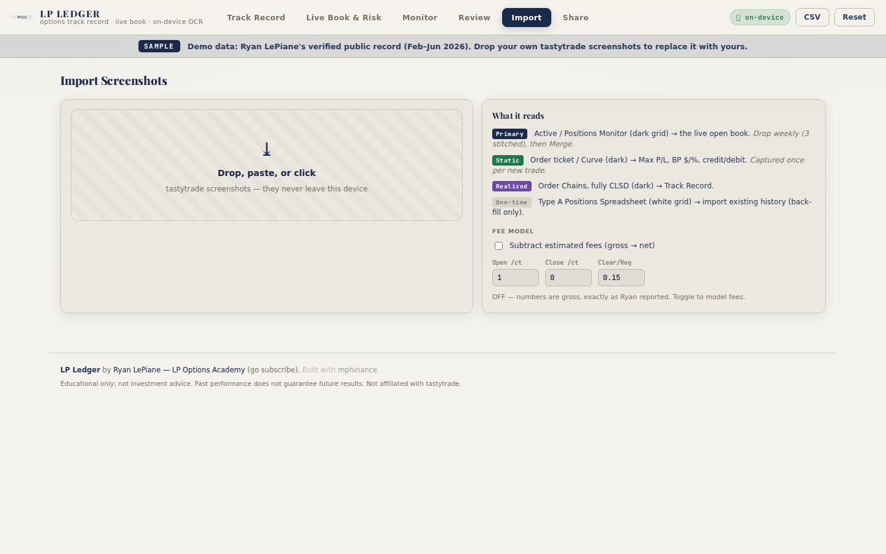

<!-- DRAFT for review, not published; screenshots + paywalled prompt to be inserted by Michael. -->

# Automating With Claude: Ryan Was the Guinea Pig

*Automation Architect, day one. Forgiveness, not permission.*

*Business 45% | AI 35% | Trading 20%*

Yesterday I let a voice AI interview me at a conference. Gemini. On the way in.

It told me what I want to do with my life.

I published that and went home. While I was already mid-build on the answer, [Ryan LePiane hit restack on the question.](https://substack.com/@ryanlepiane/note/c-283431564) His words: "And another one! Michael with another awesome free resource."

I did not ask him first. He was boosting my existential crisis while I was building his tool. Forgiveness, not permission. As it turns out, no forgiveness was even necessary.

## The job, in human words

I'm calling myself an Automation Architect now. Let me say what that actually means, because "automation" and "architect" are both words that die a little inside a LinkedIn bio.

Three services. No buzzword fog.

**Institutional Knowledge Recovery.** Somebody's thirty-year career is trapped in a notebook, a dead wiki, and a shared drive nobody can search. I build a secure, local LLM pipeline that indexes all of it into one searchable brain. The veteran retires. The knowledge doesn't. Nothing hits a cloud server you didn't approve.

**Legacy System Reskinning.** Every company has the spreadsheet that secretly runs everything. It's in Excel, it's from 2009, and the one person who built it is scared to take a vacation. I audit the logic, find where the real value lives, and turn that underused thing into an actual product. The asset was already there. It just needed a front door.

**Fractional Technical Architecture.** You don't need a full-time CTO yet. You need someone to spend ten hours a month auditing the stack, finding the one bottleneck that's quietly choking everything, and setting a roadmap that doesn't explode your budget. That's the architect layer. You rent it.

A few operating rules I won't bend. Fixed-project billing, not hourly, because hourly pays me to be slow. I'm not building a practice on a perverse incentive.

There's The Leash. The work is transparent. Fees are tied to your ROI. If it doesn't move your number, that's my problem to fix.

And the one most "AI consultants" will skip: if your problem doesn't need AI, I won't use it. Right tool for the bottleneck, not the buzzword. Sometimes the answer is one clean spreadsheet. I'll tell you that for free.

## What I built for Ryan

Ryan logs every options trade in his weekly recaps at [LP Options Academy](https://ryanlepiane.substack.com/). Real trades. Real entries. Real exits. But the record lives in broker screenshots and prose, scattered across months of posts nobody can add up.

No cumulative track record. No equity curve. No way to answer: how does he actually perform over time.

The single most valuable thing a free options teacher owns is the proof. Ryan was giving it away by accident.

So I built him LP Ledger.

Here is how each of the three services shows up in what I shipped.

**Knowledge Recovery in action.** LP Ledger's in-browser OCR reads Ryan's trapped tastytrade screenshots and indexes each trade into a searchable, on-device brain. Nothing leaves his machine. The screenshots stop being a pile of images and start being a database he can query.

**Reskinning in action.** Ryan was hand-maintaining a spreadsheet. LP Ledger reskins that into an automated, branded web app with a one-click Weekly Card he can paste directly into his recaps. Same data he already had. Now it has a front door and a name.

**Fractional Architecture in action.** Somewhere in the build I caught that we were OCR'ing the output (his spreadsheet) instead of the source (his actual broker screens). Pointed it back at the right thing. The BYOK layer (bring-your-own-key: OpenRouter, OpenAI, Claude, Gemini, local) sits on top as an optional accelerator. Plain deterministic OCR does the core job. The AI is a bonus, not a requirement. Right tool.

**The Leash in practice.** The whole thing is open source. The numbers reconcile to the penny.

## The receipts

This is what the tool surfaced from Ryan's real trading history, February through June 2026.

88 closed trades. $33,520.37 realized. 81.8% win rate. 6.67 profit factor.

Live right now: [https://mphinance.github.io/lp-ledger/](https://mphinance.github.io/lp-ledger/)

*Honest footnote, because Ryan is straight about his methodology and I am too: two of those trades were assigned positions, booked as realized premium only, with the resulting shares tracked separately. The P&L is real. The disclosure is in the app.*

## What I'd build for the rest of you

I built Ryan's. Here's what I'd hand a few other writers I actually read. Go follow them. This is the kind of decency I was talking about, and I'd rather practice it than describe it.

[OROLO Capital](https://orolo.substack.com/) publishes dated forecasted reversal dates, then grades them by hand once a month. Build: an auto-grading Forecast Scorecard that marks every call hit or miss against the tape and shows a rolling hit-rate. For a forecaster, that's the whole credibility weapon.

[Tiger Capital Research](https://princetonchen.substack.com/) posts four-plus ticker calls a day. The alpha buries itself. There's no way to ask "what has he actually said about NVDA over time." Build: a Ticker Brain. A searchable index of every call by ticker and date.

[Emerging Value](https://emergingvalue.substack.com/) re-types three portfolios into prose every single month. Build: a live portfolio tracker off one sheet, since-inception returns updating themselves. Stop re-typing your own returns.

[The VIX Queen](https://vixqueen.substack.com/) writes deep macro theses that never get revisited or scored. Build: a thesis ledger that surfaces what she called and whether it played out. The theses are great. They deserve a scoreboard.

[Michael W. Green](https://www.yesigiveafig.com/) has spent years building one dense thesis about passive investing breaking the market, spread across hundreds of posts and podcasts with no easy way in. Build: "Ask Michael Green," a searchable brain over his whole back-catalog so a new reader can navigate the argument by topic instead of reading it in chronological order.

[Investinq](https://www.thestockmarket.news/) makes bold macro calls behind a paywall with no record of how they landed. Build: a prediction scorecard that logs each call at publish and scores it at 30, 60, and 90 days. If you charge for the calls, show the receipts.

[Engineering Alpha](https://abouttrading.substack.com/) (Sofien Kaabar) runs the same backtest-to-post grind every issue. Build: a backtest-to-draft pipeline that turns Python output straight into a formatted post shell, so the writing is all that's left.

[Hidden Gems Research](https://hiddengemsresearchllc.com/) keeps a hand-updated community stock spreadsheet and quotes big winners, but there's no standing scoreboard. Build: a pick-performance tracker that logs every name at its publish price and marks it to market in public.

## How it got built

The app is free. Open source. The link is above.

What's below the paywall is the single Claude Code prompt that built the whole thing. One prompt. Claude Code's `ultracode` command. Working production app, from scratch. My own `/orchestrate` skill does the same thing from inside Claude Code's agent layer.

I've run equivalent experiments in Antigravity and Codex. Both are useful. For idea-to-production in one prompt, Claude Code is what I reach for. Not a sales pitch. Just what keeps being true.

<!-- PAYWALL HERE -->

[PAYWALLED: the one-prompt ultracode build prompt goes here — Michael pastes it from scratchpad/ultracode_build_prompt.md]

## Yesterday a robot named the job

Today I shipped the proof and gave it away.

If you're a writer drowning in your own clunky workflow, or a small business carrying automation debt you've been meaning to fix, the comment section is open. Tell me where the clog is. Worst case I tell you it doesn't need AI and you save some money.

The Leash applies to all of you. I only want to build the thing that actually moves your number.

~ Michael
