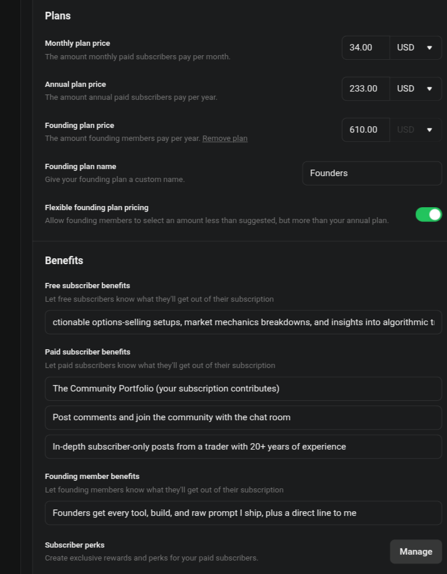
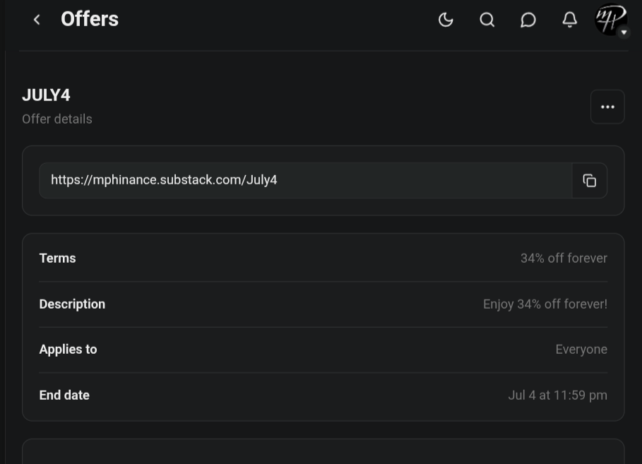

# Even Cassandra Charges

*Business 50% | Mindset 30% | Trading 20%*

> *Something new: I'm tagging every post by what it's actually made of, by weight. That line up top is the recipe, so you know what you're walking into before you spend a minute on it.*

There's a dumb way to ask why I charge and a smart way.

The dumb way is "those who can't do, teach." You can wave that off in a sentence, so I won't waste your time on it.

The smart way, the one a sharp reader actually asks, is this: if your edge is real, why not just compound it quietly and keep your mouth shut? Why run a newsletter at all?

That's the version worth answering. So I'm going to answer it, and then tell you the part that actually matters, which is what happens to your money after you hand it to me.

## First, the easy half

There's a theory floating around that charging means a trader secretly can't trade. It dies the second you look at my own feed, because Michael Burry runs a paid stack two doors down called [Cassandra Unchained](https://michaeljburry.substack.com/).

That's *the* Cassandra. The man who saw 2008 alone in a room everyone else was laughing in. The patron saint of the giant lonely bet, a guy who trades nothing like me and never will. He charges.

So whatever your theory is about charging being a confession of weakness, it has to explain him too, and it can't. The best in the building charges. Even Burry takes a fee. Done. Next question.

## The question that's actually hard

Fine. Charging isn't a tell. But if the edge is real, why not run it in silence and just compound?

I could. That's the honest answer. I've got the tools, the system, the setups. I could turn off the lights, trade my own book, and tell nobody anything.

And that is exactly the version of me I don't trust.

Recovery taught me something the market only confirmed. The stuff you do alone, in private, with nobody watching, is the stuff that gets you. Not because I'm reckless with money. I'm almost annoyingly not. I barely spend. My colorful past cost me a fortune in legal fees and roughly nothing in bad decisions at the checkout.

It's that trading alone all day, answering to no one, helping no one, slowly turns a person into someone who measures a year in basis points and a life in nothing. I've met that guy. I've been versions of him.

Doing it in public, with my name and my money and my reasoning sitting on the page where you can check it, is the leash. It keeps me honest the same way a meeting does. You don't get better in secret.

## What I do with your money

Now the part that actually matters: what happens once your subscription is mine.

Yes, a steady fee is lower variance than swinging my whole account at one idea. Even Burry takes the management fee. Smart money diversifies its income away from its own bets, and I won't pretend that isn't part of it.

But that logic, all by itself, is also the exact business model of every burn-and-churn newsletter on this website. Take a small cut from a big crowd, collect, repeat. The grifter doesn't need you to win. He needs you to resubscribe. His tell is always the same: his money isn't in the trade. Clean hands, your broken back.

So I built mine where I literally can't do that.

Twice a month I move cash into IBKR. Not the leftovers, a set amount, on a schedule, like a bill. When I find a setup I believe in, I buy it, and then I write it up. The positions in those IBKR and tastytrade screenshots aren't props. They're your subscriptions, redeployed into the same names I'm handing you, sized by risk like everything else in the book, not by how good a month the newsletter had.

My money rides in the same boat, in the same names, at the same time as yours.

And yes, I buy before I publish. A sharp cynic's hand just went up, because that's the setup for the oldest scam there is: buy quiet, pump to your list, sell into their orders. So let me close that door all the way.

I don't sell onto you. Half of what I make here keeps flowing into those same names, month after month. There is no exit where I dump my bag on the room I built, because I'm not exiting. I'm compounding next to you. The disclosure isn't "I might own this." It's "I own this, you can see exactly how much, and I'm still buying."

I'm not selling shovels with clean boots. I'm in the hole next to you, digging, with my own cash in the ground.

## So, why not just do it quietly

Because quiet is where I lose. Not the money. The plot.

Capital preservation is the unsexy skill nobody wants to pay for and everybody needs, and I am not going to get sharper at it sitting alone watching a P&L tick. I get sharper writing it down in plain words for people who remind me a lot of people I've watched torch money they couldn't afford to lose, on a bet they didn't understand, because somebody confident told them to. That still gets under my skin more than almost anything.

I can't do anything about that in silence. I can do a little about it out loud, with my own money in the same trade, getting paid more only if you're still standing here next year.

The fee isn't the thing I take from you. It's the leash I keep on me.

That's why I charge.

Sam thought I should charge more. We finished negotiating. She won.

## The new menu

New prices, and they land on Fibonacci levels, because of course they do. Thirty-four a month. Two-thirty-three a year. Six-ten for Founders, who get every tool, build, and raw prompt I ship, plus a direct line to me.

## If you already pay me, read this first

You didn't get a price increase. You got a promotion.

Everyone who was already paying when I flipped this switch is a Founder now. It didn't cost you a dollar, and nothing you get changes, because you've already been getting all of it: every setup, every tool, every build and raw prompt I ship, the live portfolio, a direct line to me. Now it just has a name on it, and your rate is locked there for as long as you stay.

That isn't a discount. It's a thank-you. You were here when it was just me, a spreadsheet, and a felony record, betting my own money out loud. Being early was the whole price of admission, and you already paid it.

Founder is a paid tier now. You got in for free by getting in first.

## If you've been reading free

You've had the philosophy for free. The trades are what's behind the wall.

The actual names, when I buy them, with my own money riding in the same boat as yours, sized by risk and written up in plain words. The live portfolio you can follow position by position. The setups, the entries, the exits. Not hot takes. Positions you can actually put on.

This is the part where I stop being subtle.

Through July 4th, you get 34% off. Forever. Not a first-year teaser that jumps on you in twelve months. The rate you lock is the rate you keep for as long as you stay. It ends at 11:59pm on the 4th, and it does not come back at this number.

The math on that isn't an accident either. Thirty-four percent off a thirty-four dollar month. I told you the levels were real.

[Lock in 34% off forever, before the 4th](https://mphinance.substack.com/July4)

You've watched me put my own cash in the same names, on a schedule, in public, getting paid more only if you're still standing here next year. That's the leash. If that's the kind of person you want in the trade next to you, the door is open until the 4th.

~ Michael
