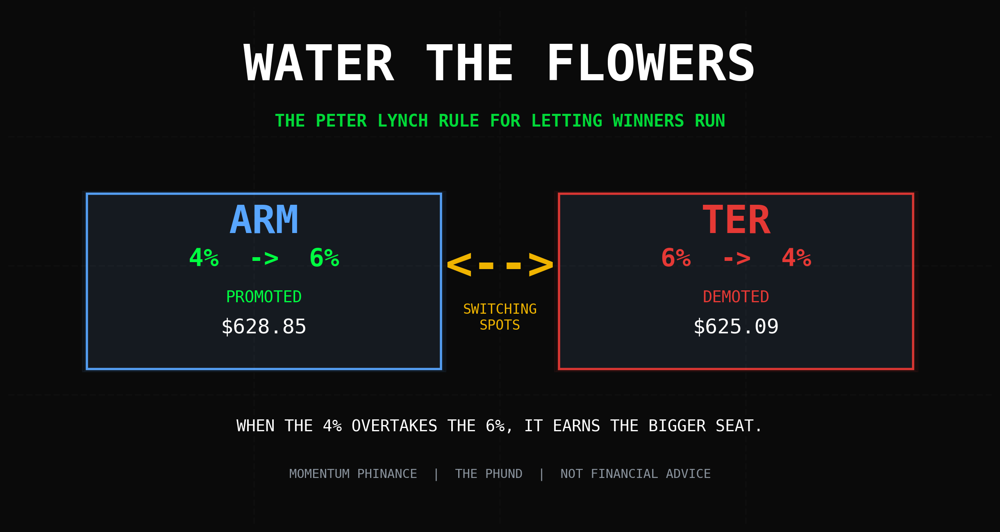
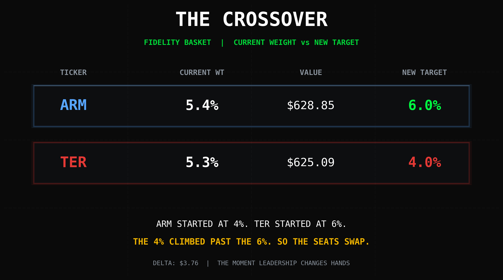
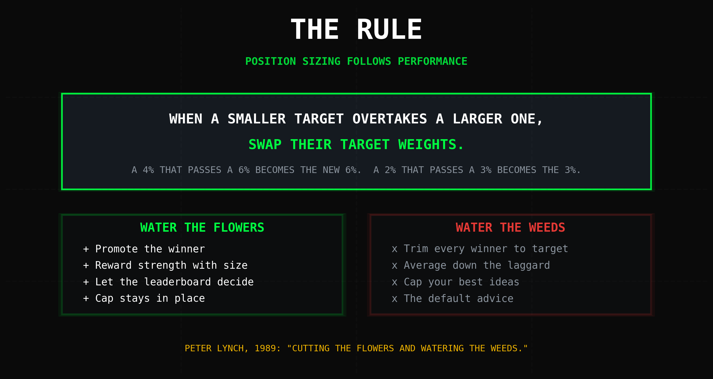

# Water the Flowers: My Peter Lynch Rule for Letting Winners Run

*Tags: rebalancing, Peter Lynch, position sizing, ARM, Teradyne, momentum, portfolio strategy*

Most people rebalance backwards. A stock rips, gets too big, and they trim it back to "target." A stock dies, shrinks to nothing, and they buy more to "average down." They sell the flowers and water the weeds.

Peter Lynch warned about this 35 years ago and people still do it every single quarter.

I do the opposite. When a small position fights its way up the leaderboard and overtakes a bigger one, I don't cut it back. I promote it. I bump its target allocation **up** and knock the laggard's target **down**. The market just told me which one is the flower. My job is to water it.

That's exactly what happened in my Fidelity basket this week. **$ARM and $TER are switching spots.**

## The Setup

Two semis. Two very different jobs.

**ARM Holdings ($ARM)** designs the chip architecture that basically every phone on earth runs on, and now it's bleeding into AI and data center. High margin, royalty model, the closest thing to a toll booth in silicon.

**Teradyne ($TER)** builds the machines that test those chips, plus industrial robots. Good business. More cyclical. It moves when the semi equipment cycle moves.

When I built this basket, I gave TER the bigger seat. **TER started at a 6% target allocation. ARM started at 4%.** At the time TER was the more established name and ARM was the newer, smaller conviction. So I sized them that way and let them run.

I did not touch them after that. No trimming. No adding. I just let the market vote.

## The Crossover

Here is what the market voted, straight off my Fidelity basket details screen:

**ARM:** now **5.4%** of the basket. Position value **$628.85**. Target getting bumped to **6.0%**.

**TER:** now **5.3%** of the basket. Position value **$625.09**. Target getting knocked down to **4.0%**.

Look at what happened. ARM started life as the 4% kid. TER started as the 6% favorite. And ARM quietly grew until it passed TER on the leaderboard. The 4% overtook the 6%. By dollars, by weight, by everything that matters.

That crossover is the entire signal. I don't need a price target. I don't need an analyst note. I don't need to guess the top. The two positions told me which one is winning by literally swapping places in the standings.

So I swap the targets to match. ARM goes to 6%. TER goes to 4%. The winner gets the bigger seat.

## The Rule

Here is the whole thing in one sentence:

**Whenever a smaller target position overtakes a larger one, swap their target weights. A 4% that passes a 6% becomes the new 6%. A 2% that passes a 3% becomes the new 3%.**

That's it. No spreadsheet gymnastics. No rebalancing back to some fixed grid that punishes your best ideas. The position sizing follows the performance, not the other way around.

Notice what this is NOT. This is not "let it ride to infinity and never sell." There's still a ceiling. ARM doesn't get to become 40% of the basket because it had a good month. It moves up one rung, from 4% to 6%, taking the exact seat the laggard gave up. The basket stays balanced. The leadership just rotates to whoever earned it.

## Here's the truth about rebalancing

The standard rebalancing advice, sell your winners down to target and buy your losers up to target, is mathematically designed to cap your best performers and pour money into your worst ones.

It feels disciplined. It feels safe. It's the financial advisor version of "don't get greedy." And over a long enough timeline it quietly strangles the one or two positions that were supposed to carry the whole basket.

Winners win for a reason. ARM isn't beating TER by accident. The market is repricing what that royalty model is worth in an AI world, and that repricing doesn't happen in one clean move. It happens over months. If I trim ARM every time it pokes above target, I'm fighting the exact trend I bought it for.

Watering the flowers means I let the leaderboard decide. The stock that climbs gets rewarded with size. The stock that fades gets less. I'm not predicting anything. I'm just refusing to punish strength.

<!--paywall-->

## The live basket math

Here's the part I only show subscribers, because this is the actual machine.

The swap is purely a **target** change. I am not market-buying ARM up to 6% in one shot and I am not dumping TER to get to 4%. That would hand the spread to my broker and the IRS for no reason.

Instead the new targets do two things automatically inside the Fidelity basket:

**1. Every new dollar I add gets routed by the new weights.** Fresh contributions now flow 6% into ARM and 4% into TER instead of the reverse. The position drifts toward the new target on its own, paid for with new money, not with realized gains.

**2. The drift band does the rest.** ARM is at 5.4% against a 6.0% target, so it's under target now and accumulates. TER is at 5.3% against a 4.0% target, so it's over target and gets starved of new dollars until it drifts back down. No panic selling. No taxable event in the taxable sleeve. The weights converge over the next few buys.

The current dollar gap is tiny, **$628.85 versus $625.09, about four bucks**, which is exactly why the crossover is the right trigger. I'm acting the moment leadership changes hands, not three months and 30% later when the move is half over.

If TER turns around and climbs back over ARM next quarter? Fine. They swap again. The rule doesn't care about my ego or my original thesis. It only cares who's winning right now.

## What's next

I'm running this rule across every basket, not just Fidelity. Any time a lower-target position closes the gap and overtakes a higher-target one, the seats swap. I'll log each crossover here so you can watch the leadership rotate in real time.

Next candidates getting close to a crossover are in the live tracker. A couple of the 2% satellites are sniffing at the 3% names above them, and if they cross, they get promoted the same way ARM just did.

The whole point is to make the discipline automatic. Take my feelings out of it. Let the flowers tell me they're flowers, and then water them.

## The close

I spent a lot of years watering weeds. In my using days I poured everything into the things that were actively killing me and starved the parts of my life that were actually growing. Recovery flipped that. You feed what's working. You stop pouring resources into the thing that's already proven it takes and takes and gives nothing back.

Turns out that's a position sizing rule too.

Water the flowers. Pull the weeds. Let the winners run, but make them earn the bigger seat.

*Not financial advice. I'm a felon with a brokerage account and a Peter Lynch quote taped to the wall. Every number in this post came straight off my Fidelity basket details screen. ARM 5.4% at $628.85, TER 5.3% at $625.09. Fork the code on GitHub if you don't believe me.*

---

**Subscribe to Momentum Phinance for the live basket tracker, every crossover the moment it triggers, and the running scoreboard of which flowers are getting watered next.**

- Michael Hanko, Managing Partner, The Phund
