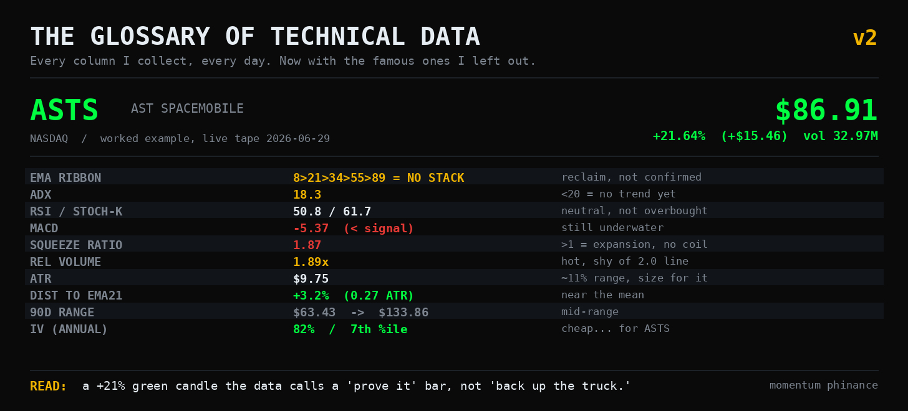

# The Glossary of Technical Data, v2

*Tags: technical analysis, stock screener, options greeks, implied volatility, RSI, gamma, trading education*

**A green candle is not a signal. It's a rumor.** The data is what tells you whether to believe it.

The first version of this post did one job: it pinned down what the acronyms in my daily screens actually mean. It worked. It also read like a textbook a robot wrote for another robot. A few of you told me as much. One of you said your wife read it, got to "non-directional volatility derivative," and asked if you were having a stroke. Fair.

So here's v2. Two things changed.

First, every term now gets the quant definition **and** a plain-English line for what it means at 9:30 in the morning when your money is actually on the line. You shouldn't need a math degree to read your own watchlist.

Second, I added the stuff v1 left out. The famous ones I took for granted (RSI, MACD, VWAP). The lesser-known ones that are already sitting in my export and nobody asks about (TRAMA, Williams %R, the bounce composite). And the whole options and volatility layer that's honestly where my edge lives: the Greeks down to lambda, VVIX, IV rank, skew, gamma walls.

It's organized into categories now instead of one long list, because the goal isn't to memorize 30 definitions. It's to learn to read a row top to bottom and hear one sentence.

To prove that's possible, we're going to do it live. Pull up the header image. That's **ASTS**, AST SpaceMobile, my favorite high-beta space lottery ticket, as it traded today: **up 21.6% to $86.91 on 33 million shares.** Looks like a monster, right? Hold that thought. We'll come back and read every column on it at the end, and the data is going to tell us something the candle won't.

Let's build the vocabulary first.

---

## 1. Trend and Direction

*Which way is this thing actually going, and do I believe it?*

**EMA Ribbon** `ema8` `ema21` `ema34` `ema55` `ema89` `emaStack`
- **The math:** Five Exponential Moving Averages. Unlike a Simple Moving Average, an EMA weights recent prices heavier, so it reacts faster. A "bullish stack" is the condition `ema8 > ema21 > ema34 > ema55 > ema89`. Fast above slow, in order.
- **In plain English:** Five different-length memories of the price, lined up shortest to longest. When they're stacked in order, everybody from the day trader to the pension fund agrees on direction. When they're tangled, nobody does.
- **What my screen wants:** A clean stack. Tangled ribbon means no trade, just noise.

**SMA50 / SMA200 / EMA200** `sma50` `sma200` `ema200`
- **The math:** The 50-day and 200-day averages. The 200 is the line institutions use to decide whether they defend a name or distribute it.
- **In plain English:** The big slow lines. Above a rising 200 is generally healthy. Below a falling 200 is generally sick. Slope matters as much as the price.
- **What my screen wants:** Price above the 200, and the 200 pointing up.

**TRAMA** `trama`
- **The math:** Trend Regularity Adaptive Moving Average. It speeds up when price is trending cleanly and slows down when it's chopping, by adapting to how "regular" recent moves are.
- **In plain English:** A moving average that stops chasing its tail in a choppy market. When TRAMA goes flat, the trend went on break.
- **What my screen wants:** Rising TRAMA under price. A flat one is a warning.

**ADX** `adx`
- **The math:** Average Directional Index. Measures trend *strength*, not direction. Under 20 is a choppy, mean-reverting regime. Over 20 confirms a real trend is present.
- **In plain English:** The "is anything actually happening" meter. It doesn't care if it's up or down, only whether the move has conviction or is just wandering around.
- **What my screen wants:** ADX over 20, so I'm not buying a breakout into quicksand.

**MACD** `macd`
- **The math:** Moving Average Convergence Divergence. The 12-day EMA minus the 26-day EMA, with a 9-day signal line. Above the signal is bullish momentum, below it is bearish.
- **In plain English:** A momentum needle. It tells you whether the short-term energy is pulling away from the long-term, and which direction. Crossovers are the tell.
- **What my screen wants:** MACD above its signal line, ideally crossing up from below zero.

**dist_to_21 / ATR multiple** `atrMultipleFromEma21`
- **The math:** How far the current price sits from the 21 EMA, measured in ATR units (volatility units), not raw percent. The 21 EMA is treated as "fair value."
- **In plain English:** A rubber band gauge. How stretched is price from its mean, adjusted for how jumpy this particular stock is. A small number is near fair value. A big number snaps back.
- **What my screen wants:** A low multiple. I want to buy near the mean, not three stretches above it.

**trendStatus** `trendStatus`
- **In plain English:** My screen's one-word summary of all of the above. "Sailing" means the trend is clean and the wind is at its back. It's the headline; the columns above are the fine print.

---

## 2. Momentum and Exhaustion

*Has this move run too far, or is it just getting started?*

**RSI** `rsi`
- **The math:** Relative Strength Index. A 0 to 100 oscillator comparing the size of up days to down days over 14 bars. Over 70 is "overbought," under 30 is "oversold." (Yes, this is the famous one I somehow left out of v1.)
- **In plain English:** A speedometer. High means it sprinted and might need to breathe. Low means it got beaten up and might be due for sympathy. It tells you the pace, not the destination.
- **What my screen wants:** Depends on the setup. For a pullback buy in an uptrend, I want RSI cooling off, not pinned at 80.

**Stochastic %K** `stochK`
- **The math:** Where today's close sits inside the high-low range of the last 14 bars, 0 to 100.
- **In plain English:** Is the stock closing near the top of its recent range or the bottom? In a confirmed uptrend, a dip under 40 is often a "mature pullback," the spot where the sellers get tired.
- **What my screen wants:** Low and turning up, inside an uptrend. That's the entry.

**Williams %R** `williamsR`
- **The math:** Basically Stochastic's mirror image, scaled -100 to 0. Above -20 is overbought, below -80 is oversold.
- **In plain English:** Same question as Stochastic, flipped upside down. A second opinion on whether the move is exhausted. When %R and Stochastic disagree, pay attention.

**CCI** `cci`
- **The math:** Commodity Channel Index. How far price is from its average, scaled by typical deviation. Above +100 is strong, below -100 is weak.
- **In plain English:** Another stretch gauge, faster and twitchier than RSI. Good for spotting a move that's gone vertical and unstable.

**Bollinger %B** `bbPct`
- **The math:** Where price sits inside the Bollinger Bands as a percentage. 100 is riding the upper band, 0 is the lower, 50 is the middle.
- **In plain English:** Your position inside the "normal range" envelope. Glued to 100 means euphoric. Sitting at 50 means undecided.

> **Worth knowing, not in my export: MFI (Money Flow Index).** RSI's better-informed cousin. It's RSI that also counts volume, so it's harder to fool. When price makes a new high but MFI doesn't, the move is running on fumes.

---

## 3. Volatility and Compression

*How much is this thing moving, and is a big move being loaded?*

**Squeeze Ratio** `squeezeRatio`
- **The math:** The Bollinger-Keltner coefficient. Bollinger Band width (2 standard deviations) divided by Keltner Channel width (an ATR-based envelope). **Under 1.0** means the Bollingers have collapsed inside the Keltners. That's a volatility squeeze.
- **In plain English:** A coiled spring detector. Under 1.0, the stock has gone quiet and tight, and quiet and tight almost always ends in a violent move. The squeeze tells you a move is *coming*. It does not tell you which way.
- **What my screen wants:** Under 1.0 for a squeeze setup. Over 1.0 means the spring already sprung.

**Keltner Channels** `keltnerMiddle` `keltnerUpper` `keltnerLower` `keltnerState`
- **The math:** An EMA with bands set an ATR multiple above and below. `keltnerState` flags whether price is inside, above, or below the channel.
- **In plain English:** A volatility-aware envelope around fair value. Riding above the upper band is strength that may be overextended. Falling out the bottom is weakness.

**ATR** `atr`
- **The math:** Average True Range. The average size of a daily bar, in dollars, including gaps.
- **In plain English:** How much this stock moves on a normal day, in actual money. It's not bullish or bearish. It's the unit you size your stops and targets in, so a $9 stock and a $900 stock get treated fairly.
- **What my screen wants:** I don't filter on it, I *respect* it. A wide ATR means smaller position, wider stop.

**VIX**
- **The math:** The market's expected 30-day volatility on the S&P 500, annualized. Under 20 is calm, over 30 is fear.
- **In plain English:** Wall Street's fear gauge. Low means the market's having a lazy Sunday. High means everyone's eyeing the exit.

**VVIX (the one you asked for)**
- **The math:** The volatility *of* the VIX. The expected vol of the fear gauge itself.
- **In plain English:** The fear of the fear. Here's why it matters: when VIX is calm but VVIX is climbing, it means the smart money is quietly buying crash insurance while the surface looks peaceful. VVIX often twitches *before* VIX does. It's the smoke before the alarm.

**IV (Implied Volatility)** `IV`
- **The math:** The annualized move the options market is pricing in, backed out of option prices via Black-Scholes.
- **In plain English:** What the options market *expects*, not what already happened. High IV means options are expensive because a big move is feared or hoped for. You pay up for that.

**IV Rank / IV Percentile**
- **The math:** Where today's IV sits versus its own past year. Percentile is the fraction of days it was lower.
- **In plain English:** The context raw IV is missing. 80% IV sounds enormous, but if this stock *lives* at 100%, that 80 is actually cheap. IV rank answers "high compared to what?" Always ask it before you buy or sell premium.

**Skew**
- **In plain English:** When puts cost more than equivalent calls, the market is paying up for downside protection. That's the shape of fear. Flip it, and the crowd is chasing upside.

**Term Structure (contango / backwardation)**
- **In plain English:** The VIX curve. Normally longer-dated vol costs more (contango, calm). When near-term vol spikes *above* longer-term (backwardation), the market is in acute, right-now stress. The curve inverts before the crowd admits there's a problem.

---

## 4. Flow and Participation

*Is real money behind this move, or is it three guys and a bot?*

**Relative Volume** `relVol` `volume`
- **The math:** Today's volume divided by the recent average (I use a 10-day baseline). 1.0 is an average day.
- **In plain English:** The "is anyone actually here" gauge. Price means nothing without participation. A breakout on 1.0 relVol is a whisper. A breakout on 3.0 is a statement.
- **What my screen wants:** Over 2.0 is my line for real conviction. That's the volume signature of institutions, not retail.

**VWAP / Anchored VWAP**
- **In plain English:** Volume-Weighted Average Price. The average price everyone actually paid today, weighted by size. It's the line algos and desks defend intraday. Anchored VWAP starts the clock from a specific event (an earnings gap, a top) to show who's underwater since then.

**OBV (On-Balance Volume)**
- **In plain English:** A running tally that adds volume on up days and subtracts it on down days. When OBV makes new highs but price hasn't yet, accumulation is happening quietly under the surface.

**DIX**
- **In plain English:** Dark Pool Index. A read on how much buying is happening in the dark pools where institutions trade away from the public tape. High DIX means the big players are accumulating where you can't watch.

---

## 5. Levels and Structure

*Where are the lines that actually matter?*

**Pivot Points** `pivot` `pivotR1` `pivotR2` `pivotS1` `pivotS2`
- **The math:** Support and resistance levels computed from the prior period's high, low, and close. R1/R2 are resistance above, S1/S2 are support below.
- **In plain English:** The day's gravity lines, calculated before the bell. Plenty of desk algos trade off these exact numbers, which is part of why they work.

**Fibonacci Retracements** `fib382` `fib500` `fib618`
- **The math:** The 38.2%, 50%, and 61.8% retracement levels of a prior move.
- **In plain English:** The "how deep is this pullback" map. The 61.8% level is the line in the sand. A healthy pullback holds above it. Break it and the move is probably dead.

**90-Day Range** `high90d` `low90d`
- **In plain English:** The ceiling and floor of the last quarter. Tells you instantly whether you're buying near the highs (chasing) or near the lows (catching).

**Buy Zone** `buyZone`
- **In plain English:** My screen's flag for "price has pulled back into the area where the risk/reward on this trend actually makes sense." It's the green light that combines trend, location, and stretch into one call.

**Bounce Composite** `bounceComposite` `bounceTopCount` `bounceBotCount` `bounceState`
- **The math:** My own composite. It counts how many independent signals are flashing reversal off a top versus off a bottom, and rolls them into one score and a state.
- **In plain English:** A democracy of indicators. Instead of trusting one oscillator, it asks all of them to vote. A high "bottom" count means a pile of independent signals all think the dip is done. Conviction by consensus.

---

## 6. Options and Dealer Positioning

*Where are the market makers forced to push the price?*

**Gamma Walls** `TopWallStrike` `TopWallOI` `WallPosition`
- **The math:** The strike with the largest open interest in the options chain, and whether spot is above or below it.
- **In plain English:** A price magnet. Dealers who are short options at a heavily-loaded strike have to hedge by trading the stock, which pins price toward that strike or defends it. Below the wall, it's a ceiling. Above it, it's a floor.

**GEX / Net Gamma**
- **In plain English:** The whole market's dealer-positioning regime in one number. When dealers are net long gamma, they sell rips and buy dips, and the tape gets calm and pinned. When they're net short gamma, they chase, and moves get violent. It's the regime underneath the regime.

Now the Greeks. The five everyone knows, fast:

- **Delta:** How much the option moves per $1 in the stock. Also a rough probability of finishing in the money.
- **Gamma:** How fast delta itself changes. The accelerator behind the accelerator.
- **Theta:** Time decay. What the option bleeds every day just for existing. Your rent.
- **Vega:** Sensitivity to implied volatility. How much you make or lose when fear rises or falls.
- **Rho:** Sensitivity to interest rates. The one nobody thinks about until rates move.

And now the one you actually came here for.

**⭐ Lambda (Λ), a.k.a. omega or elasticity**
- **The math:** The percentage change in an option's price for a **1% move in the underlying.** `Λ = Delta × (Spot ÷ Option price)`.
- **In plain English:** This is leverage with the mask off. A 0.50-delta call on a $100 stock that costs $3 has a lambda around **16**. The stock ticks up 1%, your contract jumps about 16%. Delta tells you how much you move. Lambda tells you how *hard you're actually levered*. It is the single number that explains why your "safe little calls" can evaporate in an afternoon. Respect it more than delta.

The exotic Greeks, the second and third order zoo, one line each:

- **Vanna:** How delta shifts when *volatility* moves. The Greek that drives the "vanna rallies" dealers hedge and you can't see.
- **Charm:** How delta decays as *time* passes. Why Friday afternoons near monthly expiration get weird and pin-y.
- **Vomma / Volga:** Vega's own convexity. How your volatility bet accelerates as vol keeps moving.
- **Speed, Color, Zomma:** The third-order rabbit hole. Speed is how gamma changes with price, Color is how gamma decays with time, Zomma is how gamma changes with vol. You will likely never trade off these directly. Now you know they exist, which is most of the flex.

---

## 7. Fundamental Filters

*Used on the Small Cap Multibagger scan, where the chart isn't enough.*

**Gross Margin**
- **In plain English:** Revenue minus the cost of making the product, as a percent. High margins mean pricing power, that the company can charge more than it costs without customers running.

**Revenue Growth**
- **In plain English:** How fast the top line is expanding. For a small cap, this is the whole thesis. No growth, no multibagger.

**Free Cash Flow (FCF)**
- **In plain English:** Cash from operations minus what they spend to keep the lights on and grow. Positive FCF means the business funds itself and isn't living on the kindness of new investors. It's the difference between a company and a story.

---

## Now Read the Row: ASTS, Live

Here's the whole point. Look back at that header image. ASTS closed **up 21.6% at $86.91 on 33 million shares.** The candle screams "buy me." Now read the columns instead of the candle:

- **EMA ribbon: not stacked.** Price is snapping back *up through* the ribbon from below. That's a reclaim *attempt*, not a confirmed uptrend.
- **ADX 18.3.** Under 20. There is no confirmed trend here yet. Today's explosion hasn't built one, it's a single bar.
- **MACD -5.37, below its signal.** Still underwater from the drop that came before. Momentum is catching up, not leading.
- **RSI 50.8.** Dead neutral. The 21% pop didn't push it into overbought, it dragged it *out of oversold* back to the middle. Translation: this is a bounce off a beating.
- **Squeeze Ratio 1.87.** Way over 1.0. This is not a coil. This is volatility *expansion*, the loud part, the opposite of a quiet setup.
- **Relative Volume 1.89.** Hot, but just shy of my 2.0 institutional line. Real interest, not yet a full-conviction stampede.
- **ATR $9.75.** This thing swings about 11% of its price on a normal day. Whatever you do, size for that, or it'll size you.
- **IV 82%, but 7th percentile for ASTS.** Options sound expensive at 82%. For this maniac, that's *cheap*. The market isn't pricing in much, relative to what ASTS usually does.

Put it in one sentence: **this is a high-volatility reclaim attempt in a no-trend regime, on good-but-not-great volume, with cheap-for-ASTS options.** It is a "prove it" bar, not a "back up the truck" bar. The candle wanted me to chase. The data told me to wait for ADX to confirm and the ribbon to actually stack, or to express it through those cheap options instead of paying full price for shares I'd have to babysit through an 11% daily range.

That is the entire reason I collect this data. Not to predict. To keep from getting played by a pretty green candle.

---

The data doesn't tell you what to do. It tells you what's true. What you do with the truth is character, and that part was never the chart's job.

I'll keep this one pinned and update it as the screens evolve. If there's a column I collect that you want torn apart, drop it in the comments and I'll add it.

If this saved you from chasing one green candle, that's the whole job. Subscribe and I'll keep showing you the receipts.

- Michael Hanko, Managing Partner, The Phund
