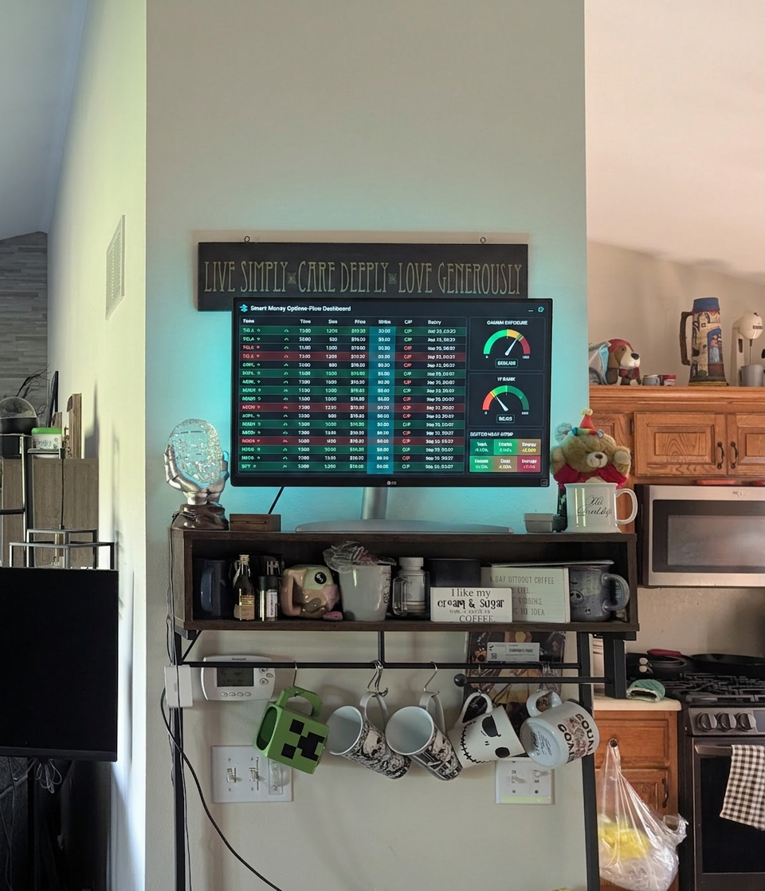

# Give Away the App. Sell the Key.

*Business 60% | AI 30% | Mindset 10%*

Art thinks I'm out of my mind. On a few things he's probably right. Not this one.

Every time I say I want to open source something we built, he gives me the look. And the look is fair. We are a startup. Startups are supposed to make money, and you don't make money by giving the product away. That's not cynicism, that's arithmetic.

So here's the argument I've been losing at dinner, finally written down as the thing that wins it.

## Give away the app. Sell the key.

The app is the part everyone can copy. Screenshot the dashboard, hand it to a designer, and they'll have a lookalike by Friday. The interface is the most copyable thing you own. Guarding it is guarding the wrong door.

The data is the part they can't copy. The live flow, the gamma, the screeners, the thing that's actually expensive to build and run. That's the door worth locking.

So lock that one. Open source everything else. Give away the app, meter the key. You are not leaking the business. You're building a sales team that works for free.

That's the whole thesis. The rest of this is proof that it's already running.

## I didn't plan an ecosystem

This started as one screen. I wanted a smart-money board glowing on a spare monitor while the coffee brewed. Small idea.

Then I realized I didn't need to build the data, because TraderDaddy Pro already speaks through an MCP endpoint. I wasn't building a product. I was building a window into ours.

Then I realized if I'm pointing one window at it, I'll want others. My phone. A Discord channel. A widget on this blog. Build that plumbing six times and you get six broken versions of it. So I built the plumbing once, as an SDK. One typed client, every tool in the platform, no guessing.

And staring at that client library instead of a dashboard, the real thing landed: the SDK is the pitch. Not the pretty UI. The rails.

So I kept going. First commit went in at 3:26 in the morning. The last one went in that same afternoon. In one day, the SDK grew a family:

- **DaddyBoard**, the wall display. The thing I actually set out to build.
- **DaddyBot**, a self-host Discord bot. Six slash commands and a loop that drops smart-money flow alerts into your own server while you sleep.
- **DaddyLens**, a browser extension. It reads any webpage, finds the $TICKERS, and annotates them with live flow and gamma. Chrome and Firefox.
- **DaddyMCP**, connector configs and example agents, so you can wire the data straight into Sam or your own AI.
- **DaddyHome**, sensors for Home Assistant through a Python mirror. E-ink display next.
- **DaddyEmbed**, five flow widgets you drop into a blog or a newsletter with one line of code.

The SDK ships in two languages, npm and Python, zero runtime dependencies, typed all the way down. Nobody asked me to. It just falls out of building the rails right.

## Open source isn't the leak. It's the sales team.

Here's the part Art will actually like, once he stops giving me the look.

Every one of these runs in keyless demo mode. Fake data, real shape. Anyone can install any of them right now, no signup, no card, and watch a flow tape scroll with numbers that behave exactly like the live ones. Identical types. The demo isn't a screenshot. It's the real app, running on sample data.

And every repo ships a prompt pack. You paste it into Sam, or Claude Code, or Cursor, and it builds your own version, demo-first. You don't have to be a coder. I'm barely one. I vibe-coded the whole family in a day.

Now follow the money. Every one of those free apps is a thing somebody else runs. A bot alerting a trading server. A widget on a newsletter with a few thousand readers. A board glowing on a wall at a meetup. Each one is our brand and our data, in front of an audience we never paid to reach.

And the demo is the funnel. You play with the sample data, you like it, and the only thing standing between you and your own numbers is a key. That's it. That's the entire model. Give away the toy, sell the batteries.

Open source didn't cost us the business. Open source *is* the distribution.

## The part that's actually useful to you

A pretty interface is not a moat. It's a screenshot waiting to happen.

The moat is the data and the rails underneath it. The boring typed contract nobody screenshots. If you build anything, sit with that, because you are probably in love with the part users see, and the part that pays is usually the part they don't. Open source the first one. Meter the second. You get marketing and margin from the same move.

Disclosure, since most of you already know: I'm on the team at TraderDaddy Pro. I write the screeners, a chunk of the engine, and the Sam integration. Art runs the place, and he's usually right, which is why I wrote this instead of just arguing. The link below is my referral link, so don't take my word for any of it. Go install a demo and take your own.

[traderdaddy.pro](https://www.traderdaddy.pro/?ref=MPHINANCE&utm_source=substack)

## Two things everyone told me were opposites

I spent a lot of years believing I had to choose between things that turned out not to be opposites at all. Freedom or safety. Honesty or being liked. Turns out most of those were the same choice wearing two coats.

Open source or revenue is another one of those. You don't pick. You give away the app and sell the key, and you get both, from one stroke of work.

Art, I solved it. Again.

~ Michael
