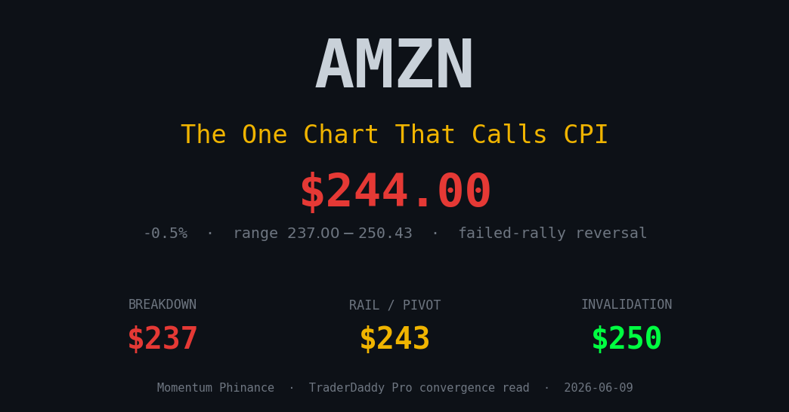
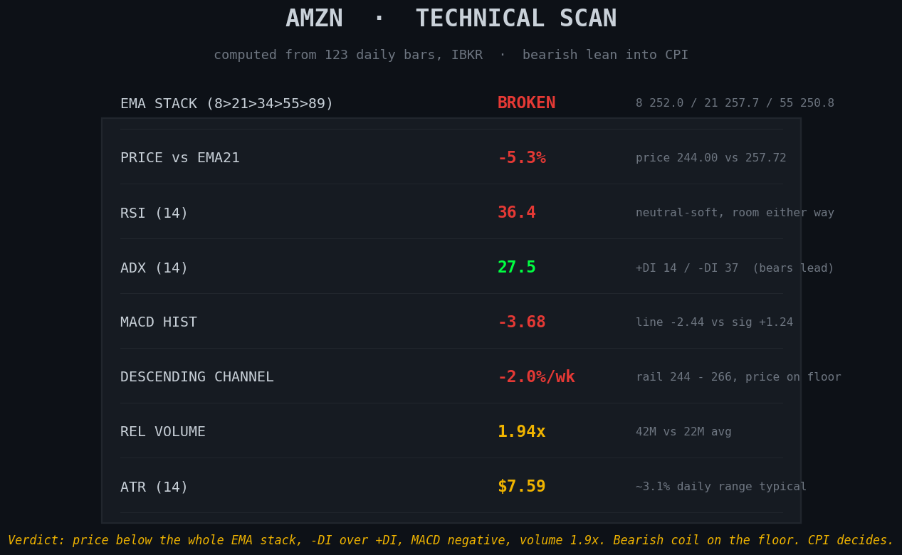
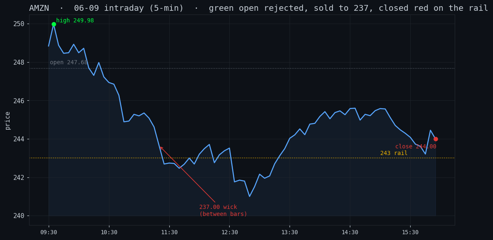
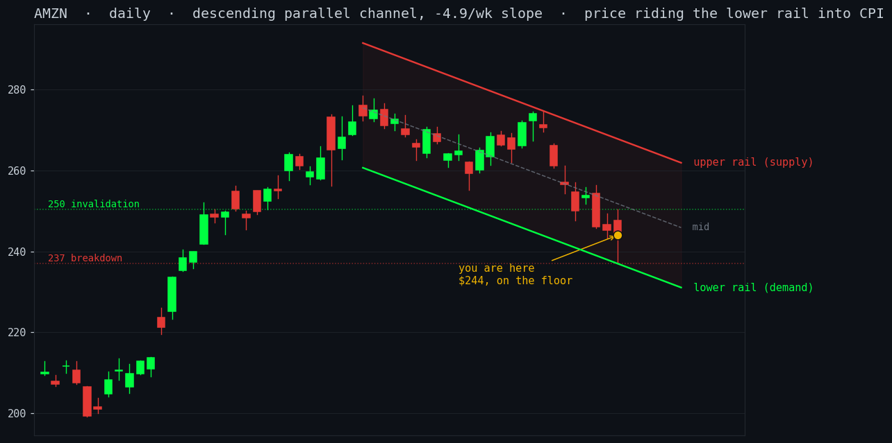

# The One Chart That Calls CPI Tomorrow

*Tags: AMZN, CPI, options flow, short interest, technical analysis, market structure, TraderDaddy Pro*

Two posts in one day is not my style. Consider it a favor, or an intervention, depending on your cost basis.

You do not need to watch the whole market into tomorrow's CPI. The market is a thousand-piece orchestra all tuning at once, and tomorrow you only need to hear the one instrument already holding a note. That instrument is Amazon. It closed at **$244.00**, parked on the floor of a falling channel, coiled into the 8:30 ET print. I ran the scan myself tonight, and the whole story fits on a few charts instead of forty tabs.

A small flex, delivered as a public service. If you bought Amazon in the last two weeks, somewhere around **$259 to $270**, you are red at $244. The sting is not the loss, it is that you could have known. The signal was not hidden in a monastery on a mountain. **TraderDaddy Pro has had AMZN tagged Distribution for two straight weeks**, blinking patiently on the dashboard like a smoke alarm nobody wanted to interrupt their snack to check. Funds quietly selling, the tape leaking lower, the warning sitting in plain sight. That is why our hands stayed in our pockets. Now the how, the where, and the why.

## The scan, no vibes

Straight off the daily bars:

- **Price is under the entire EMA stack.** The 8, 21, 55, all of it above $244. Not a healthy pullback. Supply runs the show.
- **ADX 27.5, and the bears are holding the leash.** Minus-DI 36.9 to plus-DI 14.2. Down and trending, not chopping.
- **MACD -3.68 and widening, RSI 36.** Weak, though not yet washed out.
- **Volume 1.9x the 20-day.** Nobody was asleep. A wide-range reversal on heavy volume is a brawl, and the sellers walked out with the close in their pocket.

## Today's tape

Opened green at $247.68, ran to **$250.43**, got dumped to **$237.00**, then clawed back to close red at **$244.00**. Green open, rejected high, red close, 5.5% range. A failed rally is the market promising you the world at breakfast and repossessing it by dinner. The $237 wick got bought, so the floor held. For now.

## How I found it: the parallel channel

Off the late-May high near $278, AMZN has walked straight down a clean descending channel. Two parallel rails, supply on top, demand on the bottom, and price sitting on the lower one. A name riding the floor of a falling channel into a known catalyst is coiled, and coiled things do not stay polite.

For the last-two-weeks crowd, find your buy price on this chart. You bought the top half, near the supply rail, the expensive seats. Price then did what price always does inside a descending channel, which is to say it kept its appointments. It walked to the demand rail with the punctuality of a tax bill. You did not do anything dumb. You bought a falling structure without checking the structure, which is a bit like admiring the chandelier on the Titanic. Fixable. It is exactly why we draw the channel first.

## The three numbers

- **$237** is the line. Lose it on a hot print and the floor goes with it. Lower from there.
- **$243** is the rail it is resting on. Chop here settles nothing, so neither should you.
- **$250** is the kill switch. A soft print and a reclaim ends the bear case, and the shorts covering pay for the party.

The charts are only one lens, and a lens that admires itself is just a mirror. They matter because three unrelated datasets agree: institutions net selling for weeks, put premium near **1.8x** calls in dollars, FINRA short interest up **14.7%** month over month. One chart is an opinion. Four of them nodding along is a setup.

## 🏆 The credits

This read does not happen without the cast, so cue the orchestra and let me finish before they play me off.

- **TraderDaddy Pro**, for pulling institutional flow daily, so I know who is actually selling and not merely who is tweeting.
- The **live options feed**, for serving the premium hot instead of as yesterday's leftovers.
- **Sam the Quant Ghost**, my brilliant and insufferable co-star, who flagged this two weeks ago and has reminded me roughly sixteen times since.
- And me, for showing up sober enough to read them.

I am not crying, you are.

You do not predict, you prepare. Write your lines down tonight, before the chaos, because the worst trades I ever made were the ones I argued myself into mid-storm. Set the levels. Let the print pick a side.

\- Michael, Managing Partner, The Phund
