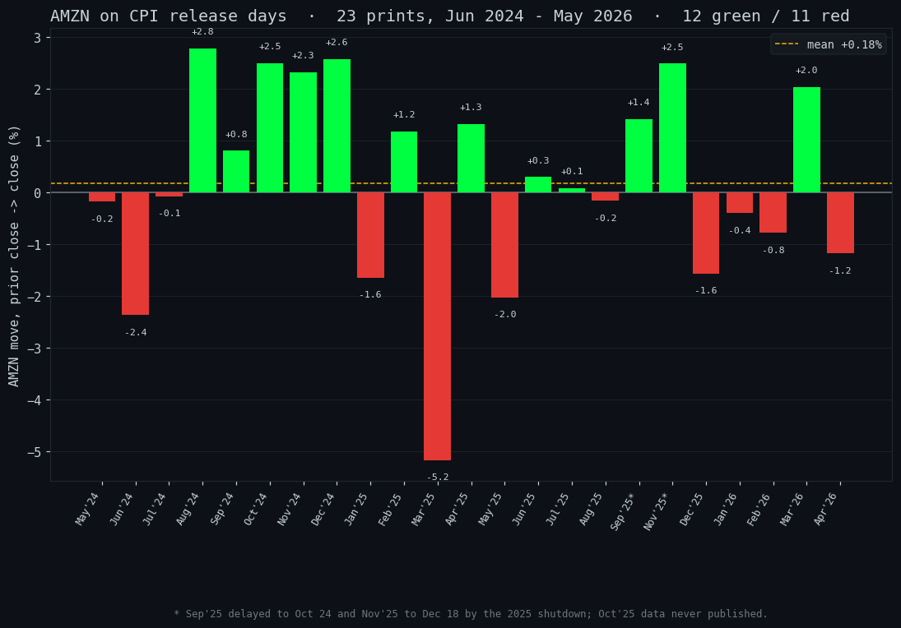

# The One Chart That Calls CPI Tomorrow

*Tags: AMZN, CPI, options flow, short interest, technical analysis, market structure, TraderDaddy Pro*

Two posts in one day is not my style. But if you cannot babysit a screen tomorrow, you should still know the one name that tells you everything.

You do not need to watch the whole market into the CPI print. You need to watch **one** stock. Amazon closed at **$244.00**, sitting right on the floor of a falling channel, coiled into the number. I ran the full scan myself tonight, and the inflation print at 8:30 ET is the referee.

Now a small flex, and I mean it as a public service. If you bought Amazon any time in the last two weeks, somewhere between **$259 and $270**, you are underwater at $244 and it is not really your fault, it is the chart's. We were not buying. The same convergence read I am about to show you flagged distribution two weeks ago, which is exactly why our hands stayed in our pockets. That is the whole pitch. Stick around and I will show you the how, the where, and the why.

## I ran the scan. Here is what it says.

Straight off the daily bars, no vibes:

- **Price is below the entire EMA stack.** The 8, 21, 55, all of it sits above $244. That is not a healthy pullback, that is supply in control.
- **ADX 27.5, and the bears own it.** Minus-DI 36.9 against plus-DI 14.2. The trend is down and it is trending, not chopping.
- **MACD histogram -3.68** and widening. **RSI 36**, weak but not washed out yet.
- **Volume ran 1.9x the 20-day average.** This was not a sleepy session. That is the part the lazy take gets wrong: a wide-range reversal on heavy volume is a fight, and today the sellers won the close.

## Today's tape, read literally

Green open at $247.68. Ran to **$250.43**. Then got dumped all the way to **$237.00** before clawing back to close red at **$244.00**. Green open, rejected high, red close, on a 5.5% range. That is a failed-rally reversal. The $237 wick got bought, so the floor held. For now.

## How I found it: the parallel channel

This is the actual setup, drawn the way I drew it. Off the late-May high near $278, AMZN has been walking down a clean descending channel, two parallel rails, supply on top and demand on the bottom. Price is sitting on the lower rail at $244. That is the tell. A name riding the floor of a falling channel into a known catalyst is coiled, and coiled things resolve hard.

And here is the where, for the last-two-weeks crowd. Find your buy price on this chart. You bought up in the top half, near the supply rail, the expensive side. Price then did what price does inside a descending channel: it walked to the demand rail at the bottom. You did not do anything dumb. You bought a falling structure without checking the structure. That part is fixable, and it is the entire reason we draw the channel first.

The levels fall right out of the picture:

- **$237** is the line. Lose it on a hot print and the channel floor breaks. Continuation lower.
- **$243** is the rail it is resting on. Chop here resolves nothing. You wait.
- **$250** is the kill switch. A soft print and a reclaim of $250 ends the bear case, and every short covering into it pays the bounce.

That is the whole game tomorrow, on one chart, instead of forty tabs.

## Bonus: what AMZN actually does on a CPI day

I ran the receipts on this, because everyone treats CPI like fireworks. Here is every CPI release since June 2024, 23 of them, and what AMZN did each time.

The honest answer: not much. AMZN closed **green on 12 of 23** CPI days, red on 11. A coin flip. The average move was **1.53%** and the average range **2.36%**. For comparison, a random day over the same two years moved **1.49%** with a **2.38%** range. A CPI day moves Amazon about as much as a Tuesday.

You might think the biggest retailer in the country would be a clean read on inflation day. It is not. The reaction is a coin flip with a normal heartbeat, so do not treat Amazon as a macro oracle.

So why care about tomorrow at all. Because the print is not the edge. The **setup** is. AMZN is not usually coiled on the floor of a channel into the number. Right now it is. The catalyst only matters because of where price is standing when it lands. Most CPI days are noise. This one has a level under it.

(Two of those prints came late: the 2025 government shutdown pushed September data to October 24 and killed the October release entirely, so November landed on December 18. Even the calendar is not sacred.)

## Here's the truth

The technicals are mine and Sam's. But the technicals are one lens. The reason this is a real signal and not a chart drawing is that three other datasets agree: **TraderDaddy Pro** shows institutions net selling AMZN for weeks, put premium running roughly 1.8x calls in dollars, and FINRA short interest up **14.7%** month over month. Four independent readings, one direction. That agreement is the edge. One chart is an opinion. Four datasets nodding along is a setup.

## 🏆 And now, the acceptance speech

This convergence read does not exist without the cast, so cue the orchestra and let me get through this before they play me off.

- I'd like to thank **TraderDaddy Pro**, for pulling institutional flow **daily** so I know who is actually selling and not just who is tweeting.
- To the **live options feed**, for showing me the premium in real time instead of yesterday's leftovers.
- To **Sam the Quant Ghost**, my brilliant and insufferable co-star, for the **charts** and for doing the math I refuse to do by hand.
- And to me, for showing up sober enough to read them.

I am not crying, you are. Anyway.

The disciplined move is the same one recovery taught me. You do not predict, you prepare. Write your lines down tonight, before the chaos, because the worst trades I ever made were the ones I decided in the middle of the storm. Set the levels. Let the print pick a side.

\- Michael, Managing Partner, The Phund
