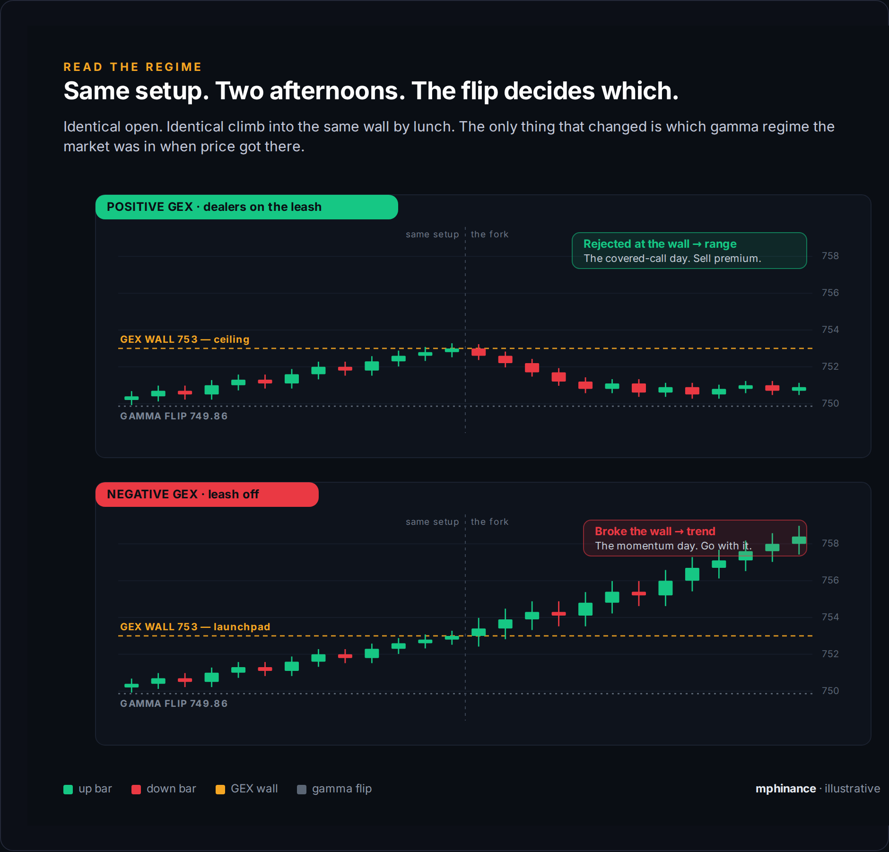
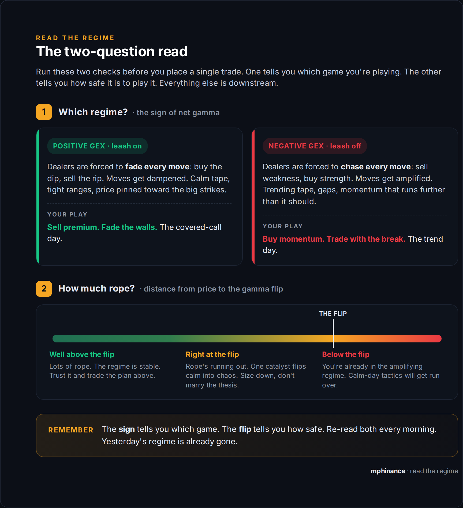

# Read the Regime: How I Knew It Was a Chop Day

*Options 50% | Trading 30% | Macro 20%*

Last week I sold two covered calls and closed the laptop by ten. That was the entire trading day.

A friend of mine traded the same tape. Faster than me, hot keys, quick hands. He went long, got stopped. Flipped short, got stopped again. Same names, same charts, same open I was staring at. He fed the market a few hundred bucks. I collected premium.

It was not skill. He is quicker than I am. I just knew what kind of day it was before the bell, and I traded the day, not the chart.

## Every morning the market is on a leash, or it isn't

That is the whole idea. Learn to tell which, and half your bad trades disappear.

On the leash, every move gets yanked back. Price lunges one way, something drags it home. The tape chops, ranges hold, and the breakout that looks so clean dies at the same wall it died at an hour ago. Quiet, mean-reverting, rubber-banded. That is a positive gamma day.

Off the leash, every move pulls harder. Price lunges and it accelerates instead of snapping back. Trends run past where they should stop. Gaps do not fill. Loud, trending, one-way. That is a negative gamma day.

Same dog. Two completely different walks.

Look at the chart up top. Same open, same climb into the same wall by lunch. Then the afternoon forks, and the only thing that changed is which leash the market was on when price got to that wall. Fade the top one, ride the bottom one. Get them backwards and you are my friend.

## Who is holding the leash

The dealers. The market makers on the other side of every option you and I trade.

They do not want a direction. They want flat. So they hedge, constantly, buying and selling the underlying to stay neutral against the options they are stuck holding.

When they are net long gamma, that hedging works against price. It rises, they sell. It dips, they buy. They are the leash. Positive gamma.

When they are net short gamma, the hedging flips. Price rises, they have to buy more. It dips, they have to sell more. Now they are pouring gas on the move instead of dampening it. Negative gamma, leash off.

You do not have to model any of this. Somebody already did the math, and it comes out as one number: net GEX. Positive means leash on. Negative means leash off. That is question one.

## Question 1: How did I know it was a chop day

Two tells, before the open.

First, net gamma was firmly positive. Big positive. Dealers were long a mountain of gamma, which means they were going to fade everything. Leash on.

Second, the tape was split and narrow. The Dow was barely green, the Nasdaq was barely red, small-caps were shrugging. Tiny moves, pointing in different directions. When the indexes cannot agree which way to lean and none of them are moving much, that is not a trend forming. That is a rubber band at rest.

Positive gamma plus a split tape is the cleanest chop signal there is. I did not need a prediction. I needed to read what was already true.

## Question 2: Why I only sold covered calls

Because in that regime, direction is a tax and premium is the paycheck.

When dealers fade every move, realized volatility stays under implied volatility. Plain version: options are priced for more movement than the day is actually going to give you. Buy a directional bet and you are paying up for a move that gets strangled at the wall, while your premium bleeds out waiting.

Flip it and you are the house. Selling the covered call collects the exact premium that stays fat because nothing is allowed to move. The pin does the work. I was not sitting out that day. I was collecting rent on the chop.

That is the part people miss. A boring regime is not a no-trade regime. It is a sell-premium regime. Different tool, same day.

## Question 3: How you know it will trend instead

You flip both tells.

Net gamma goes negative, so dealers are chasing instead of fading. And the tape lines up. Dow, Nasdaq, small-caps all leaning the same way, all moving with some size. Agreement plus amplification.

That is when the covered-call day becomes a buy-the-move day. The same premium that was a paycheck yesterday is now underpriced, because the market is about to move more than the options think. Off the leash, you want to be long the move, not short the premium.

## Question 4: The one that trips everyone up

Short the top or buy the breakout. Same wall. Opposite trade. And most people cannot tell which until it is too late.

The wall itself does not decide. The regime does.

Above the flip, in positive gamma, a big wall is a ceiling. Dealers defend it. Price grinds into it and gets sold back. You fade it. Short the top, take profits, sell the call.

Below the flip, in negative gamma, that same wall is a launchpad. Dealers are forced to chase the break, so once price clears it they add fuel. You go with it. Buy the breakout.

Same level. The flip is what tells you whether it repels or launches. If my friend is staring at a wall trying to decide whether to fade it or chase it, he is asking the wall a question only the flip can answer.

## The two-question read

So it comes down to two checks, in order. Not a hundred. Two.

The sign of net gamma tells you which game you are playing. Distance to the flip tells you how safe it is to play it.

That second one matters more than the binary, and it is where most explainers lose people. The indexes will not always agree. One can be sitting just under its own flip while another is comfortably above it, and the day can still be dead calm, because the whole market's net gamma is a giant positive number. The single index dipping under its flip is not the alarm. It is the distance to the trapdoor. Lots of room means trust the regime. Right at the flip means you are one catalyst away from the floor giving out, so size down and hold the thesis loosely.

## Read the regime, then pick the tool

Chop is not the enemy. Trading chop like a trend is.

The covered call, the fade, the breakout buy, none of them are good or bad in a vacuum. They are right or wrong for the regime you are actually in. Read the leash first. Pick the tool second. Do it in that order and the fast-hands friend stops beating you on speed, because you already skipped the two trades that were never going to work.

I run the live net GEX, the flip, and the walls every morning off the same engine I built into TraderDaddy Pro. That is where these numbers come from. But the read itself is free, and now it is yours.

~ Michael

---

*If this helped, subscribe so the next one lands in your inbox.*
