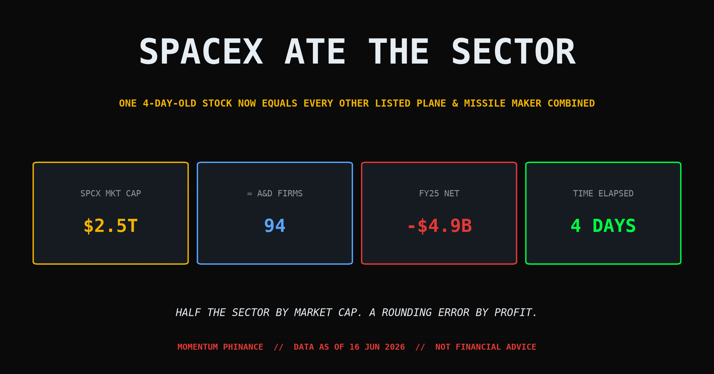
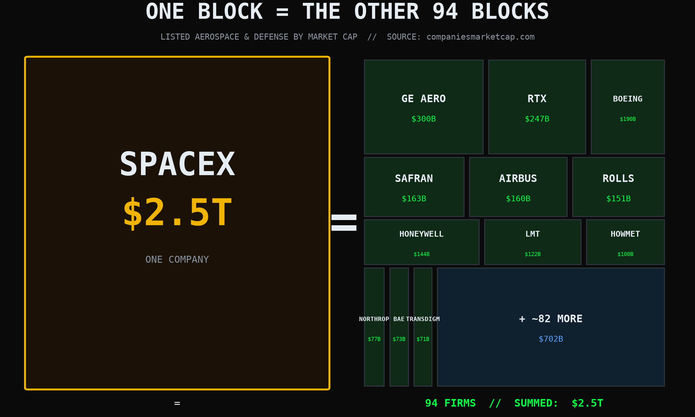
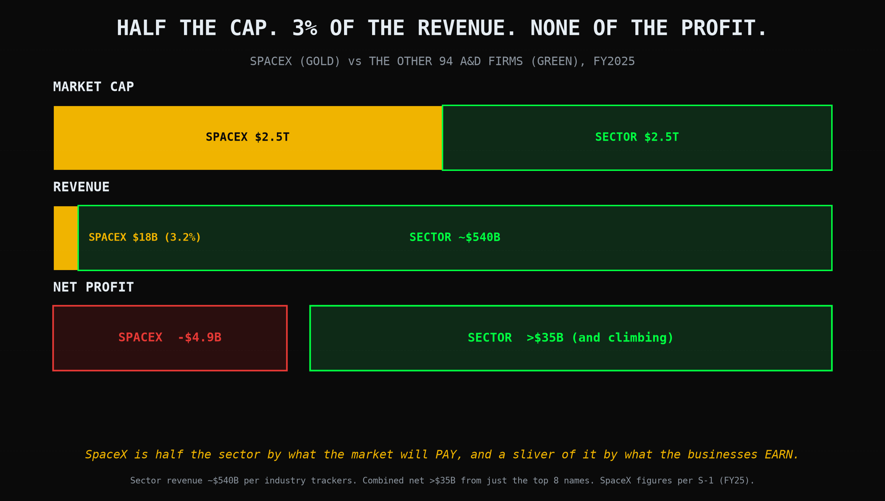
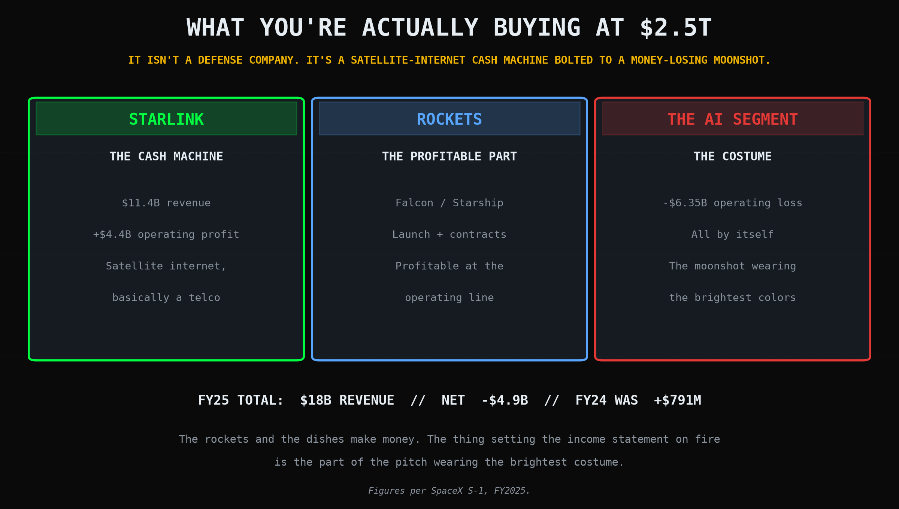

# SpaceX Just Ate Half the Aerospace Sector in Four Days. It Lost $4.9 Billion Doing It.

*Trading 70% | Business 30%*

---

Last week I wrote you a long letter about how to lose money on the SpaceX IPO while being completely right. The whole thesis was one sentence: **you're buying a story at a price the story still has to grow into.** I said the financials were a footnote and you were really just betting on Elon bending reality.

Four days. That's how long it took reality to bend.

A chart is going around this week with a headline that sounds like clickbait and isn't. **"SpaceX Is Now Half the Aerospace & Defense Sector."** One company, public since Friday, now worth as much as every other listed plane, missile, jet-engine and satellite maker on Earth, *combined.* Ninety-four firms on one side of the scale. One four-day-old stock on the other. They balance.

Someone screenshotted it and asked me the only question that matters: **is that true?**

Yes. It's true. And the way it's true is so much weirder and more useful than the headline that we have to talk about it.

---

## First, The Receipt. The Number Is Real.

I don't repeat a viral stat until I've pulled the tape myself, because half of what goes viral is a decimal point someone fat-fingered. This one holds.

SPCX priced at **$135** on Friday, June 12th, and closed its first day at **$161**, up 19%. As I write this on June 16th it's trading near **$199**, which puts the market cap at roughly **$2.5 trillion.** That's not "approaching." That's done. It vaulted SpaceX into the **sixth most valuable public company on the planet**, past Tesla, past TSMC, past Broadcom. For one surreal afternoon it was worth more than **the entire cryptocurrency market combined.** All of it. Every coin, every dog, every JPEG.

Now put that $2.5T next to the rest of the industry. I added up the treemap myself so you don't have to take a graphic's word for it:

GE Aerospace at $300B. RTX at $247B. Boeing $190B. Safran $163B. Airbus $160B. Rolls-Royce $151B. Honeywell $144B. Lockheed Martin $122B. Then Howmet, Northrop, BAE, TransDigm, and a long tail of about eighty-two more names nobody outside the sector could pick out of a lineup. Stack all ninety-four of them up and you land right around **$2.5 trillion.**

So the headline is honest. **One company now equals the entire rest of its listed sector.** A company that, last Thursday, did not trade on a public exchange at all.

Take a breath with that. Then let's take it apart, because "true" and "sane" are not the same word, and the gap between them is where you either make money or become someone else's exit.

---

## Half the Cap. Three Percent of the Revenue. None of the Profit.

Here's the trick the chart plays on your eyeball, and it's not lying to do it. It's measuring **market cap.** Market cap is not size. Market cap is not revenue. Market cap is not profit. **Market cap is the price a crowd has agreed to pay for a story on a given Tuesday.** That's it. That's the whole thing.

So when you say "SpaceX equals the sector," you have said exactly one true thing: the crowd will *pay* the same for SpaceX as it will for everyone else put together. You have said nothing about what those businesses actually *do.*

So I went and looked at what they do.

The other ninety-four companies in that basket generate somewhere around **$540 billion in annual revenue** and throw off **tens of billions in actual profit.** I can get past $35 billion in combined net income counting only the top eight names, before I've even reached the long tail. These are real factories, real order books, real jets rolling off real lines.

SpaceX, per its own S-1, did **$18 billion in revenue** in fiscal 2025. Good growth, up 33%. And it **lost $4.9 billion** doing it, after turning a $791 million *profit* the year before.

Read those two columns side by side, because this is the entire article in one breath. **SpaceX is half the sector by what the market will pay, and roughly three percent of it by what the businesses earn. By profit it isn't a sliver. It's a minus sign.**

That is not a knock. It might even be justified, if Starlink and the rest grow into it. But you have to be honest about what you're holding. You are not holding half an industry. You are holding half of the *market's opinion* about an industry, and the half you're holding is the part that loses money.

---

## It Isn't Even a Defense Company

Here's the part that breaks the chart's own framing, and I love it the most.

That graphic files SpaceX under "Aerospace & Defense." Fine. But crack open the $2.5T and ask where the value actually lives, and it is **not** in rockets-for-the-Pentagon. It's in two completely different businesses wearing a rocket costume to the party.

**Starlink** is the engine. Eleven and a half billion in revenue, four and a half billion in operating profit, growing fast. That is not a defense contractor. **That is a telecom.** A satellite internet provider that happens to share a parking lot with a rocket company. If you squint, you bought a space-based ISP with a defense-sector label stapled on by whoever built the treemap.

**The rockets** are real and they're profitable at the operating line, which is genuinely rare and genuinely impressive. That part earns its keep.

And then there's **the AI segment, which lost $6.35 billion all by itself.** That's the piece quietly setting the income statement on fire. The rockets make money. The dishes make money. The moonshot bolted to the side, the part wearing the brightest costume in the whole pitch, is the part torching five billion dollars a year.

So when someone tells you "SpaceX is half the aerospace and defense sector," the cleanest honest translation is: **a satellite-internet cash machine strapped to a money-losing AI bet is now valued the same as every actual plane and missile maker combined.** The category is doing a *lot* of heavy lifting in that sentence. It's comparing apples to a rocket-shaped thing that's mostly a telco and partly a science experiment.

---

## The Bubble Math (Or: What Has To Be True)

I'm not here to scream "bubble" and run. That's lazy, and short sellers who screamed it Friday already got their faces removed. Let me instead just lay out what the price *requires* and let you do your own arithmetic, because that's the only honest way to value a story.

At $2.5T, here's what the market is quietly assuming is a done deal:

- That **Starlink keeps compounding** until it's not just a telco but one of the biggest telcos on Earth.
- That the **AI segment** stops being a $6 billion-a-year hole and turns into a $6 billion-a-year *fountain.*
- That **Starship** works, repeatedly, economically, on a schedule that has historically been written in Elon Time.
- That none of the other ninety-four companies, the ones with the actual factories and order books, ever take a bite back.

Maybe all four happen. I'm not short the man's ambition. But there's a fifth thing the chart isn't showing you, and it's the one I flagged last week: **the float is tiny.** SpaceX sold about **4% of itself** at IPO. This entire $2.5 trillion cathedral is built on the price of a four-percent sliver, and the rest of the shares are sitting behind a lockup that unspools in waves starting around day seventy.

So the scarcity that's levitating the price today becomes the supply that caps it later. I drew that whole cliff out in the IPO letter and nothing about it has changed except the altitude we're falling from is now higher. The higher this goes on 4% of the shares, the more interesting the other 96% gets when it's finally allowed to walk out the door.

This is the same lesson the chart is screaming if you read it right: **a number can be completely true and still be standing on one leg.**

<!--paywall-->

## How I'm Actually Playing It (Paid Subscribers)

*Free readers got the full teardown, and I meant all of it. This is the part where I stop narrating and tell you what's in my own account, because that's what you pay me for. Positions, not opinions.*

Here's the honest truth I have to lead with: **I did not chase $199.** I told you Friday I wasn't holding SPCX overnight, and I didn't, and watching it run another 24% without me is exactly the kind of FOMO that recovery taught me to sit with instead of acting on. Missing a move is not a loss. Chasing one at the sixth-largest-company-on-Earth valuation, on 4% float, four days in, is how you *become* the move's exit.

So here's the structure I'm running now, with real lines:

**The "half the sector" pair trade.** This chart isn't just content, it's a setup. When one name in a sector goes vertical and the rest go quiet, there's a specific relationship I watch and a specific condition under which I lean. I'll give you the exact pair, the ratio I'm tracking, and the trigger.

**The Starlink-is-a-telco angle.** If the value is really a satellite ISP, there are *publicly traded* comps that move on the same thesis with a fraction of the froth. Two tickers, the screen I'm running them through, and why one of them is the cleaner expression of the trade than SPCX itself.

**The supply-cliff calendar.** The exact unlock dates I've got circled, the one I think the whole market front-runs, and the "failed bounce" signal I need to see before I lay a finger on the short side. Confirmation over prophecy, every time.

**The line where I'm wrong.** The single price level and the single fundamental headline that would make me tear all of this up and flip. I'll show you mine if you're honest about yours.

Plus the position sizing under all of it, because the prettiest thesis on Earth still detonates if the size is wrong, and I have detonated enough things in one lifetime.

---

## The Edge Is Knowing What the Number Means

That chart is going to get screenshotted into oblivion this week. Most people will see "SpaceX = the whole sector" and feel something, awe or outrage, and scroll on having learned nothing.

You're not most people, because you read this far. So here's the takeaway worth keeping: **the number is true and the framing is a trick, and both of those are true at the same time.** SpaceX really is worth as much as the rest of its sector combined. It also earns three percent of the sector's revenue, none of its profit, and isn't really in the sector the chart filed it under. Hold both thoughts. That's the whole skill.

I spent years of my life believing things that felt true because they were loud, because the number was big, because the story was good and I wanted it to be mine. It cost me everything that wasn't bolted down, more than once. The only thing that ever pulled me out was learning to ask the boring follow-up question after the exciting headline. *True compared to what? Measured how? Standing on what?*

A $2.5 trillion company that loses five billion a year is not a reason to panic and it's not a reason to YOLO. It's a reason to do the one thing almost nobody does when a chart makes their pulse jump: **slow down and read what it's actually measuring.**

The market will hand you a thousand true numbers this year. The edge was never having them. Your barber has them. The edge is knowing which leg each one is standing on.

---

*If this made the viral chart make more sense, do me a kindness: [subscribe](https://mphinance.substack.com), and send it to the friend who texted you the screenshot with three rocket emojis and no follow-up question. Be his follow-up question.*

*The receipts: $2.5T valuation and the sixth-largest ranking per [Yahoo Finance](https://finance.yahoo.com/markets/stocks/articles/spacex-marketcap-breaches-2-5t-003334062.html) and [CryptoBriefing](https://cryptobriefing.com/spacex-ipo-2-5t-valuation-tokenized-shares/). IPO price and first-day close per [CNBC](https://www.cnbc.com/2026/06/12/spacex-ipo-spcx-live-updates.html) and [NPR](https://www.npr.org/2026/06/12/nx-s1-5855004/stock-ai-spacex-ipo-elon-musk). Sector market caps per [companiesmarketcap.com](https://companiesmarketcap.com/aerospace-and-defense/largest-companies-by-market-cap/). FY25 financials (revenue, net loss, Starlink and AI segment figures) from SpaceX's S-1 via [Morningstar](https://www.morningstar.com/stocks/6-charts-spacexs-s-1-financials). Sector revenue estimate per [Simply Wall St](https://simplywall.st/markets/us/industrials/aerospace-and-defense).*

*None of this is financial advice. It's one felon-with-a-keyboard reading a viral chart out loud so you don't have to take it at face value. Do your own work, set your own stops, and always ask the number what it's standing on.*

*God, grant me the serenity to accept the prices I cannot change, the courage to skip the trades I shouldn't chase, and the wisdom to read the chart before the chart reads me.*

~ Michael
