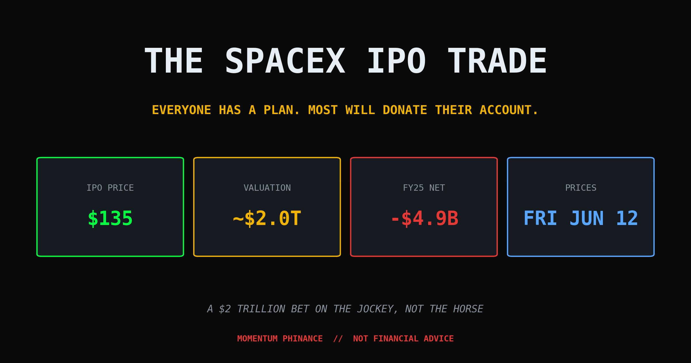
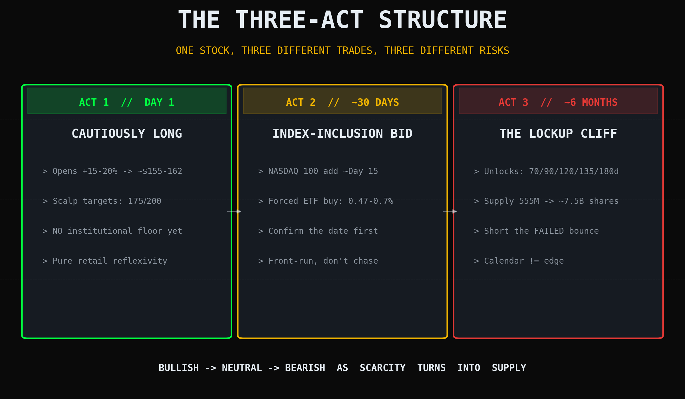
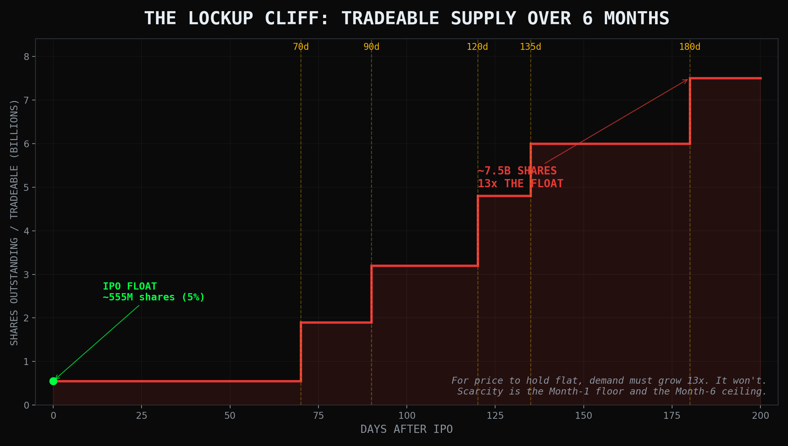

# Everyone's About to Get Rich Off the SpaceX IPO. Most of Them Won't.

*Tags: SpaceX IPO, momentum trading, lockup expiration, NASDAQ 100, Elon Musk, sympathy stocks, index rebalancing*

---

The fastest way to lose money on SpaceX this Friday isn't shorting it. It's strolling in convinced there's free money lying on the floor.

SpaceX prices Friday, June 12th, at **$135 a share** (ticker **SPCX**), valuing the company at **$1.77 trillion** on a 555.6 million share offering. That's a $75 billion raise, the biggest IPO in history by a mile. Half the group chats I'm in already have a plan. I read a good one this week: Ross Cameron's playbook. Day 1 long bias, a 30-day index-inclusion thesis, a 6-month lockup short. Clean structure. Smart guy.

It also has holes you could fly a Falcon 9 through.

So I'm going to rebuild it. Keep what works, poke the parts that leak, and show you where the "free money" is actually a trapdoor. This is not a takedown. Cameron's framework is more disciplined than 95% of what you'll see in your feed this week. But a framework you don't stress-test is just a prayer with a price target.

---

## The Setup: A $1.77 Trillion Company That Lost $4.9 Billion

Start with the line item the hype machine skips.

SpaceX is valued at **$1.77 trillion** and it **lost $4.9 billion in fiscal 2025** (versus a $791 million profit the year before). Revenue was real: **$18 billion, up 33%.** Starlink alone did $11.4 billion in revenue and threw off **$4.4 billion in operating profit.** The connectivity business prints money.

So where did the $4.9 billion go? Mostly into the **AI segment, which posted a $6.35 billion operating loss.** The rockets and the satellites are profitable. The thing dragging the whole company into the red is the moonshot bet stapled to the side of it.

You can't run a P/E ratio on this. There's no E. There's an L, and it's nine zeros deep.

So what are you actually buying? You're buying Elon. This is the textbook **"bet on the jockey, not the horse"** trade. The financials are a footnote. The thesis is "this man bends reality, and I'd rather be long his reality than short it." Fine. I get it. I've made worse bets on worse jockeys.

But understand what that means: **you are buying a story, at a price the story has to grow into.** When the story is the only fundamental, the story leaving the building is the only risk that matters. Hold that thought. We'll need it in six months.

---

## Act 1, Day One: Long Bias, Yes. Free Money, No.

Cameron's Day 1 call is a **cautiously long bias**, and on that he's right. Shorting SpaceX on debut day would be, in his words, "insane." I'll go further: shorting a retail-mania IPO on Day 1 is how you donate your account to someone with more patience than you.

Here's the Day 1 math as the plan lays it out:

- Priced at **$135**.
- Expected to open **15 to 20% higher**, so call it **$155 to $162**.
- First target if it opens soft: **$150**. Stretch targets: **$175 and $200** on the day.

That's a clean momentum ladder, and as a guy who trades volatility for a living, I'll be in there scalping the chop right alongside everyone else. Hold for minutes, sometimes seconds, take the move, get out.

**But here's the first hole.** The plan leans on "mandatory buying support from institutional funds" as a Day 1 floor. That's not how index money works. **Index funds don't buy on the open.** They buy at inclusion. And per Cameron's own thesis, inclusion is Day 15, not Day 1. So the "structural support" he's counting on isn't in the building yet on Friday. Day 1 is **pure retail reflexivity**: momentum feeding on momentum, with zero institutional floor underneath it.

That's not a reason to short. It's a reason to respect your stops. A move with no floor cuts both ways, fast.

**Second hole:** opening "near $150" contradicts a 15-to-20% pop, which lands you at $155 to $162. Small thing. But if your first target is below where the thing realistically opens, you don't have a target. You have a number you already missed.

---

## Act 2, The First 30 Days: The NASDAQ 100 Catalyst (Read The Fine Print)

This is the strongest part of the plan, and also the part where I want everyone to slow down.

The thesis: SpaceX gets **early inclusion in the NASDAQ 100** around **Day 15**. And here's the part I went and verified, because it sounded too convenient to be true: **it's real.** NASDAQ actually rewrote its index rules. The new "Fast Entry" provision lets a megacap join just **15 trading days** after IPO, down from the traditional **three-month seasoning period.** They also slashed the minimum free-float requirement so a stock with a tiny float (like, say, one selling only 4% of itself) still qualifies. Every ETF tracking the index then has to buy SpaceX to match an estimated **0.47% to 0.7% weighting**. Forced, mechanical, one-time buying. A real, structural bid.

When it's real, this kind of forced buying is about as close to a sure thing as the market hands out. I've traded it. It works. So here's where I agree with Cameron completely: **for roughly the first three weeks, the bias leans higher,** because there's a known, dumb, price-insensitive buyer about to show up.

Now the fine print, because this is where people lose money being *right*.

**Hole number three: "index inclusion" is not one thing, and the plan blurs it.** NASDAQ bent its rules. **S&P did not.** S&P Dow Jones Indices looked at the same situation and publicly *reaffirmed* its existing eligibility rules, which slams the door on fast entry into the **S&P 500.** That matters, because the S&P 500 is where the really big passive money lives (think SPY, think every 401k in America). So the forced-buying bid is real, but it's a **NASDAQ-100 bid, not an S&P 500 bid.** It's a meaningful chunk of money. It is not the tidal wave some people are pricing in. If you're long expecting *all* the index money to show up, half of it just RSVP'd no.

**Hole number four, and this is the big one: a forced buyer everyone can see tends to get front-run.** The rule is public. The ~15-day timeline is public. So the bid often gets pulled forward into the days *before* inclusion, and the actual inclusion date can print a "buy the rumor, sell the news" dump. The edge isn't *that* it happens. The edge is being positioned **before** the crowd that's also read the plan. By the time it's a clean, obvious trade, it's a crowded one.

The catalyst is real. The easy version of the trade is already gone.

---

## Act 3, Six Months Out: The Lockup Cliff Is Not A Cliff. It's a Demolition Schedule.

Now we flip bearish, and now I'm fully on board with the direction, if not the framing.

The float at IPO is tiny: SpaceX is only selling **555.6 million shares, roughly 4% of the company.** Scarcity plus mania is why the first month floats up. But the lockup holding the other ~96% is one of the most aggressive insider-exit structures I've seen on a marquee IPO. The S-1 lays it out in waves:

- **Five time-based tranches at 70, 90, 105, 120, and 135 days**, each freeing up another ~7% of eligible insider shares.
- A first earnings release (Q2) unlocks up to **20%**, plus another **10%** if the stock is up at least 30% over the offer price.
- A second earnings release (Q3) unlocks a further **28%**.
- The 180-day mark releases the remainder.

So the tradeable supply expands from that 555 million share float into the **billions** inside six months. For the price to merely hold flat, demand has to grow many times over to absorb it, and I wouldn't want to be the one betting it does. Unless the story gets dramatically *bigger* between now and Thanksgiving, supply usually wins that fight. The same scarcity that's the floor in Month 1 can easily become the ceiling by Month 6.

Then look at what Elon did with his own stake. **He locked his shares up for 366 days.** A full year. But the rank-and-file insiders and early investors? They can start selling as soon as the second trading day after the first earnings report. Read what that structure looks like to me: *the jockey stays in the saddle for the cameras, while the stable hands get handed the exits early.* If you're buying SPCX in month three, there's a decent chance you're the liquidity those early sellers are selling into. **Think hard about which side of that trade you're on.**

This is the most correct part of Cameron's plan and I'd put real size behind the direction. Institutional desks will build shorts into these windows. History agrees: a long line of hyped IPOs eventually trade **below their IPO price** once the hype fades and the supply shows up. Ask anyone who bought the open on a 2021 SPAC.

**But here's hole number five, and it's a hole in the *edge*, not the logic.** Those dates are *public*. They're in the S-1. Everyone reading this knows them. **Knowing a lockup expires is not an edge. It's a calendar.** The entire market positions for the same dates, which means the move often front-runs the actual expiration and then reverses when the expected selling doesn't materialize on schedule. The cliff is real. *Trading* the cliff is a knife fight with a thousand other people holding the same map.

The discipline here: short the *failure of the bounce*, not the calendar date. Let price confirm the supply is winning before you press it.

---

## The Best SpaceX Trade Might Not Be SpaceX

Here's the part of the plan I love most, because it's the most honest.

To 10x your money on SpaceX itself, the market cap has to go from $1.77T to nearly **$18 trillion.** That's more than four times the size of the largest company that has ever existed. **That's almost certainly not happening anytime soon.** SpaceX can be a fine *company* bet and still be a terrible *10x* bet. Those are different sentences and most people blur them.

So if you want asymmetric upside, you look *away* from SpaceX. You look at the **small-cap space-themed sympathy plays**: the tickers that fire off a press release with the word "satellite" or "lunar" in it and rip 500% because they're floating on 4 million shares and a prayer.

The plan cites **ASTC** as the dream. So I pulled the actual tape. Astrotech (ASTC) closed near **$2.77 on May 8th.** By June 2nd it was swinging between the low $30s and an intraday high of **$68.85**, then closed that very session back at **$45.** Call it a **2,500% run in about three weeks**, with single days that ripped 40% and gave half of it back before the close. That's the dream everyone's chasing.

**So here's hole number six, and it's the one that'll actually empty accounts.** A 2,500% move with $68-to-$45 intraday swings is not an investment thesis. **That's the price action of a low-float lottery ticket, not a company you can value.** When a float that thin gets tossed between momentum desks, the chart round-trips faster than you can click sell. For every ASTC you screenshot on the way up, plenty of people are holding the other side of it, having bought near hour 71 of a 72-hour squeeze.

Can you trade sympathy plays into a SpaceX mania? Absolutely. I will be. But you trade them like what they are: **fireworks, not foundations.** Tiny size. Hard stops. No bag-holding. No "it'll come back." You are renting volatility by the hour, and the rent is due the second the headline goes stale.

Riding coattails works right up until the coat gets up and leaves.

<!--paywall-->

## How I'm Actually Positioning (Paid Subscribers)

*Free readers got the full teardown above. That's the real value, and I meant every word of it. What follows is the part where I put my own account on the line, because that's what you're paying for: not opinions, live positioning.*

Here's the exact structure I'm running into Friday and through the six-month window. Real tickers, real triggers, real invalidation levels.

**Day 1 (Friday):**
- I'm not holding overnight. Period. Day 1 is a scalp environment. I'm trading the opening 30-minute range with VWAP as my line in the sand. Long above, flat below. I am not marrying this position.
- Hard rule: if it opens above $165, I do not chase the first green candle. I wait for the first pullback to hold. Chasing the open on an IPO is how you buy the exact top tick.

**The 30-Day Index Trade:**
- I want to be positioned in the Days 8-12 window, *before* the Day-15 crowd, **only if** I can confirm the inclusion date from the index provider directly. No confirmation, no trade. I'm not betting my account on a YouTube thumbnail.
- Exit plan: I sell *into* the inclusion-week strength, not on the date itself. The news is the exit, not the entry.

**The 6-Month Short:**
- I'm not shorting a calendar date. I'm watching the 70-day and 90-day windows for a *failed bounce*, a lower high after the first wave of unlocked supply hits. That's my trigger. Confirmation over prediction, every time.

**The Sympathy Basket:**
- My watchlist of low-float space names, the exact float thresholds I'm screening for, and the one rule that keeps a 2,500% screenshot from turning into a 90% drawdown in my own account.

And the position sizing math underneath all of it, because the setup doesn't matter if the size is wrong.

---

## The Only Edge That Survives a Crowd

Cameron's plan is good. Better than most. But every leg of it leans on something the whole market can see: a public IPO price, a public index date, a public lockup schedule, a public viral stat.

**Information everyone has is not an edge. It's the price of admission.**

The edge isn't knowing SpaceX is going public Friday. Your barber knows that. The edge is having a structure, sizing it so a wrong call doesn't end you, and being honest about which leg of the trade is real money and which is just a story you want to be true.

I've spent a lot of my life betting big on stories I wanted to be true. It cost me everything, more than once. Recovery taught me the only thing that's ever actually worked: don't predict, prepare. Size small enough to be wrong. Take the trade in front of you, not the one in your imagination.

The SpaceX IPO is going to mint a few legends and a lot of cautionary tales. Which one you become has almost nothing to do with SpaceX, and almost everything to do with whether you respect your stops when the whole timeline is screaming at you to bet the farm.

Don't bet the farm. The farm is how you eat next year.

---

*If this saved you from chasing the open Friday, the best thing you can do is [subscribe](https://mphinance.substack.com) and forward it to the friend you already know is about to YOLO his rent into a $4 satellite stock. Stop him. Be a hero.*

*The receipts: IPO price and $1.77T valuation per [CNBC](https://www.cnbc.com/2026/06/03/spacex-ipo-stock-price-roadshow-musk.html) and [Fortune](https://fortune.com/2026/06/03/spacex-ipo-share-price-index-funds-valuation-public/). NASDAQ's Fast Entry rule and S&P's refusal per [CNBC](https://www.cnbc.com/2026/06/05/spacex-blocked-from-early-us-benchmark-index-entry-as-sp-reaffirms-existing-rules.html). The staggered lockup and Musk's 366-day hold per [CNBC](https://www.cnbc.com/2026/05/21/spacex-insiders-will-get-to-sell-shares-earlier-than-usual-after-the-ipo.html) and [Darrow Wealth](https://darrowwealthmanagement.com/blog/spacex-ipo-employee-lockup-release-dates/). 2025 financials from the S-1 via [Morningstar](https://www.morningstar.com/stocks/6-charts-spacexs-s-1-financials).*

*None of this is financial advice. It's one felon-with-a-keyboard's read on a very crowded trade. Do your own work, set your own stops, and for the love of God, confirm the index details before you size up.*

*God, grant me the serenity to accept the trades I cannot change, the courage to cut the ones I should, and the wisdom to tell the damn difference.*

**- Michael Hanko, Managing Partner, The Phund**
