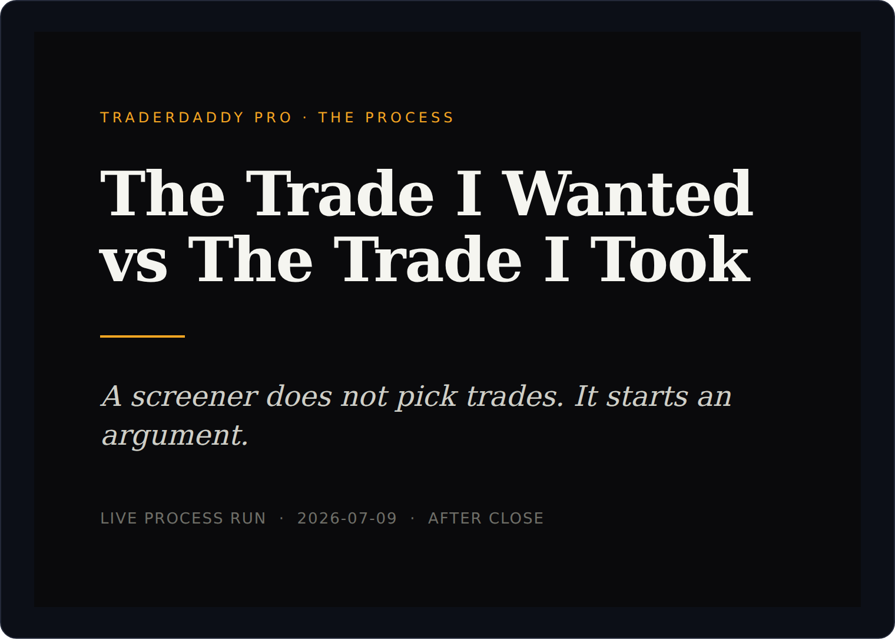
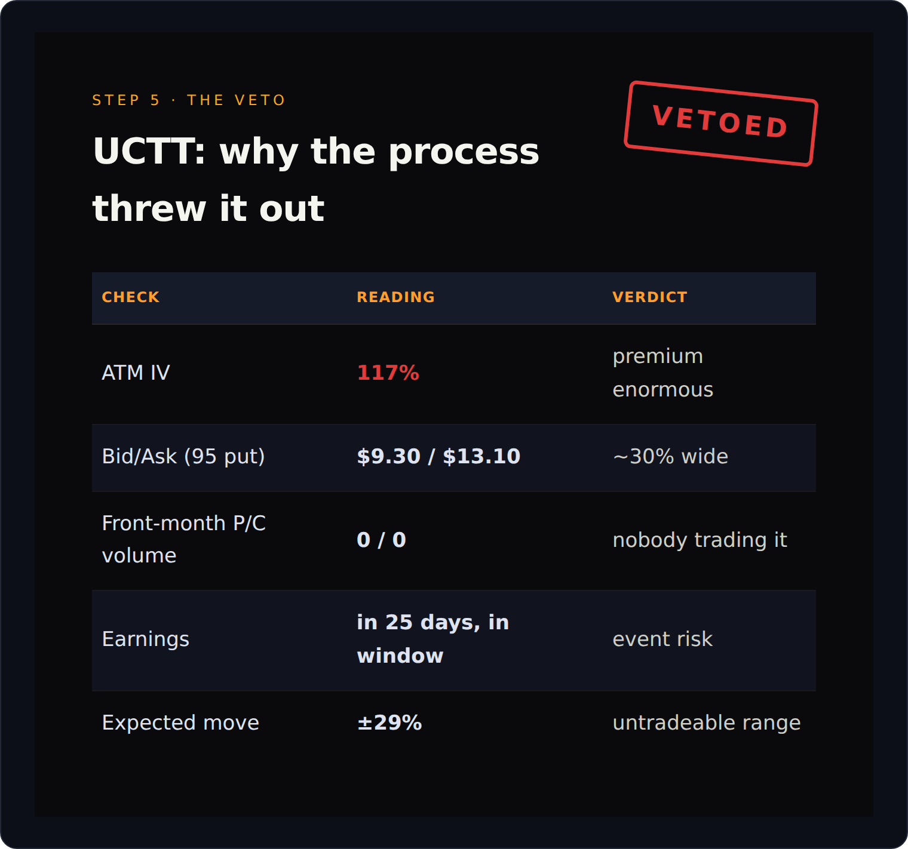
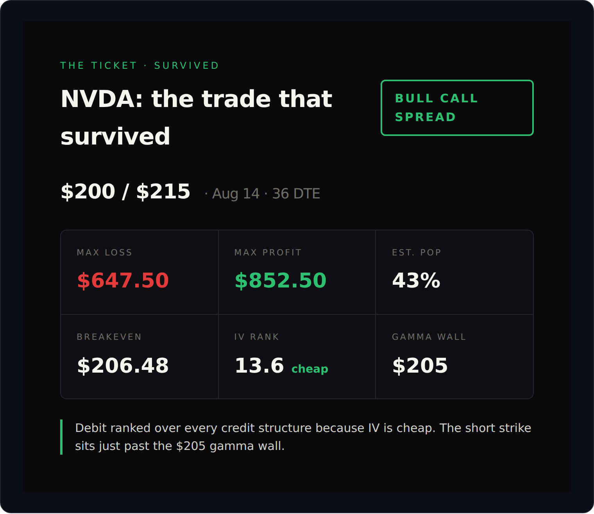

# My Screener Handed Me an A. Then My Own Process Made Me Give It Back.

*Options 40% | Screening 40% | Mindset 20%*

I don't pick stocks anymore. I let the machine hand me one.

That sounds like a flex. It's the opposite. In the rooms they tell you your best thinking is what got you here. My "this is the one" instinct is the exact same instinct that used to torch accounts at 2am. So I built a process that gets a vote, and most days it outvotes me.

Today it slapped my hand away from the one name I actually wanted. That veto is the whole post.

## Where the tape was

Wednesday, after the close. Risk-on and not shy about it. VIX down over 6% to the mid-15s, a billion and a half in net call flow, semiconductors up two and a half percent with a third of a billion dollars in calls chasing them. Nothing scary left on the calendar. The kind of afternoon where you can get away with being a little wrong.

Which is also the kind of afternoon you talk yourself into garbage. So I ran the funnel instead of my mouth.

## Step one: get a name you didn't start with

Open the screeners. Run Bullish Pullback at defaults. Don't editorialize, just read the top line.

> [SCREENSHOT: screener-bullish-pullback]

Top of the list: UCTT. Entry score 80, a clean A, semiconductor equipment. Sitting just under its 21 EMA with the whole moving-average stack still stacked underneath it. A textbook dip inside an uptrend.

I liked it immediately. That was my first warning. When a chart makes me feel something in under two seconds, that feeling is not analysis. It's the account-torching instinct saying hello.

## Step two: is the whole neighborhood hot

Before I fall in love with the ticker, I check what it is. Open Sector Flow.

> [SCREENSHOT: sector-flow]

Semiconductors up 2.49% with real call money behind them. Tech green. Two independent tools now agree, and neither one of them is my gut. The screener found a chip name. The flow board says chips are getting bought.

So the thesis stops being "UCTT." The thesis becomes "semiconductors." That reframe is the seatbelt. You can't marry a ticker if you're only dating the sector.

## Step three: what kind of tape am I in

Open GEX Overview. This tells me whether the market amplifies moves today or squashes them.

> [SCREENSHOT: gex-overview]

Long gamma. Big. Dealers are net long, which means they buy the dips and sell the rips for me whether I like it or not. Translation: mean-reverting, low-drama tape. Defined risk wins. Chasing a breakout into that is arm-wrestling a market maker who bench-presses your house.

Calendar's clear too. Fed minutes already dropped that afternoon. No landmines between here and the weekend.

## Step four: the gate

Now, and only now, I point the tools at the actual stock. Open Unusual Activity, filter to UCTT.

> [SCREENSHOT: unusual-uctt-empty]

Nothing. Zero prints. No blocks, no sweeps, no splits. Whatever the smart money is doing in chips today, it is not doing it here.

A pretty chart with no money behind it is a setup, not a signal. I kept going, but the guard was up now.

## Step five: the veto

Before I even think about a spread, I check whether the options on this thing are tradeable at all. IV rank, put/call, a quick strategy preview. This is where UCTT died.

Implied vol at 117%. Bid/ask on the 95 put running from $9.30 to $13.10, which is a thirty-percent-wide toll booth you pay just to get in and out. Zero volume on the front-month puts and calls. And earnings sitting inside the window, so the engine flags event risk on every single structure it tries to build.

A gorgeous stock setup. An unusable options name. Thin, wide, vol through the roof, an earnings landmine buried in the yard.

This is the machine doing the one job I built it for. The screener found the name. The gates threw it back. I did not lose a dime on UCTT, and the only reason is that the process refused to let me be there.

## A screener does not pick trades

A screener does not pick trades. It starts an argument.

The name at the top of the list isn't a buy. It's a defendant. Every step after it is the prosecution. Sector flow, gamma, smart money, vol, liquidity, earnings. Most days something on that list gets a name convicted and thrown out, and the whole point of running it is that you're not the judge. You're just the bailiff reading the verdict.

UCTT got thrown out. So the process did the next thing, which is the part I actually pay for.

---

## The part behind the paywall

The funnel doesn't stop at "no." It reroutes. UCTT was the wrong vehicle for a thesis that was still valid, so the process went looking for the liquid, flow-backed way to express the same semiconductor idea. That's where it put me, what every single-ticker tool said when I got there, and the exact contract structure the engine ranked first.

Half of what you pay for this goes straight into the brokerage account that takes these trades. You're not buying a newsletter. You're funding the machine that vetoes me.

> [SCREENSHOT: unusual-nvda]

The theme's liquid leader was carrying a fifty-eight-million-dollar call block, a tight two-sided market, and no earnings for seven weeks. Then I ran the single-ticker stack on it. Gamma, IV rank, and a whole-chain edge grade all pointed the same direction without me forcing a thing.

> [SCREENSHOT: nvda-strategy-ideas]

The engine ranked a defined-risk debit spread over every credit structure on the board, for a reason it could show its work on. Same reasoning a disciplined human would use, except it priced all four legs off the live chain while I was still refilling my coffee.

That's the trade the process handed me. Not the one I wanted at first glance. The one that survived the argument.

## Why this costs money

I could give this away and a lot of it I do. But the paid line is the honest one, because the paid readers fund the account that eats these trades in public. When the process is wrong, it's wrong with my actual money, next to yours. That's the only version of a trading letter I'd trust, so it's the only one I'll write.

If that's the deal you want, subscribe. If it isn't, the free half is genuinely free and I'm glad you're here.

## The close

Recovery taught me one thing that maps perfectly onto a brokerage account. You cannot be your own last line of defense. The addict does not talk the addict off the ledge. You need something outside your own head with the authority to say no.

For nineteen years that was a phone number I called before I did something stupid. Now it's also a screener that hands me a name, lets me get excited, and then quietly makes me give it back.

Best trade I made today was the one I didn't.

~ Michael
