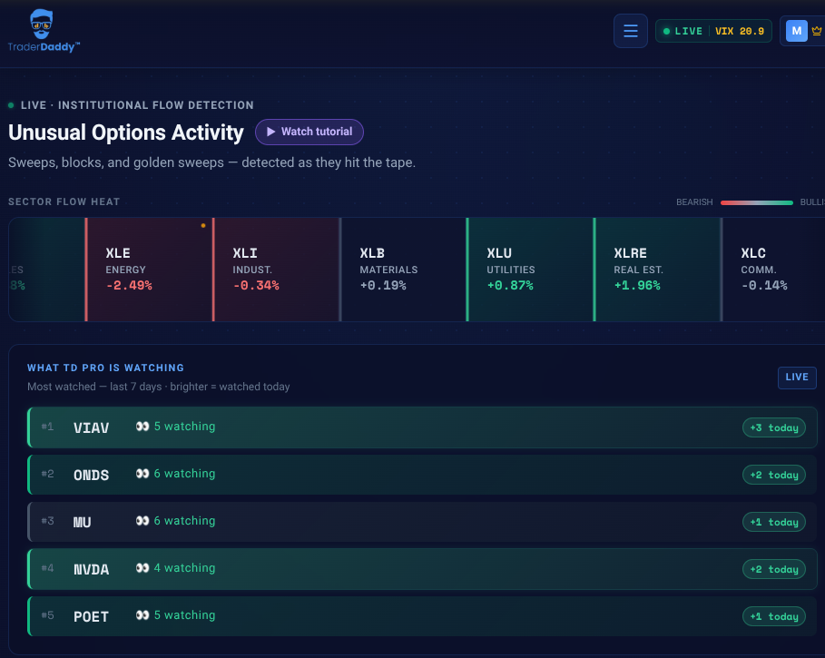
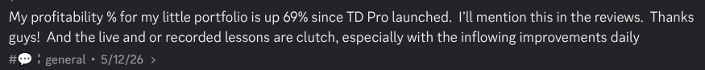
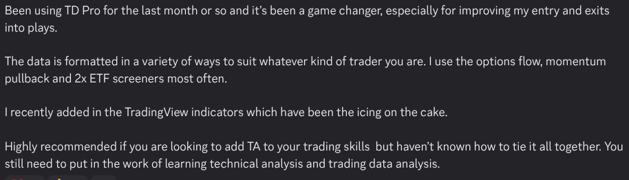
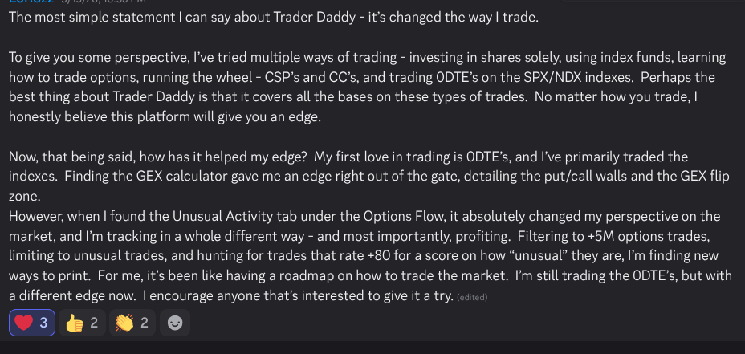
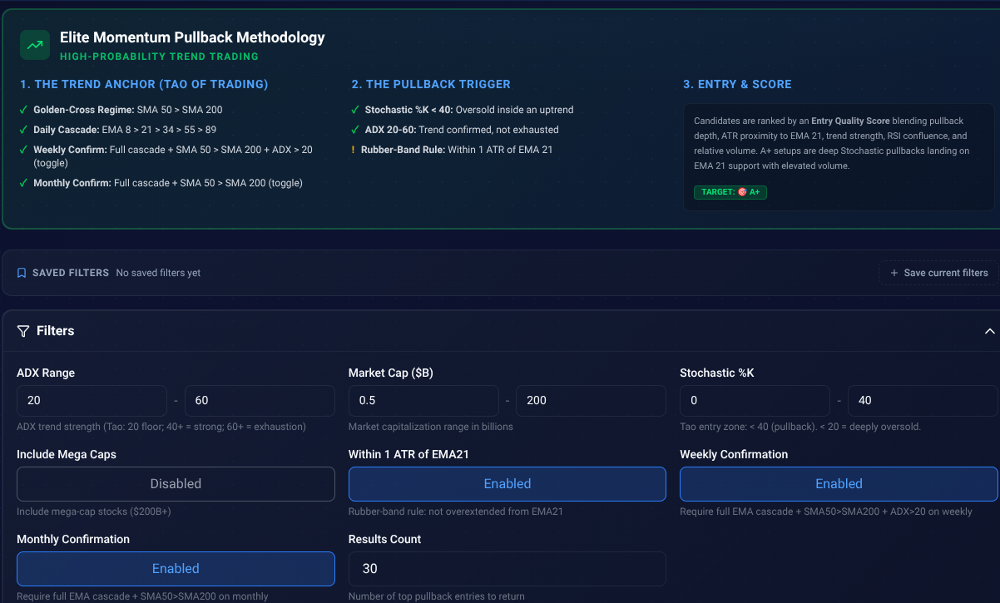
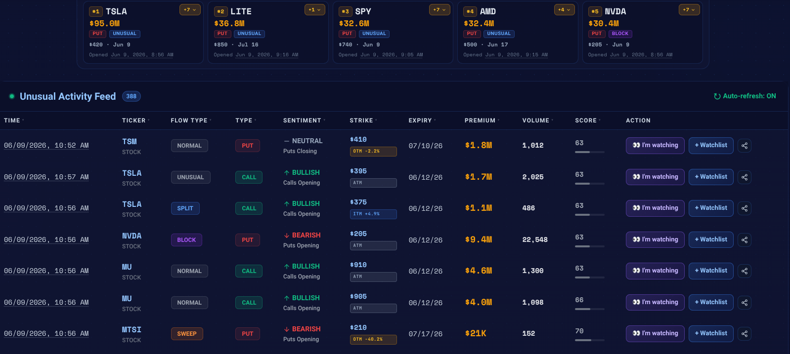
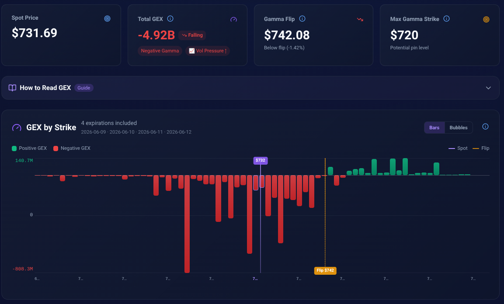

# A Member's Account Is Up 69%. We Built the Tools He Used.

*Business 60% | Trading 40%*

<!--
HERO IMAGE PROMPT (16:9) — generate in Substack:
Retro screen-print editorial poster, aged cream paper, muted navy / deep red / gold
palette, halftone texture, warm and a little tongue-in-cheek. A workbench seen from
above: a soldering iron and circuit board on one side morphing into a glowing trading
terminal on the other, the same hands that build the tool also trade with it. Stacks
of printouts labeled "OPTIONS FLOW," "MOMENTUM PULLBACK," "2X ETF," a coffee ring,
and a small hand-drawn GEX curve on a napkin. Banner ribbon along the bottom:
"WE BUILD THE TOOLS. WE TRADE THEM TOO." No people's faces, just the bench, the
glow, and the receipts. Lived-in, honest, builder energy.
-->

*Disclosure, since most of you know already: I build for [TraderDaddy Pro](https://www.traderdaddy.pro/?ref=MPHINANCE&utm_source=substack). The screeners, a chunk of the engine. The link is my referral link. So don't take my word for it. Take theirs.*

Time to find out if my marketing is half as good as my trading.

I'd rather ship a screener than write about one. But members started leaving reviews this week, and some of them were raving about tools I built without knowing I was reading. So here they are. Three real members, the tools behind them, and the part where you still have to do the work.

One thing up front: small crew, ships daily, trades the tools itself. We don't sell screeners we've never touched. I run the Momentum Phund in public on these every morning, my own money on the line. When something breaks, we feel it before you do. Then we fix it.

---

## The reviews

Three members. None of them work on this. None knew I'd quote them.

> *"My profitability % for my little portfolio is up 69% since TD Pro launched. The live and or recorded lessons are clutch, especially with the inflowing improvements daily."*

Up 69% on a "little portfolio." Can't promise you'll match it. But it's real, in the real channel, with no idea I'd be quoting him.

> *"Been using TD Pro for the last month or so and it's been a game changer, especially for improving my entry and exits into plays. The data is formatted in a variety of ways to suit whatever kind of trader you are. I use the options flow, momentum pullback and 2x ETF screeners most often. I recently added in the TradingView indicators which have been the icing on the cake."*

Those screeners are the part of the build I own. A member improving his entries with my code is the only review I care about. He also kept it honest, so I am too:

> *"You still need to put in the work of learning technical analysis and trading data analysis."*

The tool doesn't trade for you. It hands you the data. You learn to read it. Anyone who tells you different is selling a dream.

> *"The GEX calculator gave me an edge right out of the gate, detailing the put/call walls and the GEX flip zone. However, when I found the Unusual Activity tab under the Options Flow, it absolutely changed my perspective on the market... Filtering to +5M options trades, limiting to unusual trades, and hunting for trades that rate +80 for a score on how 'unusual' they are, I'm finding new ways to print. For me, it's been like having a roadmap on how to trade the market."*

That's not me pitching. That's a member describing the exact workflow we built. Three other people put hearts on it.

---

## What's under the hood

The tools I use every morning.

**Screeners.** Options flow, momentum pullback, 2x ETF. Not 500 stocks. The handful that match a real setup. The momentum pullback screener is the exact reversal entry I run on the Phund: pulled back into support, flow still underneath.

**Unusual Activity.** Filter to +5M premium, unusual only, +80 score. The difference between seeing flow and using it.

**GEX.** Total GEX, gamma flip, the strikes pulling price around. Below: spot at $731.69 sitting under a $742.08 flip. Negative gamma, vol pressure. If you trade 0DTE on SPY, SPX, or NDX, this is the map.

Plus TradingView indicators, live lessons, market pulse, sector flow, earnings flow, even congressional trades. Find the two or three that fit how you trade. Ignore the rest.

---

## The honest part

A tool won't make you money. You still do the work. TraderDaddy Pro is the best set of tools I've used, and I'd say that even if I didn't build it. But it's a roadmap, not a chauffeur. It shows you the trade. You size it, take it, and live with the red days. I have plenty in public.

The link is my referral link. Sign up through it and it helps us keep building. Want the founder? Follow @Trading_With_Art. He runs the ship and builds in public, same as me.

**[See what they're talking about → traderdaddy.pro](https://www.traderdaddy.pro/?ref=MPHINANCE&utm_source=substack)**

Drop the one tool you want me to break down next. I read every reply.

\- Michael

*Disclosure restated: I'm on the TraderDaddy Pro team and the link is a referral link. The reviews are real, unsolicited, from members who don't work on the platform. Not financial advice. Trading is real risk and you can lose money. The 69% is one member's self-reported result, not typical or guaranteed. Do your own work.*
