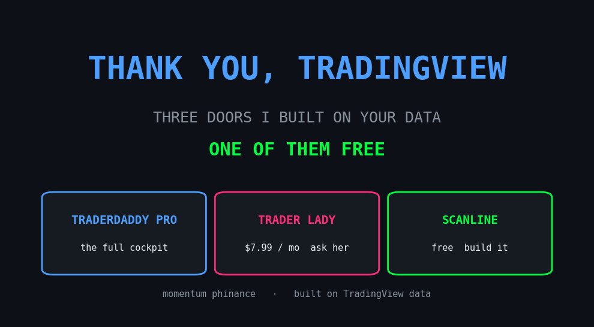
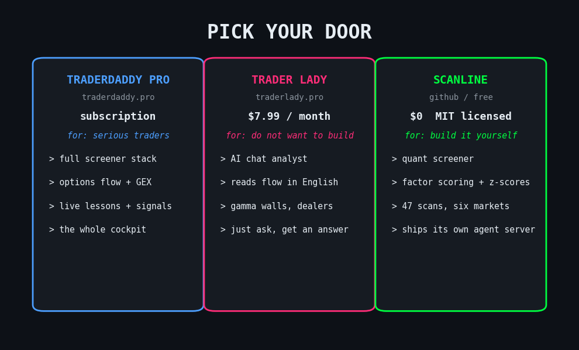
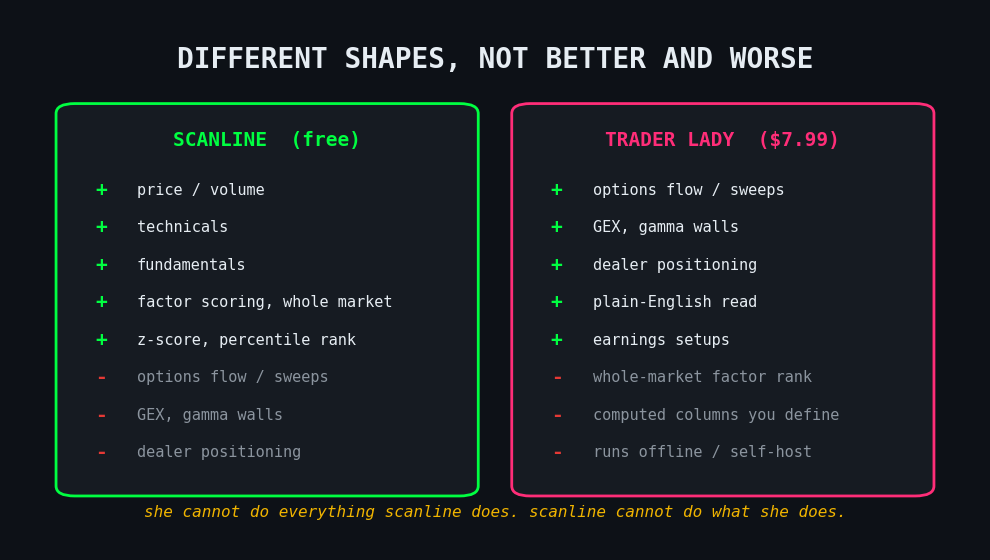

# Built on TradingView. Three Doors Into the Market, One of Them Free.

*Tags: tradingview, trader lady, options flow, open source, scanline, ai trading tools*

Before I show you anything, a thank-you. None of what follows exists without TradingView. The charts I learned to read on, the data the free tool runs on, the open library that makes all of it queryable. I wrote a layer on top of their work, that is all. I would not have any of this without them. So treat this as part launch, part receipt, part thank-you note.

Now the launch. Trader Lady is finally ready. She is live at [traderlady.pro](https://traderlady.pro), and we put her on Whop for **$7.99 a month** so there is nothing to install and nothing to figure out. You sign in, you ask, she answers. That is one door. There are three.

Same market, three ways in. Pick the one that fits how you actually work.

> None of this exists without TradingView. I just built three doors on top of their data.

* * *

## Door one: you want the full cockpit

That is [TraderDaddy Pro](https://www.traderdaddy.pro/?ref=8DUEMWAJ). I wrote the long version this morning, a member up **69%** on the exact screeners I build. I am not going to repeat it here. If you trade every day and want the whole stack, that is your door.

* * *

## Door two: you do not want to build anything

Then you want Trader Lady. She is an AI options-flow analyst that lives in a chat window. Ask her about any ticker and she reads the flow, the gamma walls, where the dealers are trapped, and what is about to move. Bloomberg-grade data, locker-room delivery.

> "She reads flow like it owes her money."

Under the hood she is Sam wired into TraderDaddy Pro's options-flow tools, behind a Whop login. No terminal, no Python, no setup. **$7.99 a month**, ask in plain English, get a straight read. This door is for the people who just want the answer. The gloriously, unapologetically lazy. I see you. I am sometimes you.

> **Sam:** I do the reading. You still take the trade. Do not blame me for your position sizing.

* * *

## Door three: you would rather build it yourself, for free

Then meet scanline. It is on my GitHub, MIT licensed, runs on your own machine, no account, **nothing to pay**: [github.com/mphinance/scanline](https://github.com/mphinance/scanline).

It is a quant-analytics screener sitting on top of TradingView's data. And I mean that literally: every number it shows comes from TradingView, pulled through shner-elmo's open [tradingview-screener](https://github.com/shner-elmo/TradingView-Screener) library, charted with TradingView's own Lightweight Charts. They built the foundation. I wrote the quant layer on top. Computed columns you define yourself. Composite factor scoring across momentum, value, quality, growth, and low-vol. In-result z-scores and percentile ranks. Multi-timeframe signals. 47 one-click scans. Six markets, from stocks to crypto to futures. It even ships its own agent server, so you can drive the whole thing from Sam in plain language too, same idea as Trader Lady, except you own every line of it.

I built it with Sam in the room. That is the part I want you to sit with. One person, an AI partner, and TradingView's data can ship a real screener now, for free, and hand it to you on day one. There is a live demo at [mphinance.github.io/scanline](https://mphinance.github.io/scanline/) if you want to poke it before you clone it.

* * *

## The honest part

Here is what nobody selling you a tool will say out loud. The free one and the paid one are different shapes, not better and worse.

scanline screens the whole market on price, volume, technicals, and fundamentals. It does not see options flow. No sweeps, no GEX, no dealer positioning. Trader Lady sees all of that, because she is plugged into TraderDaddy Pro, but she will not factor-rank six thousand tickers for you. She cannot do everything scanline does. scanline cannot do what she does. That is on purpose.

So do not let me upsell you. If you build, take the free one tonight. If you would rather just ask, she is **$7.99**. If you want the full cockpit, the morning door is still open.

**[Just ask her → traderlady.pro](https://traderlady.pro)**
**[Build it free → github.com/mphinance/scanline](https://github.com/mphinance/scanline)**
**[Full cockpit → traderdaddy.pro](https://www.traderdaddy.pro/?ref=8DUEMWAJ)**

> If one line here earned it, restack it so the next trader finds the door that fits them.

* * *

The market does not care which door you walk through. It cares whether you show up and do the work once you are inside. Same as a meeting. The room is free, the chair is free, but nobody recovers for you. Same here. The tool hands you the read. You still have to take the trade and live with the red days.

One more thank-you, on the record. The data and the charts are TradingView's, and the free tool only exists because of shner-elmo's open-source [tradingview-screener](https://github.com/shner-elmo/TradingView-Screener) library. scanline is an independent project, not affiliated with TradingView. I just stand on their shoulders.

*Disclosure, same as always. I am on the TraderDaddy Pro team and the traderdaddy.pro link is my referral link. Trader Lady is a paid product I help build. scanline is my own free, open-source repo, so I make nothing if you use it, which is the whole point. None of this is financial advice. Trading is real risk and you can lose money. Do your own work. Want the founder running the ship? Follow @Trading_With_Art.*

\- Michael
