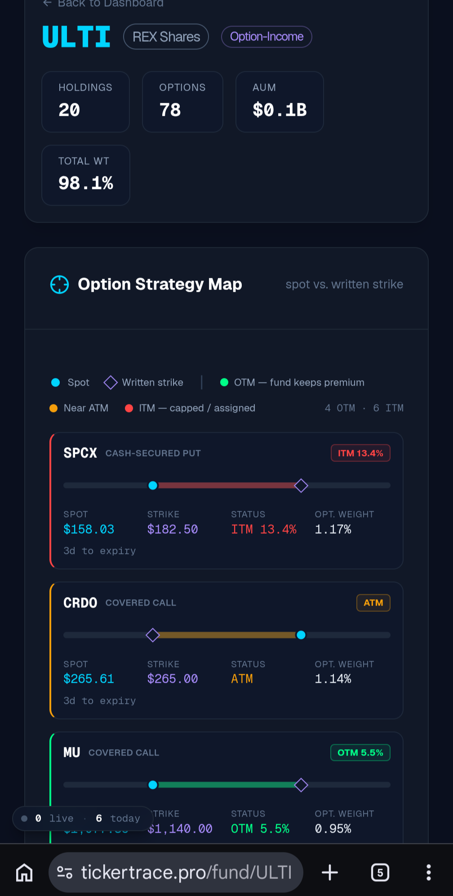
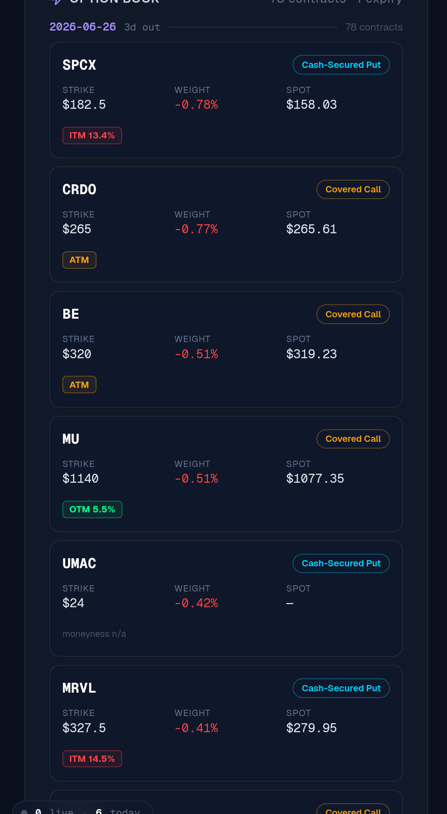
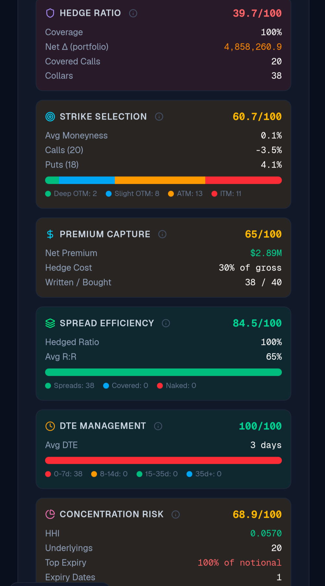
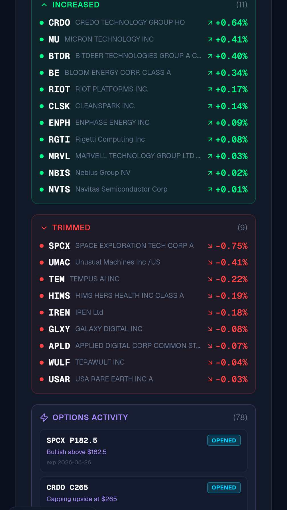
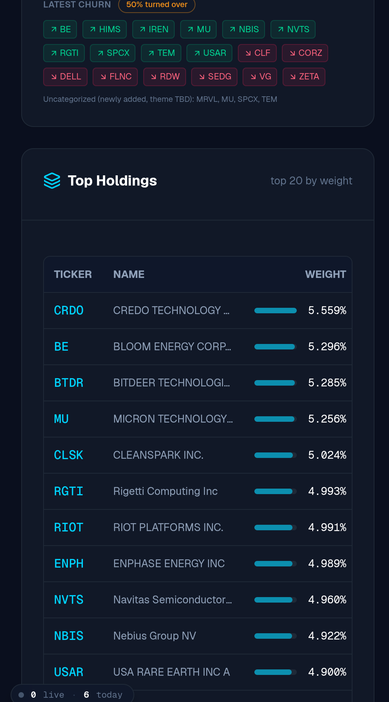
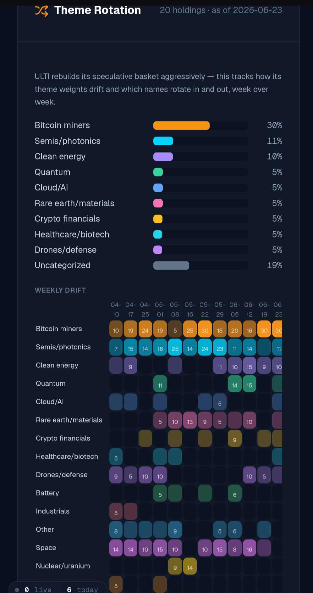
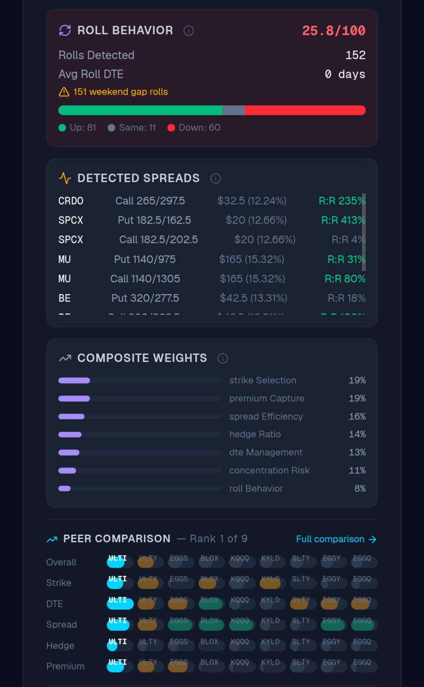

# Your Income ETF Won't Show You This. I Built a Tool That Does.

*Tags: option income ETF, ULTI, REX Shares, covered calls, cash secured puts, fund analytics, tickertrace*

<!--
HERO IMAGE PROMPT (16:9) — generate in Substack:
Dark Bloomberg-terminal aesthetic, near-black background (#0a0a0a), neon-green and gold
data glow. An X-ray light box on a desk, and clipped to it is the "skeleton" of an ETF:
instead of bones, the film shows option contracts, strike ladders, a churn feed, and a
theme-rotation heatmap glowing through. A doctor's loupe rests on top. Mono font ticker
"ULTI" stamped in the corner. Caption ribbon at the bottom: "WHAT THE FACTSHEET WON'T
SHOW YOU." Clean, data-dense, a little clinical. No faces.
-->

Here's the truth nobody selling you a 60% yield wants to say out loud: **most option-income ETFs are a black box with a payout stapled to the front.**

They show you the distribution rate. A big, juicy, screenshot-for-Reddit number. What they don't show you is the machine making it. Which strikes they wrote. How close to the money. How fast they're rolling. Whether the "income" is premium they actually kept or capital they quietly shredded to fund the payout.

I got tired of guessing. So I built a tool that pulls the fund apart on the table and shows you every organ. It's called **TickerTrace**, it's free, and today I'm using it on **ULTI**, the REX Shares option-income fund, so you can see what I mean.

---

## First, what ULTI actually is

Twenty holdings. Seventy-eight live option contracts. About **$0.1B in assets**, and **98.1% of the fund is working** at any given moment. This is not a sleepy dividend fund. This is a speculative basket with an options overlay bolted on top, and it trades like it.

That map is the whole thesis in one picture. Every name gets a dot for **spot price** and a diamond for the **strike they wrote**, and the color tells you whether the fund is keeping the premium or getting run over. SPCX is a cash-secured put sitting **13.4% in the money**. CRDO is a covered call pinned right **at the money**. MU is a covered call with **5.5% of room** left to run.

You don't get this on the issuer's factsheet. You get a pie chart and a yield. Here you get the actual positions.

## The option book, contract by contract

This is the part I love, because it's the part funds hide. The literal ledger of what's written, what it's worth, and how close it is to blowing up on them.

Next expiry is **three days out**. Read that again. The whole book turns over on a 3-day clock. SPCX put **13.4% ITM**. MRVL put **14.5% ITM**. When a cash-secured put is that deep in the money, the fund is wearing the loss on the underlying and the "income" is doing damage control, not printing free money.

That's not a knock on ULTI. It's just the truth of how these things work, and you deserve to see it before you buy the yield.

## Where it gets fun: the scorecards

I didn't want to just dump positions. Anybody can scrape a holdings file. I wanted to **grade the strategy**. So TickerTrace scores six things every option-income fund lives and dies on.

Look at the spread. **DTE Management: 100 out of 100**, because they run a 3-day book and never let theta go stale. **Spread Efficiency: 84.5**, a clean 65% average risk-to-reward. But then **Hedge Ratio: 39.7**, heavy on collars. And **Premium Capture: 65**, which tells the real story: they kept **30% of gross premium**, about **$2.8M net**. Seventy cents of every premium dollar went somewhere other than your pocket.

That one number, "kept 30% of gross," is the kind of thing you'd never find on your own. That's the whole reason the tool exists.

## How aggressively they churn

Eleven names added to, nine trimmed, and a churn feed that flagged the basket at **50% turned over**. This is an actively-managed knife fight, repriced weekly. If you thought you were buying a set-and-forget income product, the churn feed is your reality check.

And the book itself is **tight and evenly weighted**. CRDO 5.56%, BE 5.30%, BTDR 5.29%, MU 5.26%, CLSK 5.02%. Nobody name is allowed to sink the ship. That's a deliberate design choice, and now you can see it instead of taking their word for it.

## What's actually under the hood

Here's the part that should make you sit up. **38% Bitcoin miners. 21% semis and photonics. 10% clean energy.** Then quantum, cloud-AI, rare-earth, crypto-financials at about 5% apiece. The "income" label is a costume. Underneath, **ULTI is a high-beta speculation engine** wearing a yield as a disguise, and the weekly-drift heatmap shows those theme weights sliding around week to week.

If you're holding this for "safe income," the theme map is the conversation you needed to have with yourself before you bought it.

## And how it stacks up against its peers

**152 rolls detected. 151 of them weekend gap rolls.** Roll Behavior scores a rough **25.8 out of 100**, because rolling a 0-DTE book over the weekend is a high-wire act and the tool grades it honestly. But on the composite, against eight sibling option-income funds, **ULTI ranks #1 of 9.** Best of a wild bunch.

---

## Here's the truth

I'm not here to tell you to buy ULTI or sell it. I'm a felon in recovery who builds his own trading tools because I got tired of being lied to by people with nicer suits than mine. The point of this isn't the verdict. The point is that **you can run this yourself, for free, on any option-income fund you're holding, before you trust it with your money.**

TickerTrace is free. There's no catch, no paywall on the fund pages, no "enter your email to see the data." Go pull apart whatever income ETF is sitting in your account right now and find out what it's actually doing.

Run ULTI here: **[tickertrace.pro/fund/ULTI](https://tickertrace.pro/fund/ULTI)**

Then go run yours.

We get better by looking at the thing we'd rather not look at. That's true in recovery and it's true in your brokerage account. The fund won't show you the deep-ITM puts and the weekend gap rolls. So look anyway.

~ Michael
