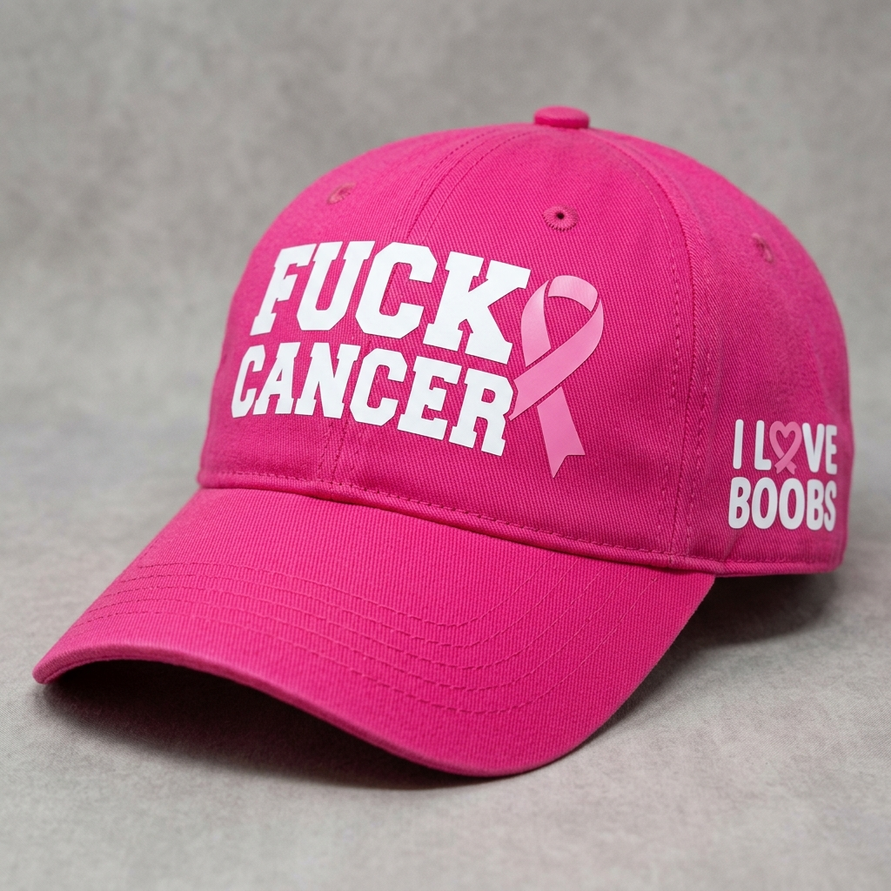
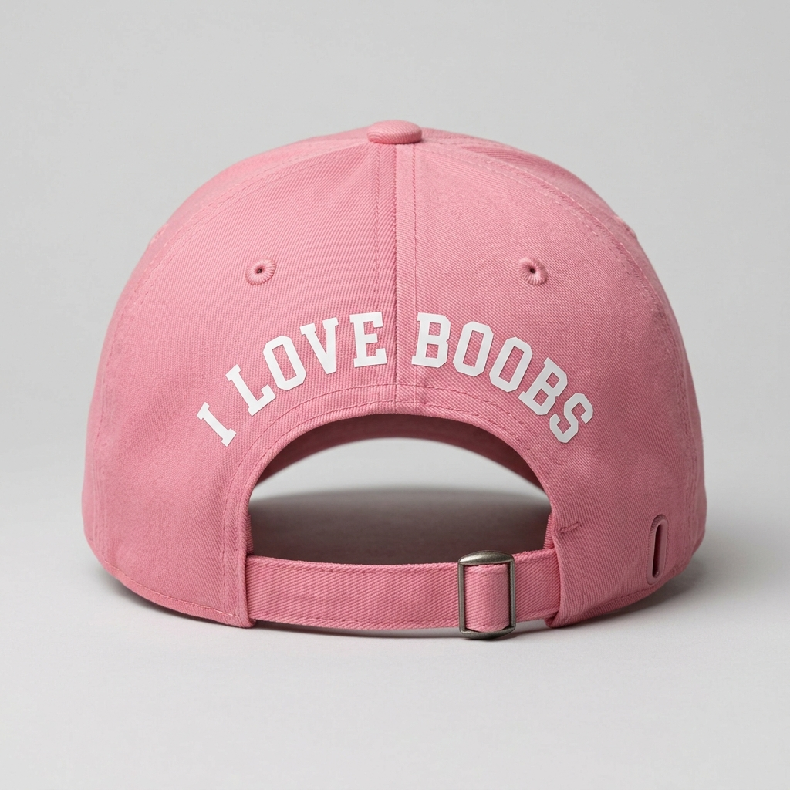
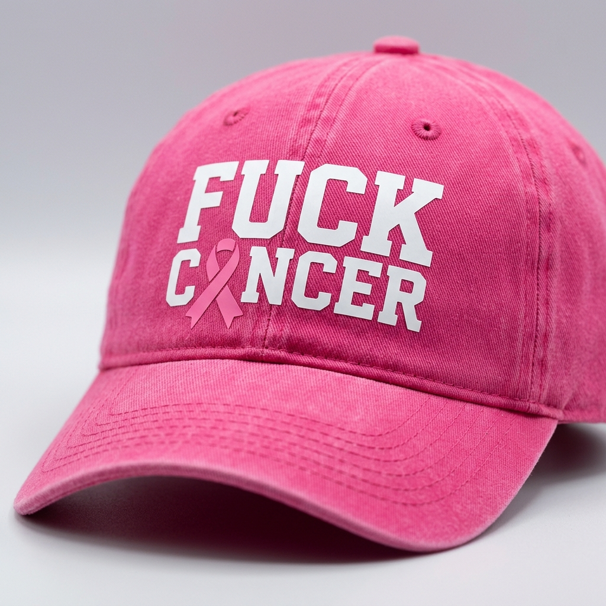
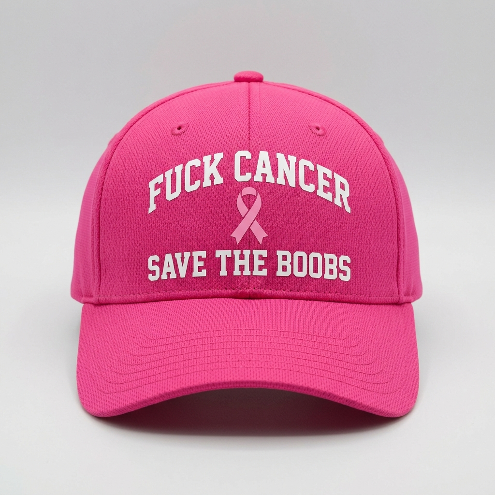
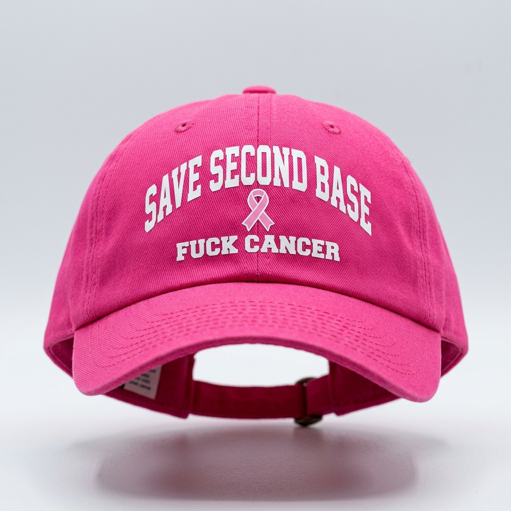
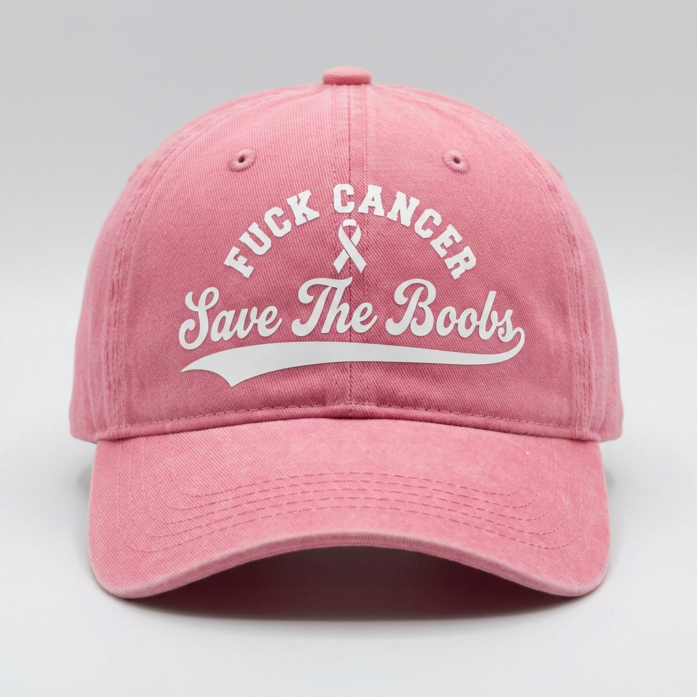
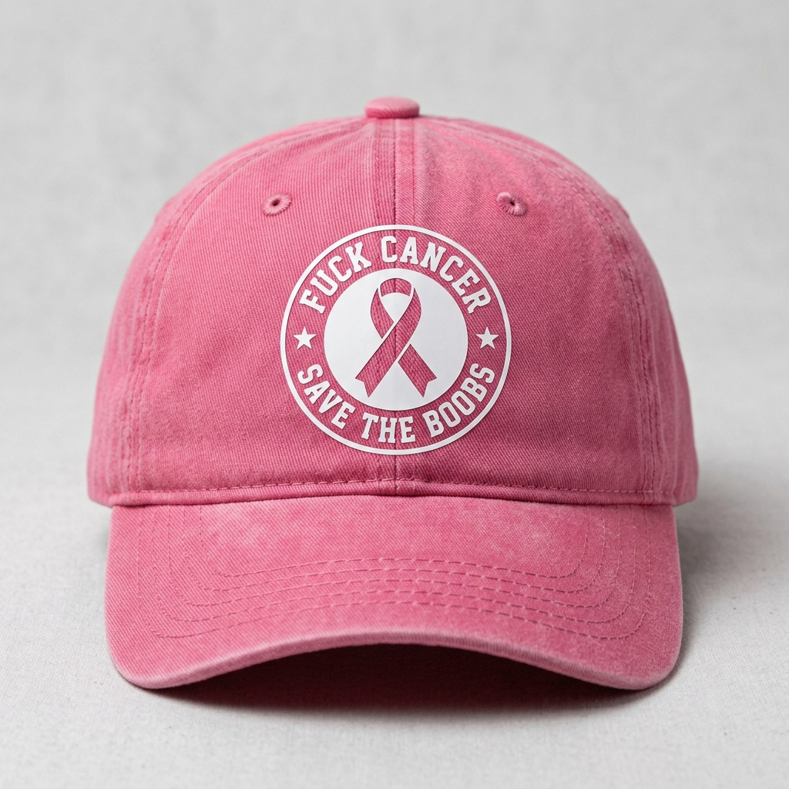
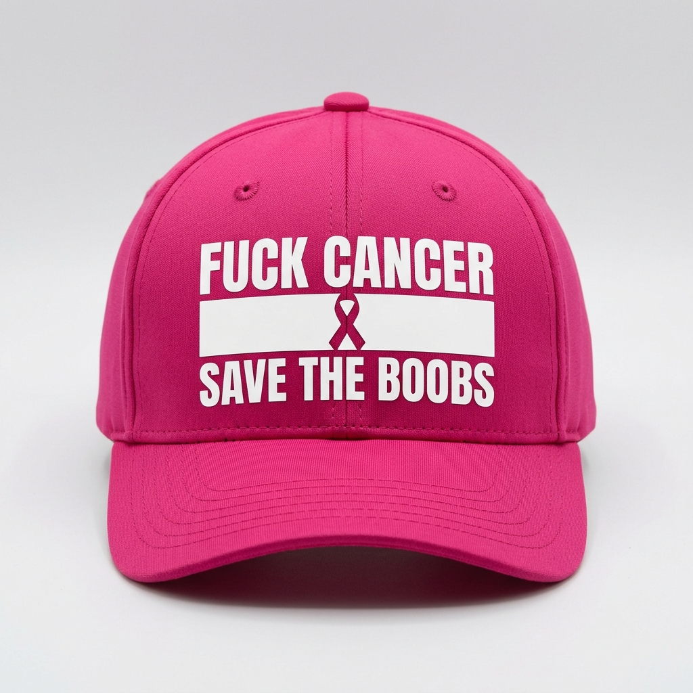
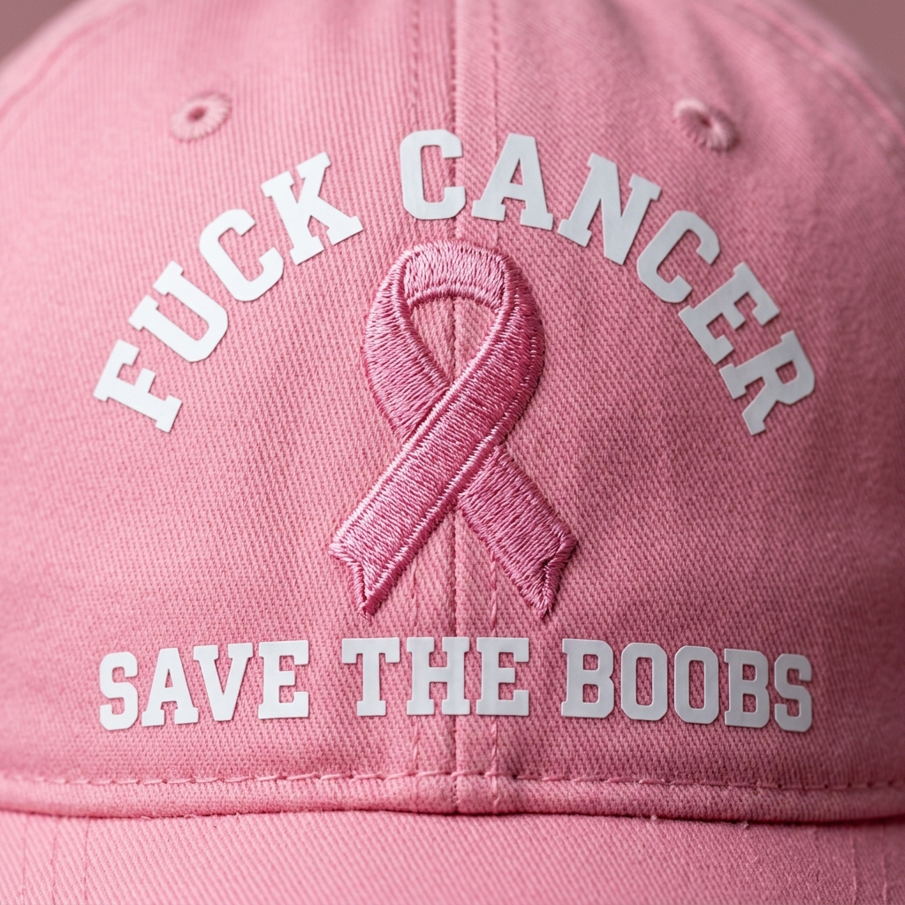

# 🎀 Pink Athletic Cap: Breast Cancer Awareness Mockups & Cricut Files

> **Project:** Custom Pink Ball Cap for Breast Cancer Awareness Month  
> **Target Cap:** DSG Adult All Sport Cap (Lightweight poly performance dad hat in Fuego Pink / Pink Spirit)  
> **Print Method:** Mom's Cricut Heat Transfer Vinyl (HTV)  

---

## 🧢 Design Layout Options

````carousel

<!-- slide -->

<!-- slide -->

<!-- slide -->

````

---

### 1. Option 1: Front + Side Temple Lockup (Recommended ⭐)
- **Front Crown:** Bold athletic `FUCK CANCER` with integrated pink awareness ribbon (approx. 3.75" W × 2.2" H).
- **Side Panel (Left Temple):** `I LOVE BOOBS` with heart-ribbon emblem (approx. 2.75" W × 1.6" H).
- **Why it works best:** Standard pro sports cap layout. It leaves the front looking clean and powerful, while putting the playful slogan on the side panel. It is also the easiest to press because standard hat presses clamp comfortably on a single panel without stretching over seams.

---

### 2. Option 2: Front + Back Keyhole Arch
- **Front Crown:** `FUCK CANCER` across the center front.
- **Back Opening:** `I LOVE BOOBS` custom-arched directly above the adjustable strap keyhole opening (approx. 4.2" W × 1.2" H).
- **Why it works:** Classic collegiate/skate cap aesthetic. Anyone walking behind you at a 5K or running errand gets the punchline.

---

### 3. Option 3: Unified Front Stack
- **Front Crown:** Both phrases stacked on the front panel with the central ribbon connecting them (approx. 4.0" W × 2.2" H).
- **Why it works:** Single-press convenience—Mom only has to line up one decal and press it in one pass.

---

## ✂️ Ready-to-Cut Files for Cricut Design Space

All vector SVGs (native cut paths) and high-resolution 300 DPI transparent PNGs have been generated and saved to your project repository:

| File Name | Format | Recommended Mat Placement | Path |
| :--- | :--- | :--- | :--- |
| **`fuck_cancer_front.svg`** | Vector SVG | Front Crown (4" × 2.5") | [`fuck_cancer_front.svg`](./fuck_cancer_front.svg) |
| **`ilove_boobs_side.svg`** | Vector SVG | Side Temple Panel (3" × 1.8") | [`ilove_boobs_side.svg`](./ilove_boobs_side.svg) |
| **`ilove_boobs_back_arch.svg`** | Vector SVG | Rear Strap Arch (4.5" × 1.5") | [`ilove_boobs_back_arch.svg`](./ilove_boobs_back_arch.svg) |
| **`combo_stacked.svg`** | Vector SVG | Single Front Crown Decal | [`combo_stacked.svg`](./combo_stacked.svg) |
| **`fuck_cancer_white.png`** | 300 DPI PNG | Front Crown (Transparent Alpha) | [`fuck_cancer_white.png`](./fuck_cancer_white.png) |
| **`ilove_boobs_white.png`** | 300 DPI PNG | Side / Back (Transparent Alpha) | [`ilove_boobs_white.png`](./ilove_boobs_white.png) |
| **`combo_stacked_white.png`** | 300 DPI PNG | Front Crown (Transparent Alpha) | [`combo_stacked_white.png`](./combo_stacked_white.png) |

*(Note: Black vinyl versions `_black.png` are also generated in the directory if she prefers black HTV on pink).*

---

## 🛠️ Instructions for Mom's Cricut Press

1. **Importing:** Open **Cricut Design Space** -> Click **Upload** -> Select the `.svg` file. It will load immediately with cut lines grouped.
2. **Mirror Mode:** **CRITICAL!** Remind Mom to toggle **"Mirror" ON** before cutting on Iron-On / HTV vinyl, or the text will press backwards.
3. **Vinyl Recommendation:** White Everyday HTV (or Stretch HTV if pressing on the lightweight polyester DSG cap so it moves with the cap fabric).
4. **Heat Settings for Polyester:** 285°F - 305°F with medium pressure for 12-15 seconds (cool peel).


---

## 🆕 New Phrasing Concepts: "SAVE THE BOOBS" & "SAVE SECOND BASE"

````carousel

<!-- slide -->

````

### Why "SAVE THE BOOBS" Hits Better:
- **Mission vs. Statement:** "I Love Boobs" is passive; "Save The Boobs" is an active mission.
- **Visual Balance:** The arched `FUCK CANCER` on top with `SAVE THE BOOBS` grounded on bottom frames the awareness ribbon cleanly in the center.
- **Cut File:** [`save_the_boobs_stacked.svg`](./save_the_boobs_stacked.svg) & [`save_the_boobs_white.png`](./save_the_boobs_white.png) are ready to load directly onto Mom's Cricut mat.


---

## 🎨 4 Design Styles for "The Champ" (`FUCK CANCER / SAVE THE BOOBS`)

````carousel

<!-- slide -->

<!-- slide -->

<!-- slide -->

````

| Style | Description | Weeding Difficulty for Mom |
| :--- | :--- | :--- |
| **1. Collegiate Varsity Arch** | Arched varsity block on top, ribbon center, heavy block bottom. Clean, timeless. | 🟢 **Easy (10/10)** — Bold lines, zero tiny pieces. |
| **2. Vintage Baseball Script** | Retro baseball tail script for `Save The Boobs` with athletic underline swoosh. | 🟡 **Medium (8/10)** — Single continuous cursive cut. |
| **3. Circular Roundel Badge** | Military squadron coin / seal style with circular border and twin stars. | 🟢 **Easy (9/10)** — Bridges crown seam flawlessly. |
| **4. Modern Streetwear Box** | Ultra-condensed heavyweight modern athletic font with divider bar. | 🟢 **Easy (10/10)** — Crisp geometric cut lines. |


---

## 🧵 The "Universal Add-Around" Kit (For Caps with Pre-Sewn Embroidered Ribbons!)

Many commercial breast cancer awareness caps (from Dick's, Amazon, charity walks, etc.) already come with a **pre-sewn / embroidered pink ribbon** stitched onto the front crown (usually 1.25" to 1.5" tall).

You cannot iron heat-transfer vinyl *over* a thick embroidered thread patch without it bubbling or peeling. 

So we engineered the **Universal Ribbon Frame**:



### How It Works:
1. **The Geometry:** 
   - `FUCK CANCER` is arched with a calibrated curve to sit cleanly **above** the top loop of any standard sewn ribbon.
   - `SAVE THE BOOBS` sits straight **below** the ribbon's bottom tails.
   - There is a generous 1.7" × 1.1" negative-space window in the center so zero vinyl touches the embroidery threads.
2. **If You Have an Existing Pre-Embroidered Cap:**
   - In Cricut Design Space, hide or delete the `Optional_Ribbon` layer.
   - Cut `Text_Layer_Single_Pass` on white Iron-On / HTV.
   - When weeding, weed the center window empty. You will have a **single sheet of clear carrier tape**.
   - Simply drop the carrier tape onto the cap so the embroidered ribbon pokes through the center window, tape it with heat tape, and press! Both lines press simultaneously, perfectly centered around the embroidery.
3. **If You Have a 100% Blank Cap:**
   - Cut both the white text layer AND the pink vinyl ribbon layer included in the SVG!

### Files for the Universal Frame:
* **Vector SVG:** [`universal_ribbon_frame_kit.svg`](./universal_ribbon_frame_kit.svg)
* **300 DPI Transparent PNG:** [`universal_text_frame_white.png`](./universal_text_frame_white.png)
