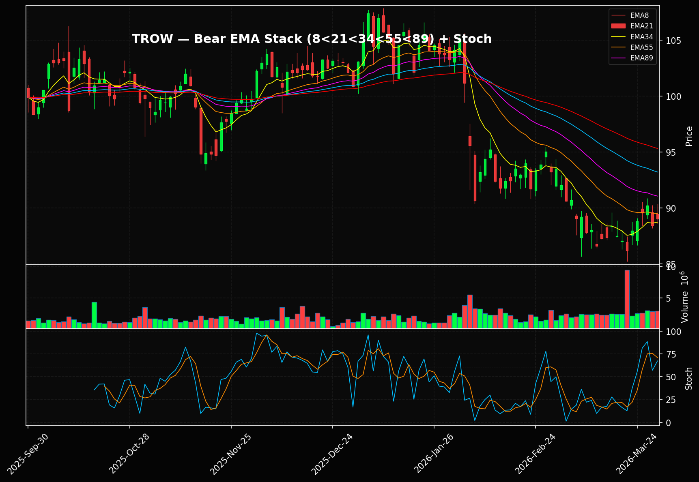
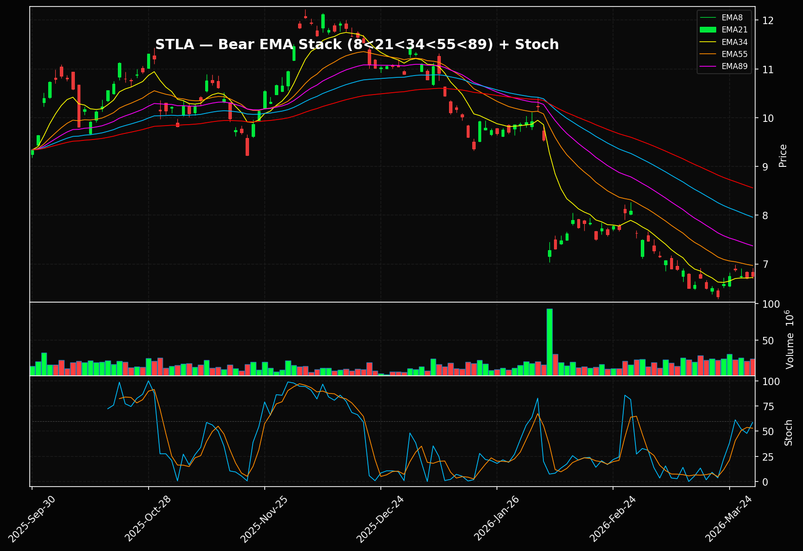
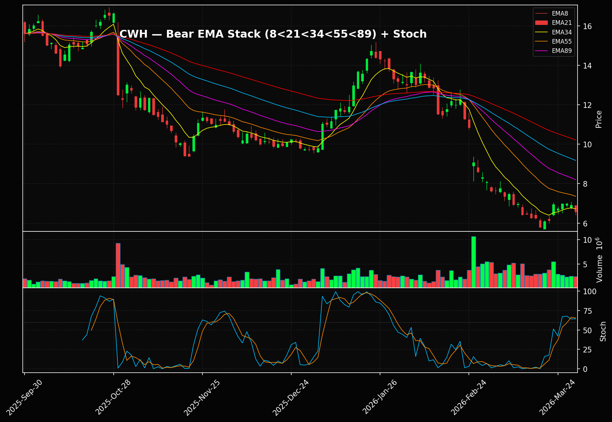
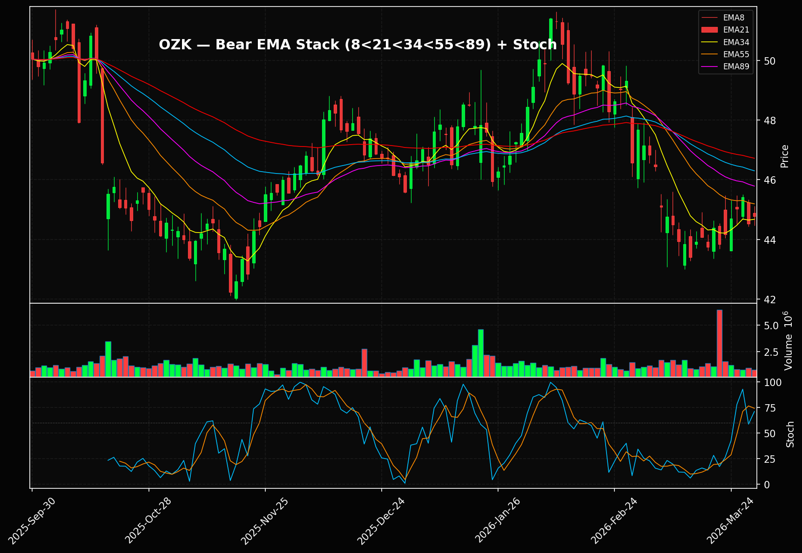

# 🐻 I Built a Bear Screener Because the Market Told Me To

Look, I know I'm a momentum guy. I built this whole pipeline to find beautiful bullish EMA stacks and Bounce 2.0 pullbacks, the whole Tao of Trading playbook. But here's the truth: when the tape turns, you either adapt or you bleed.

So I reversed everything.

## What the Bear Screener Does

You know my "Stacked EMAs Tao" setup, the one where EMA 8 > 21 > 34 > 55 > 89 and you buy the pullback? I took that exact logic and flipped every single filter.

📉 **EMA Death Stack**: 8 < 21 < 34 < 55 < 89
📉 **Death Cross**: EMA 50 below EMA 200
📉 **MACD below zero**: momentum is bearish
📉 **Stoch K > 60**: this is the key part

That last one is what makes this work. We're not buying puts at the bottom of the dump like amateurs. We're waiting for price to bounce back up into resistance, the EMA 21 zone, where the sellers are sitting. Stoch above 60 means the dead cat bounced far enough. Time to load puts.

## Why Puts

Here's the thing. Most of you can't short stocks. Your broker won't let you, or you don't have margin, or the borrow fee is insane. Puts solve that problem. Defined risk, no margin calls, and you know exactly what you can lose before you click buy.

For these setups I'm looking at puts 30 to 45 days out, near the money. You want enough time for the thesis to play out but not so much that theta eats you alive.

## What It Found Today (March 30, 2026)

I ran the entire US equity universe through the bear funnel. It eliminated 99.8% of them and gave me 16 survivors. But here's the problem I ran into right away: a lot of technically perfect bear setups have garbage options chains. No volume, no open interest, wide spreads. So I filtered the results again through an options liquidity lens.

Here are **the three I'd actually trade**.

---

## 📈 TROW (T. Rowe Price) at $89.03

This is the one that made me sit up. $19B market cap asset manager that just fell off a cliff. Look at this chart. The EMA stack just cascaded into full bearish alignment and price gapped down hard through all of them. The stochastic bounced back toward 60, which is exactly the dead cat bounce I'm scanning for.

What I like about TROW is the story behind the technicals. Asset managers bleed in risk-off environments. When the market gets scared, people pull money out of actively managed funds. That's TROW's whole business. The technicals are confirming what the fundamentals already tell you.

**The puts**: May 15 expiry has 1,259 total put open interest. The $85 put traded 79 contracts today with an ask of $2.60. The $90 ATM put has 345 open interest, ask at $5.00. These are tradeable spreads on a real name.

---

## 📈 STLA (Stellantis) at $6.75

Stellantis has been in free fall since that massive gap down in January. 27 million shares traded on that candle. The EMA stack went full bearish and hasn't looked back. RelVol at 1.11 says people are still actively trading this thing down.

The thing about STLA is the options flow is screaming. 4,821 total put open interest on the April 17 expiry. The $7 put has 2,151 open interest and is trading $0.45 bid/$0.50 ask. That's a tight spread on a liquid chain. For fifty bucks you get a defined risk bet that this thing revisits $6.

---

## 📈 CWH (Camping World) at $6.58

Down 4.78% today. Relative volume 1.13, so the selling is real and active. CWH has been grinding lower since October, and the EMA cascade is textbook. Price tried to bounce back to the EMA 21 in January and got smacked right back down. Classic.

**The puts**: May 15 expiry. The $6 put just moved 564 contracts today. That's real activity. IV is elevated at 93% so you're paying up for it, but 564 contracts on a $6 stock tells you somebody bigger than you and me is betting on more downside.

---

## The Runners Up

**OZK (Bank OZK) at $44.77** has the deepest institutional outflow on the scan (CMF -0.25) with 4,008 total put OI. The regional bank story isn't pretty. But looking at the chart honestly, it's choppier than the other three. The EMAs are aligned but the price action is messy.

**GNTX (Gentex) at $21.40** is technically clean but the options chain is dead. 2 total put open interest. You can't trade that.

**CPB (Campbell's) at $22.18** has the deepest CMF reading of the whole scan at -0.32. Institutions are dumping this thing. But again, thin options. 11 put contracts traded all day.

---

## How I'm Playing This

I'm looking at the TROW $85 puts for May 15. About $260 per contract, defined risk, on a name with real fundamentals driving the bear case.

The STLA $7 put for April 17 is the cheapest bet on the board at $50 a contract. If you've got $200 to risk, that's 4 contracts with a tight spread.

CWH is the speculative one. The 93% IV means you're overpaying, but that volume today tells a story.

Position sizing stays small. These are defined risk trades. If I'm wrong, I lose the premium and nothing else. If I'm right, the death cascade takes care of itself.

## The Pipeline

This bear screener is now wired directly into my daily Alpha Dossier pipeline. Every morning at 5 AM CST, it runs alongside the bullish Ghost Alpha screener. Bull picks on the left, bear feed on the right. I like to know what's working on both sides of the tape.

The full scan takes about 3 seconds. It starts with 8,000 stocks, runs them through TradingView's API for the bearish EMA stack, then a 15-stage funnel eliminates everything that doesn't pass. The survivors get deep scanned for weekly alignment, squeeze detection, and institutional money flow.

---

*Disclosure: This is not financial advice. I'm a guy with a felony who taught himself to code. Do your own homework. Check your own options chains before you trade anything.*

**Subscribe for the daily bear feed and the full Alpha Dossier.**
