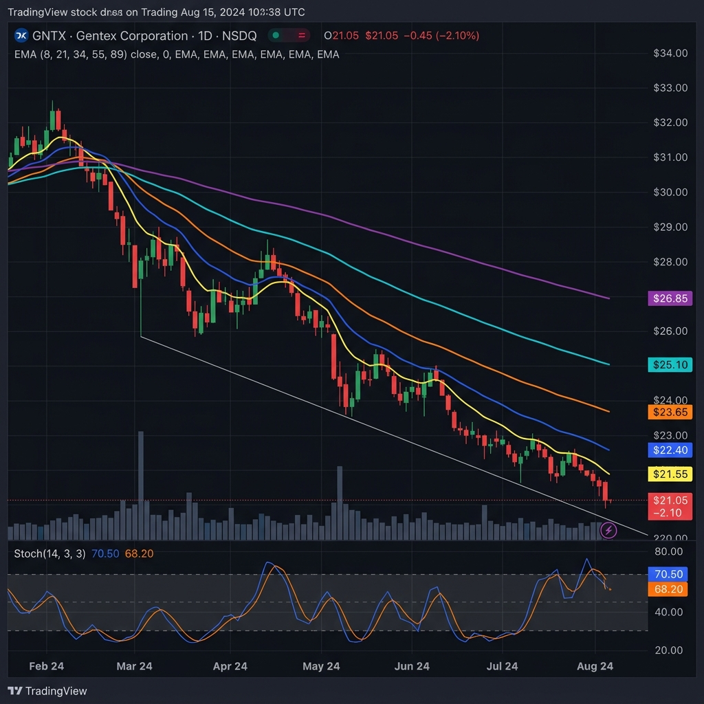
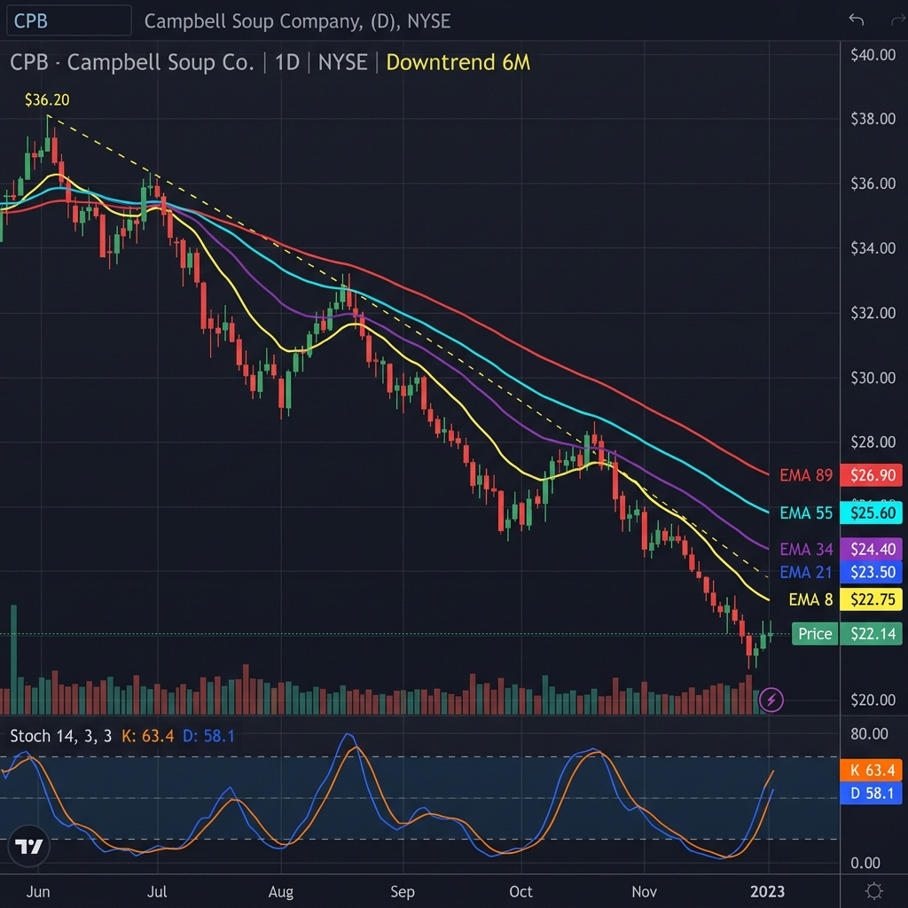

# 🐻 I Built a Bear Screener Because the Market Told Me To

Look, I know I'm a momentum guy. I built this whole pipeline to find beautiful bullish EMA stacks, Bounce 2.0 pullbacks, the whole Tao of Trading playbook. But here's the truth: when the tape turns, you either adapt or you bleed.

So I reversed everything.

## What the Bear Screener Does

You know my "Stacked EMAs Tao" setup, the one where EMA 8 > 21 > 34 > 55 > 89 and you buy the pullback? I took that exact logic and flipped every single filter:

📉 **EMA Death Stack**: 8 < 21 < 34 < 55 < 89
📉 **Death Cross**: EMA 50 below EMA 200
📉 **MACD below zero**: momentum is bearish
📉 **Stoch K > 60**: this is the key part

That last one is what makes this work. We're not buying puts at the bottom of the dump like amateurs. We're waiting for price to bounce back up into resistance, the EMA 21 zone, where the sellers are sitting. Stoch above 60 means the dead cat bounced far enough. Time to load puts.

## Why Puts, Not Shorting

Here's the thing. Most of you can't short stocks. Your broker won't let you, or you don't have margin, or the borrow fee is insane. Puts solve that problem. Defined risk, no margin calls, and you know exactly what you can lose before you click buy.

For these setups I'm looking at puts 30 to 45 days out, near the money. You want enough time for the thesis to play out but not so much that theta eats you alive.

## What It Found Today (March 30, 2026)

I ran the entire US equity universe, about 8,000 stocks, through the bear funnel. It eliminated 99.8% of them and gave me 16 survivors. Seven had daily AND weekly bearish alignment. Here's what I'm watching and the put flow behind them.

---

### 📈 OZK (Bank OZK) at $44.77, Best Put Liquidity

Regional banks coughing up blood again. This one has the nastiest CMF reading on the scan at -0.25, meaning institutional money is pouring out. The squeeze ratio at 0.76 says volatility is coiling. When it fires in a downtrend, it fires down.

**Bear Grade: A (5.0/7) | CMF: -0.25 🩸 | Death Cross ☠️ | Multi-TF Aligned ✅**

💰 **Put Flow (May 15 expiry)**:
| Strike | Volume | Open Interest | Bid/Ask | IV |
|--------|--------|---------------|---------|-----|
| $45 P | 5 | 426 | $2.50/$3.00 | 44.9% |
| $42.50 P | 1 | 819 | $1.55/$2.00 | 48.1% |

OZK has the best options liquidity of the bunch. 4,008 total put open interest with tight spreads. The $45 put gives you right at the money exposure for about $275. The $42.50 is cheaper at ~$175 but needs a bigger move.

---

### 📈 GNTX (Gentex) at $21.40, Textbook Setup

Perfect specimen. 25 bars into the bear trend, CMF at -0.18 so institutions are still selling, and the squeeze ratio is 0.80, meaning it's compressing for the next leg down.

**Bear Grade: A (5.0/7) | CMF: -0.18 🩸 | Death Cross ☠️ | Multi-TF Aligned ✅**

💰 **Put Flow (May 15 expiry)**:
| Strike | Volume | Open Interest | Bid/Ask | IV |
|--------|--------|---------------|---------|-----|
| $20 P | 1 | 1 | $0.50/$1.00 | 54.2% |

Thin options chain here. Only 2 total put OI. If you play this one, you're dealing with wide spreads. Might be better as a stock short if you have the margin, or just skip it and focus on OZK where the liquidity is.

---

### 📈 CPB (Campbell's) at $22.18, Biggest Institutional Outflow

CMF at -0.32, that's the highest institutional outflow on the entire scan. Smart money is gone. The EMA stack is textbook bearish and the stock just bounced into the resistance zone.

**Bear Grade: B (4.0/7) | CMF: -0.32 🩸 | Death Cross ☠️ | Multi-TF Aligned ✅**

💰 **Put Flow (May 8 expiry)**:
| Strike | Volume | Open Interest | Bid/Ask | IV |
|--------|--------|---------------|---------|-----|
| $21 P | 3 | 3 | $0.65/$0.85 | 47.8% |

Light volume but the IV at 47.8% isn't crazy. The $21 put costs about $75, defined risk if you want a small bet on continuation.

---

### Other Names and Their Options Situation

| Ticker | Price | Bear Grade | CMF | Put OI (Total) | Tradeable? |
|--------|-------|------------|-----|----------------|------------|
| ULCC | $3.41 | A+ (5.5) | -0.17 | 91 | ⚠️ Low price, penny options |
| GO | $6.78 | A (5.0) | -0.14 | 53 | ⚠️ Thin chain |
| MC | $54.88 | A (4.5) | -0.09 | 2 | ❌ No liquidity |
| MBC | $8.22 | A (4.5) | -0.07 | 1 | ❌ No liquidity |
| JEF | $39.62 | B (4.0) | -0.09 | TBD | Needs checking |
| FHB | $24.13 | B (4.0) | -0.01 | TBD | Needs checking |

## The Honest Truth About These

The scanner found 7 multi-timeframe aligned bear setups. The technicals are clean. But here's the thing I need to be straight about: most of these are small and mid cap names with thin options chains. **OZK is the only one with real put liquidity.**

If you're going to play the bear side through puts, you need volume and open interest. Wide bid/ask spreads eat into your edge fast. So while the screener is finding valid setups, the tradeable universe is smaller than the signal list.

That's fine. It means less competition.

## The Pipeline

This bear screener is now wired directly into my daily Alpha Dossier pipeline. Every morning at 5 AM CST, it runs alongside the bullish Ghost Alpha screener. Bull picks on the left, bear feed on the right. I like to know what's working on both sides of the tape.

The full scan takes about 3 seconds. The bear feed outputs to `docs/api/bear-screener.json` with grades, CMF readings, squeeze status, and multi-timeframe alignment scores.

---

*Disclosure: This is not financial advice. I'm a guy with a felony who taught himself to code. Do your own homework. Check your own options chains before you trade anything.*

**Subscribe for the daily bear feed and the full Alpha Dossier.**
