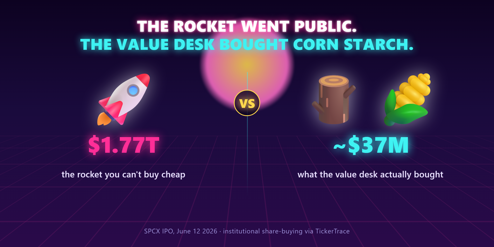
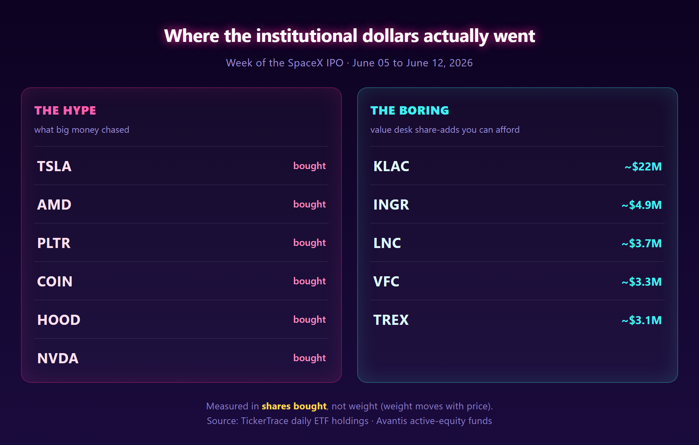

# The Rocket Went Public. The Value Desk Bought Corn Starch.

*SpaceX just ran the biggest IPO in history. While everyone chased a $1.77 trillion rocket, I went and checked what the actual value money bought that same week. It's gloriously boring, and you can afford all of it.*

Friday the rocket went public. SPCX priced at $135 a share, a $1.77 trillion valuation, about seventy-five billion dollars raised. Biggest IPO that has ever happened. Bigger than Tesla the second it opened. If you got an allocation, congratulations, you are smarter and better connected than me. The rest of us watched it pop and did the math on what we missed.

So I asked a different question. Not "should I chase the rocket." You can't, not at a sane price, not anymore. The question I can actually answer is this: while the whole tape was buying a rocket, what did the boring, disciplined value desks buy that exact same week? The ones who do this for a living and do not care about your group chat.

I pulled it from TickerTrace. Actively managed ETFs publish their full holdings every single day, so you can diff yesterday against today and see who added shares and who dumped them. No ninety day 13F delay. Just the receipts.

## First, the thing almost everyone gets wrong

When people screenshot "ETF holdings changes," they look at the change in a stock's weight. That number is a trap. Weight moves when the price moves. A fund can buy zero shares of something and watch its weight climb all week just because the stock went up.

I learned this the hard way on this very post. My first draft had Micron and Alphabet in it as big value adds, because the weight column lit up. Then I checked the actual share counts. Micron was a sixteen hundred share rounding error sitting on top of a price pop. Alphabet had a fund quietly selling it into the week. Both got cut. If you only watch weight, you get played by price every time.

So everything below is measured in shares, not weight. Did they actually buy more of the thing. That is the only honest version of this question.

## Nobody rotated to value

Here is the part that should not surprise anyone and somehow always does. The biggest institutional dollars that week did not flee to safety. They piled into the same risk-on names the rocket represents. Tesla. AMD. Palantir. Coinbase. Robinhood. Nvidia. CoreWeave. The smart money chased the exact same hype, just in tickers you can buy.

There was no great rotation into value. If you were waiting for the pros to ring a bell and pivot to boring, they didn't.

Except for one desk that kept doing its boring job anyway. And that list is short, cheap, and worth writing down.

## What the value desk actually bought

Avantis runs honest, rules-based value funds, large cap and small cap. Here is what they added shares of the week of the IPO. The format borrows from a setup I liked elsewhere and reskinned. Conviction, who's buying, sector, and the read.

**#1 $KLAC**  ⚡ Large-cap value · the standout

Net bought this week: about $22M
Funds buying: 2 (Avantis large value leading)
Sector: Semiconductors / chip equipment

**The Read**
The single biggest large-cap value conviction add of the week, by a mile. KLA makes the inspection and measurement gear every chip fab on earth needs to make anything. If the AI buildout is real, somebody sells the picks and shovels. While retail bought the rocket, the value desk bought the company that checks the rocket's chips. One honest caveat so nobody gets fooled: KLA is not cheap on a price-to-earnings basis, it actually screens expensive. Avantis did not buy it for a bargain multiple. They buy the profitability factor, the fat durable margins and high return on capital that a quality value fund pays up for. That is a different kind of value than a low P/E, and it is the whole reason a value desk can own a stock trading at a premium.

---

**#2 $INGR**  ⚡ Small-cap value

Net bought this week: about $4.9M
Funds buying: Avantis small-cap value
Sector: Consumer staples

**The Read**
Ingredion makes starches and sweeteners. Corn syrup, basically. There is not a single thing about this company that will ever trend. That is the point. Boring cash flow, a value multiple, and the value desk adding shares while the world bought a rocket.

---

**#3 $LNC**  ⚡ Small-cap value

Net bought this week: about $3.7M
Funds buying: Avantis small-cap value
Sector: Financials

**The Read**
Lincoln National sells life insurance and annuities. Deeply unglamorous, long out of favor, the kind of beaten-up financial that value screens love and nobody brags about owning. They added.

---

**#4 $VFC**  ⚡ Small-cap value

Net bought this week: about $3.3M
Funds buying: Avantis small-cap value
Sector: Consumer discretionary

**The Read**
VF Corp owns Vans, The North Face, and Timberland. A genuine turnaround story that has been left for dead. If the brands stabilize, the multiple has room. The value desk is paid to be early on exactly this kind of name.

---

**#5 $TREX**  ⚡ Small-cap value

Net bought this week: about $3.1M
Funds buying: Avantis small-cap value
Sector: Industrials

**The Read**
Trex makes composite decking out of recycled junk. Housing-adjacent, cyclical, and about as far from space travel as an investment gets. Which is the whole theme here.

---

## The point

You cannot buy the rocket cheap. That window closed at the opening bell Friday. But the boring stuff that disciplined money was quietly accumulating the same week, chip inspection gear and corn syrup and life insurance and decking, all of it trades at a price a normal person can actually pay.

Nobody is going to make a documentary about Ingredion. That is usually a feature, not a bug.

Do your own work on entry. This is institutional flow, not a buy button, and I am tracking what they bought, not promising what it does next. But if you spent Friday feeling like you missed the only trade that mattered, here is your reminder that the people who actually beat the market for a living spent that day buying decking.

— Michael
