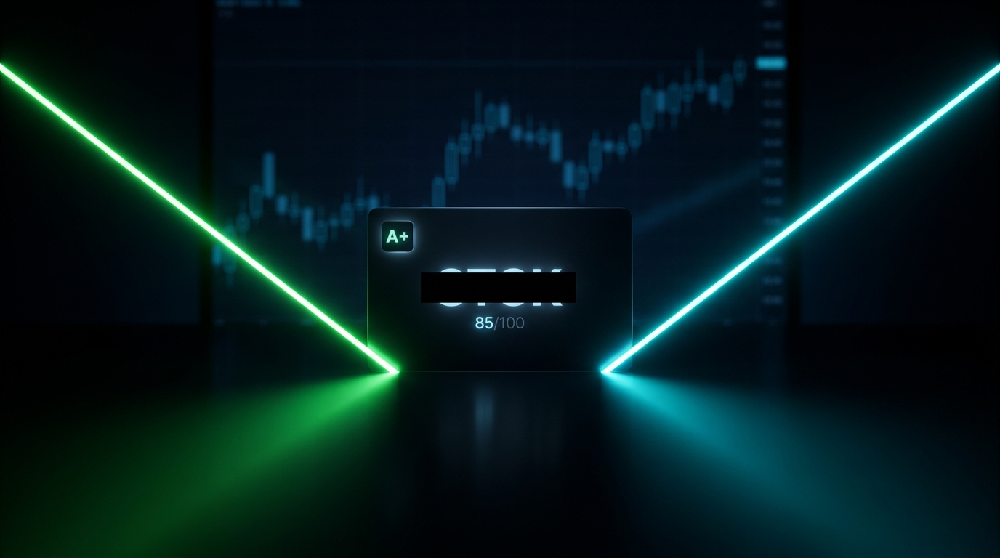
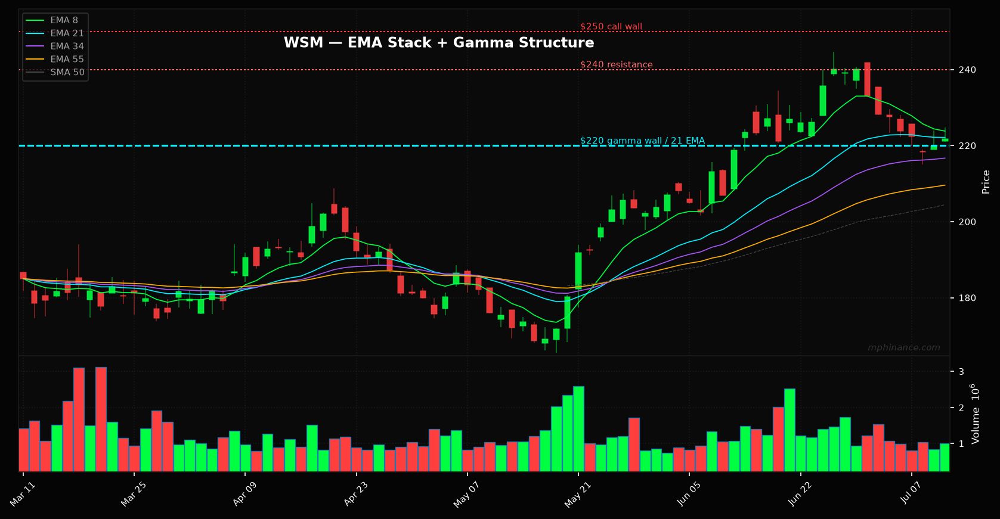

# Two Screeners Locked Onto the Same Boring Stock This Week

*Trading 50% | Screening 30% | Options 20%*

---

Every week I run the machine across every screener I own and look for one thing: a name that shows up in more than one place at the same time. A screener does not pick trades. A pile of screeners that all agree does.

This week the agreement was loud, and it landed on a stock nobody is bragging about.

## The tape this week

Risk-on, and not quietly. Roughly $130 million in bullish premium hit the board with almost nothing bearish. Big call buyers in TSLA, META, PLTR, and someone bought twenty-plus million dollars of TLT calls, a polite bet the Fed cuts. When the biggest checks all lean one way, you do not fade them for sport. You find the clean setup riding the same wave.

## One on the house: $NVDA

Here is a free one, so you can watch the machine work before you decide the paid pick is worth anything.

NVIDIA closed Friday at $210.96, up more than four percent, and it did the one thing I care about more than the price: it reclaimed the falling trendline that had capped it since the $236 high. A downtrend break like that is my favorite setup on the board. Price is back above the entire 8-through-89 EMA cluster and back over the 50-day, with ADX at 32 saying the trend has muscle, not drift.

Now the part where most people blow it. It closed at the top of the day's range with the fast stochastic pinned at 87. You do not chase a candle that just ran four percent into the bell. The entry is the pullback, not the breakout. I want it to come back and kiss the EMA cluster around $202 to $205, hold, and go. Stop sits under $200, where the reclaim would be a fakeout and I would be wrong with no story to tell. First target is the $216 shelf, then a run back at the old $236 high.

That is the whole trade, free, chart below. The name I am actually putting money behind this week is on the other side of the line.

**[DROP YOUR NVDA CHART HERE — the PatternPulse screenshot with the trendline break. Caption: NVDA reclaims the downtrend line off the $236 high.]**

## What I am NOT buying

The avoids are free. I am not chasing the mega-cap call flow, because by the time TSLA calls print that big the move is priced and I am buying someone's exit. No 0DTE lottery tickets, no names reporting earnings this week. Holding a swing through an earnings print is not a strategy, it is a coin flip with your rent.

## A side note, because it is Sunday and I build for fun

My kid had a trip coming up, so I built a little app for it. You point it at a photo of a paper schedule or a park map, an AI reads the whole thing, and out comes an installable app with a live map, a find-me GPS dot, and a countdown bar. I called it Are We There Yet, because that is the question every kid asks from the back seat. It is also the exact question you ask your brokerage account. Point the machine at the boring part, keep your hands on the wheel for the part that matters. It is open on GitHub if you want it for your own trip.

## The name is the product, so it is below the line.

Everything except the ticker: a roughly $220 stock you would never call sexy, that sells you something probably sitting on your kitchen counter right now. This week it hit number one on two different screeners at once, two engines built on completely different logic, both pointing at the same ticker. Grade A+, 85 out of 100. It pulled back into the exact spot a disciplined buyer waits for, in a confirmed uptrend, above every major moving average, with no earnings landmine for 45 days.

The full name, the deep DD, the options structure, the levels, and Sam's roast are one click below.

---

**PAID SUBSCRIBERS ONLY (set the paywall here in the editor)**

---

## The pick: $WSM (Williams-Sonoma)

Williams-Sonoma. The pots-and-pans company, around $221.75 at Friday's close.

Do not let the boring fool you. WSM is not just the store in the mall, it is the parent of Pottery Barn, West Elm, Rejuvenation and Mark & Graham. It is a high-margin, mostly-online home furnishings operator with a long reputation for fat operating margins, steady buybacks and a growing dividend. This is a compounder that hides in plain sight while everyone stares at chips.

### Why the machine flagged it

It is the number one name on my bullish-pullback screener AND my momentum screener at the same time. Two engines, different logic, same ticker. That is convergence, and convergence is the only thing I trust.

Real uptrend, above every major moving average and well above its 200-day at 196. It just pulled back into the 8 and 21 EMA, the exact Tao-of-Trading entry spot, and the stochastic crossed back up. ADX at 30 says the trend has muscle, not drift. RSI 52 leaves room to run. Earnings sit 45 days out, so no landmine in the window.

### The options structure, which makes this more interesting

WSM is sitting in negative gamma right now, with dealers holding roughly twice as much put gamma as call gamma. Negative gamma means dealers amplify moves instead of dampening them, so when this thing goes it can go fast in either direction. That is not a reason to skip it. It is the reason to respect the stop.

Here is the part I like. The single biggest gamma wall on the board is $220, stacked with over 4,400 puts, and it sits right under the current price. That $220 shelf is a support magnet, and it lines up almost exactly with the 21 EMA at 222. Two completely different disciplines, technicals and dealer positioning, are pointing at the same floor. When the tape agrees with the options structure, I pay attention.

Above, the resistance shelf is $240, then $250 where a big stack of calls sits. Below $200 the support thins out toward $190, which is exactly why I do not want to be around if it loses the EMA stack.

### The plan

Buy the pullback near here while it holds the $220 to 222 zone, where the 21 EMA and the gamma wall overlap. First target is the $240 shelf, second is $250 into that call wall. If it closes below the EMA stack and loses $220, the setup is wrong and I am out, no story, no hoping. These are Friday's numbers, so I take the real entry Monday at the open and log the actual fill here.

### Sam's read

I asked Sam for the odds. She does not do buy or sell, she does odds and roasts.

"You are buying a housewares stock during an AI melt-up because two of your spreadsheets agreed and a put wall showed up in the right spot. The setup is genuinely clean: strong trend, textbook pullback, support confluence, no earnings risk. Call it a solid B+ entry with better-than-coin-flip odds if the tape holds. But you are in negative gamma, so if risk-on flips, your tidy pullback becomes a falling knife with a stochastic crossover. Buy the confluence, respect $220, and do not marry the sauté pan."

I will log the entry Monday. You watch it happen, not a screenshot after the fact.

~ Michael

*Not financial advice. My money, my rules, my mistakes, in the open.*
