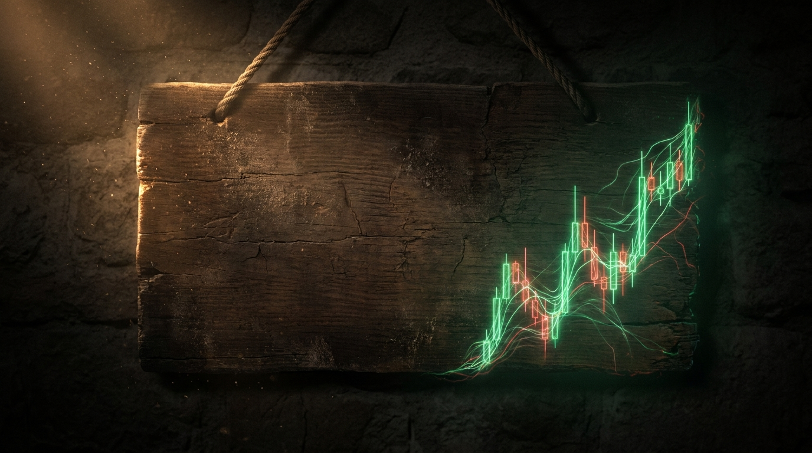
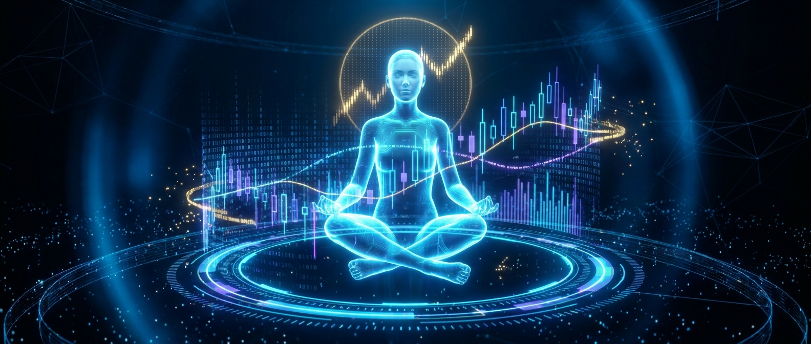

# How to Accidentally Start a Religion (Or a Bull Market)

*Trading 40% | Mindset 40% | Macro 20%*

I was watching The Orville a few weeks ago. There's an episode where the first officer, Kelly, gets glimpsed by a curious local while she's down on a pre-industrial planet. She heals a sick kid with tech that looks like a miracle, says one forgettable line about being kind to each other, and beams back to the ship. To her it was a lunch break. To the planet it was the beginning of everything.

Because time runs faster down there, the crew pops back a little later to check in. What was an afternoon upstairs is seven hundred years on the surface. They find a Church. Then a Reformation. Then, eventually, a holy war, fought over the correct interpretation of a woman who once basically said "hey, maybe don't do that." They've put her in stained glass. She is a goddess now, robes and a halo and a communicator badge. Every schism, every burning, every line of scripture, traces back to a coffee break nobody meant anything by.

I laughed. Then I stopped laughing, because I'd spent that same week reading Tchaikovsky and arguing with friends about exactly this, and I realized the show wasn't doing science fiction. It was doing a documentary with the serial numbers filed off. Swap the robes for a blazer and the halo for an upward candlestick, and you have not changed the story at all. You've just changed the pew.

You do not need a liar to build a false story. You need three things. Distance, translation, and a group of people who need the story to have already meant something. That's the whole recipe. The machine runs on its own. And once you've watched it run in a church, you cannot un-see it running in a ticker.

## One placard, two readings

There is exactly one official, government-stamped document that names Jesus a king. It's the sign they nailed over his head while he died. INRI. King of the Jews.

Roman law said you posted the crime a man was being executed for, right there on the cross, so everyone walking past knew what happened to people like him. That placard was a charge sheet. It was the accusation. It was Rome saying here's the insurrectionist who thought he was a king, look what we do to those.

Read it forty years later, by people who needed a coronation, and the execution notice becomes a throne.

Same words. To the soldier holding the hammer, a rap sheet. To the reader holding the gospel, a crown. Nobody changed the ink. The reader changed.

## The rest of the retrofit was just as quiet

None of it needs a con man. *Almah* means young woman. The Greek Septuagint rendered it *parthenos*, virgin. Centuries of doctrine turn on which of those two words a translator reached for. "Son of God" was a coronation formula too, the phrase you used for a new Davidic king in Psalm 2. Rome had its own version for its emperors. A title you handed a ruler, that later readers, further from the idiom, filed as a birth certificate.

Keep this next one handy, because it's about to cost you money in a different building. He expected the end within the lifetime of the people standing right there. Mark 13:30, this generation will not pass away. It didn't come. So the timescale got rewritten. 2 Peter, a day is like a thousand years. Read it in order and you can almost watch a community meet a deadline that passed, not by admitting it, but by deciding the deadline was never quite a deadline. Nobody lied. They just needed the story to have already meant something.

Wit, if you read Sanderson, tells stories exactly like this. A joke, a beat, then the second laugh, the one you don't enjoy. I'm not telling you what's false. I'm telling you what the words meant to the people using them, and letting you notice how little that resembles what you were handed.

I believe in a higher power, so read this line slow. I'm not knifing God. The good man can be real, the higher power can be real, and that is not the risk. The congregation is the risk. Faith that survives you reading the primary source is faith. Faith that would evaporate the second you read the Greek is just inherited noise wearing faith's coat.

That's the religion half. Now the part you actually came for, because this same machine runs on your screen every single day and it's picking your pockets while you call it research.

## The same con, built around your money

The move happens first. The story arrives after, to explain a candle that already printed. By the third retelling on your timeline the story stops being the explanation and quietly becomes the cause. Same retrofit, different building. "Smart money is accumulating" is an annunciation narrated by people who were nowhere near the room.

The ticker is the good man. NVDA is a real company, the chips are real, that was never the question. The danger is the congregation around it that has never opened a 10-K, holds because someone they trust holds, and has hardened a price target into scripture. The asset isn't the risk. The believers are.

Watch the language convert in real time. "It could run" is *almah*. Three retweets later it's "it WILL 10x," which is *parthenos*. A conditional hardens into a commandment, and the exact moment it does is the moment the trade dies. A thesis that can't be wrong can't be managed.

So here is the entire discipline, and it's nothing fancier than keeping the question mark screwed on.

Every real position has an invalidation level. A price, or a fact, that means you were wrong. That number is your question mark, and it has a boring name: your stop. Write it down before you enter, out loud, one sentence. I am wrong if ____. If you cannot fill that blank with something specific, you don't have a trade. You have a faith, and faith belongs in the other building.

Your size is just how devout you are. A full-account bet isn't conviction, it's zealotry, and the market burns zealots for the same reason history does. Size is the tell. The person who actually read the file bets like someone who might be wrong. The person in the congregation bets like someone who cannot be.

And the apocalypse that didn't come is every dated call on your feed. "Crash by Q2." Q2 arrives, nothing crashes, and nobody says I was wrong. They say early. They say zoom out. That's 2 Peter in a long-term-investor nametag: a day is like a thousand years, a quarter is like whenever I'm finally right. The congregation moves the date. The trader honors the stop. That one difference is most of the money.

## The one place the stories split

Here's the honest divergence, and it's the part I want you to sit with.

In the religion version, you do not need a villain. Kelly conned no one. Nobody in that story lied. The innocent version is the scarier one precisely because no bad actor is required. The machine builds the god all by itself, out of people who need their founding to have already meant something.

The market has that innocent version too, and most of it is innocent. But the market, unlike the desert, sometimes does have the guy. The influencer who found the ticker after the move and sold you the coronation. The fund quietly distributing into a sermon it helped write. God doesn't need a con man. The tape occasionally has one. Learn to tell the accident from the operator, because your position can't tell the difference on its own.

## Hold every lens at once

The thing I keep landing on, watching Kelly become a goddess between commercial breaks, is that all of it is true at the same time. Amazing acts. Horrible ones. Honest mistakes. Same story, same week, same person. The job was never to pick the innocent lens or the cynical one. It's to hold both, refuse the version that arrived pre-assembled, and pull one thread yourself before you kneel and before you buy.

The reader who does that with scripture is the same reader who survives a market. It's one muscle. Curiosity that offends. You are allowed to love the thing and still read the file.

This one's free, all of it, no paywall, because I'd rather it travel than earn. If it rearranged something behind your eyes, restack it and send it to the one friend who fights with you about this stuff at 1am. That's the whole ask.

Recovery taught me this before markets did. Half the wreckage in my life came from stories I swallowed without pulling a single thread, because pulling the thread meant the story might not hold, and I needed it to hold. Getting sober was mostly learning to read my own primary sources. The market just charges tuition for the same lesson. Put the question mark back on. Every time.
