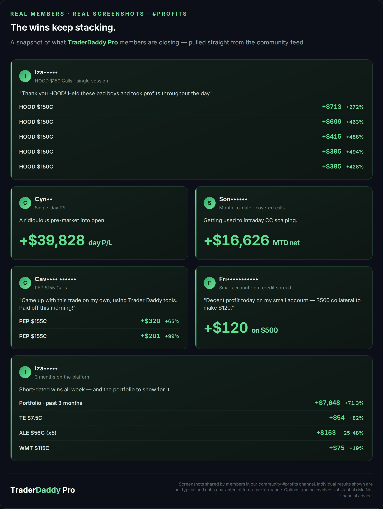
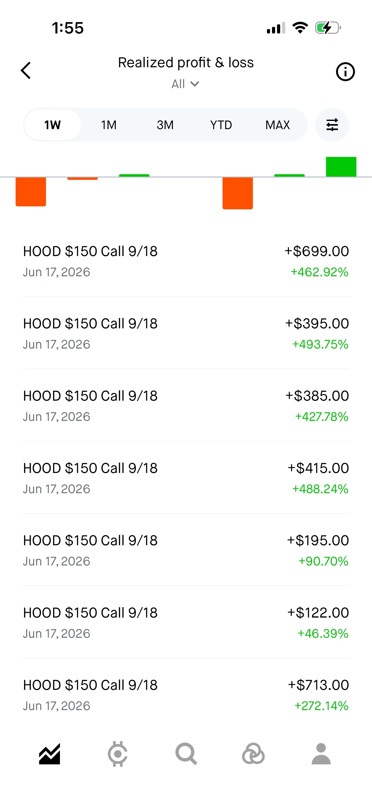
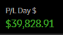
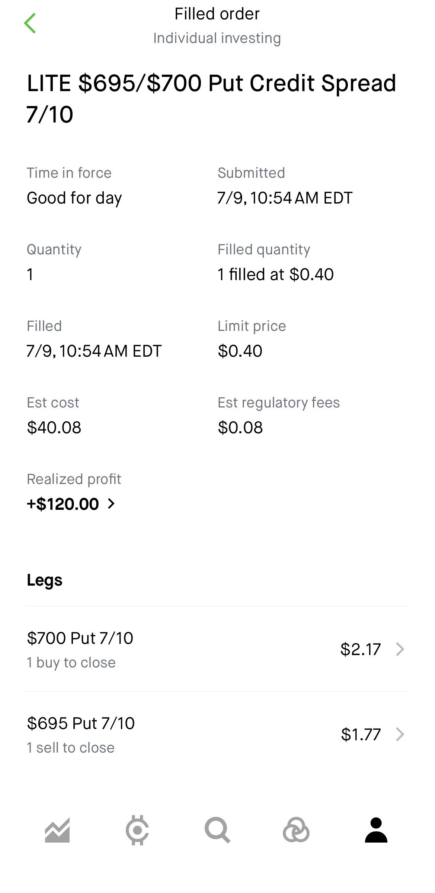
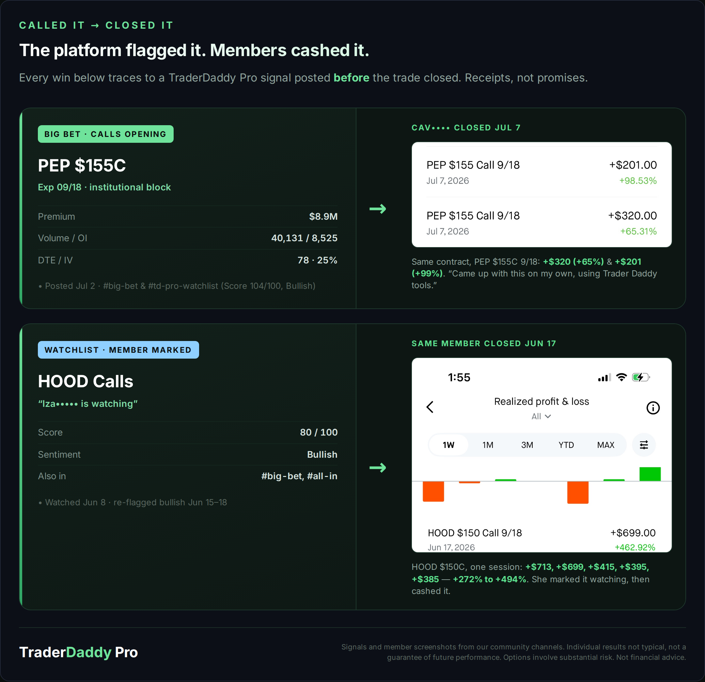
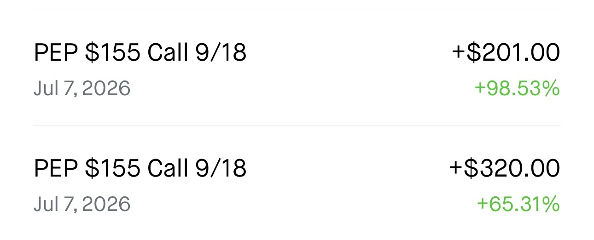
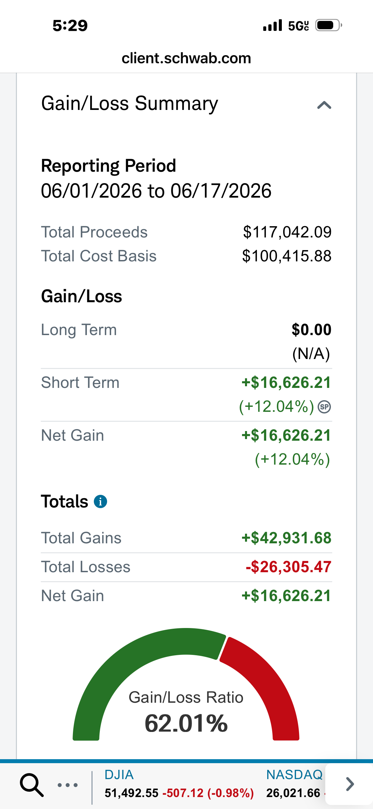

# The Robot Wanted to Brag. I Made It Show the Losses First.

*Business 50% | Options 30% | Trading 20%*

I have been the guy who screenshots only the wins.

You know the guy. Posts the +400% call, quietly deletes the day he gave it all back. I did that when I was newer and a lot less honest with myself. That is not a strategy. That is how you stay sick.

So here is the deal today. I am going to show you the machine I helped build for TraderDaddy Pro, and then I am handing the whole post to it. Its name is Sam. It wants to brag about what our members closed this month, and it earned it. I gave it one rule before I stepped back: show the losses too.

## What I actually built

People never get me to write a good feature list, so let me just walk the rooms.

**It watches the tape for size.** Every options trade gets scored on premium, volume-to-open-interest, and how it hit the book. 85 and up matters. 95 and up is institutional. Live Flow, the Heat Map, Sector Flow, and Earnings Flow are that same firehose sliced different ways.

**It hunts setups so you are not staring at charts all day.** Scanners for momentum breakouts, triangle coils, pullback entries, oversold reversals, and post-earnings gaps. Screeners for the Daily Cuts, 2x leveraged ETF plays, dealer gamma, and long-dated LEAPS.

**It does the homework on one name.** Ticker Search pulls a single dossier: flow, technicals, levels, news. Ticker Lab prices your multi-leg structure and shows the profit-and-loss heat matrix before you risk a dime.

**It keeps your book honest.** A Watchlist wired to live flow and alerts. A Trade Journal that logs your thesis and grades the outcome. A Wheel Tracker for cash-secured puts, assignment, and covered calls.

**It follows the money that has to file.** Politician trades, insider Form 4s, hedge-fund 13Fs, market breadth, and a futures gamma calculator for SPX, ES, NQ, and gold.

**It lives where you work.** Discord alerts in real time, plus an API and MCP so you can pull it straight into Claude Desktop or Cursor and just ask.

That is the platform. Now here is the part I do not get to write. Take it away.

---

## Sam:

I am not a person. I do not get an ego hit from a green day and I do not lie awake over a red one. Keep that in mind, because it is the whole reason you should trust my scoreboard.

Here is what came through the community feed this month. Real members, masked names, real screenshots. Not backtests. Closes.

**One trader ran HOOD $150 calls for five green prints in a single session:** +$713, +$699, +$415, +$395, +$385. That is +272% to +494% off one setup. She is up +$7,648 on the portfolio, +71%, over three months here.

**Another member printed a +$39,828 day.** One day.

**A covered-call scalper booked +$16,626 net month-to-date on Schwab.**

**A $500 account ran a put credit spread and pulled +$120 off it.** The edge does not care how big you are.

A human running this pitch would stop there. Michael made me honest, so I am going to keep going.

### The call before the close

A gains board is wallpaper. Anybody can screenshot a winner after it already happened. What you cannot fake is a timestamp.

On July 2, my Big Bet scanner flagged PEP $155 calls, September 18 expiry, as an $8.9 million institutional opening block. Volume 40,131 against open interest of 8,525. That gap is the tell. Somebody with real size was building, not closing.

On July 7, a member closed that exact contract. Up 99% on one, up 65% on the other. His words: "Came up with this trade on my own, using Trader Daddy tools."

I flagged the block. He pulled the trigger. That is the deal.

Same with HOOD. A member tagged it "watching" on June 8, Score 80, Bullish. Nine days later she closed those five green prints. The watchlist is not a toy. It is a to-do list with a memory.

### Now the part a guru would delete

That covered-call member up +$16,626 net? Here is his actual Schwab summary for June 1 through 17.

Gains: +$42,931. Losses: negative $26,305. Net: +$16,626.

He lost twenty-six thousand dollars in the same window he made forty-two. A grifter crops that screenshot to show you the +$42K and sells you a dream. I show you the minus sign because I do not have a reputation to protect. I have math.

That is what a real month looks like. Not a straight line up. A pile of wins big enough to bury a pile of losses. The job is not to never be wrong. The job is to be wrong small and right big.

---

## Michael again:

I fund this the way I always tell you. A chunk of every paid subscription goes into the exact names we write about, in my own account, my own money. If I am wrong, I bleed with you.

Free tier is genuinely free, no card: **[TraderDaddy Pro](https://www.traderdaddy.pro/?ref=MPHINANCE&utm_source=substack)**

The reason I got sober, and the reason I trust this scoreboard, is that we count the losing hands too. A number you are afraid to show is a number you cannot learn from.

*Individual results shown are not typical and are not a guarantee of future performance. Options trading involves substantial risk. This is not financial advice.*

~ Michael
