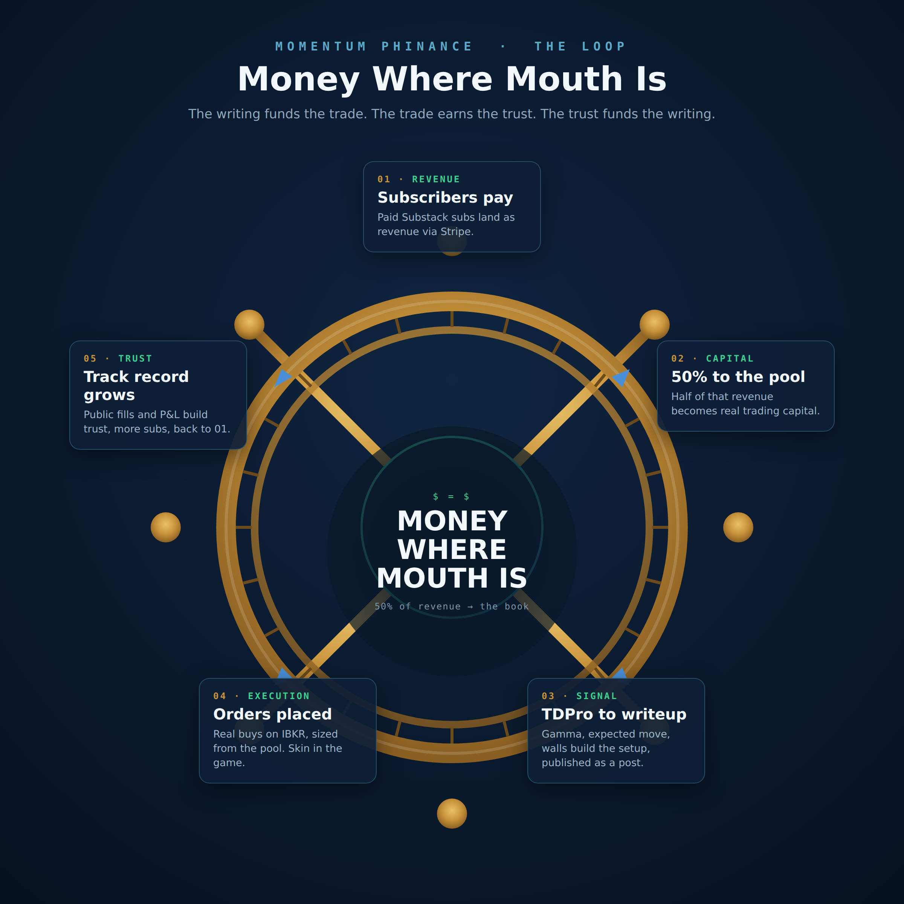
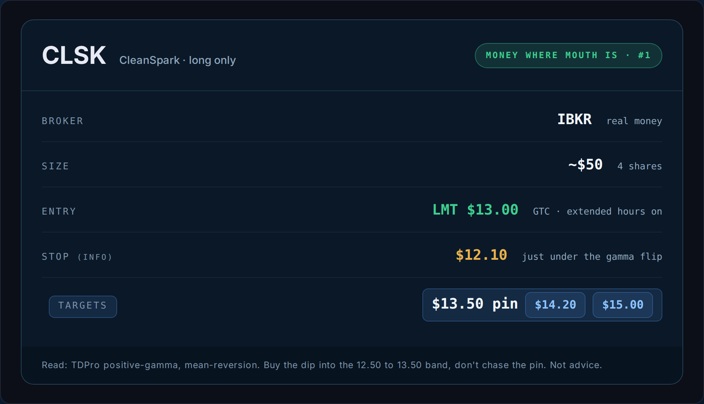

# Money Where My Mouth Is (I finally automated the part I always skip)

*Trading 55% | Mindset 45%*

I am good at the entry. I am bad at the finish.

CRWV is the receipt. I bought four shares at 88.49, it ran north of 20 percent, and I had the whole thing. Then I got busy. Life happened. I looked up a few weeks later and it was sitting at 80 and change, down 9 percent. Same brain that nailed the entry never came back to take the money. That is not a strategy problem. That is a me problem, and if you have read me for more than a week you know the finishing, the follow-up, the coming-back-around is the exact defect that runs through the rest of my life when I stop paying attention.

BABA is the other side of the same coin. One share at 97.93, it is 112 now, up 15 percent, and this time the process caught it instead of my memory. That is the whole point of what I am about to show you.

So I built the finish into the machine.

## The fix

News follows price. My follow-through now follows a file.

There is a process running that watches for a post in a specific format. When one goes out, it places the order. I do not have to remember, because remembering is the part I am bad at. The read on every pick comes from the tools I build at TraderDaddy Pro, the gamma, the expected move, the walls. The Substack post is the trigger. Publishing is the trade.

This is the first one, so we are doing it completely free and out in the open. Small size on purpose. It is a test, not a flex.

## The setup, CLSK

The TDPro read is a positive-gamma, mean-reversion regime. In plain speak, dealers are pinning the price toward the 13.50 wall, and there is a floor stacked at 12.47 to 12.50 where the gamma flips. Above that flip, dealers buy the dips right alongside you. Below it they step out of the way and it falls faster. So the plan is to buy a dip into the band, not chase the pin.

Where I am putting the limit, and why it is math and not a vibe. Spot is 13.62. The wall I am being pulled toward is 13.50. The floor that matters is the flip at 12.47. I want to buy in the middle of that band, above the flip so the dealers are still on my side. Halfway between the pin and the floor is basically 13.00. CLSK swings about 7 percent on an average day right now, so 13.00 is roughly two thirds of a single day's move below here. It fills on any normal red candle and it is still a real discount to the wall. Chasing 13.62 is paying up. Parking down at 12.60 might never fill. 13.00 is where the odds and the fill actually meet.

Here is the trade, exact.

The money is real and it comes from you. Half of what this newsletter earns goes straight into the account these trades run in. Not a demo. Not a screenshot from 2019. The exact shares.

## Full circle

Paid readers already see my book. Now you get to watch this one fill in real time, and I am going to come back down into the comments myself with a screenshot of the open order so there is nowhere to hide. If you want to go further than watching, mcp.mphinance.com lets you follow the book from your own tools, and I am seriously looking at letting people trade off it directly.

The writing funds the trade. The trade earns the trust. The trust funds the writing. That is the wheel, and now it actually turns on its own.

None of this is advice. It is four shares. It is me finally doing the part I always skip, out loud, where you can hold me to it.

~ Michael
