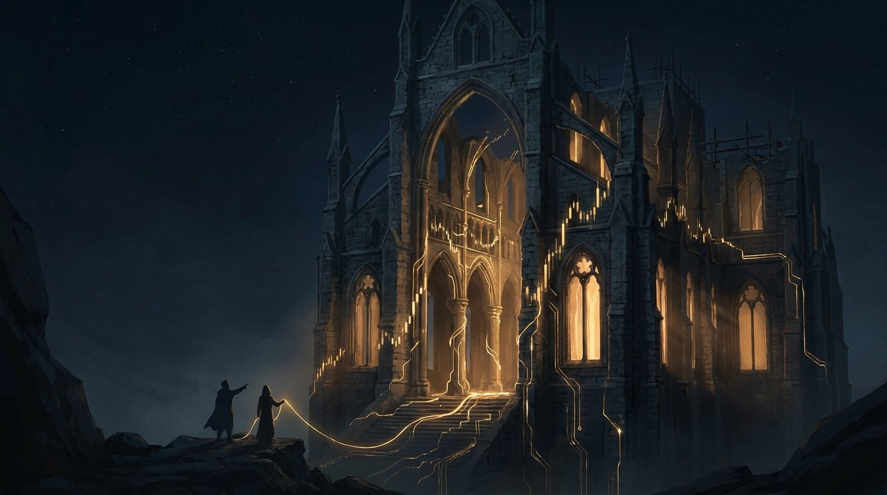
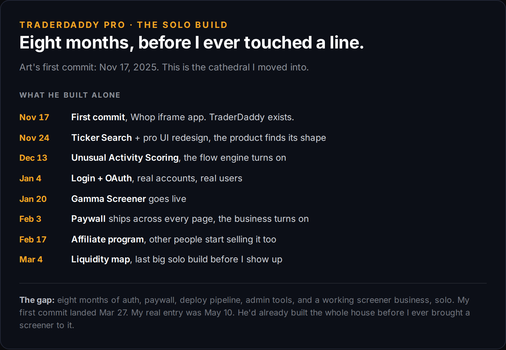
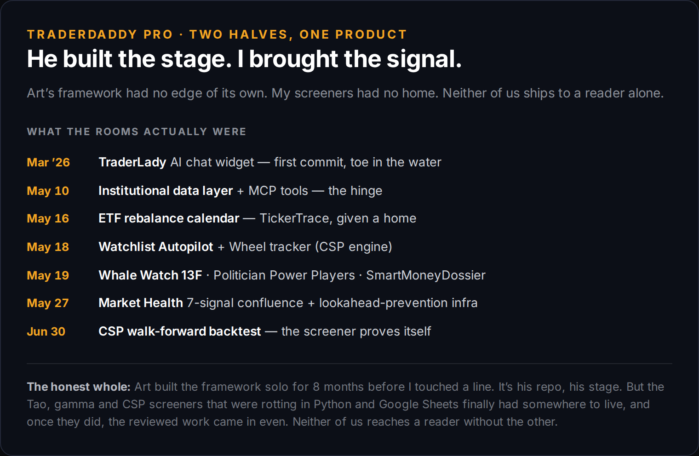

# My Best Screeners Were Dying in a Google Sheet

*Mindset 50% | Business 40% | Screening 10%*

Traders love to go it alone. So do software people. So does anybody who ever got a little good at something and decided they didn't need help.

I know the type because I am the type. My whole edge, the screeners I actually trust, lived in a Google Sheet and a pile of Python nobody could see. Tao. Gamma. Cash-secured puts. Real logic, real signal, and a total dead end.

## The thing that made me build in the first place

For a long time I followed a writer called theBoldUX. Great data. High-yield ETF flows, holdings changes, the stuff that actually moves. I loved it.

I did not love how it arrived. Everything buried in a locked Google Sheet, columns hidden, no way to do anything with it but stare.

So I did what the go-it-alone type always does. I built my own. Scrapers, my own feeds, my own version of the flow I wanted. That became TickerTrace, and it's still free, because the whole point was to not do to people what that Sheet did to me.

Here's where the story is supposed to end with me winning. It didn't. I just moved my data from his hidden Sheet to my hidden Sheet. Same trap, nicer walls.

## Then someone handed me a stage

TraderDaddy is Art's. Artur Vorojeykin. He started it in November, built the whole framework solo for eight months before I ever touched a line of it. The auth, the deploy, the display layer, the pipes. A cathedral, empty and waiting.

His framework had no edge of its own. My screeners had no home. Neither of us ships to a single reader alone.

I moved in. I built the rooms that were always meant to be mine.

Whale Watch pulling 13F filings. Politician Power Players. The SmartMoneyDossier. Market Health running seven signals at once. The wheel tracker with a cash-secured-put picker that actually scores strikes. The CSP walk-forward backtest, so the screener has to prove itself instead of just sounding smart.

Every one of those started as a tab in a spreadsheet only I could open. Now they're a product other people use.

## A screener is not a product

A screener finds names. That's it. It cannot onboard a user, take a payment, survive a deploy, or render on a phone at 6am. Mine never could have, no matter how good the logic got.

I spent years thinking the signal was the whole game. The signal is maybe a third of it. The rest is the boring cathedral somebody else already built, and the humility to go live in it instead of starting your own from scratch out of pride.

That last part is the one that got me. Going it alone isn't strength. For me it was always the character defect wearing a strength costume.

## Behind the paywall

For paid readers I'll walk the actual CSP screener: how it scores strikes above cost basis, how the walk-forward backtest keeps it honest, and the three names it's flagging into this week. The same logic that was rotting in a Sheet, now doing real work.

The tools are the edge. Half of every paid subscription buys the exact names these screeners surface, in my own account. Skin in the game, not a course.

## The part the program taught me first

They tell you early in recovery that you cannot think your way out of it alone. The mind that got you here is not going to get you out by itself. You need other people, and you need to actually let them in.

I fought that for years at meetings and I fought it again in code. Same defect, different room. My best work stayed invisible because I was too self-sufficient to put it somewhere that wasn't mine.

Art built the stage. I brought the signal. The commits will mostly wear his name, and that's fine, because the seam between our work stopped mattering the day the thing started helping people.

Nobody builds the whole thing alone. Not the sober part, not the trading part, not the business part. Go find your cathedral.

~ Michael
