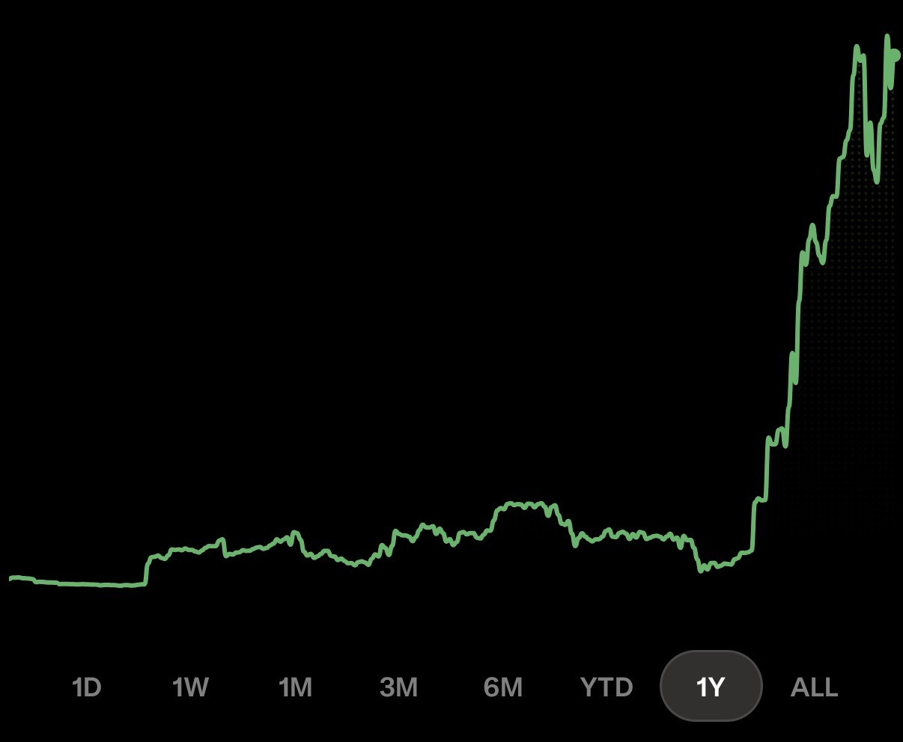
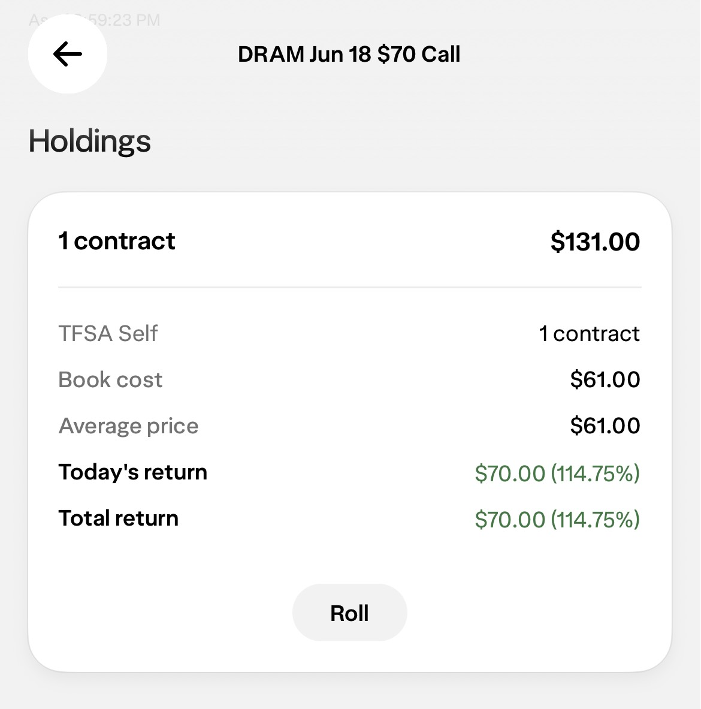

# The Cathedral and the Collaborator

*Mindset 45% | Business 45% | Screening 10%*

Traders love to go it alone. So do software people. So does anybody who ever got a little good at something and decided they didn't need help.

I know the type because I am the type. My whole edge, the screeners I actually trust, lived in a Google Sheet and a pile of Python nobody could see. Tao. Gamma. Cash-secured puts. Real logic, real signal, and a total dead end.

## Then someone handed me a stage

TraderDaddy is Art's. He started it in November and built the whole framework solo for eight months before I ever touched a line of it. The auth, the deploy, the display layer, the pipes. A cathedral, empty and waiting.

His framework had no edge of its own. My screeners had no home. Neither of us ships to a single reader alone.

I moved in. I built the rooms that were always meant to be mine. Whale Watch pulling 13F filings. Politician Power Players. The SmartMoneyDossier. Market Health running seven signals at once. The wheel tracker with a cash-secured-put picker that actually scores strikes. The CSP walk-forward backtest, so the screener has to prove itself instead of just sounding smart.

Every one of those started as a tab in a spreadsheet only I could open. Now they're a product other people use.

## A screener is not a product

A screener finds names. That's it. It cannot onboard a user, take a payment, survive a deploy, or render on a phone at 6am. Mine never could have, no matter how good the logic got.

I spent years thinking the signal was the whole game. The signal is maybe a third of it. The rest is the boring cathedral somebody else already built, and the humility to go live in it instead of starting your own from scratch out of pride.

That last part is the one that got me. Going it alone isn't strength. For me it was always the character defect wearing a strength costume.

## Two writers, one subscription

Here's the part that's new, and it's the reason I finally dug this piece back out.

Art is now a collaborator on Momentum Phinance. Same publication you're reading right now. That means you get two writers for the price of one.

He builds the machine, I read the tape. Different brains, different failure modes, one feed. When I'm wrong about a setup, there's now a second person on the byline whose whole instinct is to check the plumbing before we ship anything to you. That's not a downgrade in signal. That's a second set of eyes I used to be too self-sufficient to allow.

## The leverage part

Now the honest business part, and it's not really about money. It's about leverage.

When I write a post here, I help the people who read it. That's one-to-one, and it's slow. When I build a screener inside TraderDaddy, I help every trader who touches it, every session, whether or not they ever read a word I wrote. Same hours out of my day, wildly more reach. For the first time my work helps more people than I could ever reach one reader at a time. That's the whole reason to point more of my week at it.

And the proof isn't my P&L. It's theirs. People I've never placed a trade for, using tools I built, posting their own receipts. Names blurred, because this is their money, not a marketing prop.

One of them posted an account curve with a single caption:

*"Can anyone guess when I started up with TDPro?"*

You can see the exact day in the chart. You don't need me to point at it.

Another summed up the whole pitch in five words:

*"One trade pays for the subscription itself."*

A trader three months in: *"up 53% overall in the last month of using TD Pro."* Another, on a small account: *"$500 collateral to make $120."* One who runs the flow scanner: *"following the big dogs, another day in profit... 22.6% return for a 32 minute hold."* My favorite line came from a member who called the tools *"a light illuminating what was previously dark."*

That's leverage I can feel good about. Helping more traders and building a business are finally the same move instead of opposite ones.

TDPro's growth is starting to outrun everything else I touch, and I'm not going to be sentimental about that. So both of us are pointing more of our week at it. That's not a retreat from Substack. The bet is the opposite: two writers plus a product that's actually helping people should pull more readers back here, not fewer.

I'm naturally bad at time management. Always have been. So I did the thing I do with trades. I stopped trusting my gut about where my hours should go and let the data tell me. I put my attention where the growth is steepest, and right now that arrow points at TDPro. That's not discipline. That's me admitting I don't have the discipline and building a rule that doesn't need it.

## And a second publication

I'm also starting a second Substack. It's called *Compounding Subscribers*, and the one-line pitch is exactly the problem I keep running into:

*Substack has more creators than readers. Let's fix your side of that.*

Part of it is selfish. A second publication is another door back to me, another way readers find the trading work. I'm not going to pretend otherwise. But the bigger reason is that the creators-outnumber-readers thing is a real problem, and I've spent a year quietly solving it for my own account. Might as well write down what worked.

## The part the program taught me first

They tell you early in recovery that you cannot think your way out of it alone. The mind that got you here is not going to get you out by itself. You need other people, and you need to actually let them in.

I fought that for years at meetings and I fought it again in code. Same defect, different room. My best work stayed invisible because I was too self-sufficient to put it somewhere that wasn't mine.

Art built the stage. I brought the signal. Now his name sits next to mine on the writing too, and the seam between our work stopped mattering the day the thing started helping people.

Nobody builds the whole thing alone. Not the sober part, not the trading part, not the business part. Go find your cathedral.

The tools those members are using: [TraderDaddy Pro](https://www.traderdaddy.pro/?ref=MPHINANCE&utm_source=substack).

~ Michael
