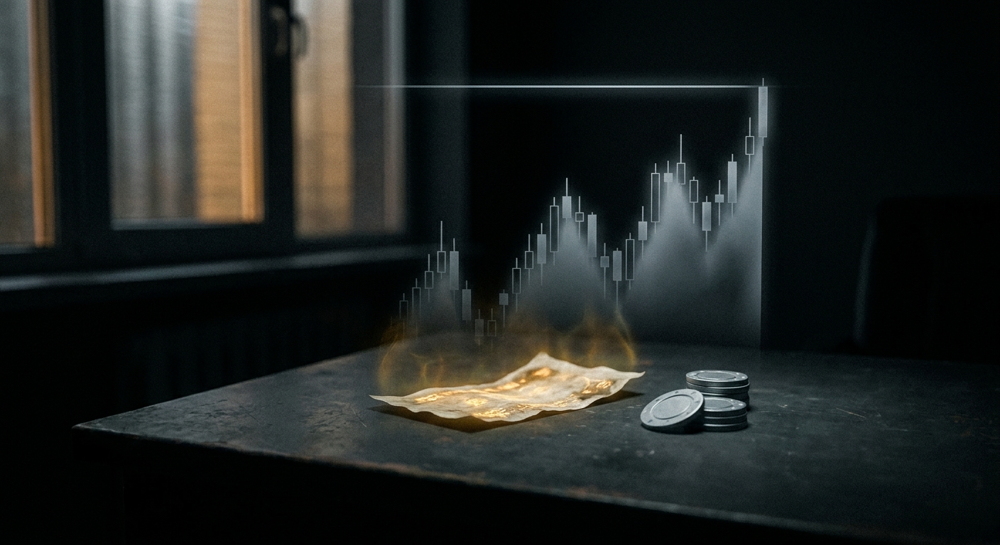
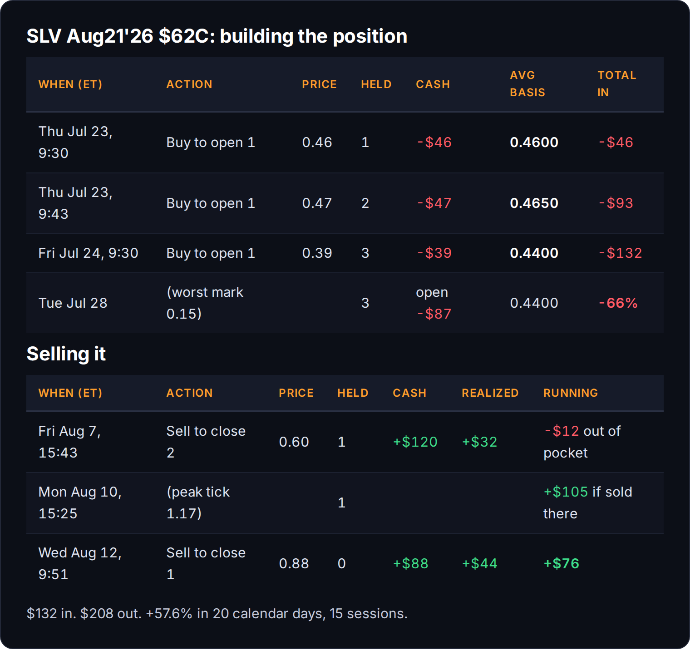
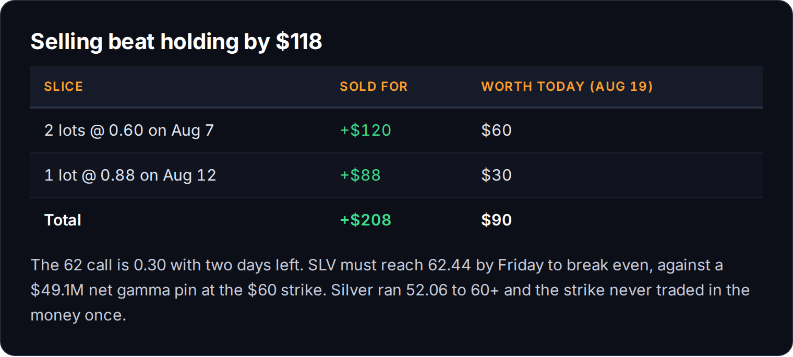
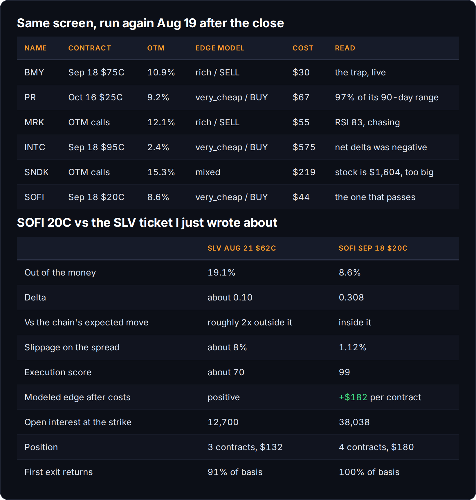

# Silver Ran 15%. My Strike Never Hit. I Made 57.6%.

*Options 50% | Trading 30% | Mindset 20%*



If you normally read these in email, open this one in the app or a browser. There are a few tables in here and your inbox is going to butcher them.

Chad, who reads this thing and once built the intraday reversals guide I published here, looked at the tooling I'd been showing off and dared me to go point it at something and make real money. Actual money. The kind with a comma.

I didn't have the cash for that and I didn't have the time. What I had was $232 in the only account I'm approved for options in, and a plane ticket. So I did the realistic version of the dare instead: I put $132 on one idea and wrote down how I was getting out before I got in.

That second part is going to matter a lot more than it sounds like it should. But we'll get to that.

Twenty days later I closed it at **+57.6%**. That's 76/132, and it is also seventy six dollars, so nobody is buying a boat. Silver went up more than 15% while I held it and my strike never traded in the money for a single minute. Both of those sentences are true, and the second one is the whole lesson.

## 🔎 The screen, and the trap sitting inside it

The plan was the dumb one. Find the cheapest far out-of-the-money calls the unusual-flow screen can cough up, buy a fistful, pray. The screen itself is honest enough: when today's volume on a deep OTM contract is bigger than its open interest, somebody is opening a fresh bet rather than closing an old one. Fresh lotto tickets, flagged automatically.

Then we priced every candidate through the edge model, which measures each contract's implied volatility against a fair-value surface built from the rest of that chain, and the whole picture flipped. Nearly every crowded, cheap, far-OTM call came back tagged **very_rich, edge direction SELL**. The 42 cent lotto with 11,000 contracts of open interest that everybody piles into is the one the pros are perfectly happy to keep selling you.

That is the structural reason the "just buy cheap calls" gospel is bullsh*t. You are not finding a mispricing. You are paying the premium that the other side of the trade is thrilled to collect. A flow screener does not hand you a trade. It hands you a crowd.

One name came back where the flow, the edge model, the liquidity and the price all agreed: **SLV**, the silver ETF, August 21 expiry, the $62 strike. Positive modeled edge, roughly 8% spreads, 12,700 open interest with real volume trading on it, and it cost 65 cents.

## 💵 What I actually paid



Three lots across two mornings. Note lot 2. I paid a penny **more** thirteen minutes after lot 1, on a tape that was actively falling, which is exactly the sort of thing I'd flag if you sent it to me (and I would be insufferable about it, too). It's a $47 ticket so nobody died, but it raised my basis on chasing, which is a dumb reason. Lot 3 the next morning at 0.39 pulled the average back down: (46 + 47 + 39) / 3 = **$44 a contract**, or 0.44.

Final position: 3 contracts, $132 all in, strike sitting **19.1% out of the money** with silver at 52.06.

## 📉 Then the hole

Silver bottomed at 51.19 on the 28th and the contract traded down to 0.15. My $132 was worth $45. **Down 66%.**

There is nothing to do there. Nothing! That number is what "I'm willing to lose all of it" actually feels like a week after you say it confidently at 1am with the market closed and a beverage in hand, which is the exact conditions under which I have said most of the dumbest things I've ever said about money.

## 🎯 The exits, which were the entire trade

On July 27, before any of it worked, we wrote the ladder down: sell one at 0.88 for double, which recovers two thirds of the basis by itself, sell one at 1.32 for triple, let the last one run. That decision got made on a Sunday, by the version of me with no money on the line in that particular minute.

Then I went on vacation, and that is the actual reason this worked.

**August 7.** I was leaving. A 0.88 limit on two contracts had worked all day and the ask never got past 0.71, and I was not about to fly out holding three lottery tickets I couldn't watch. So I re-priced and sold **2 at 0.60** seventeen minutes before the bell. Pure cover-your-ass. Booked +$32, pulled **$120 of my $132 back out**, and made the last contract functionally free.

Then I set a good-til-cancelled order on the last one at 100% and got on a plane.

I want to be precise about that, because it would be very easy to write this paragraph as discipline. It wasn't. SLV closed 57.50 that day, its first confirmed close above the 56.37 resistance, and I sold into that breakout for reasons that had nothing to do with the breakout. My edge was a departure gate.

**August 10.** The contract printed **1.17** at 3:25pm. That was the top tick of the whole trade and I was not at a screen. Had I been, I'd like to think I'd have taken it. Cute, right? I've watched myself long enough to know what actually happens: 1.17 becomes "it's going to 1.30," and 1.30 becomes 0.30.

**August 12.** Silver gapped up and my resting order filled at **0.88** at 9:51am, exactly +100%, without me. The mark fifty minutes later was 0.895 and the day faded from there. I got filled within a penny and a half of that morning's high by a limit order I'd typed four days earlier and then forgotten about in another time zone.

$132 in, $208 out, **+$76**, twenty calendar days.

## 🧊 The part that should bother you



That same 62 call is worth 30 cents as I write this, two days from expiry, with silver at 60.01. It needs **62.44 by Friday** just to break even, and it's currently pinned to a $49 million net gamma wall at the $60 strike in a regime that specifically damps moves like that. Those contracts are going to zero.

Holding all three would have left me **$90**. Selling them got me **$208**. The exits were worth **$118 more** than simply being right.

And I was right. Silver ran from 52.06 to just over 60 while I owned this thing. A 15% move in a metals ETF in four weeks is enormous. **The 62 strike never traded in the money once.** Not for a minute, not on the best day.

Direction was correct and direction was not sufficient. When you buy a strike 19% away with 29 days on it, you never get paid for being right. You get paid for premium expansion, and premium expansion is something that happens to you briefly and then leaves.

## 🤖 The trade was fine. My tools lied.

Here's the confession part, since that's what you people actually show up for.

The position monitor I built read its quantity out of a JSON file I edit by hand, and it never once reconciled that file against my actual fills. So from August 7 onward it was reporting a three-contract position I no longer owned. It escalated at me that I'd given back "$151.50 of open profit in one session," when the real number on the position I actually held was $22.50. It told me the mark had traded above 0.88, "your only-ever exit number," fifty minutes **after** I had already filled at 0.88. And it warned me eleven separate times that I had set no exit plan, while I was in the middle of executing an exit plan.

Then on August 13 the OAuth token behind the scheduler expired, it screamed 401 errors into a thread nobody reads for 28 minutes, and went silent. I didn't notice, because the trade had closed the day before. That's not design, that's luck.

Oh, and my dashboard says this trade made $340. It made $76. One line of code decides debit versus credit off a field that Tastytrade returns **empty on every single option transaction I've made this year**, so it counted my three buys as income.

I built all of that. Me! A monitor that can't see your fills isn't a monitor, it's a mirror. It'll agree with whatever you typed in last, forever, in a confident voice.

Which is a long way of saying be careful whose dashboard you believe, including your own (especially your own), but I digress.

**[ PAYWALL GOES HERE ]**

## 💰 So I ran the same screen again tonight

Same filters, same edge model, tonight's tape, and I have $200 to put back to work. That budget matters more than it sounds like it should, and I'll get to why.



**BMY is the trap, live.** Somebody bought **16,007** September 18 $75 calls today against 1,914 of open interest, roughly 11% out of the money at 30 cents a pop. Exact shape of the SLV ticket. The edge model grades it **rich, direction SELL**. Healthcare was the strongest sector on the board, so the flow makes a nice story, and you are still buying at a price the model says favors the person selling it to you.

**PR (Permian Resources)** had the biggest print of the night, $2.74 million into one October strike, and the model actually likes the contract. I'm still not touching it, because PR closed at **97% of its 90-day range** with RSI 69. Buying that is buying a rip that already happened. Same for **MRK** at RSI 83. **SNDK** trades at $1,604, so one contract eats my whole account.

And I got the next one wrong in public, so here it is. **INTC** looked perfect: a 2.4% out-of-the-money strike bought twice in one session, $3.98 million, graded very_cheap with an execution score of 99. I had it written up. I was pleased with myself. Then I pulled the directional flow and INTC's **net delta for the day was minus 250,000** across 3,413 bullish prints and 3,839 bearish ones.

I'd found one loud buyer and mistaken him for the tape. That check took ninety seconds and it killed the whole thing. Do the ninety seconds.

## Now the budget problem, which is the actual lesson

Here is the thing nobody writes about small accounts. On a 30-day chain, on a stock that trades between $90 and $800, **every single contract priced under $70 is 25 to 30% out of the money.** INTC's only sub-$70 call is 29% out. MSTR's is worse.

So a $200 account doesn't get to choose the good option. The budget marches you straight into the far-out-of-the-money lottery ticket that the edge model says to sell, and then you tell yourself you picked it. I didn't pick the SLV 62 strike because it was good. I picked it because it was 65 cents.

The way out is not a better strike. It's a **cheaper stock.** Slightly out of the money on an $18 stock costs the same as hopelessly out of the money on a $95 one.

## The one that passes

**SOFI, September 18 expiry, $20 calls, 44 cents.** Four contracts, $180 all in. That is the whole account, which I would not do at any real size and am doing here because $180 is $180.

- Edge model: **very_cheap, direction BUY**, execution score **99**, slippage **1.12%**, modeled edge after costs of **$182 a contract**. That is the best execution on anything I priced tonight, INTC included.
- **8.6% out of the money** against SLV's 19.1%, and a **0.308 delta** against roughly 0.10. It moves when the stock moves.
- **38,038 open interest** at that strike. It's liquid enough to get out of in a hurry.
- Cumulative delta across the day was **+205,859** on 32,183 contracts, second-strongest bullish flow on the entire board.

Now look one strike higher. The **22 calls have 148,852 open interest at 15 cents.** That is where the crowd is. That's the ticket that fits everybody's budget, and it's the one I would have bought in July. The 20 strike is one strike less greedy and it's the one the model actually pays for.

**And it doesn't need a new high.** SOFI's 90-day high is 20.13. I priced the contract at that level two weeks out and it comes to about **86 cents**, which is essentially my first target. The trade works if the stock goes back to where it already was this quarter. The SLV trade needed 62 on something that topped at 60, and that difference is the whole post.

## Where I'm wrong

This is the part I like most, and I owe it to a level I didn't spot.

SOFI's 21 EMA is 17.85. The 34 EMA is 17.70. The 55 EMA is 17.63. The 50 SMA is 17.58. **Yesterday's low was 17.64.** Four moving averages and the most recent session low all sit inside a **27 cent band**, on a stock with a 73 cent ATR. That's less than half a day's range holding up the entire thesis.

Better than that, it already got tested. SOFI closed at 17.66 on Monday, right on the shelf, and today it turned and ran +4.3% off a 17.84 low. So this isn't a line I drew on a chart. It's a level the market checked one session ago and respected.

Which means being wrong is cheap and it's obvious. A daily close under 17.55 and there is nothing left to argue about.

Two things I don't love and won't hide. Today's +4.3% came on **0.9x relative volume**, which is a strong move nobody showed up for. And ADX is 14, meaning there is no trend here at all, just compression. That cuts both ways: the squeeze ratio is 0.82, which is coiled, and coiled things resolve in whichever direction they feel like.

**So that's the pretty picture. What follows is the ACTUAL trigger that will place the ACTUAL order.**

```
The trade rule for this post (LONG only):
Symbol: SOFI 2026-09-18 $20 CALL
Action: BUY TO OPEN
Broker: Tastytrade (real)
Size: 4 contracts, $180 total
Entry: LMT $0.45, GTC
Targets: premium 0.90 (sell 2, returns the entire $180 basis)
         premium 1.35 (sell 1)
         premium 1.80 (sell the last one)
Thesis kill: daily close below 17.55
Hard rule: flat by September 11. No holding into expiry week.
```

And if it dips in the morning, even better. A buy limit fills at your price **or lower**, so a soft open doesn't cost me the trade, it improves my basis on it. That is the entire argument for a resting order over a market order, and it's the opposite of what I did on lot 2 in July when I chased a falling tape for a penny more. Sitting still is a skill. I do not have it naturally.

All three targets go in as resting GTC orders the day the entry fills. Not watched for, not "I'll see how it acts." The SLV trade made money because both exits were sitting in the book before I needed them, and one of them filled while I was on a beach.

Four contracts instead of three for one reason. Selling two at 0.90 returns **$180 against a $180 basis**, which is the whole thing back. From that second onward I'm playing with the house's money and two free contracts, and every decision after that is easy because none of them can hurt me. On the silver trade the first exit recovered 91% of my basis and that remaining 9% was enough to make me twitchy about the last contract for five days.

Round numbers don't matter. Getting to zero risk in one order does.

This post has gotten insanely long, so I'll stop, but two housekeeping things. I'm not telling you to buy this and I could be wrong about all of it. I did about an hour of work on SOFI, most of it reading a flow feed and one edge model, and an hour is an hour. Do your own homework. And check the earnings date yourself before you copy any of it, because our calendar feed has lied to me before and I published it and then had to go delete the post. Learn from my public humiliation, it's free.

## 🍻 Anyway

Half of what this newsletter earns goes into the actual account these trades run in, which is why the sizes look small and real instead of round and fake. You're funding the machine, and you get to watch it be wrong in public.

The thing I keep coming back to on this one isn't the 57%. It's that both good decisions in this trade were made by a guy with no money on the line. One on a Sunday afternoon in July, one at an airport. The guy who was actually available on August 10, watching 1.17 print, would have held it to zero, and I know that because I've been him.

So the takeaway is not "have discipline." I don't especially! The takeaway is to arrange things so the version of you that panics never gets a vote. Write the ladder while you're bored. Put the orders in. Then go be somewhere else, ideally somewhere with bad wifi.

Chad, that's 57.6%. It's also seventy six dollars. Same trade.

~ Michael
