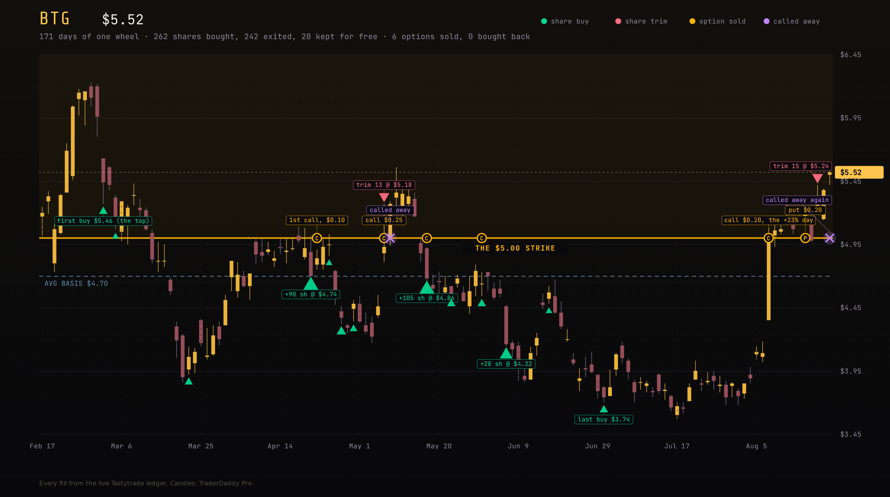
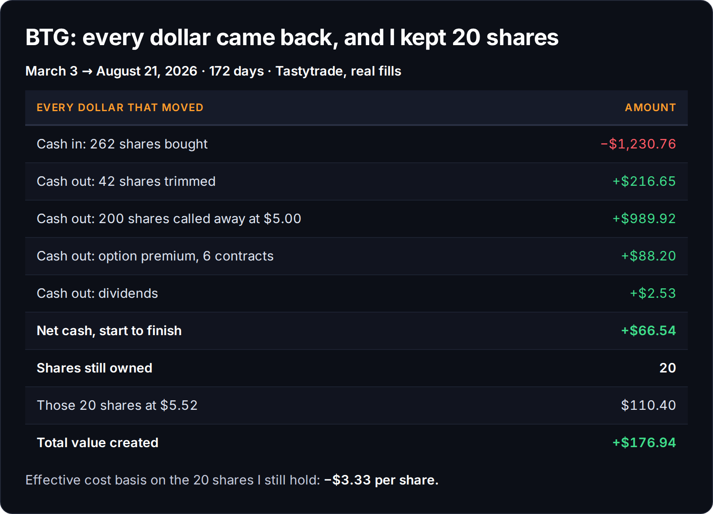
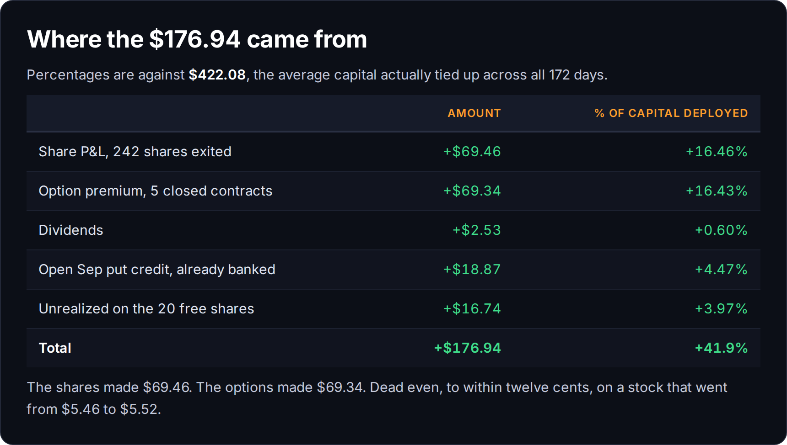
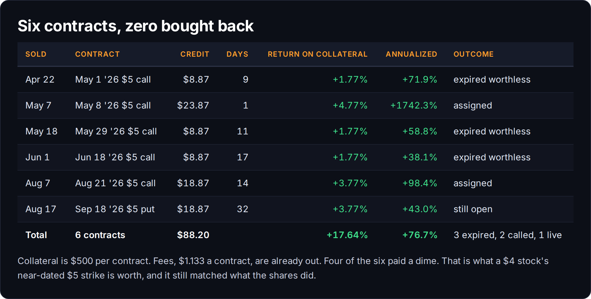
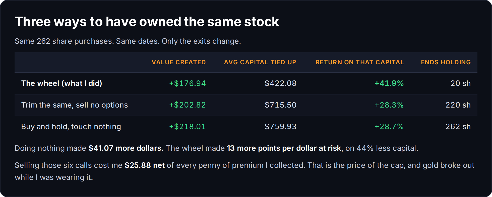
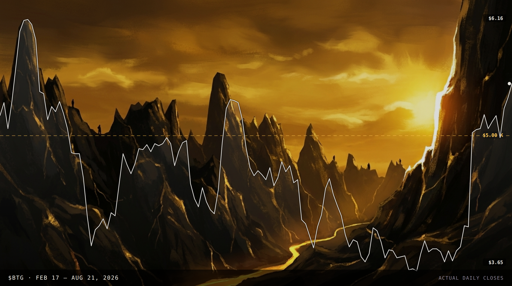

# The Wheel Paid For The Shares. Then Gold Broke Out Without Me.

*Trading 70% | Mindset 30%*

We recently started buying calculated long calls in the Momentum Phund. First one closed at 57%, the second is up 20% at today's close. That only started after seven months of doing the boring thing, which was the whole reason I started this publication: to prove a small account can wheel stocks properly and profitably.

Being directionally correct will net you profits almost every time. Always being right is impossible. Selling options gives you time working for you in free theta, and it lets you be directionally wrong for a while and still get paid for it. The side benefit nobody mentions is that you learn to *feel* how option prices move against a stock before you ever go leveraged long. Six months of selling premium is the cheapest tuition there is for buying it.

My first entry in $BTG was the first week of March. Worst timing possible, and it was also the most expensive share I would ever own. $5.4563. I have been knocking that basis down ever since.

Today the last hundred shares got called away and I am calling the trade done. Every dollar that ever went into it has come back out, plus change, and I still own twenty shares that cost me nothing.

## The receipts

That is the whole argument in one table. Cash in versus cash out. Not a percentage on a screenshot, not a broker's basis field, just money that left the account against money that came back. It came back, and there are twenty shares left over.

Effective basis on those twenty is negative three dollars and thirty three cents a share. They can go to zero and I still made money on them.

The line I like most is in the middle. The shares made $69.46. The options made $69.34. Twelve cents apart, on a stock that went from $5.46 to $5.52 and did absolutely nothing across five and a half months. Half of that return came out of a position that, on price alone, went nowhere.

Four of the six contracts paid a dime. That is not a failure of the strategy, that is the arithmetic of a four dollar stock with a five dollar strike. The wheel still matched what the shares did. It just had to turn six times to get there.

## Now the part where I tell on myself

I am not going to print the good numbers and skip the honest one.

If I had bought those same 262 shares on those same days and then gone outside, I would have $41 more than I have now. Not a fortune. But it is more, and anyone who tells you the wheel beats holding in a bull market is selling something.

What the wheel actually bought me was a smaller footprint. Buy and hold ties up $760 for five months. The wheel averaged $422 and made 41.9% on it against 28.7%. Thirteen more points per dollar at risk, on 44% less capital, in an account where capital is the scarce thing and always has been.

The cost of that is the cap, and I paid it in full this month. On August 7th BTG gapped twenty three percent in a single session on triple volume. I sold a $5 call into that day and collected twenty cents. Two weeks later the stock closed at $5.52 and my hundred shares went out the door at five even. Net of every penny of premium I collected across all six contracts, selling those calls cost me $25.88.

That is the trade. You rent out your upside and you collect rent whether the stock moves or not, and every so often the tenant buys the building out from under you. If that possibility makes you sick, do not sell covered calls. If a smaller position that pays you monthly is worth more to you than an occasional home run, this is your strategy, and now you know what the bill looks like.

## What it actually took

It was not clean. I sat through two separate drawdowns of more than twenty five percent to get here. March took it from $5.44 to $4.06 in three weeks. I averaged down. It recovered, got called away in May, I came right back in on the 18th at $4.86, and then June and July took it all the way to $3.65. I bought at $3.74 on the last day of June and it kept going lower for three more weeks.

At no point did any single exit make more than twelve percent. This was never a stock picking win. It was 242 shares grinding out about six percent apiece while the premium quietly matched them, and the only real skill involved was not selling at $3.65.

That is the part that does not fit on a screenshot. The wheel does not make a bad entry good. It makes a bad entry survivable, and survivable is most of the job.

*The cover art was painted from the actual price. That white line is BTG's daily closes from February through today, and the dashed gold line is the $5 strike I kept selling against. The valley in the middle is June and July.*

## What is still open

Short one BTG Sep 18 $5 put, $18.87 collected, with a good til cancelled buy to close resting at ten cents. If it expires worthless above five, that is free money against zero remaining cost. If BTG comes back under five I get put a hundred shares and the wheel starts over at an effective basis around $4.33, because the $66.54 already in my pocket comes off the top.

Either way the twenty shares stay. They are the only position I own that cannot lose me anything.

~ Michael

---

*I put half of everything this publication earns into the names I write about. I own the twenty shares. Nothing here is advice.*
