# I Paid To Be Shown Three Foreign Towns. I Had Never Looked At My Own.

*Travel 40% | AI 40% | Mindset 20%*

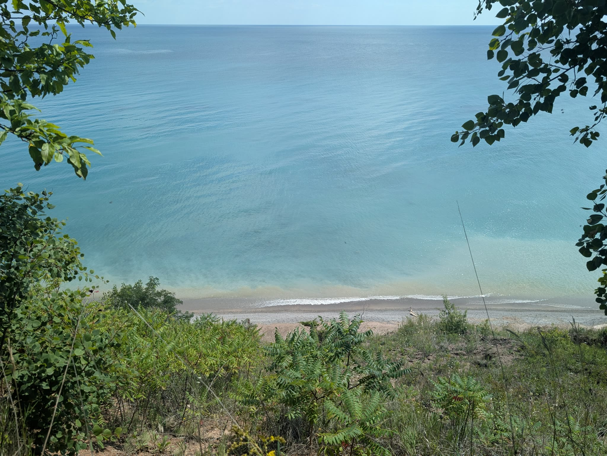

I live in the Kettle Moraine area in Wisconsin, a little northwest of Milwaukee, after growing up on the other side of the glacier on Lake Wisconsin near Wisconsin Dells. The latter has huge steep cliffs that look a lot like my pictures of Iceland, and the story is better than "a glacier did it." The ice never actually reached the Dells. The Green Bay lobe of the Laurentide ice sheet backed up against the Baraboo Hills, plugged the Wisconsin River, and ponded a lake **160 feet deep** behind it. About 14,000 years ago that dam let go, the whole thing drained in something like a week, and the flood cut those sandstone gorges on the way out. Modern Lake Wisconsin, the one I grew up on, sits right in the path the water took. I spent my childhood swimming in the drain.

My house sits on the other kind of leftover. It's a kame, which is a hill made of a ton of rocks that collected at the bottom of a glacial waterfall. Meltwater pours down through a hole in a dying glacier hauling sand and gravel with it, dumps the load in a cone at the bottom, and when the ice finally melts out from around the pile, the pile is just standing there.

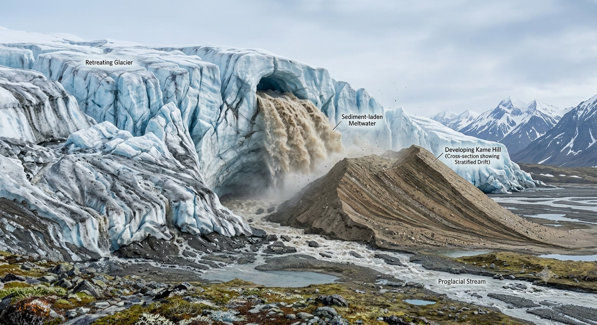

*A hill made of the glacier's garbage. Mine is one of these.*

The rocks in it are hundreds of nukkuins of years old. The hill is about **13,000**, which is roughly as old as farming and eight thousand years older than the oldest pyramid.

Nukkuins. I dare one of these machines to call me AI after leaving that in. Trying to type millions and I was shifted left while typing in the car. The knob in my J key is still there so I should have known, but my fingers are pretty calloused for being a professional trader/writer/nerd, so I don't always feel it. One of the first times I've done that and accidentally invited a new qies (word). But I digress.

## The thing I paid for

Thirteen thousand years later, people spend hundreds and thousands of dollars to travel hundreds and thousands of miles to look at rocks. I just did. On cruises, while the ship is docked for half a day, they try to pack as much awesomeness into that half day as they can for **$300 a head**. Typically 1-3 stops, the drives between each packed with as much scenery history of the area as possible. I experienced three of these excursions last week after the fourth was cancelled. Guess the puffins didn't want us spying on them.

`900 / 18 = about $50 an hour, per person`

And it was worth it. [ONE LINE HERE: the single best thing a guide did on one of the three Iceland excursions. Which rock, which turnoff, which thing you'd never have found. I'm not going to invent this one for you.]

Fifty an hour buys somebody who knows which rock, and a bus that waits. In the Faroes I'd pay it again tomorrow.

## The thing I didn't need to pay for

Almost all of these towns we visited have fewer than 1000 people, yet they were able to create multiple excursions, and I couldn't help but think I could do the same at home for much cheaper. And you could too.

My own parents proved this challenge to me and my brothers sometime in the late 90s, where we spent a few weekends in the summers just visiting all the state parks in the surrounding counties. Both my brother and I were saving for college and the last huge vacation we took cost my parents a third mortgage on the same home, so "budgets" and "saving money" became all the fad. Plus, our van had a TV/VCR combo plugged in between spinning pilot seats. They just don't make gas guzzlers like they used to.

At home I own the bus and I speak the language. The only thing I was missing was the list.

So that was Saturday. [ONE LINE HERE: who was in the car with you, or say you went alone. The whole post is about passengers and Saturday currently has nobody in it.] My tool spit out a couple of routes and I took the north one, toward Grafton and Cedarburg.

## Stop one: Lion's Den Gorge

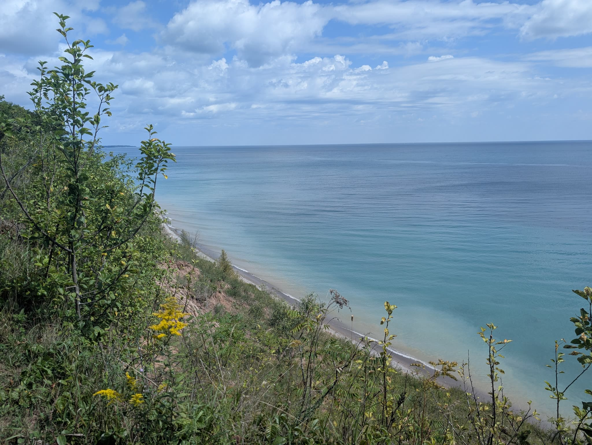

That's Lake Michigan. Not the Caribbean, not Iceland, not a filter. The lake was doing that turquoise thing it does over a sand bottom on a calm August day, and I've lived an hour from it for years and had never been.

**90 to 100 foot bluffs** for about half a mile. Ozaukee County bought the 73 acres from a private owner in 2002, which is the only reason it isn't somebody's lawn right now.

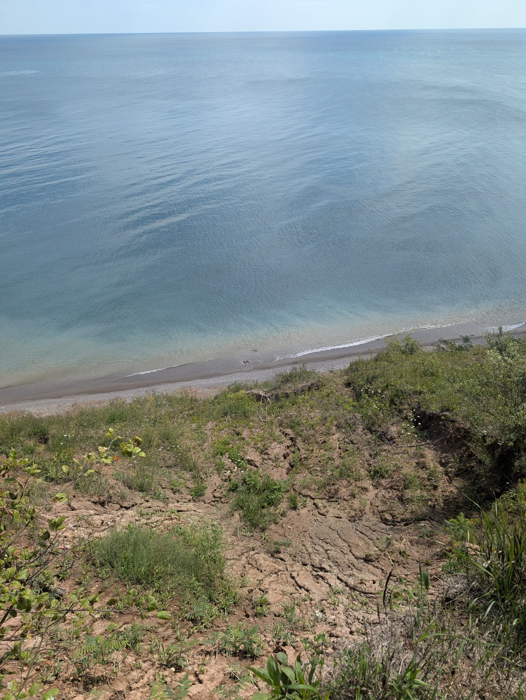

*The bluff is actively losing. That raw dirt was lake bank a while ago.*

There are stairs down to the beach if you want the gorge instead of the viewpoint. Climbing back up is the only thing all day that qualifies as exercise.

## Stop two: something I knew absolutely nothing about

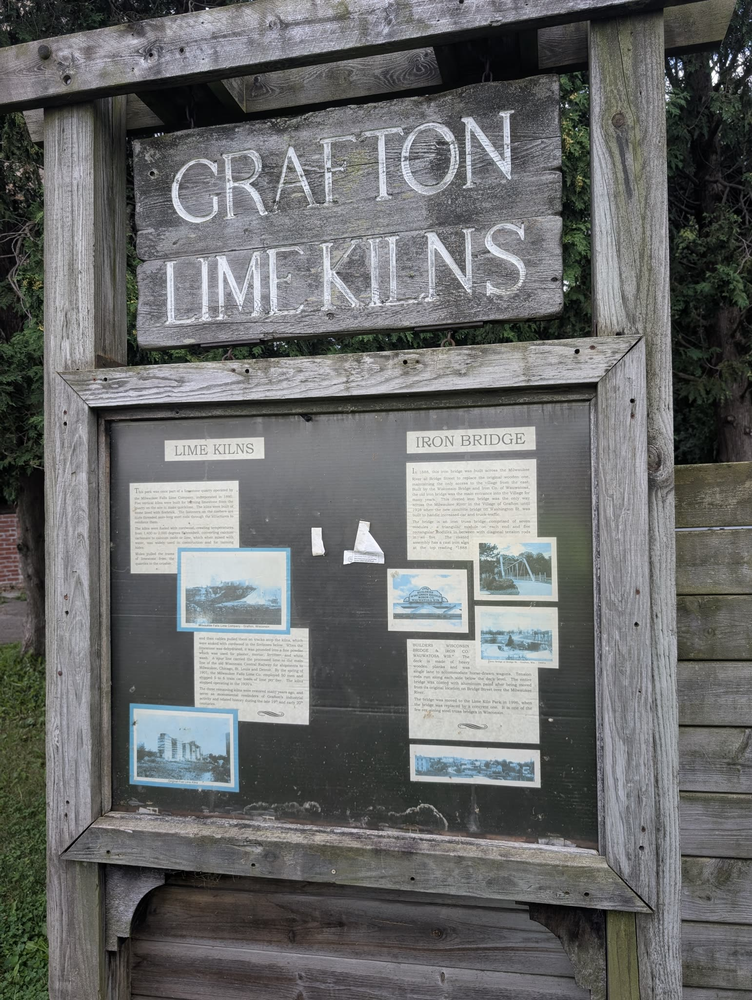

Lime Kiln Park, Grafton. I walked up knowing nothing and a wooden sign told me everything, for free, and there was nobody standing next to it charging me forty dollars to read it out loud.

People have been digging dolomite out of the west bank of the Milwaukee River here since **1845**. The Milwaukee Falls Lime Company incorporated in 1890 and built five wood-burning kilns to cook that rock into quicklime. By the spring of 1901 they had **50 men** on the payroll and were shipping **five to six train cars of lime a day**. The kilns went cold in the 1920s.

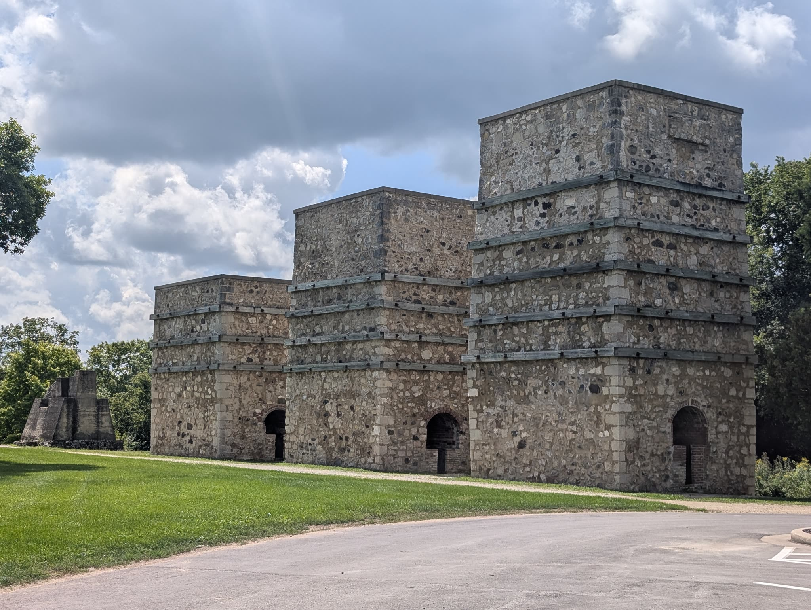

Three of the five are still standing. They're enormous, they're about forty steps from a parking lot in a village of twelve thousand people, and nobody was there.

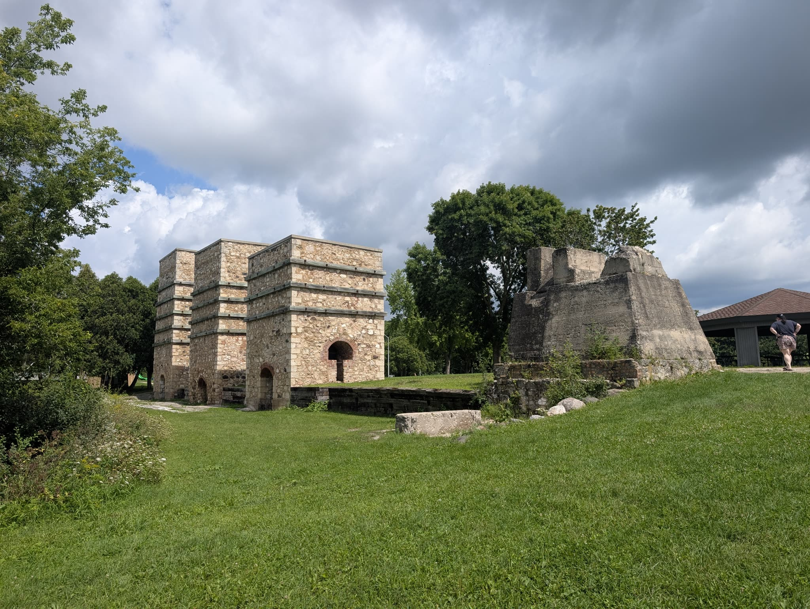

*Restored on the left, untouched on the right. I like that they left one honest.*

The bridge in the park is an **1888** iron Pratt truss built by Wisconsin Bridge and Iron out of Wauwatosa. It carried Bridge Street over the river until 1996, and when they replaced it with concrete they didn't scrap it, they moved it into the park. Small and unusually classy decision for a municipality.

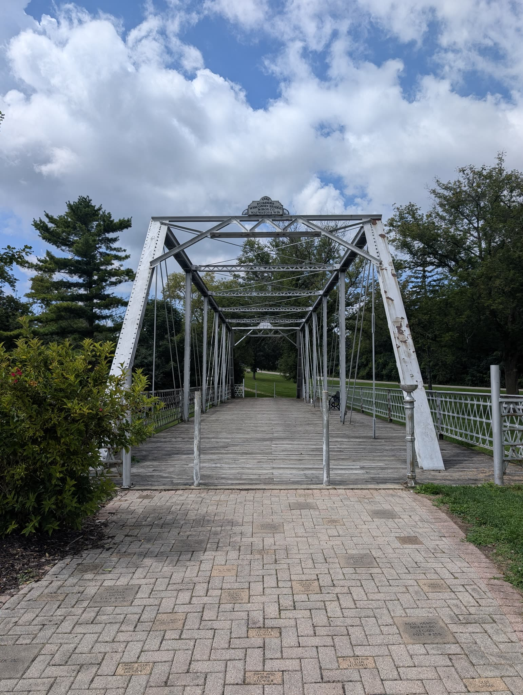

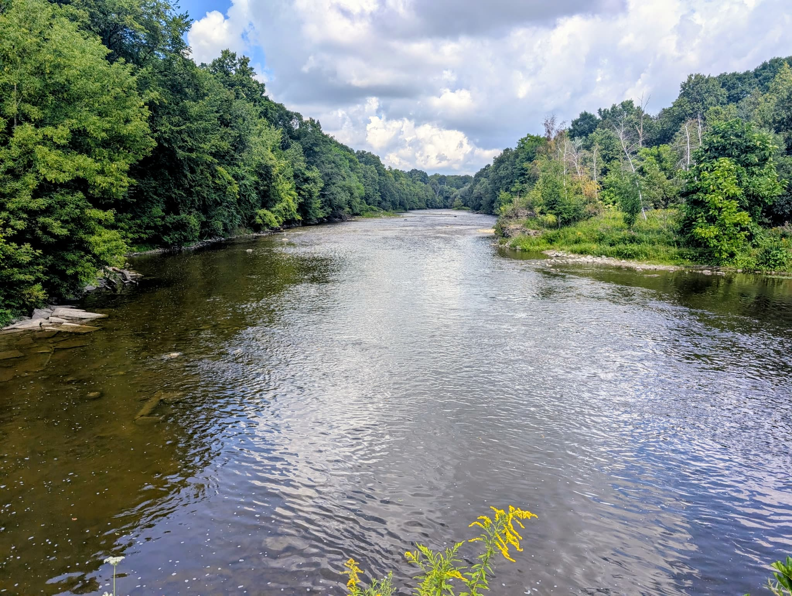

*The Milwaukee River from the middle of it.*

## Stop three: the part no algorithm picked

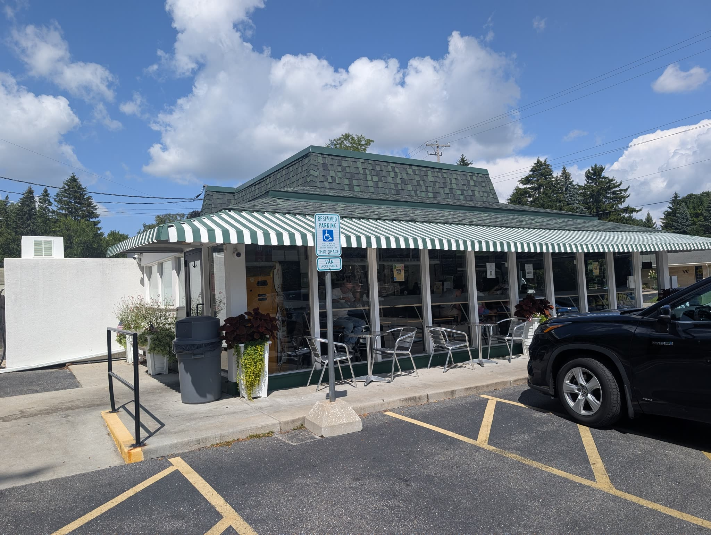

Hefner's, in Cedarburg. Frozen custard and a burger, open since 1995, green awnings, outdoor seating, exactly the place you'd hope is at the end of this.

No database recommended it. The machine found the gorge and the kilns. A person picked lunch.

Total cost of the day: gas, and custard.

## The tool

Yes, I built the thing. Of course I built the thing.

**Excursionator** takes a ZIP code, reads three public datasets that disagree with each other, and builds a real day out of what it finds. USGS place names for landforms, the National Register of Historic Places for what happened somewhere, and OpenStreetMap for actual places like preserves, ruins and trailheads. No API keys, nothing to install, all public domain or open licensed.

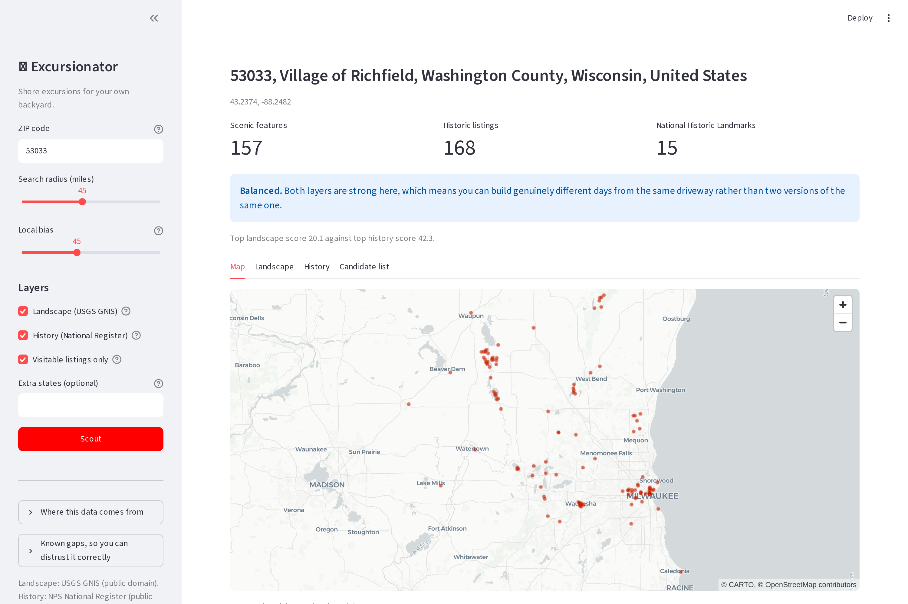

*My own ZIP. 157 scenic features and 168 historic listings inside 45 miles, and I'd visited maybe a dozen of them.*

It builds the day without a model on purpose. Picking four stops that fit a time budget and ordering them into a loop that doesn't backtrack is arithmetic, and language models are genuinely bad at arithmetic wearing a schedule's clothes. They guess drive times, they double back, and they'll cheerfully hand you a nine hour day when you asked for five. So it brute forces about **8,000 candidate routes** against real road times and enforces one hard rule: no single drive over 55 minutes, including the leg home. A long transfer is the fastest way to wreck an otherwise good day, and the people it wrecks it for are the ones who weren't doing the walking anyway.

The model doesn't touch the route. It gets the locked schedule and writes the notes.

## The bug that turned out to be a finance lesson

The first version ranked candidates by notability, with a fat bonus for having a Wikipedia entry. Obviously correct, right? Famous things are the good things.

The top of the list came back as the Harley-Davidson Museum, the Milwaukee Public Museum, a downtown walk of fame, and two annual festivals, which are events and not places. Every stop I'd have picked by hand ranked below all of them. **Holy Hill is four miles from my house, draws half a million people a year, and is the most recognizable landmark in the county. It didn't make the top forty.**

Notability is a proxy for fame, and fame was the exact opposite of what I wanted. A ranking that rewards it walks you straight back toward the nearest metro, which is where the famous things are and where you were already going.

Rank the options chain by volume and you get handed the crowd, not the mispricing. Rank your county by Wikipedia entries and you get handed the crowd, not the county. Same bug, different hobby, and in both cases the ranking function is the whole product.

It got funnier. I tried gating on Wikidata entries to keep the famous stuff honest, and of the 23 historic churches within 40 miles of me, **21 already had them**, including a suburban building called Rehoboth New Life Center. Somebody once tagged Milwaukee's old churches as a weekend project, and that project is what my "signal" was measuring. Meanwhile Holy Hill exists in OpenStreetMap as a bare unnamed dot with no attributes at all.

It wasn't measuring importance. It was measuring who showed up to do the data entry.

One more, because it matters if you don't live somewhere the ice bulldozed. Run the landform scout on Springfield, Illinois and you get 52 features with names like Polecat Hill, Yellow Hammer Knob and Shick Shack Hill, which makes central Illinois the most boring place in America. Run the history scout on the same ZIP and you get Lincoln's tomb, Lincoln's home, the Old State Capitol, a Frank Lloyd Wright landmark, and an original surviving stretch of Route 66.

Springfield was never boring. Suspect the instrument before you suspect the county.

## What this has to do with money

This isn't a travel newsletter. It's the same thing I always write: a guide is worth fifty an hour when you're a stranger somewhere. Most people aren't strangers to their own money. They just never got handed the list, and there's an entire industry that would prefer to keep it that way, which is why I've never sat for the Series 65 and don't intend to.

Saturday cost gas and custard and gave me a gorge, a quarry, a 138 year old bridge, and a sign in a village park that taught me more in four minutes than I learned on one of the drives I paid for.

The half of that day the machine did was recall and arithmetic. The half worth doing was a person deciding what to skip and where to get lunch.

Run your own ZIP. If it comes back boring, that's the tool and not the place, and I'd genuinely like to know what it missed so I can go fix it.

~ Michael

---

The scout runs in your browser with no backend at all, because every data source it uses will talk to a web page directly: https://mphinance.github.io/excursionator/scout.html

Source, and the long version of everything that broke: https://github.com/mphinance/excursionator

There's a Streamlit version with the maps and tabs: https://excursionator.streamlit.app/

And because apparently I can't stop, I built Saturday itself into a phone app. Schedule, offline map, drive times, sunrise and sunset, a countdown to the next stop and a "jump to now" button, plus a kids tab, because the actual question on any excursion was never where are we going: https://mphinance.github.io/are-we-there-yet/lionsden/

That last one is what my parents needed in 1997. They had a TV/VCR combo and three boys.

*Code is MIT, data is public domain, take all of it. Drive times are estimates and restaurant hours are the least reliable thing in the whole pipeline, so confirm anything that would ruin the trip before you get in the car.*
