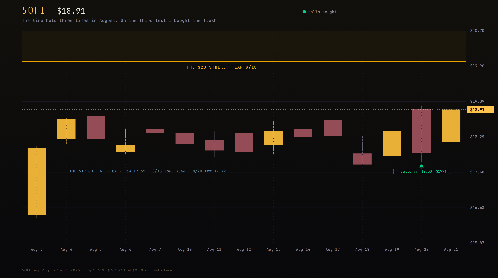
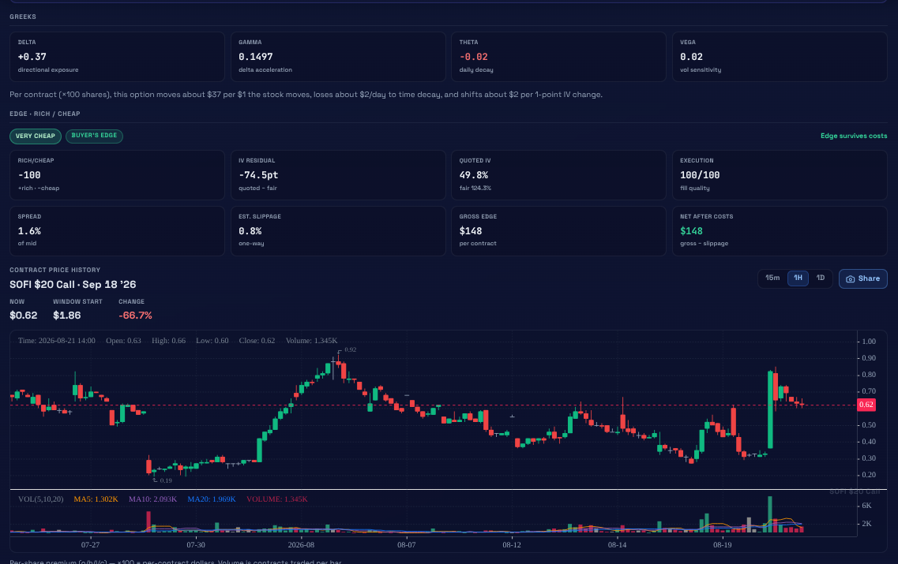
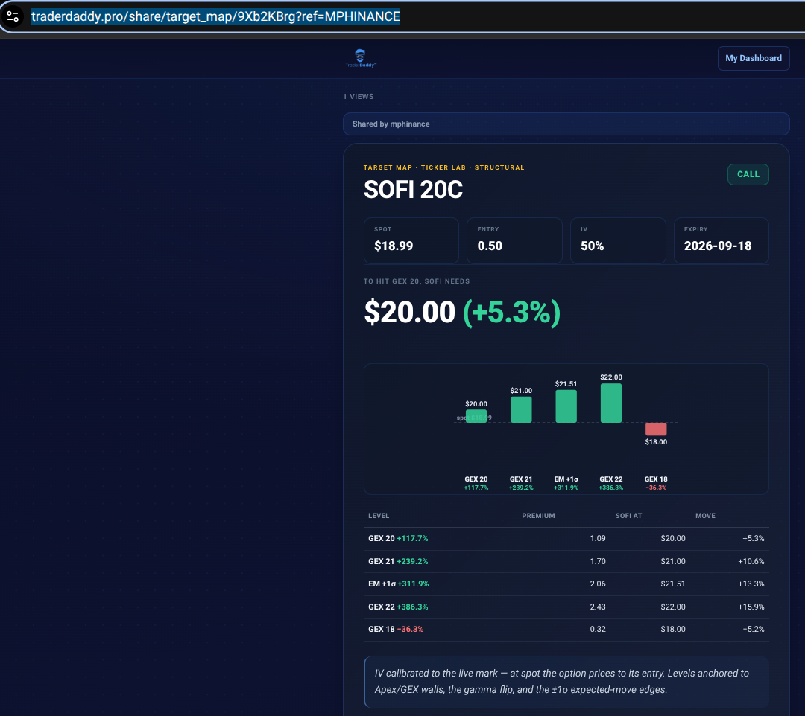
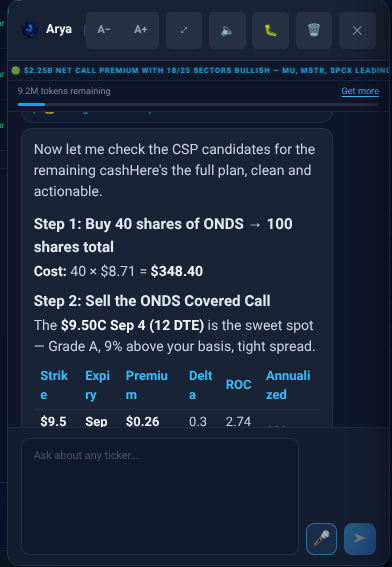
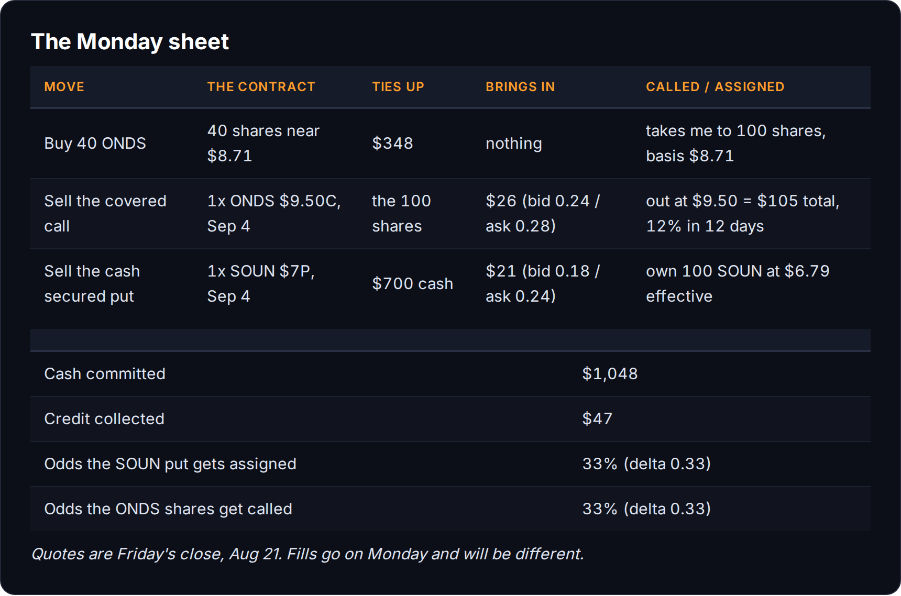

# I Drew A Line At $17.60. SOFI Tested It Three Times.

*Trading 80% | Mindset 20%*

There is a little over twelve hundred dollars sitting in cash in this account going into tomorrow, and it has been a long time since that sentence was true. For most of this year the account has been fully deployed in shares I was slowly renting out. Cash is the thing you never have when you want it and always have when there is nothing to buy.

So tomorrow I am buying.

## The second yolo, and the line it was built on

The second long call the paid side jumped into this week was SOFI $20 calls expiring September 18th. The first one of these closed at 57%. This is the second, and the two hundred dollars funding it is the same two hundred that came back out of the first one. That is the whole budget. It does not grow because I feel good, it grows because the last one worked.

The plan was to pay $0.45. SOFI opened green on Thursday and I got impatient, so the first two filled at $0.60. That is a real mistake and it is worth naming: I paid up 33% over my own number because the tape looked good for ninety minutes.

Then Thursday happened. SOFI opened at $18.92, ran to $19.00, and fell all the way to $17.72 with everything else. It stopped there. It stopped there because $17.60 is where it has stopped every single time since the August 3rd gap up, and I had written about that line and warned about it beforehand. So I bought the flush. One more at $0.45, a final one at $0.34.

Four contracts, $199 all in, average $0.4975. Friday it closed at $18.91 and the contract marked $0.62. Up about 25%.

That is the good news and it is the smaller half of the story.

## What the position actually needs

A long call is a rented opinion and the rent is due daily. This one bleeds about two dollars a contract per day, so eight dollars a day across the four of them. Sitting still is not neutral. Sitting still is a slow loss.

*This is the ticker lab in TD Pro, which is the software I build. Two numbers matter on that card. Delta says the contract moves $37 for every dollar SOFI moves. Theta says it loses $2 a day whether SOFI moves or not. That is the entire argument for and against owning it, and it is why I am not sitting on this thing for a month.*

If I hold these to expiry, SOFI has to close above $20.50 for me to make a dollar. That is 8.4% up from Friday in twenty six days. The options market's own expected move for that window is 8.5%. So a hold to expiry is a coin flip against a shot clock, which is a stupid way to own something.

Which is why I am not holding to expiry. $20 is the biggest gamma strike on the board and the single price dealers are most anchored to. Max pain is $19. If SOFI tags $20 in the next couple of weeks, TD Pro's target map puts the contract near $1.09, and that is a double on my basis without the stock ever having to close anywhere in particular. That is the trade. Not "SOFI goes up," but "SOFI touches a number that forty thousand contracts of open interest are already pinned to, and I leave."

*The target map, also mine. It does the one piece of arithmetic nobody does by hand: given where the gamma walls actually are, what is this contract worth at each of them. $20 pays 1.09. The 1 sigma edge at $21.51 pays 2.06. And it prints the downside in the same table, which is the part most tools quietly skip.*

[The live version of that map is here](https://www.traderdaddy.pro/share/target_map/9Xb2KBrg?ref=MPHINANCE) if you want to poke at it.

The downside is boring and total. If SOFI drifts sideways under $18.50 for three weeks, the $199 goes to something like sixty bucks and I will write that post too. Below $16.89 the gamma flips negative and the whole structure I am leaning on stops existing.

That is why it is a two hundred dollar position and not a two thousand dollar one. The wheel pays the bills. This is the part of the account that is allowed to be wrong.

**[ PAYWALL GOES HERE ]**

## Here is how I am spending your money

Two moves tomorrow. One of them is housekeeping and one of them is a new position.

I did not sit down with a chain and a spreadsheet for either of them. I opened Arya, the AI agent I built for TD Pro, told her what I had in cash and what position I wanted fixed, and did not name a single ticker. This is what came back.

*She did the whole thing in one pass: fix the odd lot, write the call against it, then go find a put for what is left over. Her $9.50 quote was $0.26. The live chain Friday was $0.24 bid, $0.28 ask. She is reading the same book I am, she just reads it faster than I do at nine on a Sunday night.*

I still checked every number. But checking someone's work is a different job than doing it, and it is the difference between this taking ten minutes and taking an hour.

### First, ONDS gets fixed

I own 60 shares of ONDS at $8.71 and 60 shares is a useless number. You cannot sell a covered call against it. It just sits there being a directional bet, which is not what this account is for.

So I am buying 40 more, near $8.71, which is roughly where it closed Friday. That is about $348 and it takes me to a round hundred with the same basis I already had. Then those shares go back to work.

The call Arya picked is the September 4th $9.50, twelve days out. It was $0.24 bid, $0.28 ask on Friday. Call it $26 for renting out my upside for twelve days.

Here is the part I like: the expected move for ONDS through September 4th is plus or minus $0.805, which puts the upper edge at $9.515. The $9.50 strike is sitting exactly on that edge. I am selling the top of the statistical range, not somewhere inside it.

Here is the part I do not like, and I wrote about this exact bill two days ago. The call wall is $10. Max pain is $9. If ONDS runs, the magnet above me is fifty cents above my strike and I will watch it get there without me. On Friday I published a post about BTG where selling calls cost me $25.88 in surrendered upside over five months, and here I am doing it again on purpose.

I am doing it on purpose because getting called at $9.50 pays me $105 on $871 of stock in twelve days. That is 12%. If I get "punished" with 12% in twelve days I will take the punishment every time. And if it does nothing, I keep the $26 and write another one. The only outcome I actually lose on is ONDS going to six, and I own that risk whether I sell the call or not.

### Second, a new cash secured put

For the seven hundred left over, Arya's answer was SOUN at $7 for September 4th.

SOUN closed at $7.32. The $7 put was $0.18 bid, $0.24 ask, so about $21 of credit against $700 of cash held aside. Three percent in twelve days on money that would otherwise sit there earning nothing.

The delta is 0.33, which is the honest number in the whole trade. One in three. This is not a lottery ticket sold to somebody who will never collect. Roughly a third of the time I end up owning a hundred shares of SOUN at an effective $6.79, and the expected move through September 4th has the low end at $6.825, so a single normal down week puts this in the money.

Which means the only question that matters is the one nobody asks before they sell a put: do I want to own it at $6.79? SOUN is below its 200 day. Its ninety day low is $5.65. So the honest answer is yes, but only at that price, and only because being assigned starts a wheel instead of ending a trade. If the answer had been no, the 3% would not have been worth typing.

## What that leaves

$1,048 committed and about $150 loose. Forty seven dollars of credit coming in tomorrow to sit against a $199 long call that is trying to be a double. One position going from a dead 60 shares to a hundred shares that pay rent.

That is not a heroic weekend of analysis. It is three small decisions with the odds written down next to each of them, which is the only version of this I know how to keep doing for years.

Keeping it short tonight. See you after the fills.

~ Michael

---

*I put half of everything this publication earns into the names I write about. I own SOFI calls and ONDS shares. Nothing here is advice.*
