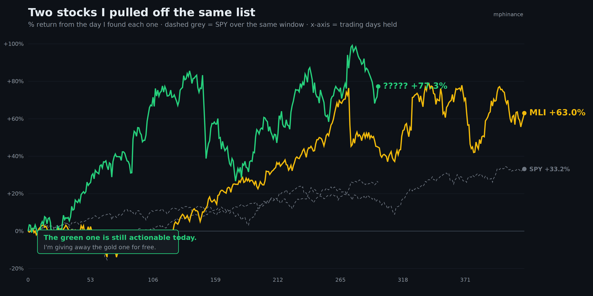
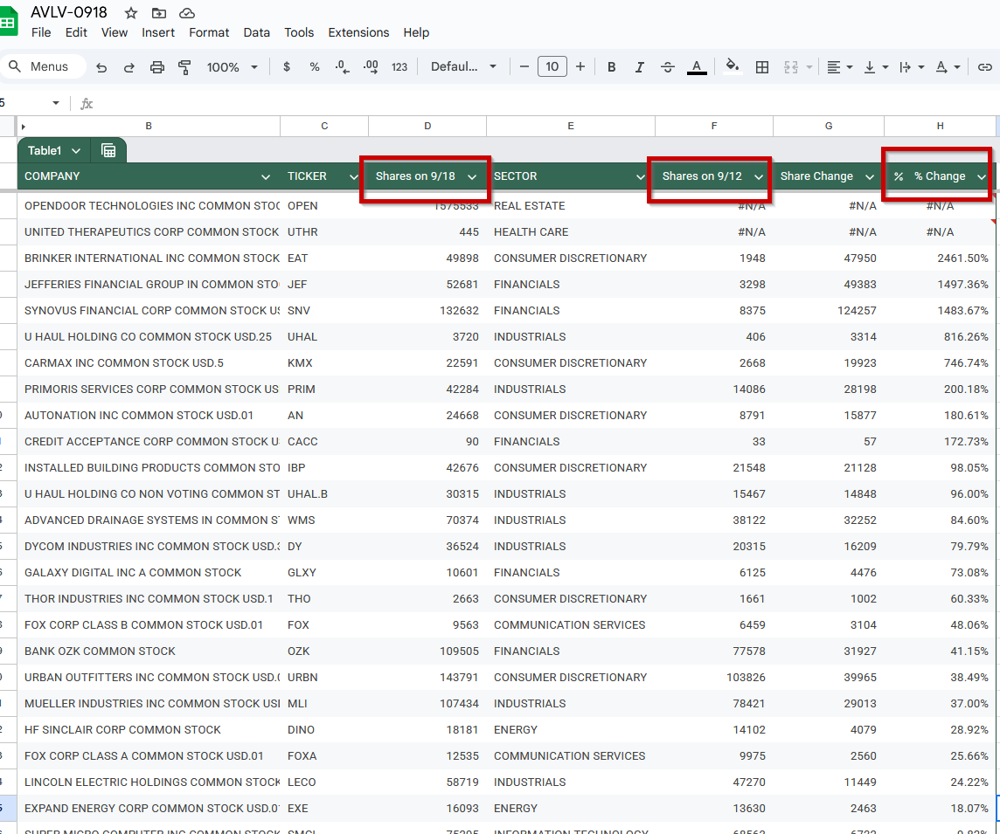
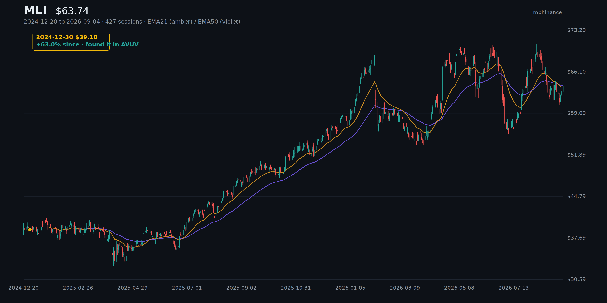
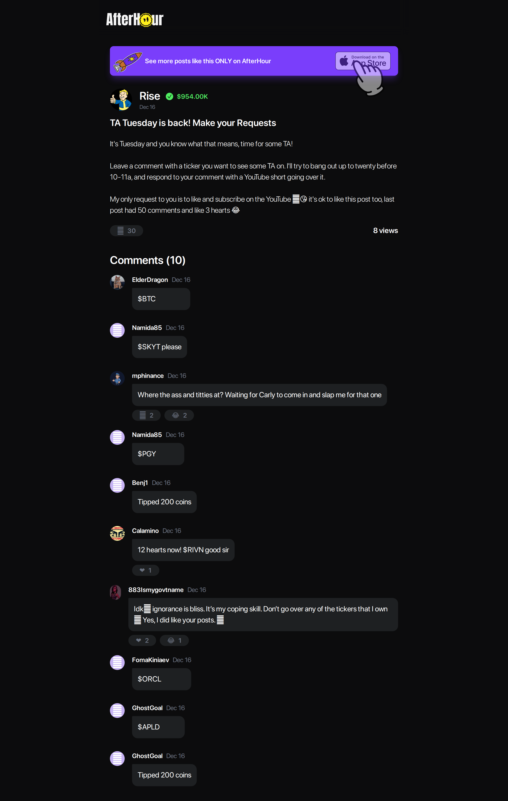
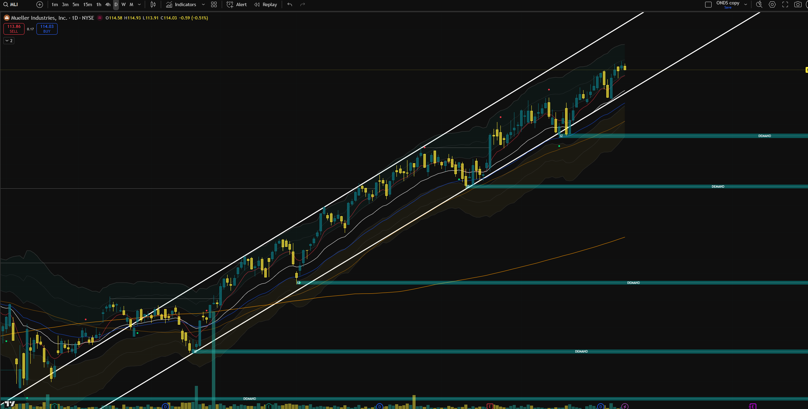
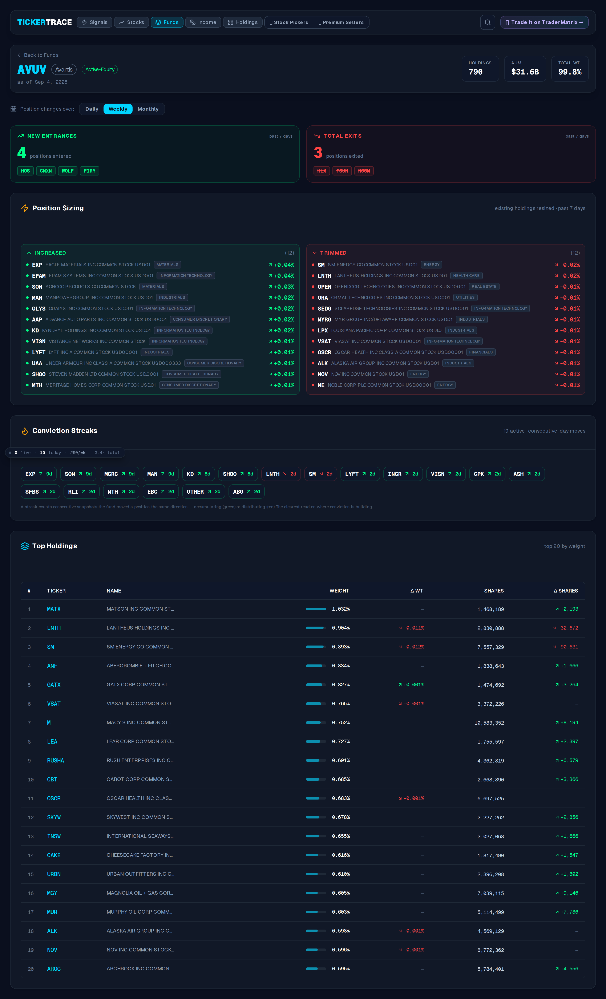
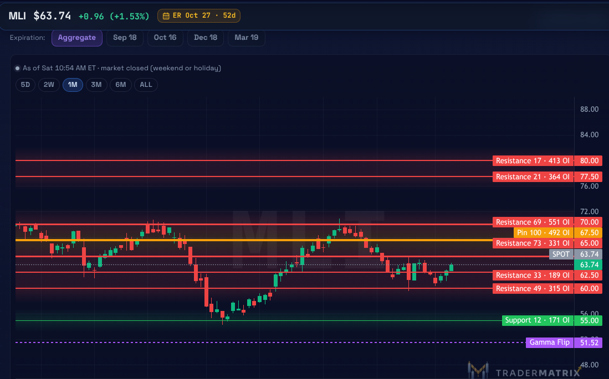
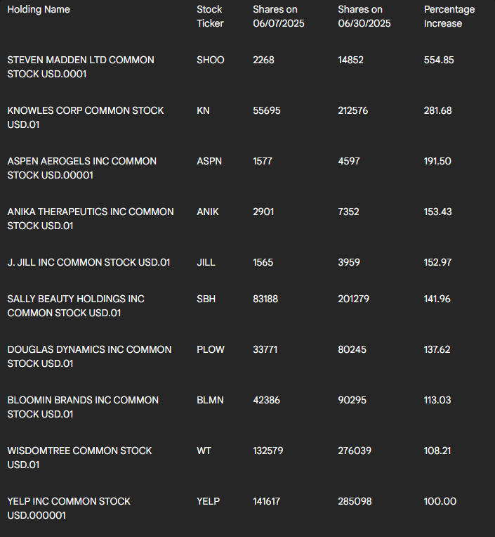
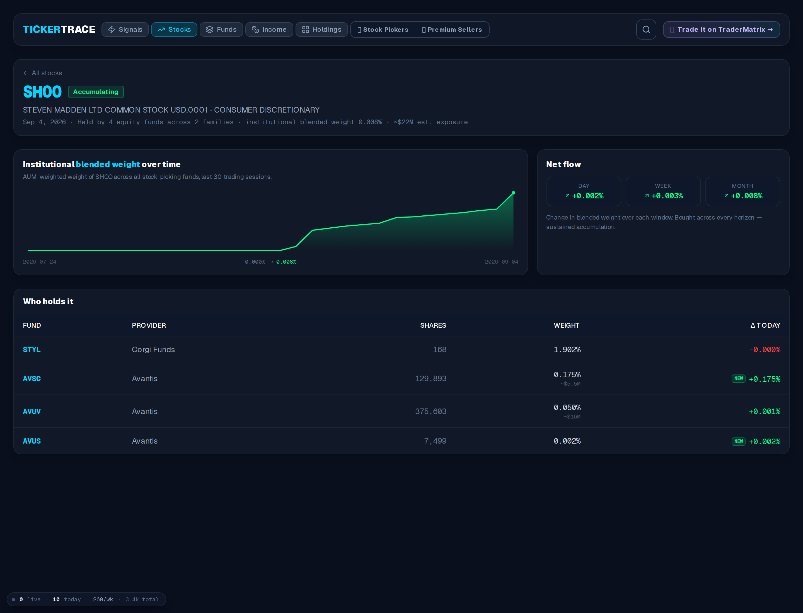
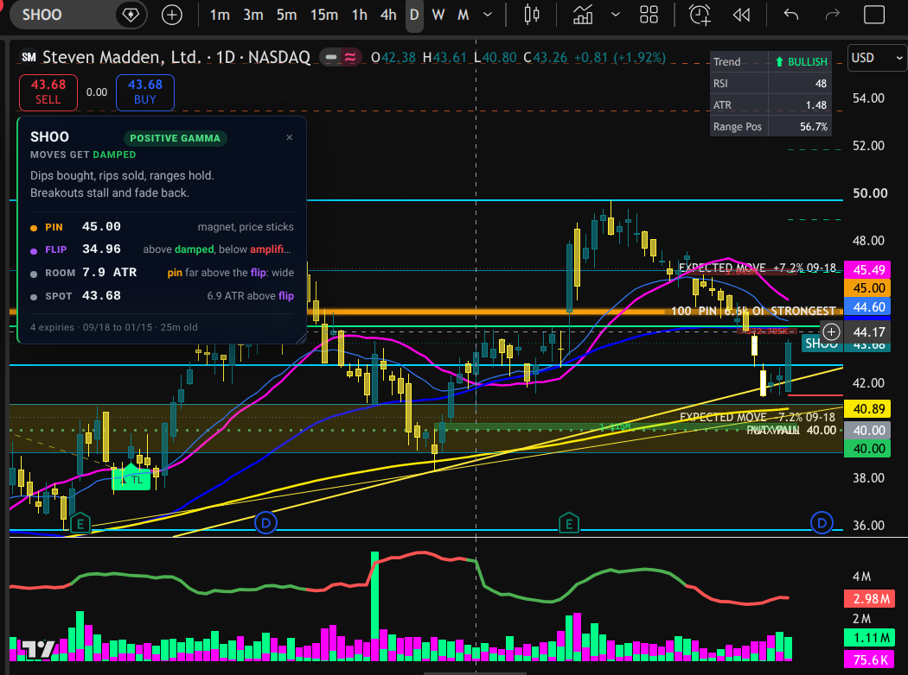

# MLI Is Up 63%. The One You Gotta Pay For Is Up 77%.

*Tools 40% | Trading 40% | Process 20%*

---



Two stocks. Same list, same method, same guy sitting at the same kitchen table downloading the same CSV file.

The gold one is Mueller Industries. I'm going to tell you the whole story on that one for free: where I found it, when, what it did, and who else ended up looking at it because I opened my mouth.

The green one is up 77.3% since I bought it, it beat the S&P by 51 points, and I'm still in it. That one is behind the paywall.

I am not teasing you with the better number and giving you the worse one. I am giving you the worse one and telling you the better one exists, which is a different and slightly more annoying kind of honest. Sam calls this "the world's least effective marketing strategy."

---

## 📊 Why I do this in the first place

Every few days, for the last couple of years, I download the holdings file for AVUV.

That's the Avantis US Small Cap Value ETF. It's run by a bunch of people who left Dimensional, and whatever they built into it, it's the best small-cap value screen I've ever found. I stopped using Finviz for small caps a long time ago. I stopped using my broker's screener before that.

Here's what I actually do with it. I pull the file, compare it against the file from a few days ago, and look at which positions got bigger. Not which ones they own. Which ones they are *adding to*. Only the second one tells you anything.

Nearly a third of my long-term profits have come off that list.

For most of that time it looked like this:



That one's AVLV, the large-cap sibling I started tracking after I ran out of small caps to be curious about. Same two columns either way. Share count on one date, share count on another date, subtract, sort. Two columns and a VLOOKUP that I rewrote by hand more times than I want to admit to a therapist.

I'm not showing you that to brag about the spreadsheet. I'm showing it so you see how unglamorous the actual thing is. There's a man in his kitchen subtracting one number from another number.

---

## 📈 Mueller Industries

I found MLI in that file on December 30th, 2024, at $79.77.



It's $63.74 today, which looks like a loss until you know they split two for one back on July 1st. Adjust for it and the position is **up 63.0%** with dividends reinvested. The S&P did **33.2%** on the same basis. So the name beat the index by about **30 points**. Price alone, no dividends, it's 59.8%.

They make copper fittings. That's it. That's the company. Every new house, every renovation, every commercial building that needs water moved from one place to another. It is the least exciting business I own and I have never once been nervous about it.

I wrote it up here in December for paid subs, [$MLI: THE COPPER-PLATED COMPOUNDER](https://mphinance.substack.com/p/mli-the-copper-plated-compounder), if you want the full thesis.

---

## 🤝 The part where it stops being about me

Here's what I like about this one.

When I posted about Mueller over on AfterHour in December, somebody read it. [@RaceyMcRacerson](https://afterhour.com/mphinance/bcQ6/dollarmli) took it over to [Rise](https://substack.com/@riseab0v3) and asked him to put a chart on it.

Rise runs a thing called TA Tuesday. You drop a ticker in the comments, he does the technical work and cuts a quick video for you. For free. Because he feels like it.



So he made one. ["MLI at a glance"](https://www.youtube.com/shorts/qtC0eHz_pIU), up on the [Theta Daddies channel](https://www.youtube.com/@thetadaddies) in January.

That chain is the only reason I post. A guy subtracts two columns in a spreadsheet. Eleven months later he writes about it. A reader picks it up and hands it to somebody better at charts than either of them. That person does the work for nothing and puts it out for everybody.

Rise, genuine question and no wrong answer: did you ever actually buy it?

I ask because I owe him a lot. He's the reason I had the nerve to start wheeling $200 stocks, which is something I now do every single day. He also didn't start wheeling until he was already a millionaire, which he'll tell you himself, and which is a more useful fact than most of what gets posted about getting rich, but I digress.

---

## ⏱️ The eleven months

I found Mueller in a spreadsheet on **December 30th, 2024**. I wrote about it publicly on **December 16th, 2025**. Look at that.



That gap is the trade. Not the thesis. The gap. Plenty of people had a good thesis on Mueller. The money came from seeing it eleven months before I had anything smart to say about it.

Which is a problem, if your whole process is a man subtracting columns by hand.

Because that process has a hard ceiling. I can check one fund. I can compare two dates. I can't tell you whether a fund added to a name because somebody made a real decision or because money came in the door that morning and got spread across four hundred positions. I can't see a build taking shape over six weeks. I can't catch it when the data provider refreshes their file and every single row suddenly looks brand new.

I lost real money to that last one before I knew it was a thing.

---

## 🛠️ So I built the thing

[TickerTrace](https://tickertrace.pro) is the spreadsheet, except it doesn't need me.



It pulls the holdings every day. It keeps the history, so you see the shape of a build instead of two snapshots. It watches every fund at once instead of the one I remembered to download. And it knows whether a fund added to one name or to its whole book. That was the check I got wrong most by hand.

Here's [MLI on it](https://tickertrace.pro/stocks/MLI). Here's [AVUV](https://tickertrace.pro/fund/AVUV). Here's [AVLV](https://tickertrace.pro/fund/AVLV) too.

It's free. Go poke at it, and yes, if you're patient you can probably work out the paid name from it yourself. I'd rather say that than pretend otherwise. What's behind the wall is the entry, the stop, and the five things I check before I'll touch anything off that list.

And when you find something on it you actually want to trade, that's what [TraderMatrix](https://tradermatrix.com) is for. Here's Mueller in it right now, with the pin sitting at $67.50 on 492 contracts of open interest and the gamma flip way down at $51.52:



Earnings are about seven weeks out.

---

## The green line

You've been looking at it this whole time. I bought it off the same list, I still own it, and unlike Mueller it isn't extended and it gave a clean entry this week.

Half of what this newsletter earns goes back into the names I write about, in my actual accounts. So when I tell you I'm buying something, that's not a figure of speech, and it's the reason I won't put a ticker in front of you that I'm not willing to hold myself.

Paid subs, it's below. Everybody else, the Mueller story above is real and it cost you nothing, and I'd rather you got that than a tease.

---

**[ PAYWALL GOES HERE ]**

## 💰 It's Steven Madden

I bought SHOO off the AVUV list on July 1st, 2025, at $25.20.



That's the post. Same day, same ritual, same spreadsheet. It's **$43.68** now. That's **+77.3%** with dividends against the S&P's **+26.1%** on the same basis, so call it **51 points** of daylight. Price alone it's 73.3%.

Shoes. It's a shoe company. I'd like to tell you I had some brilliant insight into footwear margins. I subtracted two columns.

## Why I'm writing about it again now

Because it came back.



TickerTrace has it flagged as **Accumulating**. Four funds across two families hold it, and the net flow is positive on the day, the week, and the month, which is the pattern I care about more than any single print.

The number that matters: **AVUV went from 292,425 shares to 375,603 in a week. Up 28.4%.**

Take that number on its own and you'd be doing exactly what I built the tool to stop doing. AVUV moved 794 positions that week. The median move was under 1%. A 28.4% add puts SHOO in the **96.6th percentile** of that fund's own activity.

That's what makes it a signal instead of a rounding error. Not the size of the add. The size of the add relative to everything else the fund did that day.

One thing I'll flag because you'd find it yourself: two of the four funds on that page are showing a NEW badge, and they aren't new positions. The data provider refreshed their file on the 4th and flagged about half the rows in the entire universe. Ignore the badges. The share count is the real number, and the share count is clean.

## The five things I check

This is the actual answer to the question people keep asking me, which is how I decide which names off the list to buy.

**1. Is it above its most recent swing low?** SHOO bounced off $40.80 and held the rising trendline. Yes. I've stopped touching anything that fails this, no matter how cheap it screens, because oversold in a downtrend is just a downtrend.

**2. Does it cover its own interest?** Coverage 26.1x, debt to equity 0.13, current ratio 1.91.

**3. Is it growth at a price that isn't stupid?** Revenue up 18.2%, EPS up 57%, gross margin 46.1%. Forward P/E 19.4 against 18% growth is a PEG around 1.07. Not cheap. Fair, for what it is.

**4. Can I actually trade it?** Roughly a million shares a day, real options chain, and IV rank near zero, which means the calls are about as cheap as they get in this name.

**5. Did the fund add to this name, or to its whole book?** Covered above. This name.

## The setup



Spot **$43.68**, up 1.92%, trend reads bullish, RSI 48, and it's sitting at 56.7% of its 52 week range so it is not extended.

The structure is the interesting part. There's a pin at **$45.00** with the heaviest open interest sitting at **$44.60**, and the gamma flip is all the way down at **$34.96**. Spot is nearly 7 ATR above that flip, which is deep positive gamma. In English: dips get bought, rips get sold, and there's a magnet less than 3% above where it's trading.

Expected move through the 18th is about 7.2%, so roughly $40.53 to $46.83. Max pain sits at $40.00.

```
trade rule for this post (LONG only)
ticker: SHOO
setup: rising-trendline hold into the 45 pin
trigger: 43.00-43.70 (pullback to the line, not a breakout)
stop: 40.75
target: 46.83
status 2026-09-05: LIVE (spot 43.68)
```

This is a pullback buy, not a breakout. Entry $43.00 to $43.70 on the trendline. Stop **$40.75**, under the session low and under the line. First target is the **$44.60** wall, then **$46.83**. A close below $40.75 and I'm out, no discussion, because that also breaks max pain and there's nothing underneath it I want to find out about.

I'm not telling you to buy it. I'm telling you I did, twice now, fourteen months apart, off the same spreadsheet.

Go do your own work. Then go look at [what the funds are actually buying](https://tickertrace.pro).

~ Michael
