# My Put Screener Found 18 Names. Seventeen of Them Got Hit on Friday.

*Trading 80% | Mindset 20%*

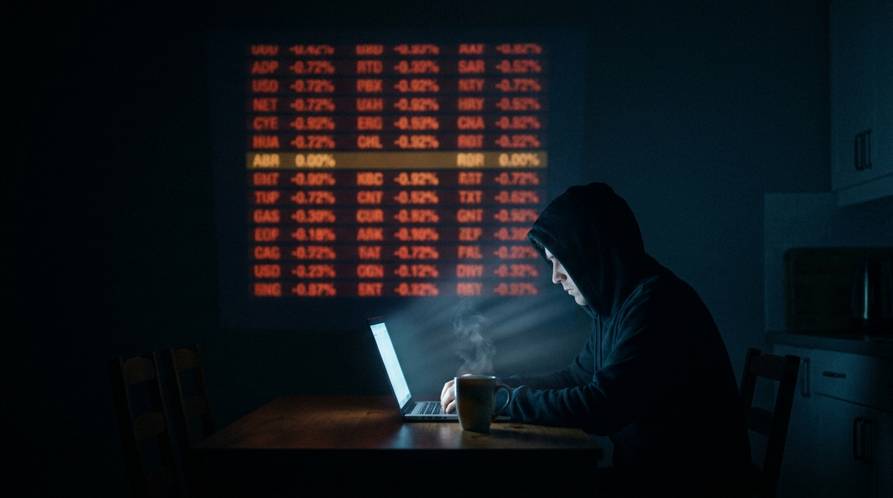

Sunday morning, coffee, laptop. I ran all five of my cash-secured put screeners back to back and dumped everything into one watchlist.

Eighteen names came out. **Seventeen of them were down on Friday.** Average drop **6.9%**. Worst one **13.2%**.

I built the damn thing and it still took me until this morning to see what it was actually doing.

A put screener sorted by premium doesn't find good trades. It finds whatever just got beat up. Premium is the price of fear, so sorting by premium sorts by fear, and fear peaks in the names that fell yesterday. My screener handed me a shopping list of Friday's wreckage and graded most of it an A.

The question it's really asking me, and never answers: was Friday the end of it or the start of it?

No filter answers that. I have to.

But I digress. The filters are the interesting part and I'm giving those away free.

## Twenty-eight ways to lie to you

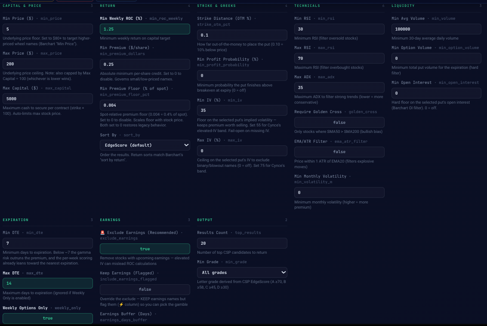

Twenty-eight knobs, because a put screen has twenty-eight ways to lie to you and I wanted all of them on one page.

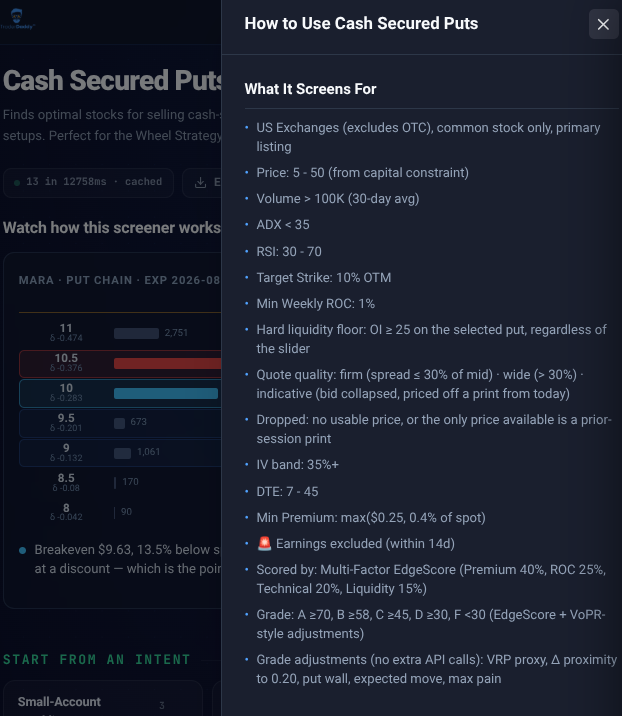

Every quote also gets stamped **firm**, **wide**, or **indicative**, and anything priced off a stale prior-session print gets thrown out. That matters more than it sounds. Half the free CSP screeners out there will happily show you a 4% weekly return on a contract that hasn't traded since Tuesday.

## Max Capital is a price filter in a budget costume

`max_capital` looks like a budget. It is one. It's also a price filter, and the tool never says so.

Cash-secured means strike times 100. A $5,000 cap silently rewrites your maximum stock price to $50, whatever you set the ceiling to. Run the small-account preset and the criteria readout comes back "Price: 5 to 50" even though the default ceiling is 200.

So the small-account preset is really a low-priced-stock filter. And low-priced stocks with liquid weeklies paying 1%+ are, almost by definition, high-beta wreckage.

That's the math of a small account, not a flaw in the tool. But if you don't know it's happening you'll think the screener has a taste for garbage. It doesn't. Your account size does.

## Your cushion isn't what you think it is

Here's the filter everybody sets first and understands last. `strike_otm_pct`. How far below the stock you put the strike. I run it at 10%.

**A 10% cushion isn't a 10% cushion.** It only means something next to how far the stock is expected to move before expiry.

One standard deviation over your holding period:

`IV x √(DTE / 365)`

Divide your cushion by that and you get what you actually bought.

**UAL.** 10% below, 19 days, IV 42%. `0.42 x √(19/365) = 9.6%` expected move. **1.00 sigma.**

**CIFR.** 11% below, 12 days, IV 92%. `0.92 x √(12/365) = 16.8%` expected move. **0.66 sigma.**

CIFR has the wider percentage cushion and the thinner actual protection. The screener's own probability column agrees: 86% for UAL, 79% for CIFR.

Run it on all eighteen and the board sorts itself.

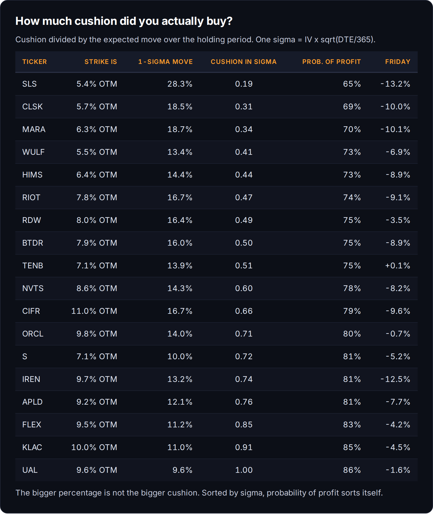

SLS was paying **3.32% a week**, the fattest number anywhere in this study, on a 5.4% cushion against a 28.3% expected move. **0.19 sigma.** That's not a cushion. That's a coin flip with a fee attached.

Probability of profit tracks sigma almost one to one, top to bottom. Percent out of the money is decoration. Sigma is the number.

Take that formula if you take nothing else. It works on any broker's chain, including the ones I didn't build.

## The most important filter ships turned off

`min_iv` and `max_iv` are the real style dial. Every one of my presets sets a floor. Only one sets a ceiling that bites.

A floor with no ceiling says: bring me the scariest thing on the tape. And it does, every time. Right now the scariest thing on the tape is the bitcoin-miners-turned-AI-datacenter complex, so that's what four of my five presets came back holding.

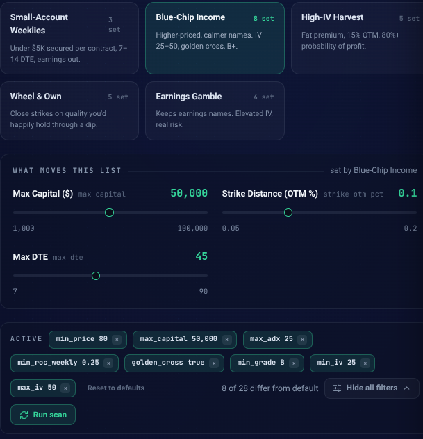

`max_iv` defaults to **zero**, which means off. It's the most important filter in the tool and it ships disabled. I'm changing that.

## The grade is a paycheck, not a forecast

The score is **premium 40%, return on capital 25%, technicals 20%, liquidity 15%.** Premium carries the most weight, and premium is fear.

Small-account preset: four names, **all A**, 75% to 79% probability of profit.

Blue-chip preset: three names, **all B**, 83% to 86%.

The screener gave a higher grade to the trades less likely to work. It's doing exactly what I told it to, which is measure how much you get paid. It just doesn't measure whether you keep it.

## The preset that returns nothing

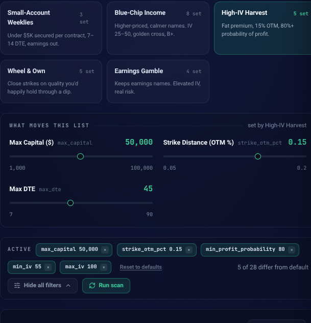

I took it apart to find the killer. Drop the 80% probability floor and three names appear. Drop the IV band and keep the floor and it's still zero. Lower the return target from 1% a week to 0.25% and **fourteen names appear.**

It's the return target, and the reason is better than I expected.

Lock probability of profit at 80% and the strike at 15% out of the money and you've already pinned the premium. It works out to 1.80% of the strike at any expiry you like, because those two numbers fix how far into the tail you're standing. The calendar is the only thing left that moves.

So weekly return is that number spread over the hold: `1.80% x 7 / DTE`. Which leaves two floors pulling against each other.

Asking 1% a week caps me at **12.6 days.** Longer and the same premium spreads too thin.

My own IV ceiling of 100 floors me at **11.2 days.** Shorter and 15% out of the money at 80% odds needs more than 100% implied vol, which the preset forbids.

A window **1.4 days wide**, at 94% to 99% implied.

I assumed those three numbers just couldn't all be true at once. They can. It's a slot, and most weeks nothing is standing in it. This week something nearly was: CIFR quoted 92.5% implied on the exact September 11 expiry sitting 12 days out. The window wanted about 96.5%. Four points of vol short.

And the filter locking it out is `max_iv`, the same ceiling I just spent a section praising. Raise it and the preset breathes. That's the honest tension in the whole tool: the ceiling that saves you from garbage is the ceiling that makes your best-sounding preset return nothing.

## The rest, fast

**`min_open_interest`** sits on that hard floor of 25. Twenty-five protects nobody. Two names this run cleared it with 41 and 59 contracts under the strike. Those are quotes, not markets. I set it to 500 now.

**`quoteQuality`** isn't a filter, it's a column, and it's the most underused number on the card. On a 30 cent credit a wide spread is a tax going in and again going out.

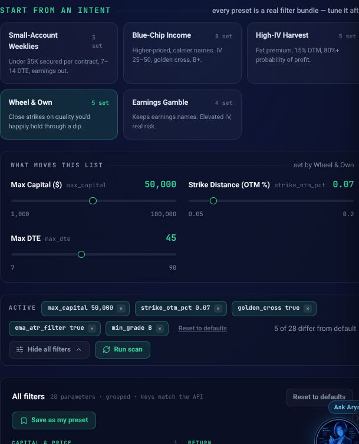

Those two gates are the only "quality" filters in the whole tool, and they aren't enough.

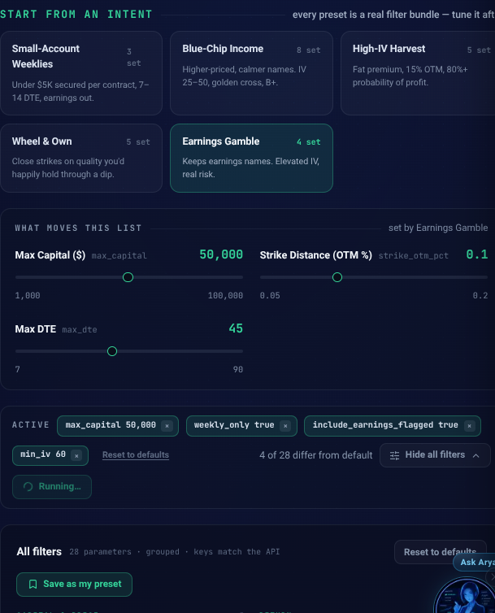

I ran that one on the last weekend in August. Earnings season is over. Not one name came back flagged. **That preset is seasonal, and right now it's just high-IV weeklies.** A screener doesn't know what month it is. You do.

**`weekly_only`** overrides your max DTE entirely, which trips me up about once a month.

**`min_profit_probability`** also ships at zero. Turning it on is the fastest way to make the tool honest with you. It's what exposed High-IV Harvest as impossible.

## So what do I do with all that

Five presets, twenty-three result slots, **eighteen unique names**. One showed up in three of the five.

I build screeners for a living and I still don't trust one to pick for me. The screen narrowed a few thousand optionable stocks to eighteen, then handed me eighteen names that mostly fell 7% on Friday and called them A's.

The narrowing is worth real money. The picking is my job.

Below: which of the four small-account names I took and why, the correlation math on why selling all four is one trade in a trench coat, the part where I admit I can't afford my own answer, why the 2x ETF on it is a trap, and the order that goes into my real account.

Half of what this newsletter earns gets reinvested into the exact names I write about, in the same IBKR account. So when I tell you which one I picked, I'm telling you where your subscription money went.

**[ PAYWALL GOES HERE ]**

## The four names

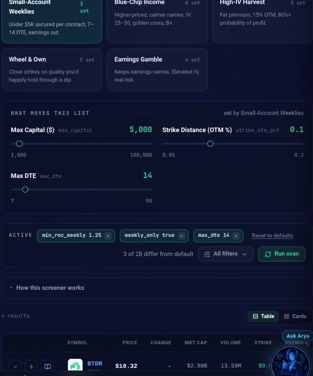

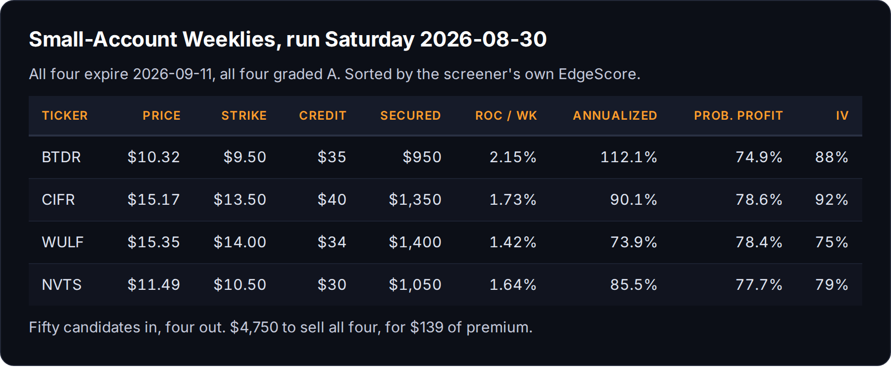

All four graded A. All four expire September 11. Selling all four costs **$4,750**, which fits neatly under the $5,000 cap.

That's the trap, and it's a good one, because it looks like diversification.

## It's one trade

BTDR is Bitdeer. CIFR is Cipher Mining. WULF is TeraWulf. Three bitcoin miners pivoting into AI datacenters, filed under the identical industry code in my own data feed.

NVTS is Navitas, gallium nitride power semis. Looks like the diversifier. It's the same datacenter buildout one layer down, selling power electronics into the racks the other three are racing to fill.

Sixty sessions of daily returns:

- **CIFR and WULF: 0.87**
- BTDR and CIFR: 0.73
- BTDR and WULF: 0.72
- BTDR and NVTS: 0.65
- WULF and NVTS: 0.63
- CIFR and NVTS: 0.58

Nothing below 0.58. CIFR and WULF at 0.87 are close enough to the same ticker that owning both is just a bigger position. Over 90 days: BTDR down 14.6%, CIFR down 15.9%, WULF down 22.4%, NVTS down 25.0%.

So selling all four isn't $4,750 across four names. It's $4,750 on one theme, under a 10% cushion, in a complex that already gave back a fifth of its value in a quarter, on the Monday after every one of them dropped 7% to 10% in a session.

I'd collect $139 for that. **1.71% a week blended.** Fine number, wrong trade.

Pick one.

## Ranked

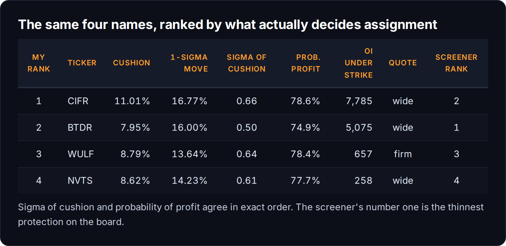

Sigma lines up with probability of profit in exact order, all four, no exceptions. **BTDR 0.50 and 74.9%. NVTS 0.61 and 77.7%. WULF 0.64 and 78.4%. CIFR 0.66 and 78.6%.**

Which is the precise reverse of how the screener ranked them. BTDR sits on top with a score of 100.5 and the thinnest protection on the board.

**4. NVTS.** **258 contracts** of open interest under the strike. That's not a floor, it's a rounding error. Weakest RSI at 39.4, worst 90-day performer of the group. Cheapest to enter at $1,050 and I still don't want it.

**3. WULF.** The only **firm** quote of the four, which is worth actual money. But ADX 24.6 is the highest here and it's down 15.5% over 30 days. A stock trending down into your strike is the one condition a put seller can't tolerate.

**2. BTDR.** Cheapest capital at $950, best return at 2.15% a week, healthiest chart with RSI 47.1. But the fattest delta at -0.286, the lowest probability of profit, and the thinnest cushion at 0.50 sigma. It pays the most because it's the most likely to come get me.

**1. CIFR.** The one I'm selling. Delta -0.214, closest of the four to the 0.20 I target. Highest probability of profit at 78.6%. Deepest breakeven cushion at 13.65%. **7,785 contracts** of open interest under the strike, the only genuine put wall in the group. And ADX 11.4, the most rangebound name here, which is exactly what you want under a short put.

The knock is real and I'm taking it anyway: wide quote, and 92.5% implied vol is the highest of the four. I'm getting paid for that, at the strike with the most support under it.

If CIFR gets put to me at $13.50 I own a miner 13.7% below Friday and I go sell calls against it. That's the wheel. Assignment isn't the failure case, it's the other half of the plan.

## Except I can't afford my own answer

Now the embarrassing part.

That put requires **$1,350 in cash, locked, for twelve days.** I don't have $1,350 to tie up. The reinvest slice out of this newsletter is about **$100**.

My screener did its job perfectly and handed me a trade I can't place.

**The wheel has a minimum ticket, and on a $15 stock it's $1,350.** Nobody selling you a wheel course leads with that. Under that number you aren't running the wheel. You're saving up to run it.

Which leaves two ways to get $100 of exposure, and one is a trap.

CIFR has a **2x leveraged ETF** on it. Two, actually. CIFG closed Friday at $3.58, so my $100 buys 27 shares instead of 6 shares of the stock. More shares, twice the move, no options approval. That pitch is aimed squarely at accounts my size.

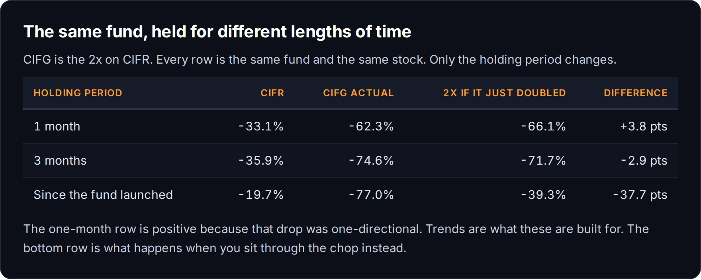

CIFR closed at **$15.15** on December 18 and **$15.17** on Friday. Eight months, up two cents. Over that window CIFG lost **62.6%** and the competing 2x fund lost **61.7%.** Independently. On a stock that went nowhere.

The daily reset drag runs roughly `σ² x T`. CIFR's realized vol is **112%**, so squaring it is about **1.26 a year** of headwind before the stock does anything.

What I'm underwriting is a twelve day hold in a name with 92% implied vol. That's not a trend, it's chop with a calendar on it, and chop is what these things burn. The holding period is the product. A 2x fund is a position you close today.

I went far enough down this hole that it became [its own post](https://mphinance.substack.com/p/i-liked-a-stock-somebody-bought-the), 36 of these funds across five issuers, all landing on the same line.

Shares of the real thing.

## The order

```
The trade rule for this post (LONG only):
Symbol: CIFR
Action: BUY
Broker: IBKR (real)
Size: ~$100 (about 7 shares at the limit)
Entry: LMT $13.50, GTC, outside_rth = true (extended-hours eligible)
Stop: informational for now, ~$12.80 (below the $13 gamma shelf)
Targets: $14.00 support, $15.00 max gamma, $17.00 resistance
```

And here's the part I actually like.

The put I wanted to sell was a promise to buy CIFR at $13.50, and I'd have been paid **$40** to make it. I can't afford the collateral. But I can still make the promise for free.

**A resting GTC limit at $13.50 is the same commitment as that cash-secured put**, minus the $40 and minus the obligation. If CIFR trades to $13.50, I own it either way. The $40 isn't a prize for being clever. It's rent for agreeing to stand there. Without $1,350 to post I don't collect the rent, and I don't have to stand there either.

That's the small-account version of a cash-secured put, and nobody sells it to you because there's nothing to sell.

The strike is also the level: **9,130 put contracts sit at $13.50** and it reads as gamma support. I'm putting my bid where the option market already built a floor.

## What would make me wrong

If Friday was the start of something in the miners rather than the end, I don't get to be right about picking the best of four. I just lose less than the guy who bought all four. Choosing carefully inside a correlated group reduces size, not direction.

The second thing is the bid never filling. If CIFR turns and runs from $15.17 I collected nothing and own nothing, which is the exact cost of not having the $1,350. The put seller gets paid to wait. I don't. **That gap, $40 over twelve days, is the honest price of a small account**, and the fix is a bigger account, not a cleverer trade.

Every number above is Friday's close. I'll repost the fill, or the fact that there wasn't one.

---

The sigma formula is yours to keep and it works on any broker's chain. The rest of this, the presets and the twenty-eight knobs, is what I build for [TraderDaddy Pro](https://www.traderdaddy.pro), and paid subscribers here get the picks before I take them.

The $100 above is partly yours, and it's $100 rather than $1,350 because that's genuinely what the account has.

~ Michael
