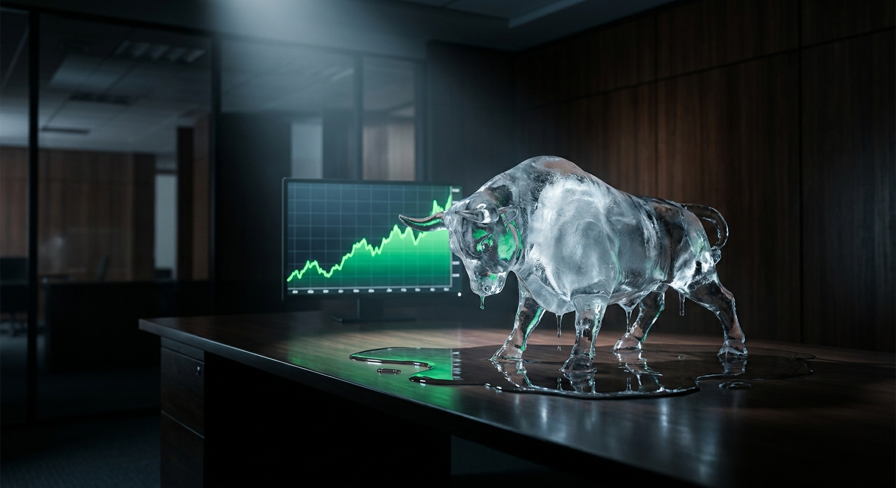
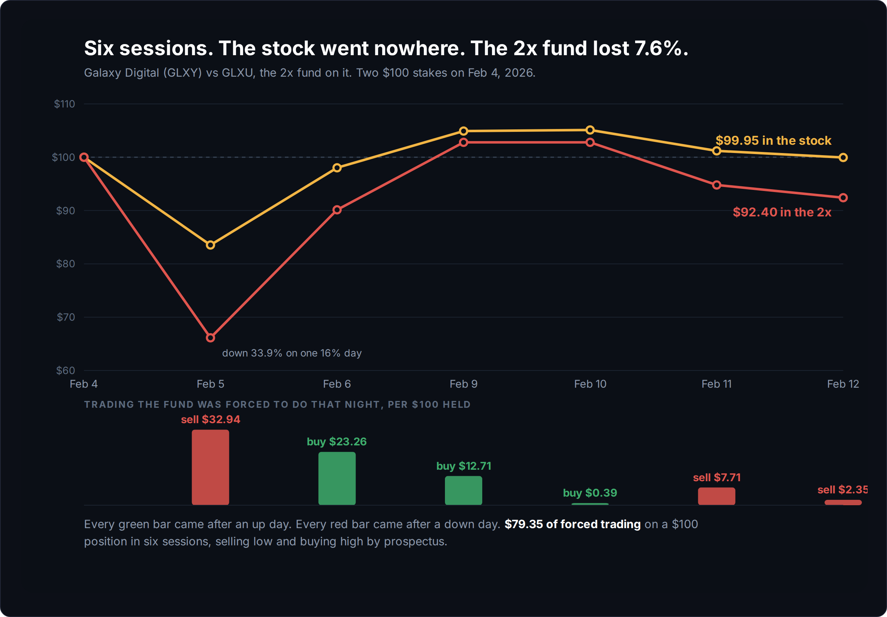
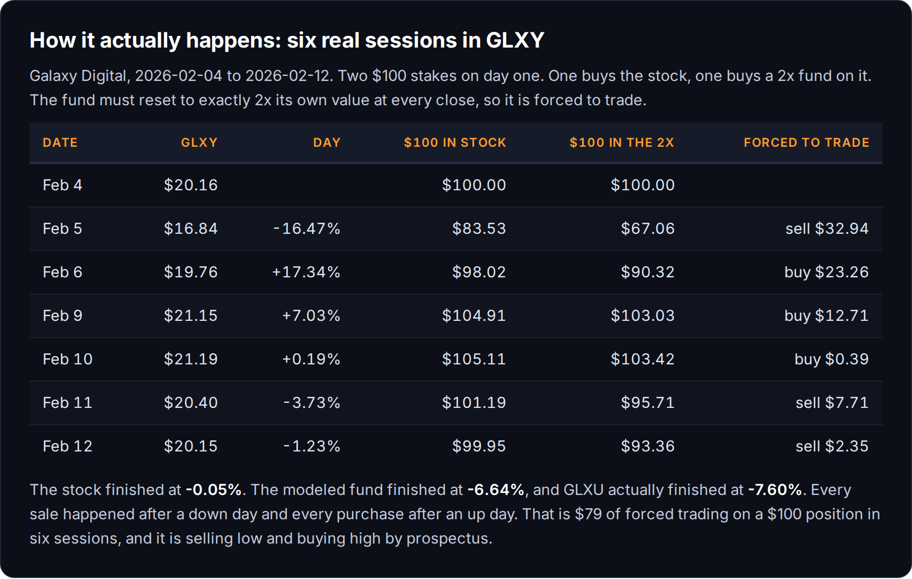
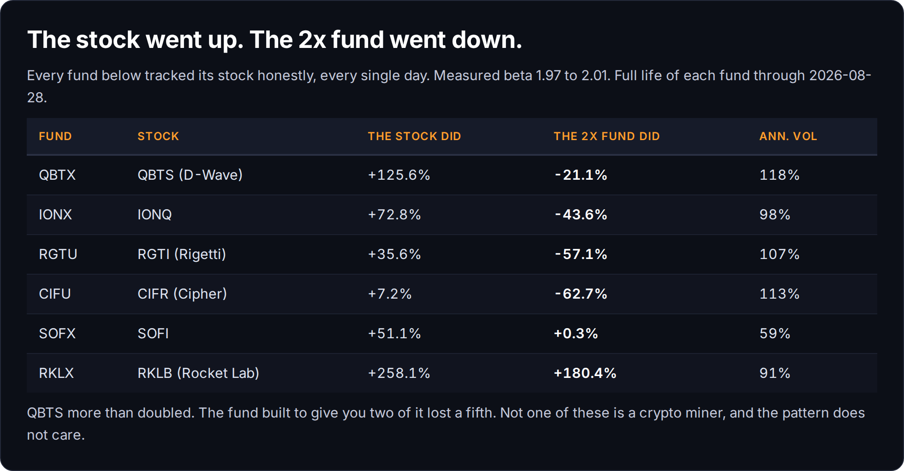
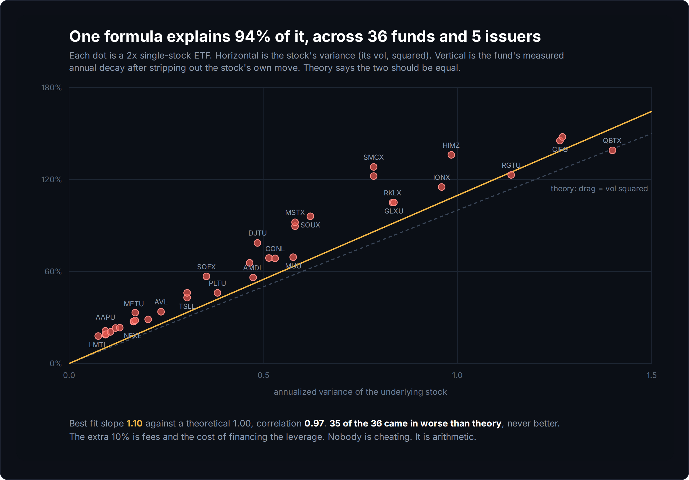

# This Stock Doubled. The 2x Fund on It Lost 21%.

*Trading 70% | Mindset 30%*

QBTS, the quantum computing company, is up **125.6%** since the 2x fund on it opened.

That fund, QBTX, is down **21.1%**.

Not up half as much as the stock. Down. You picked the right company, you picked the leveraged version because you were confident, and you're poorer than the guy who bought nothing.

That result is not a bug and it's not a bad fund. QBTX did exactly what it promised, every single day, and I checked. So did the other thirty five of these things I pulled data on.

I want to show you why, because every explanation of this I've ever gotten leaned on the phrase "volatility drag" and I nodded and understood nothing.

## First I tried to catch them cheating

I pulled daily closes for 36 different 2x single-stock ETFs across five issuers, matched each against its underlying stock, and measured the leverage they delivered. Every one of them should move 2.00 times its stock each day.

Measured beta came back between **1.969 and 2.006**. All thirty six.

Then I went looking for reverse splits, because a split fakes a giant one-day gain and quietly poisons every number after it. I compared each fund's daily move against twice its stock's daily move across **12,358 fund-days**. If a split were hiding in there, one day would blow out.

Worst single-day miss in the whole set: **5.7%**. One day, one fund, out of twelve thousand.

Nobody's skimming. The tracking is close to perfect. The catch is what they're tracking to, which is 2x of **one day**. Not your week, not your year, not your thesis. One day, close to close, and then the clock resets.

It's in the prospectus. I'd read it. I still couldn't have told you what it costs.

## What the reset costs

The fund has to hold exactly two dollars of exposure for every dollar of its own value, at every close. Not on average. At the close. So the second the stock moves, it's out of balance and has to trade to get back. It sells after down days and buys after up days, every day, and that's not a manager screwing up. That's the rulebook.

Take six real sessions in Galaxy Digital, the first week of February. Hundred dollars in the stock, hundred dollars in the 2x fund, same morning.

GLXY closed at **$20.16** on Wednesday. Six sessions later, **$20.15**. A penny.

The 2x fund lost **7.6%** in that penny.

Add up the bars. On a hundred dollar position, in six trading days, that fund was forced to move **$79.35** of stock around. It bought $36.35 of it after the price had already gone up and sold $42.99 of it after the price had already gone down.

Thursday the 5th is where you can feel it. The stock fell 16.5%, which is a genuinely bad day. The fund fell **33.9%**, which is a third of everything. Then it had to dump $32.94 of exposure at that exact low. So when the stock bounced 17.3% the next morning, the fund only had two thirds as much left to bounce with.

The stock got all its money back that week. The fund couldn't, because it had less of itself left in the game.

## Being right doesn't save you

I had this part wrong going in. I assumed it was a chop problem, and that if the stock went up you'd still come out ahead, just less ahead than you hoped.

Wrong. QBTS was the first one that showed me, and it isn't alone.

IONQ is up 72.8% and IONX is down 43.6%. RGTI is up 35.6% and RGTU is down 57.1%. Cipher is up 7.2% and CIFU is down 62.7%.

None of those are crypto miners, and I want that on the record, because "leverage plus bitcoin equals bad" is a story people already believe and it lets them off the hook. It's not the sector. It's how much the stock moves.

Then there's the one that got me, because I write about this company.

**SOFI is up 51.1%.** Over that same stretch, SOFX, the 2x fund on SOFI, returned **+0.3%**. Seventeen months in a stock that gained half its value and the 2x version paid you **thirty cents** on a hundred dollars.

## Sometimes it works

It's not always a loser, and the cases where it wins tell you exactly when to use it.

AMD is up 349.8% over the window I measured. AMDL, the 2x, is up **797.9%**, which is more than twice the stock, and it's the only fund out of thirty six that beat the theoretical math instead of falling short of it. Micron is up 820.6% and MUU is up **3,004%**.

Rocket Lab tripled and RKLX made money too, up 180.4%. Notice it made *less* than the stock's 258.1% while carrying double the risk of ruin the whole way.

So leverage isn't a scam. It's a bet on a **straight line**. If your stock goes up and mostly keeps going without violent round trips, the daily rebalance compounds in your favor and you make a fortune. AMD did that. Being right on direction isn't enough, though. You also need the path to be calm, and that second part is the whole bet.

## The only number you need

Here's where it stopped being an anecdote for me.

I took all 36 funds, stripped out each stock's own move, and isolated the pure decay. Then I plotted that decay against the stock's variance, which is just its annual volatility times itself.

Theory says those two numbers should be equal, so a perfect fit sits on the dotted line at slope 1.00. Measured slope came in at **1.096**, correlation **0.970**.

One number, the stock's own volatility, explains **94%** of every dollar lost across thirty six funds and five different issuers. Five companies, one line. Nobody's deciding this. It's the math.

Thirty five of the thirty six landed slightly *worse* than theory, never better, and that gap is real costs. Financing, spread, and the fact that stocks move all day and not just at the close.

Which gives you the one thing worth remembering:

**Take the stock's annual volatility. Square it. That's roughly what it costs you per year to hold the 2x version.**

Lockheed Martin moves about 27% a year. Square it and you'd expect 7%. LMTL actually cost **16.4%** a year. The calmest name in my entire set still charges you sixteen points for the privilege.

Cipher Mining moves about 112% a year. Square 112% and you don't have a fee anymore, you have the whole position.

And look, that volatility they're squaring and taking? That's the exact thing I sell every month, on purpose, to people who want to buy it. I'm on the other side of that trade collecting it in premium instead of paying it in decay. But I digress.

## The hole is deeper than the number looks

One more piece of math, and it's the one that should scare you off holding these.

Galaxy Digital is down 16.5% since its 2x fund opened, so getting back to even takes a **19.8%** rally. `1 / (1 - 0.165) - 1 = 0.198`. That's a good quarter. That happens.

GLXU is down 77.0% over the same stretch. `1 / (1 - 0.770) - 1 = 3.348`. It needs **334.8%**.

It has to more than quadruple, and it has to do it while the reset keeps charging rent the whole way up, on a stock still sitting 16% below where it started. A patient holder of the stock waits out a 16% drawdown. The fund turned the same drawdown into permanent.

## The rule

If you're holding it past today's close, own the stock.

These are day trading instruments and the label says so. The word "daily" is in the fund's actual legal name. If you're in and out inside a session, the reset never touches you and the product does exactly what it advertises.

Hold one overnight and you've stopped betting on the company and started betting the path is smooth. That's a different bet, a worse one, and it isn't what you thought you bought.

If you want the leverage anyway, get it somewhere you can see the bill. Buy the stock and size up. Buy a call and know what the premium cost you on day one. Both of those tell you the price up front.

The 2x fund never shows you the bill. It just squares the vol and takes it.

Own the stock.

If you want the rest of the work I do like this, the screeners and the receipts and the trades I actually put money into, it's all here. Free posts stay free.

~ Michael

*Every number comes from daily closes through 2026-08-28. I don't own any of the leveraged funds in this post and I'm not going to.*
