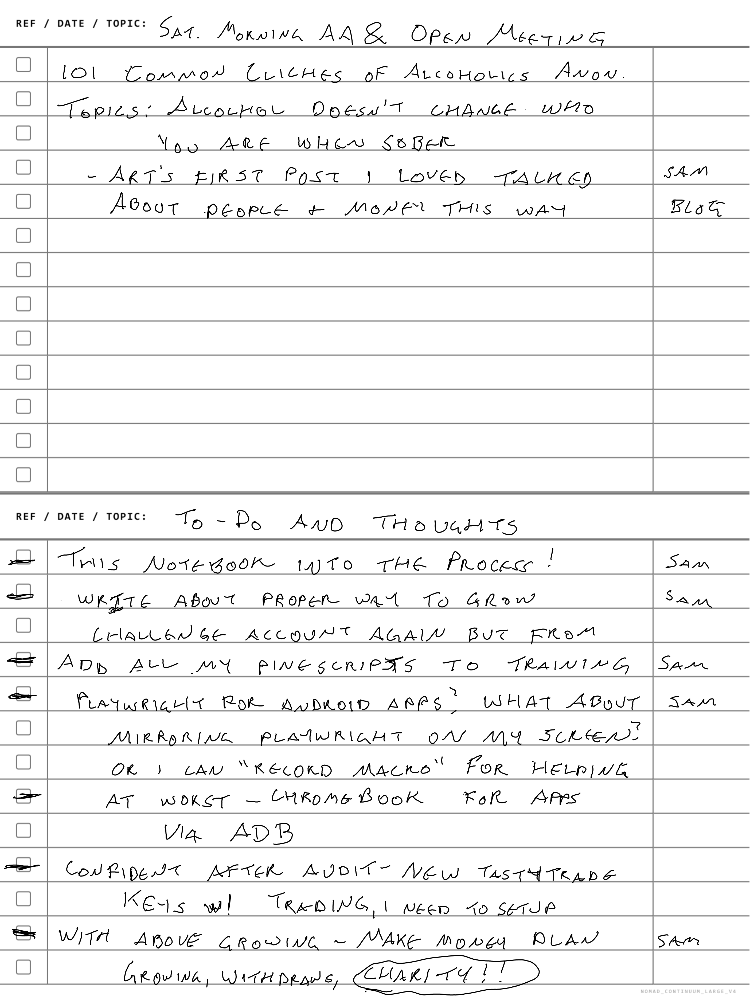
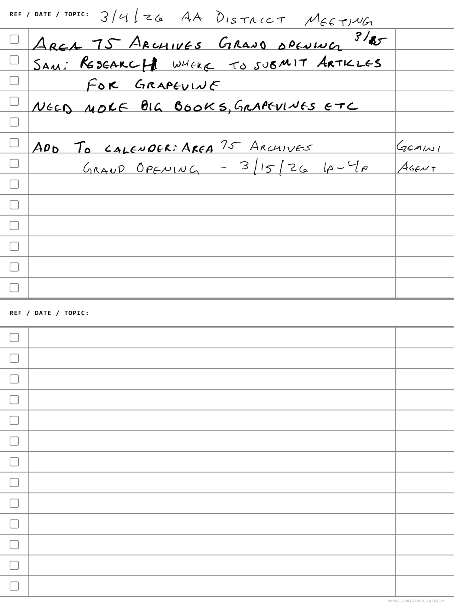

# I Taught My AI to Read My Handwriting (From an AA Meeting Notebook)

*Michael's Musings — March 7, 2026*

---

> 🎨 **IMAGE PROMPT:** *A moody, cinematic photo of a hand writing on an e-ink tablet with a stylus in a dimly lit church basement. Coffee cup nearby. Warm amber lighting. Shallow depth of field. The screen shows handwritten notes with small tags in the margin.*

I use a Supernote tablet. It's one of those e-ink notebooks where you write with a stylus and it feels like actual paper. No notifications, no apps, no distractions. Just writing.

I take it to AA meetings. I take it to coffee with my sponsor. I take notes the old-fashioned way because here's a secret about recovery: **writing things by hand makes you actually process them.**

The problem is, those notes sit in a tablet. They export to PDFs. Those PDFs sit in a Google Drive folder. And within a week, I've forgotten what I wrote, what I wanted to do about it, and what was actually important.

---

> 🎨 **IMAGE PROMPT:** *A sleek infographic-style diagram showing the flow: handwritten notebook → PDF export → AI vision reading → branching arrows to "Blog Draft", "Calendar Event", "Task List", and "Ebook Chapter". Dark background, neon green accents (#00ff41), clean minimal design.*

So I did what any reasonable person would do. I built a pipeline.

Here's what my actual notes look like. This is the raw handwriting my AI reads:

Here's the flow:

1. **I write in Supernote** — normal handwritten notes, like a human being
2. **I tag things in the right column** — "Sam" (for my AI copilot to handle), "Blog" (content idea), "Gemini Agent" (calendar/scheduling for my phone)
3. **The PDFs auto-export to Google Drive**
4. **My AI reads them** — downloads the PDFs, renders the pages as images (because handwriting isn't OCR-able text), and literally looks at my handwriting to transcribe it
5. **Tags get routed** — Sam items become to-do tasks. Blog items become Substack draft seeds. Gemini Agent items become calendar events on my phone.

---

Today's notes were from this morning's AA meeting. Art — one of those old-timers who's been sober since before you were probably born — talked about character.

The cliche was "alcohol doesn't change who you are when you're sober." And Art's take was that sobriety doesn't fix your character. It just removes the excuse. You still have to do the actual work of becoming a better person.

Here are the actual meeting notes from that day:

That turned into a whole thing (separate post coming) about how the exact same principle applies to money. Lottery winners. Day traders who blow up accounts. The amount doesn't matter if the character behind it hasn't changed.

---

> 🎨 **IMAGE PROMPT:** *Split-screen composition: left side shows a peaceful church basement AA meeting with people sitting in a circle, right side shows a futuristic terminal screen with code and data flowing. The two halves connected by a glowing line. Photorealistic, dramatic lighting.*

But here's the meta thing that's actually blowing my mind:

**I wrote that insight by hand, in a meeting, with a stylus on an e-ink screen. And twenty minutes later, an AI agent had:**

- Transcribed my handwriting
- Identified the tags
- Created a blog draft from the content
- Added a calendar event to my phone
- Filed it for future ebook chapters
- Updated the task list for the next coding session

The notebook → pipeline → content → products loop is real. And it starts with a guy sitting in a church basement writing about character defects.

---

I keep saying "radical transparency" but this is something else. This is **radical integration.** The meetings, the trading, the building, the writing — it's all one thing. Recovery teaches you to live an integrated life. No compartments. No "work me" vs "real me."

So yeah. My AA notes feed my trading blog feed my ebook feed my AI system. And somehow that makes perfect sense.

---

*If you want to build something like this, the entire system is open source. The Supernote reader, the draft manager, the RSS dedup checker — it's all at [github.com/mphinance](https://github.com/mphinance/mphinance). And before you ask: yes, the AI can read my terrible handwriting. It's better at it than most pharmacists.*

— Michael

*Momentum Phinance — [mphinance.com](https://mphinance.com)*
