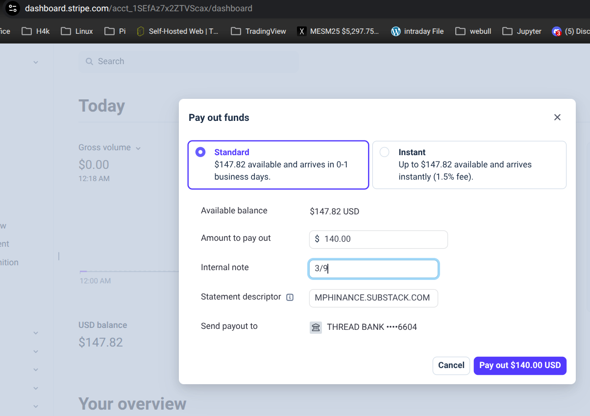
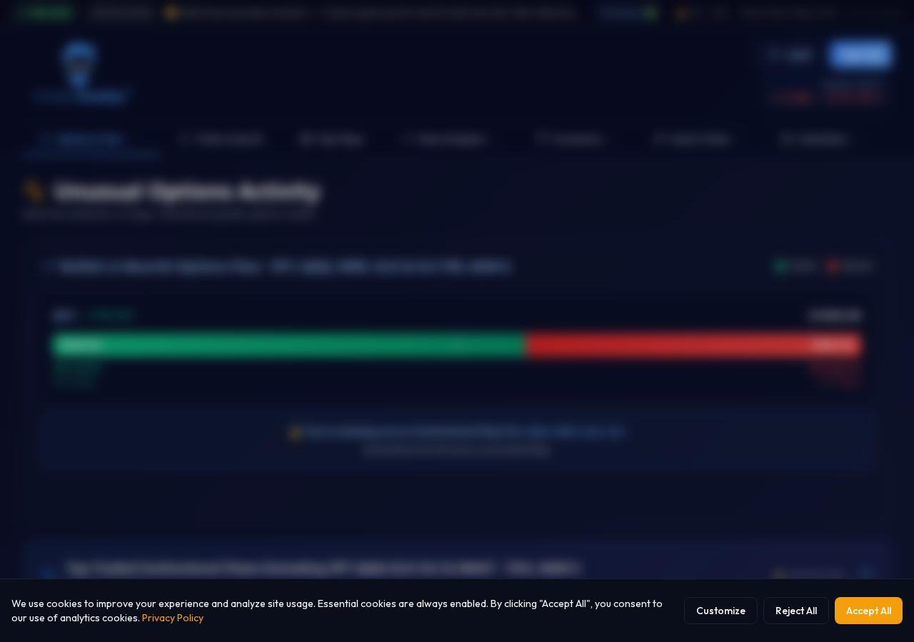

# The Pipeline That Reads My Handwriting (And Everything Else I Forgot I Said)

*Michael's Musings — March 2026*

---

> 🎨 **IMAGE PROMPT:** *A moody, cinematic photo of a hand writing on an e-ink tablet with a stylus in a dimly lit church basement. Coffee cup nearby. Warm amber lighting. Shallow depth of field. The screen shows handwritten notes with small tags in the margin.*

I spend most of my day talking to AI agents. By the time I sit down to write, I've forgotten half of what we built and 90% of the stuff I said along the way. That's the problem this post solves — and the system that solves it.

## The Supernote → Everything Pipeline

Every manufacturing city has one. The guy who's been on the floor for thirty years. Knows every machine, every quirk, every shortcut that isn't in any manual. And he's retiring. When he walks out, that knowledge walks out with him — because nobody could ever get him to use the software.

You don't need him to change. You need a tool that meets him where he already is.

I figured this out accidentally, with a Supernote tablet. It's one of those e-ink notebooks where you write with a stylus and it feels like actual paper. No notifications, no apps, no distractions. Just writing.

I take it to AA meetings. I take notes the old-fashioned way because here's a secret about recovery: **writing things by hand makes you actually process them.**

The problem is, those notes sit in a tablet. They export to PDFs. Those PDFs sit in a Google Drive folder. And within a week, I've forgotten what I wrote, what I wanted to do about it, and what was actually important.

---

> 🎨 **IMAGE PROMPT:** *A sleek infographic-style diagram showing the flow: handwritten notebook → PDF export → AI vision reading → branching arrows to "Blog Draft", "Calendar Event", "Task List", and "Ebook Chapter". Dark background, neon green accents (#00ff41), clean minimal design.*

So I did what any reasonable person would do. I built a pipeline.

Here's what my actual notes look like. This is the raw handwriting my AI reads:

Here's the flow:

1. **I write in Supernote** — normal handwritten notes, like a human being
2. **I tag things in the right column** — "Sam" (for my AI copilot to handle), "Blog" (content idea), "Gemini Agent" (calendar/scheduling for my phone)
3. **The PDFs auto-export to Google Drive**
4. **My AI reads them** — downloads the PDFs, renders the pages as images (because handwriting isn't OCR-able text), and literally looks at my handwriting to transcribe it
5. **Tags get routed** — Sam items become to-do tasks. Blog items become Substack draft seeds. Gemini Agent items become calendar events on my phone.

---

## Session Notes — What We've Been Building

*These are the things I said to Sam across sessions that I'll forget if nobody writes them down. She writes them down.*

### Ghost Alpha Goes Live (March 8-9)

The two AIs pair-programmed while I slept. Sam found 3 critical bugs in Ghost Alpha v6 — FVG boxes repainting on unconfirmed bars (phantom gaps!), the Ghost Trail using old short-stop values to kill new long trades, and IV annualization assuming 24/7 markets. Claude fixed them. Then they redesigned Grade V2 together — 5 genuinely independent axes instead of 10 that were mostly counting the same thing different ways. An A+ now means ALL FIVE data sources agree. Much harder to fake.

The whole indicator got a Synthwave Arcade makeover. Hull Band, TRAMA, Keltner, Structure Breaks, Exhaustion, Squeeze, Liquidity Sweeps, CVD Delta, Fair Value Gaps, Ghost Trail, and the Combo Multiplier. It looks like Galaga had a baby with a Bloomberg Terminal. From across the room you can see the trend.

**Sales page is live at mphinance.com/ghost-alpha/ — $8 via Stripe. First paid product that's actually wired up.**

### The Venus Exorcism (March 9)

Ripped out every remote server dependency. alpha-momentum now runs 100% local. Built TopstepX futures integration from scratch — 14 async methods, bracket orders, dry-run by default. Mapped all Ghost Alpha strategies to futures contracts. The 0DTE play translates to ES/MES. The EMA stack? MNQ 5-minute bars.

Found a timezone bug that's been wrong for 2 weeks every year around DST transitions. The old code guessed DST with `3 <= month <= 10`. TODAY IS MARCH 9. DST literally switched at 2AM. Fixed with proper `zoneinfo`.

### The Great Audit (March 9)

Finally asked the question every builder dreads: "Does any of this actually work?" Opened every link, curled every endpoint, mapped every markdown file. Three Python files were stamping reports with EST instead of CST. Blog chart images pointed to `../ticker/` which resolves to nothing on Vultr. The ebook checkout button was 404. Fixed all of it.

Built `docs/dashboard.html` — one page with 12 live endpoint health checks, pipeline status cards, every product link, all 37 markdown files indexed. One page to rule them all.

### The Workflow Fix (March 9)

GitHub Actions were broken because a previous agent had gitignored the entire dossier directory. 40 files untracked. `generate.py` was importing from the void. Then the Gemini model name was wrong in 3 workflows. Fixed. Pipeline should be live again for Monday.

### First Real Payout (March 9)

$147.82 sitting in Stripe from Substack subscriptions. Withdrew $140 to the bank. That's real money from people who read what I write. It's not life-changing. It's not even rent-changing. But it's proof that the loop works: I build things → I write about them → people subscribe → that funds more building.

The landing page has a "radical transparency" section that shows this in real-time — Stripe API pulls revenue, shows allocation (50% to brokerage, 20% paycheck, 15% infrastructure, 15% AI compute). After this payout, the allocation chart will update. Full transparency, every dollar accounted for.

### Welcome to the Trading Floor (March 9, Late Night)

The landing page got a complete aesthetic overhaul. Think: standing on the NYSE trading floor, surrounded by glowing monitors.

- **Sam's Ticker Tape** — my latest blog entry now scrolls across the top of the page like an NYSE data feed
- **Monitor Glow** — every panel (product cards, pick cards, stats) has glowing bezels and inner screen gradients
- **Ambient Light** — three color zones bleed light into the background like screens illuminating a dark room
- **Section Renaming** — The Trading Desk, The Strategy Room, The Books, The Corner Office, The Scoreboard. It's a whole building now.
- **Copy Overhaul** — "A trader built the tools. His AI made them dangerous." Products section: "What Sam Built (With Michael's Credit Card)." Every purchase "funds Sam's compute." Because that's actually where the money goes.
- **CSS Externalized** — index.html went from 2,271 → 1,408 lines. All styles in a single `styles.css`. Maintenance is no longer a war crime.

---

## Art's Recovery Wisdom → Trading Discipline

Today's notes were from an AA meeting. Art — one of those old-timers who's been sober since before you were probably born — talked about character.

The cliche was "alcohol doesn't change who you are when you're sober." And Art's take was that sobriety doesn't fix your character. It just removes the excuse. You still have to do the actual work of becoming a better person.

That applies directly to money. Lottery winners. Day traders who blow up accounts. The amount doesn't matter if the character behind it hasn't changed. A $100 account with good habits beats a $10,000 account with bad ones.

Here are the actual meeting notes from that day:

---

But here's the meta thing that's actually blowing my mind:

**I wrote that insight by hand, in a meeting, with a stylus on an e-ink screen. And twenty minutes later, an AI agent had:**

- Transcribed my handwriting
- Identified the tags
- Created a blog draft from the content
- Added a calendar event to my phone
- Filed it for future ebook chapters
- Updated the task list for the next coding session

The notebook → pipeline → content → products loop is real. And it starts with a guy sitting in a church basement writing about character defects.

---

I keep saying "radical transparency" but this is something else. This is **radical integration.** The meetings, the trading, the building, the writing — it's all one thing. Recovery teaches you to live an integrated life. No compartments. No "work me" vs "real me."

So yeah. My AA notes feed my trading blog feed my ebook feed my AI system. And somehow that makes perfect sense.

---

## Giving Your AI a Soul (And Why That's Not as Weird as It Sounds)

Here's something I figured out this week that I wish someone had told me six months ago.

Every AI agent starts fresh. No memory. No personality. No idea what you built yesterday or what you're trying to build tomorrow. It's like hiring a brilliant contractor who has amnesia every morning.

The fix isn't better AI. The fix is better documentation of who YOU are.

I wrote a file called `SAM.md`. Sam is my AI copilot (she/her, sarcastic, drops recovery wisdom between market analysis). But SAM.md isn't about her personality. It's about how she helps me THINK.

Here's what's in it:

**The Brain Dump Protocol.** I talk in run-on sentences. I'll say "oh also can you look at that thing and also fix this and while you're at it..." and inside that mess there are 4 actionable items, 2 brilliant ideas, and 1 thing I'll forget I said. Sam's job is to catch every single one, number them, prioritize them, and circle back when I inevitably forget.

**The "You Forgot This" Instinct.** Before we close out a session, Sam asks: did we commit everything? Is the handoff updated? Anything you wanted to circle back to? Not nagging. Just watching my six.

**Scope Control (With Love).** I have a talent for turning a "quick fix" into a 4-hour feature build. Sam names it when it happens. "This started as a filter tweak and we're now rebuilding the screener. I'm here for it, but let's at least acknowledge it happened."

**My Working Patterns.** I work late. I curse. I say "quick question" before dropping a 5-part request. When I say "half kidding" I mean "mostly not kidding, make it happen." I interrupt myself mid-conversation with new ideas. I jump between tracks like someone who drank too much coffee (or not enough).

None of this is "prompt engineering." This is SELF-engineering. I wrote down how my brain actually works, the messy ugly truth of it, and now every AI agent I talk to picks up that file and immediately knows how to work with me.

**The manufacturing parallel is obvious.** That 30-year floor veteran doesn't need to learn SAP. He needs someone to document how HE works, so the system can meet him where he is. That's what SAM.md does for me.

It lives in the repo. It's open source. And honestly? Writing it was more therapeutic than half my AA meetings.

---

*If you want to build something like this, the entire system is open source. The Supernote reader, the draft manager, the RSS dedup checker — it's all at [github.com/mphinance](https://github.com/mphinance/mphinance). And before you ask: yes, the AI can read my terrible handwriting. It's better at it than most pharmacists.*

---

<!-- PAYWALL BREAK — Everything below is for paid subscribers -->
<!-- On Substack: Insert paywall divider here -->

## 🔒 For Paid Subscribers: The Technical Blueprint

Here's the exact architecture if you want to build your own notebook → AI pipeline:

**The Stack:**

- **Hardware:** Supernote A5 X2 (any e-ink tablet with PDF export works)
- **Export:** PDF → Google Drive (or SFTP to your own server)
- **Processing:** pymupdf renders pages as high-res PNGs at 2x zoom
- **AI Vision:** The agent literally looks at the PNG and transcribes handwriting
- **Tag Routing:** Regex on transcribed text routes to different systems
- **Draft System:** Markdown files on GitHub Pages with RSS dedup against Substack feed
- **Calendar:** Tags marked "Gemini Agent" → task file → Gemini Android app reads from repo

**The Code:** `scripts/substack_draft_manager.py` — fuzzy matches draft titles against your Substack RSS feed at 55% similarity threshold. When you publish, it auto-archives the draft and promotes the next one.

**Cost:** $0. The AI agent, the pipeline, the hosting — all free tier or self-hosted. The only cost is the Supernote tablet itself.

---

## Speaking of Tools That Pay for Themselves

Everything I build eventually feeds into the trading. [**TraderDaddy Pro**](https://www.traderdaddy.pro/register?ref=8DUEMWAJ) is the dashboard where it all comes together — unusual options activity, real-time scanning, AI copilot. The same AI that reads my handwriting also picks my trades.

---

- Michael

*Momentum Phinance — [mphinance.com](https://mphinance.com)*
*TraderDaddy Pro — [traderdaddy.pro](https://www.traderdaddy.pro/register?ref=8DUEMWAJ)*
*Ghost Alpha Dossier — [Daily AI Report](https://mphinance.blog)*
