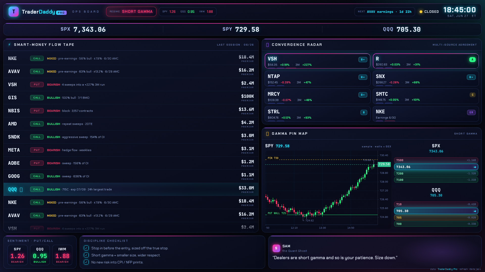
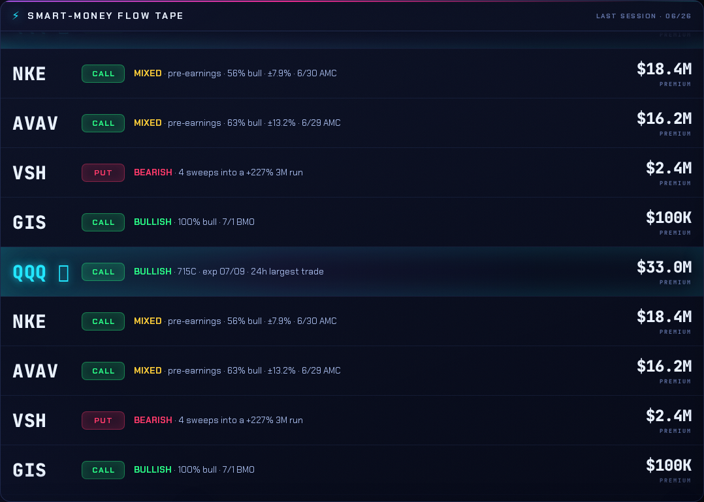
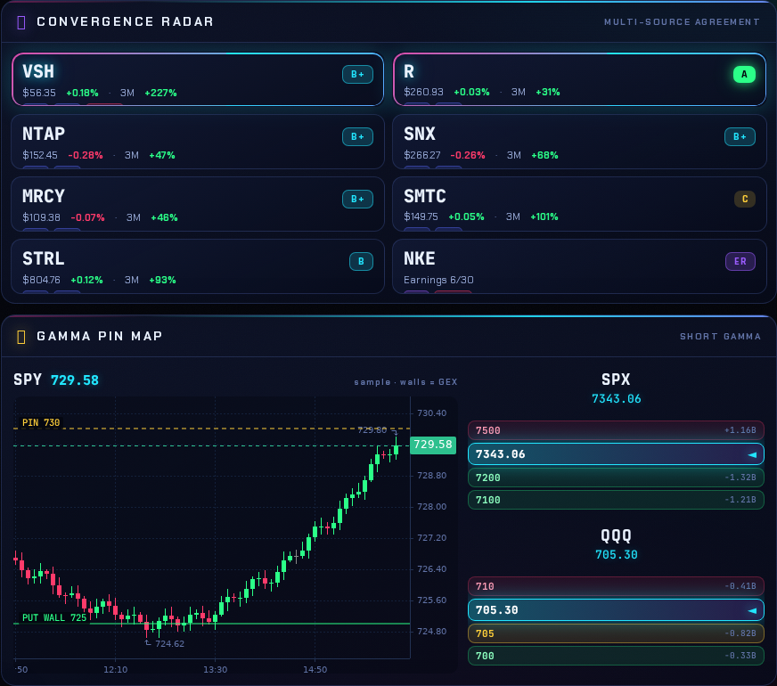
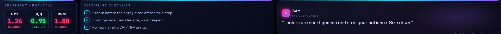

# TraderDaddy Pro · Ops Board

An always-on, glanceable market-ops wall display. **Not a chart** — it tells you
what's happening and whether you should care. Built to run on a spare monitor
driven by a Raspberry Pi in kiosk mode, fed by TraderDaddy Pro + Tradier.

**Self-contained appliance.** Drop your keys in `keys.env` before first boot; the Pi
serves the board to itself on `localhost` and refreshes its own data. No cloud, no
external host required. (Want a public show-off URL too? Copy this folder into
`docs/` and GitHub Pages will serve it at `…github.io/mphinance/ops-board/`.)



## The four panels

| Panel | What it shows | Source |
|-------|---------------|--------|
| ⚡ **Smart-Money Flow Tape** | Scrolling feed of the biggest sweeps/blocks + pre-earnings flow | `get_unusual_activity`, `get_earnings_flow`, `get_market_stats` |
| 🎯 **Convergence Radar** | Names multiple screeners (+flow +earnings) agree on, with source badges | `run_screener` (bullish-pullback, momentum, …) |
| 🧲 **Gamma Pin Map** | Live **SPY candlestick** (KLineChart) with the call/put gamma walls drawn across it, plus SPX/QQQ wall ladders + regime | `get_gex_overview` + Tradier `timesales` |
| 🪞 **Discipline Mirror** | Put/call sentiment, a rules checklist, and Sam keeping you honest | `get_market_stats` + Sam |

Header carries the **gamma regime** chip, **put/call** sentiment, a live **next-event
countdown** (CPI / NFP / earnings), an ET clock, and a LIVE/CLOSED LED.

> **SPY hero chart:** real candles from Tradier `timesales` with the GEX walls overlaid
> as horizontal lines (gold pin, red call wall, green put wall) — watch price ride the
> walls in real time. SPY is an ETF, so on a **funded Tradier token the candles are
> real-time** (the 15-min delay only hits CME futures like NQ). The walls themselves
> refresh on the GEX cadence (~5–15 min), which is correct — dealer gamma doesn't move
> tick-to-tick.

| Smart-Money Flow Tape | Convergence Radar + Gamma Pin Map | Discipline Mirror |
|:---:|:---:|:---:|
|  |  |  |

> Screenshots are the live board on a closed-market Saturday (trailing-week flow).
> During RTH the tape fills with the day's sweeps and the LED flips to **LIVE**.

## Files

- `index.html` — the whole board, self-contained. Ships with a real snapshot baked
  in (`DEFAULT_DATA`) so it renders standalone, then overrides itself from `data.json`
  every 60s when served over HTTP.
- `data.json` — the data the board reads. `refresh.py` overwrites it on a timer.
- `refresh.py` — the local refresher (stdlib only, no pip). Reads `keys.env`, pulls
  live data, writes `data.json`. Runs ON the Pi.
- `serve.py` — local web server (stdlib only). Serves the board + a `/api/spy` live
  price tap so the SPY candle ticks in near-real-time. Run this instead of a plain
  static server.
- `keys.env.example` — copy to `keys.env` and drop your keys in **before first boot**.
- `kiosk.sh` — Chromium kiosk launcher for Raspberry Pi OS Lite (manual path).

## The appliance model

Each Pi is a self-contained appliance. You drop your keys in `keys.env` once before
first boot; from then on the Pi runs its own tiny refresher locally, writes
`data.json`, and the kiosk browser reads `localhost`. Nothing upstream required.

A Pi 3 is weak (1GB RAM, 2.4GHz-only wifi) — but a few REST calls every 60–120s is
*nothing*. What kills a Pi 3 is rendering a heavy page like TradingView, not a small
fetch loop. So: light HTML page + light Python refresher = fine on a Pi 3.

**Your keys never touch the browser.** `refresh.py` reads them server-side and writes
only `data.json`, which contains no secrets. The key stays on the SD card, on
localhost, off the wire.

> The 15-min NQ lag you hit on TradingView is a **data-feed** problem, not a display
> one. This board shows options flow / GEX / screeners (TraderDaddy data, near-real-time
> during RTH), not a live futures price. If you want a real-time NQ/ES *number* on here
> too, wire a real-time feed (IBKR CME data) into the refresher — see below.

---

## Hardware (per Pi)

- Quality 32GB microSD (A1-rated SanDisk/Samsung)
- **Official 5.1V/2.5A PSU** (undervoltage throttles a 24/7 kiosk)
- Heatsink or fan case (Chromium pegs the CPU)
- **Ethernet** (wired beats flaky 2.4GHz wifi for always-on)
- HDMI cable (Pi 3 = full-size HDMI)

---

## Option A — FullPageOS (easy button)

A Pi distro that boots straight into fullscreen Chromium. No desktop, no scripting.

1. Flash **FullPageOS** with Raspberry Pi Imager.
2. Copy this `ops-board/` folder to the Pi (`/home/pi/ops-board`), fill `keys.env`,
   and enable the local server + refresher timer (see *Keeping it live* below).
3. On the boot partition, edit **`fullpageos.txt`** → set the single URL line to:
   ```
   http://localhost:8077/
   ```
4. (Wifi) drop your creds in `fullpageos-wpa-supplicant.txt`. Wired needs nothing.
5. Boot. Done — it stays fullscreen and auto-recovers on crash.

> Prefer zero-setup over self-contained? Publish the folder under `docs/` and point
> FullPageOS at the public `…github.io/mphinance/ops-board/` URL instead — but then
> `data.json` only updates when you re-publish, so the appliance path is better for live.

Screen-blanking is already off in FullPageOS. If yours sleeps, add `consoleblank=0`
to `cmdline.txt`.

## Option B — Raspberry Pi OS Lite + the kiosk command

If you'd rather control it yourself:

```bash
sudo apt update && sudo apt install -y --no-install-recommends \
    xserver-xorg xinit chromium-browser unclutter x11-xserver-utils

mkdir -p ~/ops-board && cp kiosk.sh ~/ops-board/ && chmod +x ~/ops-board/kiosk.sh
```

Autostart on boot with a systemd unit (`/etc/systemd/system/opsboard.service`):

```ini
[Unit]
Description=Ops Board Kiosk
After=network-online.target

[Service]
User=pi
Environment=OPS_URL=http://localhost:8077/
ExecStart=/usr/bin/xinit /home/pi/ops-board/kiosk.sh -- :0 -nocursor
Restart=always

[Install]
WantedBy=multi-user.target
```

```bash
sudo systemctl enable --now opsboard
```

Override the URL anytime with `OPS_URL=...` (point at Venus, or a `file://` for local).

---

## Keeping it live — the refresher

The board is only as fresh as `data.json`. `refresh.py` rewrites it. Set your keys
once, then run it on a timer.

```bash
cp keys.env.example keys.env && nano keys.env   # fill TRADIER_TOKEN + TD_API_KEY
python3 refresh.py                               # writes data.json once — try it
```

**Hybrid feed** (uses whichever keys are present, degrades gracefully):

| Source | Feeds |
|--------|-------|
| TraderDaddy Pro (`TD_API_KEY`) | flow tape, convergence radar, gamma pin map, sentiment, events |
| Tradier (`TRADIER_TOKEN`)      | real-time index band, **SPY hero-chart candles**, + the **live SPY price tap** (`/api/spy`) |

Run it every 90s during market hours with a **systemd timer** on the Pi
(`/etc/systemd/system/opsboard-refresh.{service,timer}`):

```ini
# opsboard-refresh.service
[Service]
Type=oneshot
WorkingDirectory=/home/pi/ops-board
ExecStart=/usr/bin/python3 /home/pi/ops-board/refresh.py
```
```ini
# opsboard-refresh.timer
[Timer]
OnBootSec=30
OnUnitActiveSec=90
[Install]
WantedBy=timers.target
```
```bash
sudo systemctl enable --now opsboard-refresh.timer
```

And a long-running service for the web server (`opsboard-serve.service`):

```ini
[Service]
WorkingDirectory=/home/pi/ops-board
ExecStart=/usr/bin/python3 /home/pi/ops-board/serve.py
Restart=always
[Install]
WantedBy=multi-user.target
```
```bash
sudo systemctl enable --now opsboard-serve
```

`refresh.py` self-detects whether the market is open (Tradier clock, or a weekday
9:30–16:00 ET fallback) and idles cheaply off-hours. A blunt every-90s timer is fine.

**Appliance wiring:** run `python3 serve.py` in `~/ops-board` (kiosk URL
`http://localhost:8077/`). `serve.py` serves the static board **and** a `/api/spy`
endpoint that returns the latest SPY quote from Tradier (cached ~2s) — the page polls
it every 4s to keep the SPY candle live between the slower `data.json` refreshes. The
refresher overwrites `data.json` in place (atomic write); the page re-pulls it every
60s. The Tradier token stays server-side in `serve.py`/`refresh.py` — never the browser.
No GH Pages, no pushes, all local.

### Real-time SPY tap

`serve.py` is what makes SPY tick live across the room. The slow path (`refresh.py` →
`data.json`, every ~90s) carries the candles + walls; the fast path (`/api/spy`, every
4s) nudges the latest candle's close so price moves in near-real-time. With no token,
`/api/spy` returns `{"error": …}` and the board just stays on the 90s candles — no
breakage. Market data only: no account or position access.

`data.json` schema: `meta`, `indices[]`, `regime`, `sentiment[]`, `events[]`,
`flow[]`, `convergence[]`, `pinmap[]`, `chart.spy{bars[],levels[],spot}`, `sam_lines[]`.

### Real-time futures number (optional)

To put a live NQ/ES *number* on here, add to `refresh.py` a pull from a real-time CME
feed (IBKR via the mur bridge on `:8765` — **not** the IBKR MCP, which logs the box
out) and push it into an `indices[]` entry. Left out by default since the futures
number needs a paid real-time feed; Tradier covers SPY/QQQ/IWM.

---

## Local preview

```bash
# Just open it — the baked snapshot renders without a server:
xdg-open index.html
# …or run the real server so data.json overrides + the live SPY tap kick in:
python3 serve.py                   # → http://localhost:8077
```
