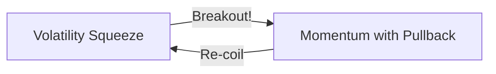

# Trading Strategy Guide: Momentum → Volatility Squeeze

## The Core Relationship

These two strategies work as **sequential stages** of a stock's momentum cycle:



---

## 1️⃣ Volatility Squeeze ("The Snap")

**What it finds:** Stocks that have been **coiling/compressing** and are about to **snap** into a trending move.

### Key Concepts
| Metric | What it Means |
|--------|---------------|
| **SqueezeRatio < 1.0** | Daily volatility compressed vs weekly baseline |
| **EMA Stack Aligned** | Uptrend confirmed (8 > 21 > 34 > 55 > 89) |
| **Relative Volume ≥ 1.3x** | Waking up from quiet period |

### Signals to Watch
- 🔋 **Tight Squeeze** (< 0.7) — Maximum compression
- 🌀 **Deep Coil** (ADX < 15) — Directionless, ready to move
- 🔥 **Volume Spark** (> 1.5x) — Institutions entering

### Entry Thesis
> "This stock has been quiet and coiling. The EMAs are stacked bullish, and volume is picking up. It's ready to snap."

---

## 2️⃣ Momentum with Pullback

**What it finds:** Stocks in **confirmed uptrends** that have **pulled back** to a buyable level.

### Key Concepts
| Metric | What it Means |
|--------|---------------|
| **EMA Stack (3 timeframes)** | Daily + Weekly + Monthly alignment = strong trend |
| **SMA50 > EMA200** | Long-term uptrend confirmed |
| **Stochastic < 40** | Oversold on oscillator (pullback) |
| **Within 1 ATR of EMA21** | Not overextended |

### The TAO Multi-Timeframe Stack
```
Daily:   EMA8 > EMA21 > EMA34 > EMA55 > EMA89
Weekly:  EMA8 > EMA21 > EMA34 > EMA55 > EMA89
Monthly: EMA8 > EMA21 > EMA34 > EMA55 > EMA89
```
When all three align = **TREND CONFIRMED**

### Entry Thesis
> "This stock is in a strong multi-timeframe uptrend but has pulled back to the EMAs. The oscillator is oversold. Buy the dip."

---

## 🔄 The Cycle

### Volatility Squeeze → Momentum
A stock exits the Squeeze scanner when it **breaks out** and starts trending. It then becomes a candidate for the Momentum scanner as it pulls back to the EMAs.

### Momentum → Volatility Squeeze  
After a strong trend run, the stock may **re-coil** (volatility compresses, consolidation pattern forms). It then reappears on the Squeeze scanner.

---

## Quick Comparison

| Aspect | Volatility Squeeze | Momentum with Pullback |
|--------|-------------------|----------------------|
| **Stage** | Pre-breakout | Mid-trend pullback |
| **Volatility** | Compressed (SqueezeRatio < 1.0) | Normal/Expanded |
| **ADX** | Lower (≥ 20) | Higher (20-100) |
| **Stochastic** | Any | < 40 (oversold) |
| **Volume** | Just waking up (≥ 1.3x) | Normal |
| **Risk** | Higher (breakout may fail) | Lower (trend confirmed) |
| **Reward** | Higher (catch the snap) | Moderate (ride the wave) |

---

## Practical Workflow

1. **Run Volatility Squeeze** → Find stocks ready to break out
2. **Watch for breakout** → Volume spike, price expansion
3. **Run Momentum with Pullback** → Find re-entry on the pullback
4. **Repeat** until the trend ends
